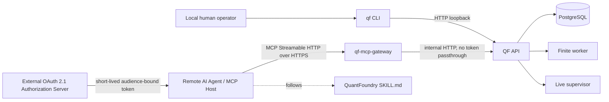

# QuantFoundry CLI、MCP Gateway 与远程 AI Agent Skill 技术设计

> 文档状态：目标方案，尚未实现。  
> 适用分支：`codex/quantfoundry-nautilus-redesign`。  
> 上位事实源：[`DESIGN.md`](DESIGN.md)。本文件展开本地 CLI、远程 MCP 接入和 Skill 的实现合同；不得修改 `DESIGN.md` 已确定的研究状态机、交易事实、风险限额、Recovery 或人工审批语义。

## 1. 结论

QuantFoundry 使用两条正式操作通道：

```text
本地人类操作者
  → qf CLI
  → loopback QF API

远程 AI Agent
  → MCP client
  → HTTPS MCP Streamable HTTP endpoint
  → qf-mcp-gateway
  → internal QF API
```

**远程 Agent 不使用 SSH。** 仓库不提供 SSH forced command、远程 Shell 包装器、自定义 JSONL 隧道或端口转发方案。

本地 CLI 与 MCP Gateway 都是薄适配层：

- 不复制领域状态机；
- 不直接操作 PostgreSQL、Docker、Nautilus 或持久卷；
- 不绕过 Approval、Holdout、Recovery、风险或插件版本固定；
- 最终行为仍由 QF API 和领域服务拥有。

## 2. 目标

### 2.1 本地 CLI

官方本地命令固定为：

```text
qf
```

用于：

- 系统状态和诊断；
- 插件、Credential、Data Source 和 Execution Connection 管理；
- Dataset、Strategy、Research、Experiment 和 Run；
- 人工 Approval；
- Deployment、Risk、Universe 和 Recovery；
- Secret 写入、Force Remove、真实资金 Canary 等 human-only 操作。

### 2.2 远程 MCP

远程 Agent 使用标准 MCP，而不是模拟终端：

```text
https://<operator-domain>/mcp
```

目标：

- 兼容支持 MCP Streamable HTTP 的远程 Agent；
- 通过 MCP `tools/list`、Resources 和 JSON Schema 自描述能力；
- 对长任务支持 MCP Tasks 或 QF operation handle；
- 通过 OAuth scope 控制 Agent 可见工具；
- 对所有 mutation 提供幂等和 optimistic precondition；
- 将 Secret、资金 Approval 和强破坏操作保留给本地人工；
- 保持核心 API 为 loopback/internal，不把 `/api/v1` 暴露到公网。

### 2.3 配套 Skill

`skills/quantfoundry/SKILL.md` 是外部 Agent 的操作编排说明：

- 只使用已连接的 QuantFoundry MCP Server；
- 从 `tools/list` 和 `qf://manifest` 获取当前能力；
- 读取当前状态后再 mutation；
- 生成 idempotency key 和 expected preconditions；
- 追踪异步任务；
- 在 human-only 节点停止并生成 handoff；
- 不处理 OAuth token、Secret 或本地钱包材料。

Skill 不构成 QF 内置 Agent runtime，也不拥有任何业务权限。

## 3. 非目标

本方案不建设：

- SSH transport、普通 Shell、forced command 或远程命令执行器；
- 公网暴露的 QF Core API；
- MCP 到任意 HTTP URL 的通用代理；
- QF 内置 LLM、Agent scheduler、模型 provider 或 prompt runner；
- 多用户工作区、业务 RBAC 或 SaaS 控制面；
- Agent 自行输入或读取 Credential Secret；
- Agent 自行 approve/reject 真实资金 Approval；
- Agent Force Remove 插件或执行真实资金 Canary；
- Agent 直接提交 Order、绕过 Strategy、RiskEngine 或 central reservation；
- MCP Sampling 驱动新的自治交易循环；
- 通过 Elicitation 表单收集密码、API Key、Private Key 或支付凭据；
- 在 MCP 消息内传输大型 Parquet 的 Base64；
- 在 CLI 或 MCP Gateway 内复制 Nautilus 金融事实或 QF 领域逻辑。

`DESIGN.md` 中“无用户/workspace/auth”指 QF 不建设业务用户域和登录系统。MCP Gateway 的 OAuth 2.1 是**远程传输授权边界**，不是 QF 业务用户模型。

## 4. 总体架构



边界：

- Core API：宿主仅发布 `127.0.0.1:8000`；
- MCP Gateway：唯一远程入口，公开 HTTPS `/mcp`；
- Gateway 不提供 `/api/v1` 反向代理；
- Gateway 不访问 PostgreSQL、Docker socket、Plugin Volume、Catalog 或 Wallet 文件；
- Gateway 只调用固定 QF API 操作；
- 远程 OAuth access token 不转发到 QF API 或交易场所；
- 本地 Human CLI 与 MCP tools 映射到相同领域动作和 Pydantic wire model。

## 5. 服务与网络拓扑

### 5.1 Compose 目标服务

在 `DESIGN.md` 的控制面服务基础上增加独立的：

```text
mcp-gateway
```

目标服务：

```text
postgres
migrate
api
finite-worker
live-supervisor
mcp-gateway
```

`mcp-gateway` 使用同一 core image，但运行独立入口：

```text
python -m quantfoundry.mcp.main
```

### 5.2 端口

```text
QF API host binding:       127.0.0.1:8000
MCP public endpoint:       https://<domain>/mcp
MCP internal container:    0.0.0.0:8001
```

生产环境必须使用 HTTPS。TLS 可以由：

1. `mcp-gateway` 直接加载只读 certificate/key；或
2. 部署环境已有的托管 TLS endpoint 终止。

仓库不恢复 Nginx，也不把通用 reverse proxy 作为 QF 应用组件。外部 TLS endpoint 只能转发：

```text
/mcp
/.well-known/oauth-protected-resource
/.well-known/oauth-protected-resource/mcp
/agent-artifacts/*
```

不得转发 `/api/v1`。

### 5.3 Gateway 最小权限

Gateway 容器：

- read-only root filesystem；
- drop all Linux capabilities；
- 无 Docker socket；
- 无 PostgreSQL credential；
- 无 Plugin/Catalog/Report/Wallet Volume；
- 只允许访问内部 QF API 和 OAuth JWKS/metadata endpoint；
- 上传内容直接流式转发到 QF API 的 staging handler，不在 Gateway 永久落盘。

## 6. MCP 协议基线

### 6.1 Transport

基线为 MCP `2025-11-25` 的 **Streamable HTTP**：

```text
POST /mcp
GET  /mcp          # 可选 SSE server stream / resume
DELETE /mcp        # 结束 session，若启用 stateful session
```

要求：

- 每个 HTTP 请求携带 `MCP-Protocol-Version`；
- 支持 `application/json` 和 `text/event-stream`；
- 断线不等于取消；
- 取消必须使用 MCP cancellation；
- 如果启用 session，使用 `MCP-Session-Id`；
- access token 在每个 HTTP 请求上重新校验；session ID 不是认证凭据；
- 如果客户端不支持服务器 stream，所有工作仍可通过轮询完成。

### 6.2 Stateful 与 stateless

V1 默认：

```text
stateless MCP request handling
+ QF durable jobs/runs/events
```

理由：

- QF 的长任务本来已经持久化；
- Gateway 重启不应影响 Run、Plugin Job 或 Deployment；
- 减少 Gateway session store；
- 客户端可以通过 task/QF resource ID 恢复。

仅当客户端需要 MCP server-to-client request 或 resumable notification 时启用 stateful session。即使启用，也不得把业务状态只保存在 MCP session 内。

### 6.3 Origin 与 Host

Gateway 必须：

- 校验 `Host`；
- 对存在的 `Origin` 进行精确 allowlist 校验；
- 非允许 Origin 返回 403；
- CORS 不允许 `*`；
- 浏览器客户端只暴露协议所需 response headers；
- 限制 MCP JSON request body，默认 1 MiB；
- 文件上传走独立 artifact endpoint。

## 7. OAuth 2.1 授权

### 7.1 角色

```text
MCP client       = OAuth client
mcp-gateway      = OAuth protected resource / resource server
External IdP     = OAuth 2.1 authorization server
```

QF 不自行实现通用 OAuth Authorization Server。操作者配置一个现有、受信任的 OAuth/OIDC Authorization Server。

### 7.2 Discovery

Gateway 必须提供 RFC 9728 Protected Resource Metadata：

```text
/.well-known/oauth-protected-resource
/.well-known/oauth-protected-resource/mcp
```

未授权请求返回：

```http
HTTP/1.1 401 Unauthorized
WWW-Authenticate: Bearer resource_metadata="https://<domain>/.well-known/oauth-protected-resource/mcp"
```

Metadata 至少包含：

```json
{
  "resource": "https://<domain>/mcp",
  "authorization_servers": ["https://<issuer>"],
  "scopes_supported": ["qf:read", "qf:research:write"]
}
```

### 7.3 Client 类型

V1 支持预注册客户端，不要求 Dynamic Client Registration：

1. **Human-delegated Agent**：Authorization Code + PKCE；
2. **Unattended Agent**：Client Credentials，但只能获得机器允许的 scopes。

Authorization Code flow 必须使用 PKCE S256。Access token 必须：

- 短生命周期；
- `aud`/resource 绑定到精确 MCP resource URI；
- 包含 issuer、client identity 和 scopes；
- 不通过 query string；
- 不写入日志或 Tool Result。

### 7.4 Token 验证

Gateway 每次请求验证：

```text
signature
issuer
expiration / not-before
audience / resource
client_id or azp
subject when present
scopes
```

禁止 token passthrough：

- 不把 MCP access token 传给 QF API；
- 不把 MCP access token 传给 Polymarket；
- 不接受签发给其他 resource 的 token；
- 不接受 ID token 代替 access token。

### 7.5 Scope

建议 scopes：

```text
qf:read
qf:plugin:stage
qf:plugin:activate
qf:data:write
qf:connection:write
qf:research:write
qf:experiment:run
qf:deployment:create
qf:deployment:stop
qf:universe:propose
qf:approval:prepare
qf:artifact:upload
```

Tool list 按 token scope 过滤。客户端调用无权限 Tool 时返回 403 `insufficient_scope`，并通过 `WWW-Authenticate` 指明所需 scope。

### 7.6 永久 human-only

以下能力不是 scope，不会出现在 MCP tools 中：

```text
Credential secret create/update/read
Approval approve/reject
Force plugin remove
Live-money canary execution
Master key change
Destructive database operation
Raw order submission
Risk / Recovery / Holdout bypass
```

即使 Authorization Server 错误签发同名 scope，Gateway 也必须 hard-deny。

## 8. MCP Primitives

### 8.1 Tools

MCP Tools 是 Agent 的正式操作面。命名使用稳定 dotted name：

```text
qf.system.status
qf.plugin.list
qf.research.show
qf.experiment.start
qf.deployment.stop
```

每个 Tool 必须提供：

```text
name
title
description
inputSchema
outputSchema
annotations
execution.taskSupport
```

Tool Result：

- 必须提供 `structuredContent`；
- 同时提供简短 TextContent 兼容客户端；
- 不输出 Secret；
- 失败使用 `isError: true` 和稳定 QF error code；
- malformed MCP 请求使用 JSON-RPC protocol error。

### 8.2 Tool annotations

示例：

```json
{
  "readOnlyHint": false,
  "destructiveHint": false,
  "idempotentHint": true,
  "openWorldHint": false
}
```

含义：

- 查询工具：`readOnlyHint=true`；
- 创建 Research、Run 等 additive mutation：`destructiveHint=false`；
- Stop、Deactivate 等改变运行状态：`destructiveHint=true`；
- 对外部 Venue 进行 preflight：`openWorldHint=true`；
- annotations 只是客户端提示，服务器必须独立执行 scope 和状态校验。

### 8.3 Resources

MCP Resources 提供可读取的当前状态和报告，不承担 mutation：

```text
qf://manifest
qf://operations
qf://system/status
qf://plugin-releases/{id}
qf://runtime-bundles/{id}
qf://datasets/{id}
qf://strategies/{id}
qf://research/{id}
qf://experiments/{id}
qf://runs/{id}
qf://runs/{run_id}/reports/{report_id}
qf://approvals/{id}
qf://deployments/{id}
qf://deployments/{id}/risk
qf://deployments/{id}/universe
```

资源内容必须是当前 API 快照；不得让模型依据历史缓存执行 mutation。

### 8.4 Resource subscription

如果客户端支持 subscription：

- Run、Plugin Job、Approval、Deployment、Risk 和 Universe Resource 可订阅；
- Gateway 从 QF durable event stream 接收事件；
- 对应资源变化时发送 `notifications/resources/updated`；
- 断线后客户端仍必须重新读取资源；notification 不是事实源。

### 8.5 Prompts

V1 不依赖 MCP Prompts 执行业务。可选只读 prompts：

```text
qf.review.research
qf.review.approval
qf.diagnose.recovery
```

Prompt 只生成审阅模板，不执行 mutation，也不替代 Skill。

### 8.6 Elicitation

Form Elicitation 只允许收集非敏感澄清，例如：

```text
Research title
选择已有 Dataset
选择报告展示粒度
```

严禁通过 Form Elicitation 请求：

```text
password
API key
access token
private key
wallet credential
payment credential
```

Approval 和 Secret 写入不通过 Elicitation 完成；Tool 返回 human handoff。

## 9. Canonical Tool Catalog

### 9.1 Read tools

```text
qf.system.status
qf.plugin.list
qf.plugin.show
qf.plugin.impact
qf.bundle.list
qf.bundle.show
qf.credential.list
qf.credential.show
qf.data_source.list
qf.data_source.show
qf.execution_connection.list
qf.execution_connection.show
qf.dataset.list
qf.dataset.show
qf.strategy.list
qf.strategy.show
qf.research.list
qf.research.show
qf.experiment.show
qf.run.list
qf.run.show
qf.run.report
qf.approval.list
qf.approval.show
qf.deployment.list
qf.deployment.show
qf.universe.show
qf.risk.show
qf.event.list
qf.artifact.show
```

### 9.2 Scoped mutation tools

```text
qf.plugin.stage
qf.plugin.prewarm
qf.plugin.activate
qf.plugin.deactivate

qf.data_source.create
qf.data_source.update
qf.data_source.preflight

qf.execution_connection.create
qf.execution_connection.update
qf.execution_connection.preflight

qf.dataset.import_parquet_l2

qf.strategy.create
qf.strategy.version_create

qf.research.create
qf.research.section_set
qf.research.activate

qf.experiment.create
qf.experiment.start

qf.approval.prepare_decision

qf.deployment.create
qf.deployment.stop
qf.deployment.restart_request

qf.universe.revision_create

qf.artifact.begin_upload
qf.artifact.finalize_upload
qf.artifact.delete
```

Tool descriptions必须明确：

- `qf.deployment.create` 不审批、不直接进入 Trading；
- `qf.deployment.restart_request` 只创建新 Approval；
- `qf.deployment.stop` 撤单并停止新增交易，但不强平已有仓位；
- `qf.universe.revision_create` 的扩张仍需人工 Approval；
- `qf.plugin.deactivate` 进入 Drain，不等于立即杀死现有 Runner。

## 10. Tool 输入合同

### 10.1 Mutation 公共字段

所有 mutation Tool 的 `inputSchema` 必须包含：

```json
{
  "idempotency_key": "UUID",
  "expected": {},
  "arguments": {}
}
```

可直接平铺业务字段，但公共语义固定。

### 10.2 Idempotency

`idempotency_key`：

- mutation 必填；
- read tool 禁止或忽略；
- 网络重试同一操作复用同一 key；
- 同 key + 同 tool + 同 normalized arguments 返回原 receipt；
- 同 key 被用于不同 tool/target/arguments 返回 `IDEMPOTENCY_KEY_REUSED`；
- MCP JSON-RPC request ID 不是业务幂等键。

### 10.3 Optimistic preconditions

更新类操作必须包含当前读取到的字段，例如：

```text
state
content_revision
version_no
generation
plugin_release_id
runtime_bundle_id
updated_at
```

冲突返回：

```text
PRECONDITION_FAILED
```

Agent 必须重新读取资源和重新规划，不得盲重放。

### 10.4 Impact token

高影响但可由 Agent 发起的操作，例如：

```text
plugin.activate
plugin.deactivate
deployment.stop
universe.revision_create
```

先调用相应 impact/preflight Tool，服务端返回短生命周期：

```text
impact_token
```

Mutation 必须携带该 token，且 token 绑定：

```text
principal
target
current version/generation
operation
expires_at
```

Impact token 不是 Approval，也不能绕过状态机。

## 11. 长任务与 MCP Tasks

Plugin Install、Bundle Build、Parquet Import、Optimization、Holdout、Deployment Recovery 都是异步工作。

### 11.1 兼容模式

如果客户端不支持 MCP Tasks：

- Tool 立即返回 QF `job_id`、`run_id`、`approval_id` 或 `deployment_id`；
- 返回对应 `qf://` resource link；
- Agent 通过 read Tool/Resource 轮询。

### 11.2 Task 模式

如果双方协商支持 MCP `2025-11-25` Tasks：

- 长任务 Tool 设置 `execution.taskSupport="optional"`；
- 客户端请求 task augmentation 时，Gateway 创建 MCP task；
- task 绑定 OAuth principal；
- task 映射到 QF job/run/deployment；
- `tasks/get` 和 `tasks/result` 从 QF 当前状态生成；
- task cancellation 只在底层 QF 操作支持取消时执行；
- 超时或连接断开不取消底层工作；
- 任何 caller 不能读取其他 principal 创建的 task。

MCP Tasks 当前属于可能演进的协议能力，因此 QF 的业务事实始终保留在自身 job/run/deployment 中，不能只存在 task store。

## 12. Artifact 上传

### 12.1 为什么不放进 MCP JSON

允许上传：

```text
STRATEGY_SOURCE
PLUGIN_WHEEL
PARQUET_L2
```

Parquet 上限可达 10 GiB，因此禁止：

- Base64 放入 Tool arguments；
- 把文件内容放入 LLM context；
- Gateway 全量缓冲；
- 任意远程 URL 由服务器抓取。

### 12.2 两阶段协议

1. MCP Tool：

```text
qf.artifact.begin_upload
```

输入：

```json
{
  "kind": "PARQUET_L2",
  "filename": "market.parquet",
  "size_bytes": 123456,
  "idempotency_key": "..."
}
```

输出：

```json
{
  "artifact_id": "...",
  "upload_url": "https://<domain>/agent-artifacts/<opaque-capability>",
  "expires_at": "...",
  "chunk_size_bytes": 8388608,
  "accepted_offset": 0
}
```

2. Agent-side companion CLI 通过 HTTPS 按顺序上传：

```bash
qf artifact upload \
  --mcp-server https://<domain>/mcp \
  --artifact-id <id> \
  --file market.parquet
```

3. 完成后调用：

```text
qf.artifact.finalize_upload
```

### 12.3 Upload endpoint

```text
HEAD /agent-artifacts/<opaque-capability>
PUT  /agent-artifacts/<opaque-capability>
```

要求：

- 同一 HTTPS origin；
- OAuth token 必须仍有效并属于创建者；
- opaque capability 单 artifact、单 principal、短时有效；
- `Content-Range` 只允许从 `accepted_offset` 顺序追加；
- `HEAD` 返回当前 offset；
- 声明总字节数不可改变；
- 超限立即拒绝；
- finalize 前精确匹配 `size_bytes`；
- 中断可从 offset 继续；
- 不生成应用级 checksum/hash/fingerprint；
- staging 超时清理；
- Gateway 流式转发，不全量载入内存。

### 12.4 Companion CLI Token

远程 Artifact CLI 是标准 MCP/OAuth 客户端：

- 优先复用 Agent Host 已建立的 OAuth session；
- 独立使用时走 Authorization Code + PKCE 或预注册 Client Credentials；
- token 存储使用操作系统安全凭据存储，不能写入 Skill、命令参数或日志；
- Skill 不读取、打印或要求用户粘贴 access token。

## 13. 本地 `qf` CLI

### 13.1 打包

```toml
[project.scripts]
qf = "quantfoundry.cli.main:main"
```

目标结构：

```text
backend/src/quantfoundry/cli/
├── __init__.py
├── main.py
├── client.py
├── registry.py
├── output.py
├── idempotency.py
├── preconditions.py
├── watch.py
├── oauth.py
├── mcp_client.py
└── artifact_upload.py
```

### 13.2 本地模式

默认 endpoint：

```text
http://127.0.0.1:8000
```

本地 Human CLI 只接受 loopback Core API，不提供 `--allow-remote-api`。

示例：

```bash
qf status
qf research show <id>
qf run watch <id>
qf approval approve <id>
qf deployment stop <id>
```

### 13.3 MCP Client 模式

CLI 也可作为标准 MCP Client，用于：

- 人工检查远程 MCP Gateway；
- Agent 环境没有原生 MCP Host 时的兼容调用；
- 大文件上传。

示例：

```bash
qf mcp login --server https://qf.example.com/mcp
qf mcp tools --server https://qf.example.com/mcp
qf mcp call qf.system.status --server https://qf.example.com/mcp --json '{}'
qf artifact upload --mcp-server https://qf.example.com/mcp --file strategy.py --kind STRATEGY_SOURCE
```

CLI MCP 模式必须使用标准 MCP Streamable HTTP 和 OAuth；不得退化为 raw `/api/v1` client。

### 13.4 Human-only CLI

仅本地 CLI 提供：

```text
qf credential create/update with secret stdin
qf approval approve/reject
qf plugin remove --force
qf canary execute
qf system master-key ...
```

Secret：

- 只从受保护 TTY/stdin/OS key store 输入；
- 不通过 argv；
- 不出现在 shell history；
- 不回显；
- 不进入 JSON output。

## 14. Skill 运行合同

Skill 每个会话：

1. 使用已配置的 QuantFoundry MCP connection；
2. 检查 `tools/list` 和 Resources；
3. 读取 `qf://manifest`；
4. 调用 `qf.system.status`；
5. 读取目标资源及依赖；
6. 判断用户目标是否需要 human-only action；
7. mutation 前执行 impact/preflight；
8. 生成一个 UUID idempotency key；
9. 携带 current expected preconditions；
10. Tool 只调用一次；同一网络重试复用 key；
11. 追踪 MCP task 或 QF resource；
12. 最后重新读取并验证状态；
13. 输出 IDs、状态、警告、持仓影响和 human handoff。

Skill 不能：

- 使用 SSH；
- 使用 curl 访问 Core API；
- 连接 PostgreSQL 或 Docker；
- 请求 OAuth token 或 Secret；
- 自行 approve/reject；
- 直接选择另一个 Pareto Candidate；
- 通过其他工具绕过 scope/human gate；
- 把 Stop 描述为已平仓。

## 15. Error 与响应

### 15.1 Tool execution error

结构化错误：

```json
{
  "code": "PRECONDITION_FAILED",
  "message": "Deployment generation changed.",
  "details": {
    "expected_generation": 4,
    "actual_generation": 5
  },
  "retryable": false,
  "human_action_required": null
}
```

常见新增代码：

```text
MCP_PROTOCOL_UNSUPPORTED
MCP_ORIGIN_FORBIDDEN
MCP_TOKEN_INVALID
MCP_AUDIENCE_INVALID
MCP_SCOPE_INSUFFICIENT
MCP_TOOL_FORBIDDEN
MCP_TASK_NOT_FOUND
MCP_TASK_ACCESS_DENIED
IDEMPOTENCY_KEY_REQUIRED
IDEMPOTENCY_KEY_REUSED
PRECONDITION_REQUIRED
PRECONDITION_FAILED
IMPACT_TOKEN_REQUIRED
IMPACT_TOKEN_EXPIRED
HUMAN_ACTION_REQUIRED
AGENT_ARTIFACT_INVALID
AGENT_ARTIFACT_INCOMPLETE
AGENT_ARTIFACT_EXPIRED
AGENT_ARTIFACT_ALREADY_CONSUMED
```

### 15.2 Human handoff

Human-only Tool 请求返回：

```json
{
  "code": "HUMAN_ACTION_REQUIRED",
  "message": "Deployment start approval must be decided locally.",
  "details": {
    "approval_id": "...",
    "local_cli": "qf approval show <id>",
    "effect": "Approval may permit a new Recovery generation and later live trading."
  }
}
```

不返回可由 Agent 执行的 approval token 或隐藏替代路径。

## 16. 审计与限流

每个 MCP 调用记录：

```text
request_id
MCP session id when present
OAuth issuer
subject when present
client_id / azp
scopes
tool name
safety class
idempotency key
resource IDs
result/error code
latency
created task/job/run/deployment ID
```

禁止记录：

```text
access token
refresh token
private key
API secret
ciphertext/nonce
Strategy source body
Parquet content
```

限流维度：

```text
client_id
subject
tool
mutation/read class
upload bytes
concurrent tasks
```

对 `qf.deployment.stop` 不应设置会阻止紧急风险收缩的低限额，但仍要防止并发重复调用，依靠幂等和状态前置条件收口。

## 17. 目标代码树

```text
backend/src/quantfoundry/
├── cli/
│   ├── main.py
│   ├── client.py
│   ├── registry.py
│   ├── output.py
│   ├── oauth.py
│   ├── mcp_client.py
│   └── artifact_upload.py
├── mcp/
│   ├── main.py
│   ├── server.py
│   ├── auth.py
│   ├── scopes.py
│   ├── tools.py
│   ├── resources.py
│   ├── tasks.py
│   ├── artifacts.py
│   ├── errors.py
│   └── audit.py
└── commands/
    ├── registry.py
    ├── models.py
    └── handlers.py

skills/quantfoundry/
├── SKILL.md
└── references/
    ├── commands.md
    └── safety.md
```

`commands/registry.py` 是本地 CLI 和 MCP Tool 的共享映射层，但领域行为仍由 service/API handler 拥有。

## 18. 依赖选择

- 使用官方 MCP Python SDK，实施时固定经过验证的稳定版本；
- 使用现有 ASGI/FastAPI/Starlette 运行时；
- OAuth token 验证使用已批准 JOSE/JWT 库，禁止自行实现签名算法；
- 使用现有 HTTP client 调内部 API和 OAuth metadata/JWKS；
- 不引入 SSH 库；
- 不引入第二个 Web Framework；
- 不实现通用 API Gateway。

版本必须由 `uv.lock` 精确锁定。MCP SDK 升级需要协议和 Tool schema 回归。

## 19. 验证矩阵

### 19.1 Protocol

- [ ] MCP Initialize、tools/list、tools/call、resources/list/read 通过官方 Inspector/SDK。
- [ ] `MCP-Protocol-Version` 缺失、错误和不支持版本行为正确。
- [ ] JSON 与 SSE response 均可用；断线不被当作取消。
- [ ] Origin/Host allowlist 被真实 HTTP 测试证明。
- [ ] Gateway 重启不改变底层 Run/Deployment 状态。

### 19.2 OAuth

- [ ] RFC 9728 metadata 和 401 challenge 可发现 Authorization Server。
- [ ] Authorization Code + PKCE 可连接。
- [ ] Client Credentials 可连接受限机器 Agent。
- [ ] 错误 issuer、过期 token、错误 audience 和错误 resource 被拒绝。
- [ ] access token 不传给 Core API 或下游 Venue。
- [ ] tools/list 只返回当前 scopes 可见工具。
- [ ] insufficient scope 返回 403 和正确 challenge。

### 19.3 Tool safety

- [ ] Human-only Tool 永不出现在 tools/list。
- [ ] 直接调用不存在/禁止 Tool 不产生副作用。
- [ ] Mutation 缺少 idempotency/precondition 被拒绝。
- [ ] 同 key 同请求返回同 receipt；同 key 不同请求被拒绝。
- [ ] Impact token 与 principal/target/version 绑定。
- [ ] Stop 明确不强平，且重复请求不创建多次 Stop。

### 19.4 Tasks

- [ ] 无 Tasks 客户端可通过 operation/resource ID 完成全部流程。
- [ ] 支持 Tasks 的客户端可以创建、轮询和取回结果。
- [ ] task 与 OAuth principal 绑定，跨 principal 不可读。
- [ ] task cancellation 不伪造底层取消成功。

### 19.5 Artifact

- [ ] Strategy/Wheel/Parquet 可通过 HTTPS upload session 流式上传。
- [ ] 10 GiB 文件不在 Gateway/API 全量入内存。
- [ ] offset resume、过期、超限、错误 filename 和错误 kind 被处理。
- [ ] token/principal 不匹配无法上传或 finalize。
- [ ] 不创建应用级 checksum/hash/fingerprint。
- [ ] Secret 文件类型不可创建 upload session。

### 19.6 Skill E2E

- [ ] Skill 只调用 MCP Tools/Resources。
- [ ] Skill 不读取、输出或请求 OAuth token/Secret。
- [ ] Skill 正确处理 scope challenge 和 human handoff。
- [ ] Skill 可完成 Research → Experiment → Run monitoring → Approval preparation。
- [ ] Skill 可诊断 `RECOVERY_BLOCKED`，但不能绕过。
- [ ] 明确用户请求时可执行 scoped Stop，并准确报告未平仓风险。

## 20. 实施路线

### M0：MCP Read-only Spike

实现：

```text
mcp-gateway
OAuth token verifier
RFC 9728 metadata
tools/list
qf.system.status
qf://manifest
```

完成条件：远程 MCP Client 通过 HTTPS/OAuth 连接；Core API 仍只有 loopback/internal；不存在 SSH 或 raw API 暴露。

### M1：Shared Command Registry

- CLI 和 MCP 共用 command metadata；
- read tools 覆盖系统、插件、Dataset、Research、Run、Deployment 和 Risk；
- structuredContent/outputSchema；
- audit 和 rate limit。

### M2：Reliable Mutation

- scopes；
- idempotency；
- expected preconditions；
- impact token；
- Human Handoff；
- read-modify-verify 测试。

### M3：Artifact Upload

- begin/finalize tools；
- HTTPS resumable upload endpoint；
- companion CLI；
- Strategy/Wheel/Parquet 消费；
- 失败和过期清理。

### M4：Tasks 与 Notifications

- 可选 MCP Tasks；
- QF job/run/deployment 映射；
- resource subscription；
- reconnect 和 gateway restart 测试。

### M5：Skill Coverage

- 更新 Skill、commands 和 safety references；
- 完成 Plugin、Data、Research、Experiment、Approval Preparation、Deployment Monitor、Risk、Universe、Recovery 工作流；
- 不包含 human-only actions。

### M6：Live Boundary Review

独立验证：

- Secret；
- Approval；
- Plugin Force Remove；
- Stop；
- Central Risk；
- Recovery；
- Production canary；
- OAuth audience和 scope。

只有 M0–M5 通过后，才能宣称远程 Agent 可操作；只有 M6 与真实资金验收通过后，才能把 MCP 通道用于 live Deployment 相关 mutation。

## 21. 官方参考

- [MCP 2025-11-25 Specification](https://modelcontextprotocol.io/specification/2025-11-25)
- [MCP Streamable HTTP Transport](https://modelcontextprotocol.io/specification/2025-11-25/basic/transports)
- [MCP Authorization](https://modelcontextprotocol.io/specification/2025-11-25/basic/authorization)
- [MCP Tools](https://modelcontextprotocol.io/specification/2025-11-25/server/tools)
- [MCP Tasks](https://modelcontextprotocol.io/specification/2025-11-25/basic/utilities/tasks)
- [MCP Elicitation](https://modelcontextprotocol.io/specification/2025-11-25/client/elicitation)
- [MCP Python SDK](https://github.com/modelcontextprotocol/python-sdk)
- [RFC 9728: OAuth 2.0 Protected Resource Metadata](https://www.rfc-editor.org/rfc/rfc9728)
- [RFC 8707: Resource Indicators for OAuth 2.0](https://www.rfc-editor.org/rfc/rfc8707)
- [RFC 9700: Best Current Practice for OAuth 2.0 Security](https://www.rfc-editor.org/rfc/rfc9700)

---

本文件描述目标 CLI/MCP/Skill 合同。当前仓库尚未实现 `qf` CLI、MCP Gateway、OAuth resource server、Artifact upload、Tasks 或远程 Agent E2E，因此不得宣称该通道已可用。