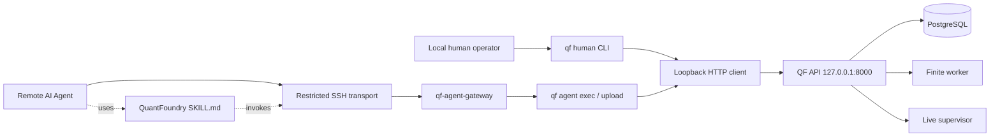

# QuantFoundry CLI 与远程 AI Agent Skill 技术设计

> 文档状态：目标方案，尚未实现。  
> 适用分支：`codex/quantfoundry-nautilus-redesign`。  
> 上位事实源：[`DESIGN.md`](DESIGN.md)。本文件展开 CLI、远程 Agent 传输和 Skill 的实现合同，不得引入与 `DESIGN.md` 冲突的产品状态、交易事实或风险语义；发生冲突时先修改 `DESIGN.md`。

## 1. 目标

QuantFoundry 需要同时服务两类调用者：

1. 本机单操作员，通过终端完成工作台操作；
2. 运行在其他机器或云环境中的 AI Agent，通过稳定、可审计、可限制的机器接口完成受托操作。

正式调用面固定为官方 CLI：

```text
qf
```

CLI 的目标是：

- 覆盖 `OPERATIONS.md` 中全部工作台节点；
- 为人类提供可读输出，为 Agent 提供稳定 JSON 输出；
- 将远程 Agent 与 loopback API、PostgreSQL、Docker、插件目录和交易进程隔离；
- 对重试、长任务、并发状态变化和文件上传提供确定语义；
- 将真实资金审批、Secret 写入和强制破坏操作保留给本地人工；
- 允许 Agent 完成研究、数据准备、插件 staging、运行监控、审批材料准备和显式授权的风险收缩操作；
- 保留 QF 的单机单操作员产品边界，不在 V1 建设多用户 SaaS 或内置模型运行时。

## 2. 非目标

CLI 与 Skill 不建设：

- 公网 HTTP API、远程 Bearer Token 服务或多租户认证；
- QF 内置 LLM、Agent runtime、模型 provider 或 Agent 调度器；
- 允许 Agent 绕过人工 Approval、中央风险、Recovery 或 Holdout；
- 允许 Agent 直接访问 PostgreSQL、Docker socket、插件目录、wallet 文件或 Nautilus 内部对象；
- 任意 Shell、任意 Python 执行或任意文件路径读写；
- 在 CLI 内复制 API 领域逻辑、Nautilus 交易逻辑或插件实现；
- 通过命令行参数、环境变量、JSON 输出或日志传递真实 Secret；
- 同一 TradingNode 进程内热替换插件；
- 公共 Skill 市场或自动下载安装未知 Skill。

`DESIGN.md` 中“无 AI/Agent/Tool”的非目标特指 **QF 不内置模型和 Agent 执行系统**；外部 AI Agent 通过本方案的受限 CLI 调用 QF 是明确支持的集成方式。

## 3. 总体架构



边界固定为：

- API 继续只发布到宿主 `127.0.0.1:8000`；
- 远程 Agent 不直接连接 API；
- 远程 Agent 不获得普通 Shell；
- SSH 只负责加密传输和主机身份校验；
- `qf-agent-gateway` 是远程 Agent 的唯一主机入口；
- Gateway 只允许结构化 `exec` 和 `upload` 两种协议；
- Agent Profile 在调用 API 前限制命令范围；
- API 仍执行最终领域校验、状态机、风险和 Approval 校验；
- 本地人类 CLI 与 Agent CLI 使用同一个命令注册表和同一组 API 路由，避免行为分叉。

## 4. CLI 打包与运行边界

### 4.1 Console script

CLI 随 QF core wheel 安装：

```toml
[project.scripts]
qf = "quantfoundry.cli.main:main"
```

目标代码树：

```text
backend/src/quantfoundry/cli/
├── __init__.py
├── main.py                 # argparse 入口
├── client.py               # loopback HTTP、timeout、SSE
├── registry.py             # 命令、参数 schema、safety class、scope
├── output.py               # human / json envelope
├── idempotency.py          # idempotency header 与 receipt
├── agent_protocol.py       # JSONL exec protocol
├── uploads.py              # binary stdin staging protocol
└── preconditions.py        # expected state/version/generation

deploy/
└── qf-agent-gateway        # forced-command dispatcher

skills/quantfoundry/
├── SKILL.md
├── references/
│   ├── commands.md
│   └── safety.md
└── scripts/
    └── qf_remote.py
```

### 4.2 依赖

CLI 是薄客户端：

- 使用 `argparse` 解析命令；
- 使用 core runtime 已批准的 HTTP client 完成 loopback 请求、multipart streaming 和 SSE；
- 可以复用 QF Pydantic wire models，但不生成第二套 client model；
- 不导入第三方插件、Strategy 或 Nautilus；
- 不访问数据库；
- 不直接读写 Catalog、report、plugin release 或 runtime bundle 路径。

若标准库实现 multipart、SSE 和 timeout 造成重复或脆弱代码，允许把 `httpx` 作为一个明确的 core dependency；不得为 CLI 再引入框架堆栈。

### 4.3 Endpoint

默认 endpoint：

```text
http://127.0.0.1:8000
```

CLI 只接受 loopback host：

```text
127.0.0.1
localhost
::1
```

V1 不提供 `--allow-remote`。检测到非 loopback endpoint 时必须在发请求前失败：

```text
REMOTE_API_ENDPOINT_FORBIDDEN
```

远程调用通过 SSH 到 QF 主机后在本机执行 CLI，而不是改变 API 暴露面。

## 5. 两种 CLI 模式

### 5.1 Human mode

面向本机操作者：

```bash
qf status
qf research show <research_id>
qf deployment stop <deployment_id>
```

输出模式：

```text
--output table   # 默认，仅 human mode
--output json
```

Human mode 可以进入本地 TTY 确认流程，并在明确命令中读取 stdin Secret。

### 5.2 Agent mode

面向远程或本地 AI Agent：

```bash
qf agent manifest
qf agent exec --profile <profile_id>
qf agent upload --profile <profile_id>
```

Agent mode 固定：

- stdin 输入 JSONL 或 framed binary；
- stdout 只输出 JSONL；
- diagnostics 只写 stderr；
- 不输出 ANSI；
- 不进入交互式 prompt；
- 不接受 Secret；
- 按 Agent Profile 执行 scope 检查；
- 每个 mutation 必须携带 idempotency key；
- 不暴露 human-only 命令。

Human mode 和 Agent mode 最终调用同一个 command handler；Agent mode只增加协议、scope 和非交互限制，不另建业务逻辑。

## 6. 命令层级

### 6.1 Human CLI

```text
qf status
qf manifest

qf plugin list|show|install|activate|deactivate|impact|remove
qf bundle list|show|prewarm
qf credential list|show|create|update
qf data-source list|show|create|update|preflight
qf execution-connection list|show|create|update|preflight
qf dataset list|show|import-parquet-l2
qf strategy list|show|create|version-create
qf research list|show|create|section-set|activate
qf experiment create|start|show
qf run list|show|watch|report
qf approval list|show|approve|reject
qf deployment list|show|create|stop|restart-request|watch
qf universe show|revision-create
qf risk show
qf event watch
qf artifact show|delete
```

### 6.2 Canonical Agent command names

Agent protocol 不依赖 Shell 子命令拼写，使用稳定 dotted names：

```text
agent.manifest
system.status

plugin.list
plugin.show
plugin.stage
plugin.impact
plugin.prewarm
plugin.activate
plugin.deactivate

credential.list
credential.show

data_source.list
data_source.show
data_source.create
data_source.update
data_source.preflight

execution_connection.list
execution_connection.show
execution_connection.create
execution_connection.update
execution_connection.preflight

dataset.list
dataset.show
dataset.import_parquet_l2

strategy.list
strategy.show
strategy.create
strategy.version_create

research.list
research.show
research.create
research.section_set
research.activate

experiment.create
experiment.start
experiment.show

run.list
run.show
run.watch
run.report

approval.list
approval.show
approval.prepare_decision

deployment.list
deployment.show
deployment.create
deployment.stop
deployment.restart_request
deployment.watch

universe.show
universe.revision_create

risk.show
event.watch
artifact.show
artifact.delete
```

以下命令永不出现在 Agent manifest 中：

```text
credential.create_with_secrets
credential.update_secrets
approval.approve
approval.reject
plugin.remove_force
canary.live_execute
system.master_key_change
system.database_destructive_operation
```

Agent 请求这些能力时返回 `HUMAN_ACTION_REQUIRED`，并给出本地操作者需要执行的 human CLI 命令模板，不执行降级替代。

## 7. Agent manifest

每个新 Agent 会话必须先调用：

```text
agent.manifest
```

响应至少包含：

```json
{
  "protocol_version": "1",
  "cli_version": "0.1.0",
  "api_version": "v1",
  "profile": {
    "profile_id": "research-agent",
    "scopes": ["read", "research:write", "data:import"]
  },
  "commands": [
    {
      "name": "research.create",
      "safety_class": "RESEARCH_MUTATION",
      "required_scope": "research:write",
      "mutation": true,
      "arguments_schema": {},
      "result_schema": {}
    }
  ],
  "upload_kinds": ["STRATEGY_SOURCE", "PLUGIN_WHEEL", "PARQUET_L2"],
  "limits": {
    "max_request_bytes": 1048576,
    "max_wait_seconds": 1800
  }
}
```

Skill 不得根据静态记忆假定命令存在；CLI/Server 版本变化时以 manifest 为准。若 Skill 文档和 manifest 冲突，Agent停止 mutation 并报告协议不兼容。

## 8. JSONL exec protocol

### 8.1 Request

一行一个 JSON object：

```json
{
  "protocol_version": "1",
  "request_id": "957bed72-e307-4b95-9c60-1dc1632313fa",
  "idempotency_key": "5d9d5622-647c-4399-8db1-94f0248a538e",
  "command": "research.section_set",
  "arguments": {
    "research_id": "19b5574b-1200-40d2-9238-e4f513cdb2ad",
    "section": "RISKS",
    "markdown": "..."
  },
  "expected": {
    "state": "ACTIVE",
    "content_revision": 6
  },
  "wait": {
    "mode": "terminal",
    "timeout_seconds": 300
  }
}
```

字段：

| 字段 | 必填 | 语义 |
|---|---|---|
| `protocol_version` | 是 | V1 固定 `"1"` |
| `request_id` | 是 | 调用级 UUID，用于日志和响应关联 |
| `idempotency_key` | mutation 是 | mutation 重试稳定 UUID；read 必须为 null 或省略 |
| `command` | 是 | manifest 中的 canonical name |
| `arguments` | 是 | 命令 JSON Schema 校验后的参数 |
| `expected` | 更新类 mutation 是 | 读取后获得的 state/version/generation 前置条件 |
| `wait` | 否 | none、terminal 或指定 state；timeout 不代表取消 |

Agent 一次可以发送多行，但 Gateway 按行串行响应。V1 不提供跨命令事务；需要原子性的业务动作必须由单个 API 端点实现，例如 Approval 与 desired state/event 的事务。

### 8.2 Success response

```json
{
  "protocol_version": "1",
  "request_id": "957bed72-e307-4b95-9c60-1dc1632313fa",
  "ok": true,
  "command": "research.section_set",
  "safety_class": "RESEARCH_MUTATION",
  "result": {
    "resource_type": "research_section_revision",
    "resource_id": "c18f1bd4-53b6-48bc-a92b-8ef2b5af88d3",
    "state": "CREATED"
  },
  "follow_up": {
    "command": "research.show",
    "arguments": {
      "research_id": "19b5574b-1200-40d2-9238-e4f513cdb2ad"
    }
  },
  "warnings": [],
  "human_action_required": null
}
```

### 8.3 Human handoff response

```json
{
  "protocol_version": "1",
  "request_id": "...",
  "ok": false,
  "command": "approval.approve",
  "safety_class": "HUMAN_APPROVAL",
  "error": {
    "code": "HUMAN_ACTION_REQUIRED",
    "message": "Deployment approval must be decided by the local operator.",
    "details": {
      "approval_id": "...",
      "local_command": "qf approval show ... && qf approval approve ..."
    },
    "retryable": false
  },
  "exit_code": 6
}
```

### 8.4 Error response

```json
{
  "protocol_version": "1",
  "request_id": "...",
  "ok": false,
  "command": "deployment.stop",
  "error": {
    "code": "PRECONDITION_FAILED",
    "message": "Deployment generation changed.",
    "details": {
      "expected_generation": 7,
      "actual_generation": 8
    },
    "retryable": false
  },
  "exit_code": 3
}
```

### 8.5 Exit codes

| Exit | 类别 |
|---:|---|
| 0 | 成功 |
| 2 | CLI usage、JSON 或参数 schema 无效 |
| 3 | 状态/version/generation 前置条件冲突 |
| 4 | 资源不存在 |
| 5 | 领域校验或资源冲突 |
| 6 | 必须人工操作或审批 |
| 7 | 暂时不可用，可按响应策略重试 |
| 8 | 等待超时；后台动作不自动取消 |
| 9 | Agent Profile 禁止 |
| 10 | SSH/HTTP/协议传输失败 |

Agent 应优先读取 JSON `error.retryable`，不能只按 Exit Code 无限重试。

## 9. 文件上传协议

Strategy、wheel 和 Parquet 不能嵌入 JSON。Agent mode 使用：

```text
qf agent upload
```

stdin framing：

```text
<一行 JSON header>\n
<严格 size_bytes 个原始字节>
```

Header：

```json
{
  "protocol_version": "1",
  "request_id": "...",
  "upload_id": "...",
  "kind": "STRATEGY_SOURCE",
  "filename": "strategy.py",
  "size_bytes": 4821
}
```

允许 kind：

```text
STRATEGY_SOURCE
PLUGIN_WHEEL
PARQUET_L2
```

规则：

- upload 只接受 stdin streaming，不接受任意服务器路径；
- `filename` 只作为展示名，不能包含目录分隔符；
- 服务端读取恰好 `size_bytes`；多或少都失败；
- 写临时文件后原子进入 Agent Artifact inbox；
- 中断时清理临时文件；
- V1 不做断点续传；
- 不计算应用级 checksum/hash/fingerprint；
- Secret 文件不是允许的 upload kind；
- 返回 opaque `artifact_id`，不返回服务器路径；
- 创建 Strategy version、plugin release 或 import Run 时传 `artifact_id`；
- Artifact 默认有过期时间；使用后记录消费资源；
- 大文件远程传输失败时创建新的 `upload_id`，不续写旧文件。

目标表：

```text
agent_artifacts
```

字段：

```text
id UUID PK
profile_id TEXT
kind TEXT
original_filename TEXT
relative_path TEXT
expected_size_bytes BIGINT
received_size_bytes BIGINT
state TEXT              # STAGING | READY | CONSUMED | FAILED | EXPIRED
expires_at TIMESTAMPTZ
created_at TIMESTAMPTZ
ready_at TIMESTAMPTZ NULL
consumed_at TIMESTAMPTZ NULL
consumed_by_type TEXT NULL
consumed_by_id UUID NULL
last_error TEXT NULL
```

## 10. Idempotency 与并发前置条件

### 10.1 Idempotency

Agent mode 的全部 mutation 必须带 UUID `idempotency_key`。Skill 在第一次提交前生成，并在网络失败、7 类 retryable error 或查询状态时复用同一个 key。

API 使用：

```text
Idempotency-Key: <uuid>
X-QF-Command: <canonical command>
X-QF-Agent-Profile: <profile_id>
```

目标表：

```text
agent_idempotency_records
```

字段：

```text
idempotency_key UUID PK
profile_id TEXT
command_name TEXT
target_type TEXT NULL
target_id UUID NULL
request_summary JSONB       # 仅非敏感、用于检测 key 被错误复用的字段
state TEXT                  # IN_PROGRESS | SUCCEEDED | FAILED
http_status INTEGER NULL
result_ref JSONB NULL        # 资源 ID、job/run/approval ID；不得含 secret
error_code TEXT NULL
error_message TEXT NULL
created_at TIMESTAMPTZ
completed_at TIMESTAMPTZ NULL
```

语义：

- 相同 key、profile、command 和 request summary 返回先前结果；
- 相同 key 被用于不同 command、target 或 summary，返回 `IDEMPOTENCY_KEY_REUSED`；
- 原动作仍在进行时返回 `OPERATION_IN_PROGRESS` 和查询入口；
- 不保存 Secret、源码正文或上传文件内容；
- Human mode 可以自动生成 key，但显示在 JSON 输出中以便故障重试。

### 10.2 Optimistic preconditions

读取后再修改的 Agent 命令必须携带当前可观察前置条件，例如：

```text
state
content_revision
version_no
generation
runtime_bundle_id
plugin_release_id
updated_at
```

服务端最终校验；不匹配返回 `PRECONDITION_FAILED`，不自动套用到新状态。Skill 必须重新读取、重新评估影响并使用新 idempotency key，不能盲目重放原计划。

## 11. Safety class 与 Agent Profile

### 11.1 Safety classes

| Safety class | 示例 | 默认 Agent 行为 |
|---|---|---|
| `READ_ONLY` | list/show/status/watch/report | 可自动执行 |
| `RESEARCH_MUTATION` | Research、Strategy、Experiment、Import | 可按 profile 执行 |
| `PLATFORM_MUTATION` | plugin stage/activate/deactivate、connection update | 只有显式 scope 才可执行 |
| `RISK_REDUCING` | Deployment Stop、Universe 收窄请求 | 仅用户明确要求或预设紧急策略时执行 |
| `APPROVAL_BOUND` | 实盘启动、Restart、Universe expansion、plugin switch approval | Agent 只能准备材料，不能决定 |
| `SECRET_BOUND` | private key、API secret、master key | Agent 不得接收、存储或提交 |
| `DESTRUCTIVE_FORCE` | force remove、破坏性数据库操作 | Agent 不得执行 |

### 11.2 Profile

远程 SSH key 映射一个 root-owned Profile：

```toml
profile_id = "research-agent"
scopes = [
  "read",
  "research:write",
  "data:import",
  "plugin:stage"
]
allowed_upload_kinds = ["STRATEGY_SOURCE", "PARQUET_L2", "PLUGIN_WHEEL"]
max_wait_seconds = 1800
```

建议 Profile：

| Profile | 能力 |
|---|---|
| `observer-agent` | 只读、watch、report |
| `research-agent` | 只读 + Research/Strategy/Experiment/Import + plugin stage |
| `operations-agent` | research-agent + plugin activate/deactivate + connection update + Deployment Stop/Restart request |

以下能力为 Gateway 硬拒绝，不能通过 Profile 授予：

```text
Secret 写入或回读
Approval approve/reject
Force plugin remove
真实资金 canary 执行
Master key 或数据库破坏操作
绕过 Recovery、Holdout 或中央风险
```

Profile 是远程自动化的 OS/CLI 访问策略，不是 QF 多用户/RBAC。V1 仍是单操作员产品。

## 12. 本地人工硬节点

### 12.1 Secret

本地人类使用 stdin 或受保护文件描述符：

```bash
qf credential create --plugin-release <id> --secret-stdin
```

禁止：

```text
--private-key <value>
环境变量承载真实 Secret
在 JSON 输出中回显 Secret
Agent Artifact 上传 Secret
```

### 12.2 Approval

本地 TTY：

```bash
qf approval show <approval_id>
qf approval approve <approval_id>
```

CLI 必须显示不可变审批快照，并要求输入与 Approval 短 ID 绑定的确认文本。Agent 只能调用 `approval.prepare_decision` 获取摘要和待人工命令。

### 12.3 Force remove

```bash
qf plugin impact <release_id>
qf plugin remove <release_id> --force
```

必须本地 TTY 展示受影响 Run、Deployment、Connection、Bundle 和残留仓位语义；确认后仍按标准 Stop/drain 执行，不强平。

## 13. 远程 SSH Gateway

### 13.1 OS user

建议单独创建：

```text
quantfoundry-agent
```

该用户：

- 无普通登录 Shell；
- 无 sudo；
- 无 Docker socket；
- 无 PostgreSQL socket/credential；
- 无 plugin/catalog/report 目录直接读写；
- 只能执行 forced command Gateway；
- 不能端口转发、Agent forwarding、X11 或 PTY。

### 13.2 Forced command

SSH key 绑定：

```text
/usr/local/bin/qf-agent-gateway --profile research-agent
```

Gateway 只接受 `SSH_ORIGINAL_COMMAND`：

```text
exec
upload
manifest
```

任何其他值返回 `AGENT_GATEWAY_COMMAND_FORBIDDEN`。Gateway 不把原始字符串交给 Shell；使用固定 argv 调用 CLI。

### 13.3 Audit

每次调用记录：

```text
profile_id
request_id
idempotency_key
canonical command
resource IDs
safety class
result/error code
started_at/completed_at
remote SSH key identity label
```

不得记录：

```text
Secret
Strategy 源码正文
Plugin/Parquet 文件内容
完整 credential config
```

## 14. Skill 设计

Skill 位置：

```text
skills/quantfoundry/SKILL.md
```

Skill 是远程 Agent 的可移植工作流，不包含 QF credential、SSH private key、host address 或用户数据。连接信息由 Agent 运行环境的 SSH config 和：

```text
QF_REMOTE_ALIAS
```

提供。

Skill 必须执行：

1. 调用 `agent.manifest`；
2. 调用 `system.status`；
3. 根据用户目标识别工作台节点和 Safety class；
4. 读取当前资源，不猜 ID、state、version 或 generation；
5. 对 mutation 生成 plan，必要时调用 impact/preflight；
6. 检查 Profile 是否允许；
7. 遇到 Secret、Approval 或 force action，生成 Human Handoff 并停止；
8. 对允许的 mutation 生成 UUID idempotency key；
9. 携带 optimistic preconditions 执行；
10. 对 async job/run/deployment watch 到目标状态或 timeout；
11. 重新读取资源验证结果；
12. 返回资源 ID、最终 state、未完成项和人工动作。

Skill 永远不得：

- `curl` QF API；
- 连接 PostgreSQL；
- 调用 Docker；
- 读取 QF 主机文件路径；
- 接收或重复 Secret；
- 批准或拒绝 Approval；
- Force remove；
- 手工选择 Pareto candidate；
- 修改终态 Run；
- 将 timeout 描述为取消成功；
- 将 Stop 描述为仓位已平；
- 在 `RECOVERY_BLOCKED` 时尝试绕过恢复。

## 15. 典型 Agent 工作流

### 15.1 创建研究并启动实验

```text
manifest/status
→ dataset.list / strategy.list
→ research.create
→ research.section_set × N
→ research.activate
→ experiment.create
→ experiment.start
→ run.watch
→ research.show / run.report
```

Agent 可以完成全过程，但不能在 Holdout 后自行批准实盘。

### 15.2 上传 Strategy

```text
agent.upload(kind=STRATEGY_SOURCE)
→ strategy.version_create(artifact_id)
→ strategy.show
```

Agent 不通过任意路径或 inline source 绕过 Artifact staging。

### 15.3 安装插件新版本

```text
agent.upload(kind=PLUGIN_WHEEL) × N
→ plugin.stage(artifact_ids)
→ plugin.show / job watch
→ plugin.impact
```

`plugin.activate` 只有带 `plugin:activate` scope 的 Profile 才能执行；无该 scope 时输出本地 human command。Execution plugin 用于现有 Deployment 的切换仍必须产生 Approval。

### 15.4 监控并 Stop

```text
deployment.show
→ risk.show
→ event.watch 或 deployment.watch
→ 用户明确要求 Stop
→ deployment.stop(expected generation)
→ deployment.watch
→ deployment.show
```

Stop 的成功标准是进入 `STOPPING` 或 `STOPPED` 并记录撤单流程；不得声称已有仓位被平仓。

### 15.5 人工审批 handoff

```text
approval.show
→ approval.prepare_decision
→ 返回不可变 snapshot 摘要和本地 CLI 命令
→ 等待人类决定
→ 后续会话只读 approval.show / deployment.watch
```

Agent 不代替人类输入确认文本。

## 16. API 与持久化增量

为支持 CLI/Agent，目标 API 增加或统一以下合同：

```text
GET  /api/v1/cli/manifest
POST /api/v1/agent-artifacts              # streaming upload
GET  /api/v1/agent-artifacts/{id}
DELETE /api/v1/agent-artifacts/{id}
GET  /api/v1/jobs/{id}                    # plugin job 等有限作业状态
```

全部 mutation routes 支持：

```text
Idempotency-Key
X-QF-Command
X-QF-Agent-Profile
expected state/version/generation fields
```

`X-QF-Agent-Profile` 只用于审计和结果关联，不把 loopback API 改造成公网认证系统；远程权限边界由 forced-command Gateway 保证。API 仍执行业务校验，不能信任 CLI 已经检查。

新增表：

```text
agent_artifacts
agent_idempotency_records
```

不新增：

```text
Agent conversation
LLM prompt/history
模型 credential
Agent memory
通用 command bus
订单/成交/仓位镜像
```

## 17. 观测与错误语义

CLI JSON 输出和 server event 使用同一 error code，不翻译成不可解析的自然语言。新增至少：

```text
CLI_PROTOCOL_UNSUPPORTED
CLI_COMMAND_UNKNOWN
REMOTE_API_ENDPOINT_FORBIDDEN
AGENT_PROFILE_FORBIDDEN
AGENT_GATEWAY_COMMAND_FORBIDDEN
HUMAN_ACTION_REQUIRED
IDEMPOTENCY_KEY_REUSED
OPERATION_IN_PROGRESS
PRECONDITION_FAILED
AGENT_ARTIFACT_INVALID
AGENT_ARTIFACT_EXPIRED
AGENT_ARTIFACT_ALREADY_CONSUMED
AGENT_UPLOAD_INCOMPLETE
AGENT_UPLOAD_TOO_LARGE
```

Agent mode 的 stderr 只允许传输诊断，不能包含业务结果或 Secret。日志必须带 `request_id`、`profile_id` 和 canonical command。

## 18. 测试与验收

### 18.1 CLI

- [ ] Human 与 Agent mode 使用同一 command registry；
- [ ] JSON mode stdout 永远是合法单行 JSON object；
- [ ] 非 loopback endpoint 在发请求前被拒绝；
- [ ] 所有 mutation 在 Agent mode 缺少 idempotency key 时失败；
- [ ] 同 key 重试返回同一结果；错误复用被拒绝；
- [ ] expected state/version/generation 冲突不执行 mutation；
- [ ] timeout 不取消后台 job/run；
- [ ] exit code 与 JSON error 一致；
- [ ] CLI 不导入插件、Strategy 或 Nautilus。

### 18.2 Upload

- [ ] binary streaming 不全量载入内存；
- [ ] 少于或多于 `size_bytes` 均失败；
- [ ] 中断清理 staging；
- [ ] filename traversal 被拒绝；
- [ ] Secret kind 被拒绝；
- [ ] Artifact expiry、consume 和重复 consume 语义正确；
- [ ] 不创建 checksum/hash/fingerprint。

### 18.3 Gateway

- [ ] Agent SSH key 无普通 Shell；
- [ ] 无 port/agent/X11 forwarding 和 PTY；
- [ ] 只接受 exec/upload/manifest；
- [ ] Profile 禁止的命令在 API 调用前失败；
- [ ] Human-only 命令无法通过任何 Profile 授予；
- [ ] Agent 不能访问 API port、DB、Docker socket 或持久卷；
- [ ] Gateway/CLI 崩溃不改变正在运行的 Deployment。

### 18.4 Skill

使用真实 CLI process tests，不只审阅文本：

- [ ] Skill 每次会话先读取 manifest/status；
- [ ] 能完成 Research → Experiment → Run watch；
- [ ] 能上传 Strategy、wheel 和 Parquet artifact；
- [ ] 遇到 Approval 只产生 handoff，不调用 approve/reject；
- [ ] 遇到 Secret 请求拒绝接收值；
- [ ] Deployment Stop 后明确“不强平”；
- [ ] `RECOVERY_BLOCKED` 不被绕过；
- [ ] protocol/version mismatch 时停止 mutation；
- [ ] stale state 时重新读取而非盲重试。

## 19. 实施顺序

### C0：协议 Spike

- 建立 `qf` console script；
- 实现 `agent.manifest`、`system.status` 和一个 read command；
- 实现 JSONL one-request/one-response；
- 实现 loopback-only transport；
- 实现 forced-command Gateway 和 observer Profile；
- 用远程进程证明 Agent 无 Shell、无 API 直连。

### C1：可靠 Mutation

- command registry 与 Safety class；
- idempotency records；
- optimistic preconditions；
- job/run/deployment wait/watch；
-统一 JSON envelope 和 exit codes。

### C2：Artifact Upload

- framed binary upload；
- `agent_artifacts`；
- Strategy/plugin/Parquet 消费；
- stream、cleanup、expiry 和 size tests。

### C3：业务命令覆盖

按顺序接入：

```text
System/Plugin
→ Credential reference/Connections
→ Dataset/Strategy/Research
→ Experiment/Run
→ Approval handoff
→ Deployment/Risk/Universe/Events
```

Secret、Approval decision 和 force remove 始终只保留 Human mode。

### C4：Skill

- 提交 `skills/quantfoundry/SKILL.md`；
- 提交 command/safety references 和 remote helper；
- 运行端到端 Skill smoke tests；
- 记录支持的 Agent 平台和安装方式，但不把 Skill 与单一模型 provider 耦合。

### C5：外部实盘前验收

- 独立 reviewer 检查 Gateway、Profile、Secret 和 Approval 边界；
- 验证 Agent 能监控和 Stop，但不能启动未审批实盘；
- 验证 Agent/CLI 故障不会绕过 central risk 或 recovery；
- 再进入 Polymarket production canary。

## 20. 已知限制

- V1 远程 Agent 依赖操作者已有的 SSH 基础设施；QF 不负责公网暴露和主机账号生命周期；
- Agent Profile 是单机 OS/CLI 策略，不是完整 RBAC；
- Agent 不能独立完成 Secret 写入、资金 Approval、force remove 或真实 canary；
- 文件上传 V1 不支持断点续传；
- Skill 能提高流程一致性，但不能替代 API 状态机、风险校验和人类资金责任；
- CLI/Skill 当前仅为目标设计，必须完成 process、Gateway 和外部 Agent smoke tests后才能声明可用。

## 21. 参考

- OpenAI Skills：Skill 通常由名称、描述、`SKILL.md` 工作流和支持资源组成；
- Python Packaging entry points：用于 QF runtime plugin，而不是 CLI Skill；
- OpenSSH forced command：作为远程 Agent 的主机传输边界；
- `DESIGN.md`：产品、领域、API、风险和 Deployment 的唯一完整事实源；
- `OPERATIONS.md`：用户运行角色和工作台节点。
