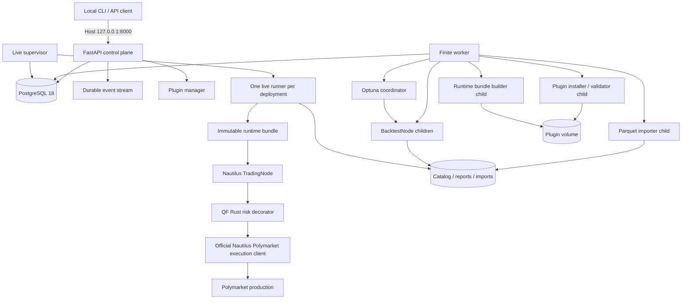

# QuantFoundry 产品与技术架构设计

> 架构基线：2026-08-20  
> 目标分支：`codex/quantfoundry-nautilus-redesign`  
> 文档地位：QuantFoundry 唯一完整的产品与技术事实源  
> 当前状态：**目标架构已锁定，现有实现不符合本设计，尚未 release-ready / live-ready**

`README.md` 只负责项目入口、当前状态和最短运行说明；`AGENTS.md` 只负责开发治理。代码、配置、测试或运行结果不得静默改写本文。

---

## 0. 当前分支审计结论

本分支已经完成产品边界和架构方向重写，但尚未完成对应代码重构。现有运行代码仍属于旧系统，不能作为新架构的实现基础继续叠加功能。

| 区域 | 当前证据 | 本设计要求 | 结论 |
|---|---|---|---|
| 产品文档 | 已建立单一 `DESIGN.md` | 单一产品与架构事实源 | 已完成 |
| Backend | 仍有旧 `app`、`scheduler`、Agent、generated model、自研 engine | 精简的 QF 控制平面 + Nautilus runner | 必须替换 |
| 数据库 | 仍有旧 17 段 migration 和历史 schema 快照 | 单一 fresh-schema `0001_initial.py` | 必须重建 |
| 依赖 | 仍包含 LangGraph、YAML contract、DuckDB 等旧依赖，缺少 Nautilus/Optuna | 只保留目标运行依赖 | 必须重锁 |
| Compose | 仍有 local-provider、agent-worker、scheduler、frontend、8080 | PostgreSQL、migrate、API、finite worker、live supervisor | 必须重写 |
| Frontend | 完整 React/Storybook/Playwright 目录仍存在 | 无前端 | 必须删除 |
| 插件 | 仍是构建期静态安装模型，没有 release、bundle、drain、remove 生命周期 | 运行时动态安装、激活、停用、升级和卸载 | 必须新建 |
| CI | 仍是旧 fast/full/release/agent gates | 单一、与目标代码树对应的 `ci.yml` | 必须重写 |
| 外部验证 | 无 Polymarket production preflight/canary 证据 | 只读预检 + 最小金额 canary + 独立复核 | 未开始 |

因此，当前分支只能描述为 **architecture baseline**，不得描述为“重构完成”。实施必须先删除不属于目标架构的旧代码，再建立新骨架；不得在旧 `app/main.py`、旧 scheduler、旧 generated contract 或旧插件加载逻辑上做兼容式迁移。

## 1. 产品定义

### 1.1 定位

QuantFoundry（QF）是 **API-only、单机、单操作员** 的量化研究与实盘工作台。第一阶段提供 Polymarket 和固定 L2 Parquet 插件；后续数据源、导入器和执行连接通过运行时插件管理器动态安装、激活、停用、升级和卸载，控制面不需要重启。

QF 是控制平面和产品层；NautilusTrader 是唯一交易内核。

QF 负责：

- Research、研究章节和状态生命周期；
- Strategy 源码、配置和版本；
- 插件 release、runtime bundle、数据源、执行连接和 credential；
- Parquet 导入、回测、优化、Holdout、审批和 Run 编排；
- live deployment 的 desired state、进程恢复、universe revision 和控制事件；
- 加密 credential 的持久化；
- Nautilus 标准结果摘要、报告引用和中央风险最小投影。

NautilusTrader 负责：

- instrument、market data、event loop、ParquetDataCatalog；
- BacktestNode、TradingNode；
- order、fill、position、portfolio、NAV、费用和撮合；
- RiskEngine、ExecutionEngine、adapter 和 venue reconciliation；
- 官方 Polymarket data/execution adapter 的协议、签名和状态推进。

### 1.2 第一阶段工作流

```text
运行时安装并激活所需插件
  → 创建 data source / execution connection
  → 创建 Research
  → 完成七个研究章节
  → 上传可信 Python Strategy
  → 选择 Catalog dataset
  → 100-trial NSGA-II 优化
  → 确定性选择 Pareto 折中解
  → 单次独立 Holdout
  → 人工审批
  → 创建并启动 Polymarket deployment
```

人工 Stop 撤销挂单但不强平。人工 Restart 必须重新审批。进程崩溃或节点丢失触发自动 recovery；自动 recovery 可以沿用原审批，但必须先完成 fail-closed 两代恢复流程。

### 1.3 “运行时动态插拔”的精确定义

动态插拔指：

- API、finite worker 和 live supervisor 保持运行；
- 操作者通过 API 上传 wheel 集、安装、激活、切换默认版本、停用和卸载插件；
- 多个插件版本可以并存；新资源使用当前 active release，已有资源固定到其原 release；
- 插件代码只在短生命周期 validator 或具体 Run/live runner 进程内加载；
- 停用插件立即阻止新绑定，已有任务和 deployment 按 drain 规则收口；
- 强制拔出通过停止受影响 runner、释放 runtime bundle 和删除插件文件完成；
- 不尝试在已经导入插件的 Python/Nautilus 进程内卸载模块或原生扩展。

因此，“系统不停机”不等于“同一个 TradingNode 进程原地替换 adapter”。涉及正在运行的执行插件升级或拔出时，受影响 deployment 必须走 Stop 或受控 restart/recovery；其他控制面和无关 deployment 不受影响。

### 1.4 明确非目标

第一阶段不建设或保留：

- 浏览器前端、移动端、Nginx、Swagger UI、Redoc；
- 用户、workspace、session、Bearer auth、登录或多租户；
- AI、Agent、Tool、模型 provider 或 LangGraph；
- QF 自研回测、Paper scheduler、撮合、收益、费用、仓位或 NAV 引擎；
- QF 自研券商 REST/WebSocket/签名/订单协议；
- 没有官方 Nautilus adapter 的执行场所；
- 公共插件市场、自动更新、后台静默升级、任意 Git URL 安装；
- 运行时构建 sdist、editable package 或本机编译第三方 native extension；
- 进程内 `reload()`、修改 `sys.modules` 或热补丁式插件卸载；
- 独立 factor engine；因子直接写入 Strategy；
- QF 内部 funding、allowance、redemption 或交易所外人工交易账本；
- 应用级 SHA、hash、checksum、digest、fingerprint 文件或状态判定；
- 为未来场景预埋的 feature flag、兼容层、HA、Redis、消息中间件、密钥轮换体系或旧业务数据迁移框架。

插件和 Strategy 都是可信本地操作员代码，不是安全沙箱。

## 2. 架构不变量与 ownership

以下边界不可通过实现细节突破：

1. **单一交易事实源**：订单、成交、仓位、账户、NAV 和费用只属于 Nautilus/交易场所。
2. **控制面不镜像账本**：QF 只存研究、编排、引用和中央风险所需的最小投影。
3. **交易节点进程隔离**：API 进程不运行 BacktestNode 或 TradingNode。
4. **官方 execution adapter**：执行插件只构造官方 Nautilus adapter；不得复制协议客户端。
5. **插件进程隔离**：第三方插件不得导入 API、finite worker 或 live supervisor 长生命周期进程。
6. **插件 release 固定**：Run、data source、execution connection 和 deployment 必须引用具体 `plugin_release_id`，不得只引用可漂移的 `plugin_id`。
7. **无进程内热卸载**：插件生命周期等于 validator/runner 子进程生命周期；切换通过新进程完成。
8. **文档优先**：状态、字段、API、插件合同、风险或失败语义变化先改本文。
9. **fail-closed**：风险数据库、reconciliation、owner、heartbeat 或运行插件不可用时，禁止增加暴露；cancel 保持可用。
10. **删除优先**：旧系统无兼容义务，使用全新数据库和持久卷，不迁移旧业务数据。

Ownership 固定为：

| 层 | 拥有的行为 |
|---|---|
| API | HTTP 校验、资源状态、统一错误 envelope、SSE 输出 |
| QF control plane | Research、Strategy version、Experiment、Run、Approval、Deployment、Universe revision |
| Plugin manager | plugin release 生命周期、descriptor snapshot、activation/drain/remove、runtime bundle 编排 |
| Plugin validator | 在隔离进程中安装和加载 entry point、生成 schema、验证兼容性 |
| Finite worker | 插件安装/删除、Parquet import、Backtest、Optimization、Holdout 有限作业 |
| Live supervisor/runner | deployment owner、generation、TradingNode 生命周期、插件 bundle 固定和 recovery |
| QF native risk | 提交前中央 reservation、最小 projection、reconciliation 接口 |
| Nautilus | 交易内核、Catalog、回测、订单、成交、仓位、账户、原生风险和 adapter |
| PostgreSQL | 控制面、插件状态、作业队列、事件 outbox、Optuna schema、中央风险投影 |
| 持久卷 | plugin artifacts/bundles、Catalog、reports、import staging |

## 3. 总体架构



### 3.1 运行组件

| 组件 | 数量 | 职责 |
|---|---:|---|
| `postgres` | 1 | QF schema、plugin/risk state、Optuna schema、job/event storage |
| `migrate` | one-shot | 旧 schema 预检、运行单一 Alembic baseline |
| `api` | 1 | FastAPI，无插件代码和交易节点 |
| `finite-worker` | 1 | claim 插件管理和研究有限作业，启动独立子进程 |
| `live-supervisor` | 1 | 按 desired state 管理 live runner 子进程 |
| plugin validator/builder child | 按作业 | 安装、descriptor 校验、runtime bundle 构建和删除 |
| Backtest/import child | 按作业 | 一次 Run 一个隔离进程；优化最多并发 4 个 BacktestNode |
| live runner child | 每 deployment 1 个 | 固定 runtime bundle、recovery/armed generation 和 TradingNode |

API、finite worker 和 live supervisor 使用同一个 backend image。第一阶段不引入 Redis、Celery、Kafka、Kubernetes 或单独的 plugin daemon。

### 3.2 网络边界

容器内 Uvicorn 监听 `0.0.0.0:8000`，以便 Docker 转发；Compose 只发布：

```yaml
ports:
  - "127.0.0.1:8000:8000"
```

因此宿主机外不可访问。不得发布 `8080`，不得恢复 frontend/Nginx。OpenAPI JSON 位于 `/api/v1/openapi.json`；`docs_url` 和 `redoc_url` 必须为 `None`。

插件安装第一阶段只接受 multipart 上传的本地 wheel 集，不由 API 访问 PyPI、GitHub 或任意远端 URL。

## 4. 目标代码树

```text
QuantFoundry/
├── README.md
├── DESIGN.md
├── AGENTS.md
├── LICENSE
├── NOTICE
├── THIRD_PARTY_NOTICES.md
├── compose.yml
├── Makefile
├── .env.example
├── .gitignore
├── .dockerignore
├── .gitattributes
├── .editorconfig
├── .github/
│   └── workflows/
│       └── ci.yml
├── deploy/
│   └── Dockerfile.backend
├── native/
│   └── qf_nautilus_risk/
│       ├── Cargo.toml
│       └── src/
│           ├── lib.rs
│           ├── client.rs
│           ├── factory.rs
│           └── reservation.rs
└── backend/
    ├── pyproject.toml
    ├── uv.lock
    ├── alembic.ini
    ├── alembic/
    │   ├── env.py
    │   └── versions/
    │       └── 0001_initial.py
    ├── src/
    │   └── quantfoundry/
    │       ├── __init__.py
    │       ├── main.py
    │       ├── settings.py
    │       ├── errors.py
    │       ├── api/
    │       │   ├── plugins.py
    │       │   ├── integrations.py
    │       │   ├── strategies.py
    │       │   ├── research.py
    │       │   ├── runs.py
    │       │   ├── deployments.py
    │       │   └── system.py
    │       ├── db/
    │       │   ├── session.py
    │       │   ├── models.py
    │       │   └── repositories.py
    │       ├── crypto.py
    │       ├── plugins/
    │       │   ├── contract.py
    │       │   ├── manager.py
    │       │   ├── artifacts.py
    │       │   ├── validator.py
    │       │   ├── bundles.py
    │       │   └── runtime.py
    │       ├── strategy_contract.py
    │       ├── jobs.py
    │       ├── events.py
    │       ├── research.py
    │       ├── optimization.py
    │       ├── risk.py
    │       ├── deployments.py
    │       └── runners/
    │           ├── install_plugin.py
    │           ├── build_plugin_bundle.py
    │           ├── remove_plugin.py
    │           ├── import_parquet.py
    │           ├── backtest.py
    │           ├── optimize.py
    │           ├── live.py
    │           ├── finite_worker.py
    │           └── live_supervisor.py
    └── tests/
        ├── unit/
        ├── integration/
        ├── process/
        └── external/
```

必须删除旧 `frontend/`、`backend/app/`、`backend/scheduler/`、`backend/schema/`、generated models、旧 contracts、旧 migrations、旧 release/evidence scripts 和与目标架构无关的 CI workflow。不得保留兼容 wrapper。

## 5. 领域模型与状态机

### 5.1 Research

Research 状态固定为：

```text
DRAFT → ACTIVE → REVIEW → CLOSED
              ↑       │
              └───────┘
```

| 当前状态 | 动作 | 下一状态 | 条件 |
|---|---|---|---|
| `DRAFT` | activate | `ACTIVE` | 七个章节完整，存在有效 Strategy version |
| `ACTIVE` | start experiment | `ACTIVE` | 数据、策略、插件 bundle 和 experiment 配置有效 |
| `ACTIVE` | holdout succeeded | `REVIEW` | optimization 已完成且选出唯一 candidate |
| `REVIEW` | approve deployment | `CLOSED` | 人工 approval 通过 |
| `REVIEW` | reject | `ACTIVE` | 拒绝原因必填；后续必须产生新的章节 revision 或 Strategy version |
| `CLOSED` | mutate | 禁止 | 创建新的 Research |

研究章节固定为独立 Markdown revision：

```text
HYPOTHESIS
MARKET_CONTEXT
DATA
METHOD
RESULTS
RISKS
CONCLUSION
```

### 5.2 Experiment、Run 与 Plugin job

Research Run 类型：

```text
PARQUET_IMPORT
BACKTEST
OPTIMIZATION
HOLDOUT
```

Run 状态：

```text
QUEUED → RUNNING → SUCCEEDED
                 ├→ FAILED
                 └→ CANCELLED
```

插件管理只使用 `jobs.kind`：

```text
PLUGIN_INSTALL
PLUGIN_BUNDLE_BUILD
PLUGIN_REMOVE
```

Plugin job 不创建 Research `runs` 行，也不挂到 Experiment；其业务状态写入 `plugin_releases` 或 `plugin_runtime_bundles`。Research Run 和 plugin job 的终态均不可重新打开；重试必须创建新的 Run 或 job。子进程退出码、标准错误摘要和报告/状态引用必须写回对应资源。

### 5.3 Approval

Approval 类型：

```text
DEPLOYMENT_START
UNIVERSE_EXPANSION
```

状态为 `PENDING → APPROVED | REJECTED`。

- `DEPLOYMENT_START` approve 必须在同一事务中写 deployment desired state 和启动 event。
- 人工 restart 不直接启动；它创建新的 `DEPLOYMENT_START` approval。
- 更换 running deployment 的 data/execution plugin release 属于 restart 配置变化，必须重新审批。
- `UNIVERSE_EXPANSION` 只批准明确的 predicate、cap 和 revision，不覆盖未来放宽。

### 5.4 Deployment

Deployment 持久化 `desired_state` 与 `observed_state`：

```text
desired_state: CREATED | RUNNING | STOPPED
observed_state:
  CREATED | STARTING | RUNNING | STOPPING | STOPPED | RECOVERY_BLOCKED | FAILED
```

每个 runner generation 的内部状态：

```text
RECOVERY → RECONCILED → ARMED → STRATEGY_READY → TRADING
```

Deployment 固定 `runtime_bundle_id`、data plugin release 和 execution plugin release。任何状态不确定、风险投影不完整、数据库不可用、owner lock 丢失、bundle 不可用或插件版本不匹配，都必须保持或进入 `RECOVERY_BLOCKED`。

### 5.5 Universe revision

第一阶段默认最多 100 个 outcome instruments：

1. 按获批 predicate 发现市场；
2. liquidity 降序；
3. 相同 liquidity 按 Nautilus `InstrumentId` 升序；
4. 截断到 cap；
5. 新 instrument 先进入 pending roster；
6. 受控 restart、reconciliation 和精确风险映射完成后才可交易。

已审批 predicate 命中的新上市市场可以自动进入 pending revision。放宽 predicate、降低流动性/到期门槛或提高 cap 必须新建 `UNIVERSE_EXPANSION` approval。收窄条件立即撤单并触发受控 restart。

离开 active universe 的 instrument 禁止新增暴露并撤销挂单；只要仍有仓位或未结算状态，就保留在 recovery roster。

## 6. PostgreSQL 数据模型

### 6.1 通用约束

- 主键使用 UUID；外部展示不再引入另一套 public-id。
- 时间统一为 UTC `timestamptz`。
- 金额、价格、数量使用 `numeric` 或十进制字符串，不使用浮点数。
- 状态字段使用 `text + CHECK`；状态变化由领域服务执行。
- JSONB 只存插件 descriptor snapshot、配置、不可预先规范化的摘要或审批 scope，不代替核心关系字段。
- 不使用软删除；插件 release 即使物理卸载也保留 `REMOVED` tombstone 供引用和审计。
- 被引用的一般资源返回 `RESOURCE_REFERENCED`。
- 不建立订单、成交、仓位、账户或 NAV 完整镜像表。
- 不使用内容 hash 作为 plugin release、artifact 或 runtime bundle 身份；均使用数据库 UUID 和显式关系。

### 6.2 插件表

| 表 | 关键字段 | 约束/用途 |
|---|---|---|
| `plugin_releases` | `id`, `plugin_id`, `distribution_name`, `version`, `api_version`, `state`, `is_default`, `descriptor_snapshot`, `last_error`, `created_at`, `activated_at`, `removed_at` | `(plugin_id, version)` 永久唯一；同一 `plugin_id` 最多一个 default active release |
| `plugin_artifacts` | `id`, `plugin_release_id`, `role`, `filename`, `relative_path`, `package_name`, `package_version`, `created_at` | `role=PRIMARY|DEPENDENCY`；只接受 wheel；不保存 QF checksum |
| `plugin_runtime_bundles` | `id`, `state`, `python_version`, `qf_version`, `nautilus_version`, `environment_path`, `last_error`, `created_at`, `ready_at`, `removed_at` | `BUILDING|READY|FAILED|STALE|REMOVED`；目录完成后不可原地修改 |
| `plugin_runtime_bundle_members` | `runtime_bundle_id`, `plugin_release_id`, `member_role` | 明确记录 bundle 内 release；不使用组合 hash |

Plugin release 状态机：

```text
RECEIVED → INSTALLING → VALIDATING → STAGED → ACTIVE
                         └────────────→ FAILED
ACTIVE → DRAINING → INACTIVE → REMOVING → REMOVED
STAGED → REMOVING → REMOVED
FAILED → INSTALLING | REMOVING
```

规则：

- `ACTIVE` 是新绑定的默认 release；激活新版本时，旧 active release在同一事务中进入 `DRAINING`。
- `DRAINING` 禁止新 data source、execution connection 或 deployment 绑定，但允许已有绑定完成作业、自动 recovery 或人工 Stop。
- `DRAINING` 在无活跃/排队运行引用后进入 `INACTIVE`；处于 `INACTIVE` 的旧持久绑定不能启动新的 Run 或人工 Restart，除非重新激活或迁移。
- `REMOVED` 只删除 artifact 和 bundle 文件，不删除数据库 tombstone。
- `FAILED` release 不允许激活；若原 artifacts 完整，可以创建新 `PLUGIN_INSTALL` job 重试同一 release，否则必须上传新的 version。
- `(plugin_id, version)` 在 tombstone 后仍不可复用；任何重新构建必须提升 version。

### 6.3 控制面表

| 表 | 关键字段 | 约束/用途 |
|---|---|---|
| `credential_sets` | `id`, `plugin_release_id`, `name`, `public_config`, `created_at`, `updated_at` | credential schema 固定到 release；列表只返回 public config 和 secret presence |
| `credential_secrets` | `credential_set_id`, `field_name`, `ciphertext`, `nonce`, `key_version` | `(credential_set_id, field_name)` 唯一；永不通过 API 返回 |
| `data_sources` | `id`, `plugin_release_id`, `credential_set_id`, `name`, `config`, `state` | release 必须有 historical/live-data capability；停用后已有绑定可 drain |
| `execution_connections` | `id`, `plugin_release_id`, `credential_set_id`, `name`, `config`, `state` | release 必须有 execution capability；只使用官方 Nautilus adapter |
| `catalog_datasets` | `id`, `data_source_id`, `instrument_id`, `catalog_path`, `started_at`, `ended_at`, `row_count`, `state`, `run_id` | 只有完整导入后注册 |
| `strategies` | `id`, `name`, `created_at` | 逻辑策略容器 |
| `strategy_versions` | `id`, `strategy_id`, `version_no`, `source_text`, `default_config`, `objective_directions`, `created_at` | `(strategy_id, version_no)` 唯一；不计算源码指纹 |
| `research_cases` | `id`, `title`, `state`, `content_revision`, `created_at`, `updated_at` | `content_revision` 仅为递增业务版本号 |
| `research_section_revisions` | `id`, `research_id`, `section`, `revision_no`, `markdown`, `created_at` | `(research_id, section, revision_no)` 唯一 |
| `experiments` | `id`, `research_id`, `strategy_version_id`, `dataset_id`, `train_start`, `train_end`, `holdout_start`, `holdout_end`, `seed`, `objective_directions`, `optuna_study_name`, `selected_trial_no` | train/holdout 不重叠 |
| `runs` | `id`, `experiment_id`, `runtime_bundle_id`, `type`, `state`, `attempt`, `started_at`, `finished_at`, `summary`, `error_code`, `error_message` | 使用插件的 Run 固定 bundle；终态不可重开 |
| `reports` | `id`, `run_id`, `kind`, `relative_path`, `media_type`, `row_count`, `created_at` | 只存引用，不存金融事实副本 |
| `approvals` | `id`, `type`, `resource_type`, `resource_id`, `scope`, `state`, `reason`, `created_at`, `decided_at` | approve/reject 一次性 |
| `deployments` | `id`, `research_id`, `strategy_version_id`, `data_source_id`, `execution_connection_id`, `runtime_bundle_id`, `desired_state`, `observed_state`, `active_revision_id`, `generation`, `last_error`, `created_at`, `updated_at` | 一个 deployment 同时只有一个 owner；固定 bundle |
| `deployment_universe_revisions` | `id`, `deployment_id`, `revision_no`, `predicate`, `cap`, `state`, `approval_id`, `created_at` | predicate/cap 的获批快照 |
| `deployment_instruments` | `deployment_id`, `revision_id`, `instrument_id`, `lifecycle_state`, `risk_limit_pusd`, `last_reconciled_at` | 精确 instrument roster |

### 6.4 作业与事件表

`jobs` 是内部 durable queue：

```text
id UUID PK
kind TEXT
resource_type TEXT
resource_id UUID
state TEXT                 # READY | LEASED | SUCCEEDED | FAILED | CANCELLED
payload JSONB
attempt INTEGER
available_at TIMESTAMPTZ
lease_owner TEXT NULL
lease_expires_at TIMESTAMPTZ NULL
last_error TEXT NULL
created_at / updated_at TIMESTAMPTZ
```

worker 使用 `SELECT ... FOR UPDATE SKIP LOCKED` claim。插件安装、bundle 构建和移除均为 job；API 不直接运行 `uv` 或导入插件。Lease 只用于进程崩溃后重新领取，不改变业务终态语义。

`events` 同时作为事务 outbox 和 SSE durable source：

```text
id BIGINT GENERATED ALWAYS AS IDENTITY PK
kind TEXT
aggregate_type TEXT
aggregate_id UUID NULL
payload JSONB
created_at TIMESTAMPTZ
```

状态变更与 event insert 必须处于同一数据库事务。PostgreSQL `LISTEN/NOTIFY` 只做唤醒；事件补发和顺序以 `events.id` 为准。

### 6.5 中央风险表

| 表 | 关键字段 | 语义 |
|---|---|---|
| `risk_accounts` | `funder_id`, `status`, `gross_limit_pusd`, `owner_deployment_id`, `owner_generation`, `last_reconciled_at`, `last_heartbeat_at` | funder 级锁定行 |
| `risk_positions` | `funder_id`, `instrument_id`, `entry_cost_pusd`, `observed_at` | venue snapshot 的最小投影 |
| `risk_open_orders` | `funder_id`, `client_order_id`, `instrument_id`, `increase_debit_pusd`, `state`, `observed_at` | 只为下一笔风险判断 |
| `risk_reservations` | `id`, `funder_id`, `runner_generation`, `client_order_id`, `instrument_id`, `reserved_pusd`, `state`, `created_at`, `resolved_at` | `(funder_id, runner_generation, client_order_id)` 唯一 |
| `risk_events` | `id`, `funder_id`, `kind`, `payload`, `created_at` | 风险裁决/对账审计，不是交易账本 |

## 7. 运行时插件架构

### 7.1 分发格式与发现

每个插件 release 由一组 Python wheels 构成：

- 一个 PRIMARY wheel；
- 零个或多个 DEPENDENCY wheels；
- 同一个 wheel 集内每个 distribution name 只能出现一个 version；
- DEPENDENCY wheel 不得声明 `quantfoundry.plugins` entry point；
- 不接受 sdist、editable install、源码目录、Git URL 或任意可变远程 URL；
- 包含 native extension 时必须提供与目标 Python/平台兼容的预编译 wheel。

PRIMARY wheel 必须声明恰好一个 entry point：

```toml
[project.entry-points."quantfoundry.plugins"]
<plugin_id> = "<module>:<descriptor_factory>"
```

Entry point name、descriptor `plugin_id` 和安装请求声明的 `plugin_id` 必须一致；distribution version 与 descriptor version 必须一致。一次 release validation environment 中必须只发现这一个目标 entry point。

API 和长生命周期进程只读取数据库中持久化的 descriptor snapshot，不直接调用 `entry_points()` 或导入插件。Entry point 的发现与 `.load()` 只发生在独立 validator/runner 进程。

### 7.2 Descriptor 合同

```text
plugin_id: str
version: str
api_version: str                    # V1 固定 "1"
capabilities: set[
  HISTORICAL_IMPORT |
  LIVE_DATA |
  EXECUTION
]
compatibility_key: str
requires_python: str
requires_qf: str
requires_nautilus: str | null
public_config_model: type[BaseModel]
secret_config_model: type[BaseModel]
required_secret_names: tuple[str, ...]
build_data_config(...)
build_execution_config(...)
build_catalog_importer(...)
```

约束：

- 不具备的 capability 对应 builder 必须为 `None`；
- `EXECUTION` builder 只能返回官方 Nautilus adapter config/factory 或设计批准的 QF decorator factory；
- schema 必须能稳定生成 JSON Schema；
- descriptor import 不得启动网络连接、后台线程或交易节点；
- plugin package 不定义 QF 自己的 Instrument、Order DTO、symbol normalization 或 broker client interface；
- schema 和 capability snapshot 在 validation 成功时持久化，后续不得原地修改该 release。

### 7.3 安装与验证流程

`POST /api/v1/plugin-releases` 完成流式上传并创建 `RECEIVED` release，随后提交 `PLUGIN_INSTALL` job：

```text
RECEIVED
  → 将 wheel 集写入 imports/plugin-install/{release_id}/
  → 解析 wheel METADATA 和 entry point 声明（不执行插件）
  → 创建一次性 validation venv
  → 从 core wheelhouse 安装固定 QF plugin contract、Nautilus 和约束依赖
  → uv 离线安装 PRIMARY + DEPENDENCY wheels
  → uv pip check
  → validator 子进程加载唯一 entry point
  → 校验 descriptor、版本约束和 JSON Schema
  → 持久化 descriptor snapshot
  → 原子移动 artifacts 到 plugins/releases/{release_id}/
  → STAGED
```

安装命令必须满足：

- 使用 backend image 内固定的 `uv`；
- `--offline --no-index --only-binary :all:`；
- 使用 core lock 生成的精确 constraints，插件不得替换 QF/Nautilus/core dependency 版本；
- 禁止 Python 自动下载；
- 不执行 sdist build；
- validation venv 和失败 staging 在 `finally` 清理；
- 安装失败只影响该 release，不能使 API 或其他 active release 不可用；
- QF 不创建 artifact checksum、digest 或 fingerprint。

插件 wheel 的 import 本身是可信代码执行。隔离进程用于生命周期隔离和故障收口，不构成恶意代码沙箱。

### 7.4 Immutable runtime bundle

插件 release 不直接修改 backend image 或长生命周期进程的 site-packages。使用插件前，QF 为所需 release 组合构建 immutable runtime bundle：

```text
runtime bundle
  = pinned QF runner wheel
  + pinned Nautilus wheel
  + pinned qf_nautilus_risk wheel
  + selected plugin PRIMARY/DEPENDENCY wheels
```

构建步骤：

1. 以数据库 UUID 创建临时 bundle 目录；
2. 使用与 backend image 相同的 Python patch version 创建 venv；
3. 从 image 内 core wheelhouse 和 plugin artifact 目录按 core constraints 离线安装；
4. 执行 `uv pip check`；
5. 在 bundle Python 中重新发现和加载所有指定 entry points；
6. 校验 release 组合、`compatibility_key`、QF/Nautilus/Python 版本；
7. 校验 descriptor/builder 可调用性和 Nautilus factory 注册；不伪造业务配置，也不连接真实 venue；
8. 原子 rename 到 `/var/lib/quantfoundry/plugins/bundles/{bundle_id}`；
9. 状态变为 `READY`，目录只读。

实际 data source、execution connection 或 deployment 在首次使用前，必须在该 bundle 的独立 preflight 子进程中使用其真实 public config、secret presence 和资源上下文构造配置。需要真实网络的 Polymarket preflight 仍按生产只读流程单独执行，不能由 generic bundle build 冒充。

Bundle 完成后不得原地 `pip install`、`pip uninstall` 或修改文件。需要新插件版本或新组合时创建新 bundle。

Bundle 身份由 UUID 和 `plugin_runtime_bundle_members` 显式关系决定，不计算组合 hash。相同 core version 和相同 release 组合可以复用已有 `READY` bundle；查重使用关系查询，不使用 fingerprint。

backend image 的 Python、QF 或 Nautilus 版本变化后，旧 bundle 标记为 `STALE`。任何新 Run 或新 runner generation 使用前必须从原 artifacts 重建；正在运行的旧进程可以完成，但不得在旧 bundle 上启动新的 generation。

### 7.5 激活、升级、停用与拔出

#### 激活

`POST /api/v1/plugin-releases/{id}/activate`：

- 只允许 `STAGED` 或 `INACTIVE` release；
- 在一个事务内将它设为 `ACTIVE/is_default=true`；
- 同一 `plugin_id` 的旧 default release 进入 `DRAINING/is_default=false`；
- 不重启 API、worker、supervisor 或无关 runner；
- 新 data source/execution connection 只能绑定新的 active release。

#### 升级

升级是 side-by-side 安装新版本，不覆盖旧目录：

1. 上传并验证新 release；
2. 激活新 release；
3. 新资源使用新 release；
4. 已有资源继续固定旧 release；
5. 操作者显式更新 data source/execution connection；
6. running deployment 通过新 approval 和受控 restart 切换 bundle；
7. 旧 release 无运行引用后转为 `INACTIVE`。

不得把已有 deployment 的 `plugin_release_id` 或 `runtime_bundle_id` 原地偷换为新版本。

#### 普通停用

`POST /api/v1/plugin-releases/{id}/deactivate`：

- 立即进入 `DRAINING`，禁止新绑定；
- 已经入队或运行的 finite Run 可以完成；
- 已有 live deployment 可以继续、自动 recovery 或人工 Stop，但不能人工 Restart，也不能创建引用该 release 的新 deployment；
- 无 active/queued 运行引用后自动进入 `INACTIVE`；
- 控制面保持运行。

#### 物理卸载

`DELETE /api/v1/plugin-releases/{id}` 创建 `PLUGIN_REMOVE` job：

- 非强制删除：若仍有 queued/running Run、active deployment 或不可替代的持久资源引用，返回 `PLUGIN_IN_USE`；
- 强制删除：先进入 `DRAINING`，取消尚未启动的相关 jobs，请求受影响 deployment 按标准 Stop 撤单并退出 runner，待所有子进程终止后把依赖资源标记为 `BLOCKED_PLUGIN_REMOVED`；
- 删除仅清理该 release artifacts 和不再被引用的 bundles；
- 数据库 release 行保留为 `REMOVED` tombstone；
- 强制删除不强平现有仓位，后续恢复需要重新安装新 version 的兼容 release 或重新绑定可用连接。

### 7.6 为什么不做进程内 reload/unload

Python reload 不会重新绑定插件外部持有的旧对象引用，既有 class instance 也继续使用旧 class；动态加载的 extension module 也可能无法安全重复初始化。Nautilus adapter、PyO3/Rust extension、线程、socket 和事件订阅进一步放大该问题。

因此 QF 的动态插拔边界固定为：

```text
插件包和版本在系统运行时动态变化
≠
已加载插件的同一 Python/TradingNode 进程原地卸载
```

真正的资源释放通过子进程退出和 immutable bundle 删除完成。

### 7.7 Data/Execution 组合

Data source 和 execution connection 可以独立配置，但用于同一 deployment 时：

- 两者 release 必须处于 `ACTIVE`，或是该 deployment 已有绑定的 `DRAINING` release；
- `compatibility_key` 必须完全相同；
- `requires_qf`、`requires_python` 和 `requires_nautilus` 必须同时满足；
- 必须生成原生 Nautilus `InstrumentId`；
- execution 必须来自官方 Nautilus adapter；
- secret schema 只用于 write-only 输入；
- 组合必须先构建并验证为一个 `READY` runtime bundle。

第一阶段初始插件：

| `plugin_id` | 能力 | 责任 |
|---|---|---|
| `polymarket` | `LIVE_DATA`, `EXECUTION` | 构造官方 Nautilus Polymarket CLOB V2 data client 和 QF risk-wrapped execution factory |
| `parquet_l2` | `HISTORICAL_IMPORT` | 固定 L2 Parquet → Nautilus ParquetDataCatalog |

它们可以随初始部署作为 STAGED release 导入数据库，但后续与第三方插件使用同一 lifecycle，不在 API 中硬编码第二套 registry。

## 8. Credential 与 secret

- 使用 AES-256-GCM；每个 secret field 使用独立随机 96-bit nonce。
- master key 从 `QF_MASTER_KEY` 外部注入，缺失时 API/worker/supervisor 启动失败。
- AAD 至少包含 `credential_set_id`、`plugin_release_id`、`field_name`、`key_version`，防止密文跨字段或跨 release 替换。
- 第一期只支持一个 active key version，不实现自动轮换。
- API 永不返回 plaintext、ciphertext、nonce 或 master key。
- 列表仅返回 secret 字段名和 `configured: true|false`。
- credential schema 固定到创建它的 plugin release；升级插件时必须显式验证或新建 credential set，不自动迁移字段。
- live supervisor 只解密该 deployment 引用的 credential set，通过匿名 pipe 传给 runner；不把 secret 写入命令行、日志、持久卷或普通环境变量。
- Plugin 和 Strategy 与 TradingNode 同进程时都属于可信代码，可能接触该 deployment 的运行时 secret；文档不得把它描述为隔离沙箱。

## 9. Strategy 合同

上传恰好一个 `.py` 文件：

```text
source <= 1 MiB
strategy config JSON <= 64 KiB
```

模块必须导出：

```python
Config(StrategyConfig)
Strategy(Strategy)
suggest(trial: optuna.Trial) -> dict
OBJECTIVE_DIRECTIONS: tuple[str, ...]  # exactly 2 or 3
objectives(result: BacktestResult) -> tuple[float, ...]
```

约束：

- `Config` 满足 Nautilus `ImportableStrategyConfig` 语义；
- BacktestNode 与 TradingNode 使用相同 Strategy/Config；
- QF 不安装源码声明的额外依赖；策略依赖必须属于固定 core runtime 或已批准 plugin bundle，不从源码动态解析；
- 不接受外部 module path 或压缩包；
- contract validation 在独立短生命周期进程中运行；
- 源码以 PostgreSQL text 保存，以数据库 `strategy_version.id` 和 `version_no` 引用；不计算源码 hash/fingerprint。

## 10. 固定 L2 Parquet 导入

一次 dataset revision 只包含一个 Polymarket outcome instrument。multipart metadata 至少包含 condition/token identity、时间范围和 source label；instrument 使用官方 Polymarket provider 解析。

固定列：

```text
event_id       uint64
event_index    uint32
is_snapshot    bool
action         enum(CLEAR, ADD, UPDATE, DELETE)
side           enum(BUY, SELL, NONE-for-CLEAR)
price          UTF-8 decimal string
size           UTF-8 decimal string
order_id       uint64
sequence       uint64
ts_event_ns    uint64
ts_init_ns     uint64
```

导入算法：

1. 确认 `parquet_l2` release 可用于该 data source，并取得 `READY` runtime bundle；
2. 上传写入 `/var/lib/quantfoundry/imports/{run_id}/upload.parquet`；
3. 使用该 bundle 的 Python 启动 importer 子进程；
4. PyArrow `RecordBatch` 分批读取，不使用 pandas，不全量载入内存；
5. 校验物理 schema、十进制字符串、`event_index` 连续性和 snapshot `CLEAR` 起点；
6. `price`/`size` 通过 Nautilus `Price`/`Quantity` 构造；
7. 生成 Nautilus `F_LAST`/`F_SNAPSHOT` 事件；
8. 写同一持久卷内的临时 Catalog 目录；
9. 完成后原子 rename 到最终目录，再在数据库注册 dataset；
10. 任意失败不注册 dataset，并在 `finally` 清理 staging。

默认上限 10 GiB，由 `QF_MAX_PARQUET_UPLOAD_BYTES` 调整。超限返回 413；schema/语义错误返回 422。不生成 checksum 文件。

## 11. Backtest、优化与 Holdout

### 11.1 唯一回测路径

```text
Nautilus BacktestNode + ParquetDataCatalog
```

QF 保存 `BacktestResult` 的标准 summary、PnL/return/general stats、returns series、counts 和 timestamps。orders/fills/positions/account 报告使用 Nautilus 官方 report 生成函数写入 reports volume；QF 只保存文件引用。

每个 Run 在入队前固定 `runtime_bundle_id`。若只需要 core Nautilus，则使用零插件成员的 core bundle；若 Strategy 或数据路径需要 plugin release，则使用包含确切 release 的 bundle。Bundle 成员 release 后续进入 `DRAINING` 不影响已经入队或运行的 Run。若固定 bundle 在子进程启动前变成 `STALE` 或 `REMOVED`，Run 以 `PLUGIN_RUNTIME_UNAVAILABLE` 失败；重试必须创建新 Run 并显式选择新构建的 bundle，不得原地改写旧 Run 或漂移到其他 release。

### 11.2 Optuna 配置

第一阶段固定：

```text
Optuna 4.9.0
NSGAIISampler(population_size=20, seed=stored_seed)
100 Optuna trials
最多 4 个并发 BacktestNode OS processes
2 或 3 个 objectives
```

为避免并发完成顺序改变采样结果，不使用 `study.optimize(..., n_jobs=4)` 直接异步推进。Coordinator 使用确定性的 population-batch 调度：

1. 依次 `study.ask()` 产生一组 20 个 trial；
2. 在 coordinator 内调用 Strategy `suggest(trial)` 固化参数；
3. 最多并发 4 个独立子进程执行这 20 个 trial；
4. 整组完成后，按 trial number 升序调用 `study.tell()`；
5. 共执行 5 组，得到恰好 100 个 trial。

子进程基础设施失败可以用相同 trial number、参数和 runtime bundle 重跑一次；不得创建额外 Optuna trial。重试仍失败则整个 optimization Run 失败，不伪造完整 100-trial 结果。

Optuna 使用 PostgreSQL 独立 `optuna` schema，由 Optuna 管理表和锁；QF Alembic 不接管其内部表。

### 11.3 Pareto 自动选择

固定算法为 normalized ideal-point compromise：

1. 取 completed trials 的 Pareto front；
2. 把 minimize 目标转换到 higher-is-better 方向；
3. 在 Pareto front 内逐目标 min-max 归一化；
4. 常量维度设为 1；
5. 计算到全 1 理想点的欧氏距离；
6. 选择距离最小者；完全相同时取更小 trial number。

不得人工替换自动 candidate。该 candidate 只允许一次独立 Holdout。Holdout 失败或审批拒绝后，Research 回到 `ACTIVE`；不得在同一 Holdout 区间自动尝试下一个 candidate。

## 12. Job、进程与事件语义

### 12.1 Finite worker

- worker claim job 后按 kind 启动对应短生命周期子进程；
- `PLUGIN_INSTALL`、`PLUGIN_BUNDLE_BUILD`、`PLUGIN_REMOVE` 不能在 worker 主进程执行第三方代码；
- 一个 import/backtest/holdout job 启动一个子进程；
- optimization coordinator 自身是一个子进程，并管理最多 4 个 BacktestNode 子进程；
- 子进程 executable 必须来自该 job 固定的 runtime bundle，插件管理 validator 除外；
- worker 终止时先停止领取新 job，再等待或终止当前子进程并写明确状态；
- lease 过期只让未进入终态的 job 可重新领取；终态 Run 不重开；
- 插件 job 重试不得修改已经 `READY` 的 immutable bundle，而是创建新临时目录或新 bundle。

### 12.2 Live supervisor

- 轮询/监听 deployment desired state；
- 每个 deployment 最多一个 live runner child；
- runner executable 来自 deployment 固定的 `READY` runtime bundle；
- 通过 PostgreSQL session advisory lock fencing owner；
- owner lock、数据库连接或 bundle 可读性丢失时，runner 立即停止 TradingNode 并停止 heartbeat；
- supervisor 崩溃后，新进程只启动 recovery generation，不直接恢复交易；
- plugin release 进入 `DRAINING` 不杀死已有 runner；`force remove` 必须先走标准 Stop 并等待 runner 退出。

### 12.3 SSE

`GET /api/v1/events/stream` 使用 Server-Sent Events：

- client 通过 `Last-Event-ID` 或 query cursor 指定最后 event id；
- API 先从 `events` 表补发，再等待 `NOTIFY`；
- 每条 SSE `id` 等于 `events.id`；
- 插件 install/validate/activate/drain/remove/bundle state 作为控制面事件发送；
- 不承载完整市场事件流。

## 13. HTTP API

FastAPI route + Pydantic model 是唯一 wire contract；不保留 YAML contract、generated API model、schema loader、codegen 或 schema-diff machinery。

资源族：

```text
GET    /api/v1/plugins
GET    /api/v1/plugin-releases
POST   /api/v1/plugin-releases                       # multipart PRIMARY + dependency wheels
GET    /api/v1/plugin-releases/{id}
POST   /api/v1/plugin-releases/{id}/activate
POST   /api/v1/plugin-releases/{id}/deactivate
DELETE /api/v1/plugin-releases/{id}                  # force=false by default
GET    /api/v1/plugin-runtime-bundles/{id}
POST   /api/v1/plugin-runtime-bundles/prewarm

POST   /api/v1/credential-sets
PUT    /api/v1/credential-sets/{id}
GET    /api/v1/credential-sets

GET/POST/PUT /api/v1/data-sources
POST   /api/v1/data-sources/{id}/imports/parquet-l2
GET    /api/v1/catalog-datasets

GET/POST/PUT /api/v1/execution-connections
GET/POST     /api/v1/strategies
GET/POST     /api/v1/strategies/{id}/versions

GET/POST/PATCH /api/v1/research-cases
GET/POST       /api/v1/research-cases/{id}/sections
POST           /api/v1/research-cases/{id}/experiments

GET    /api/v1/runs/{id}
GET    /api/v1/runs/{id}/reports/{report_id}

POST   /api/v1/approvals/{id}/approve
POST   /api/v1/approvals/{id}/reject

GET/POST /api/v1/deployments
POST     /api/v1/deployments/{id}/stop
POST     /api/v1/deployments/{id}/restart
GET/POST /api/v1/deployments/{id}/universe-revisions
POST     /api/v1/universe-revisions/{id}/approve

GET      /api/v1/risk-accounts
GET      /api/v1/events/stream
GET      /api/v1/system/health
GET      /api/v1/openapi.json
```

Plugin install/remove 是异步操作，响应返回 release、job 和当前状态。`restart` 返回新建的 pending approval，不直接启动。QF 不提供 order/fill/position/NAV CRUD。

统一错误：

```json
{
  "error": {
    "code": "PLUGIN_IN_USE",
    "message": "human-readable explanation",
    "details": {}
  }
}
```

固定错误码至少包括：

```text
PLUGIN_UNKNOWN
PLUGIN_INVALID
PLUGIN_ARTIFACT_INVALID
PLUGIN_INSTALL_FAILED
PLUGIN_VALIDATION_FAILED
PLUGIN_API_INCOMPATIBLE
PLUGIN_DEPENDENCY_CONFLICT
PLUGIN_NOT_ACTIVE
PLUGIN_IN_USE
PLUGIN_BUNDLE_BUILD_FAILED
PLUGIN_RUNTIME_UNAVAILABLE
CAPABILITY_MISMATCH
DATA_EXEC_INCOMPATIBLE
CREDENTIAL_KEY_UNAVAILABLE
CREDENTIAL_INVALID
PARQUET_L2_SCHEMA_INVALID
PARQUET_L2_SEMANTIC_INVALID
STRATEGY_FILE_INVALID
STRATEGY_CONFIG_INVALID
OPTIMIZATION_FAILED
HOLDOUT_REQUIRED
APPROVAL_REQUIRED
UNIVERSE_EXPANSION_APPROVAL_REQUIRED
LIVE_START_FAILED
RECOVERY_BLOCKED
RISK_UNAVAILABLE
RISK_LIMIT_EXCEEDED
RESOURCE_REFERENCED
OLD_SCHEMA_REQUIRES_NEW_VOLUME
```

HTTP 映射原则：请求格式 400、资源冲突或 plugin in use 409、上传超限 413、领域/schema/artifact 校验 422、外部依赖、bundle 或风险不可用 503。

## 14. Polymarket 与官方 Nautilus adapter

### 14.1 连接

使用官方 Nautilus Polymarket CLOB V2 data/execution adapter。Polymarket outcome token 映射为 Nautilus `BinaryOption`，抵押资产为 pUSD。

Deposit Wallet 配置：

```text
signature_type = 3
wallet_type = Poly1271
```

signer private key、funder/deposit wallet、CLOB API key/secret/passphrase 分字段加密保存。Funding、allowance、钱包准备和 redemption 在 QF 外完成。

每个 active deployment 使用独立 CLOB credential set，并启用 dedicated Polymarket heartbeat。Polymarket 不被假定存在本系统可用的 testnet；真实验证必须走 production read-only preflight 和最小金额 canary。

`polymarket` plugin release 只负责构造官方 adapter 与 QF risk decorator。升级该 plugin 或 Nautilus 版本必须产生新 release/bundle，并重新执行 factory、risk、recovery 和 canary 回归。

### 14.2 订单语义

- 只允许官方 adapter 支持的 MARKET/LIMIT 和 GTC/GTD/IOC/FOK；
- 不增加 stop、trailing、OCO 等 QF 自定义订单；
- market buy 使用 pUSD quote quantity，必须设置 `quote_quantity=True`；
- `MATCHED` 不是最终状态，继续等待 adapter 的链上状态推进；
- QF 不负责 redemption；结算后只记录 `resolved_unredeemed` 控制状态。

## 15. 中央逐单风险

### 15.1 实现 seam

Nautilus v2 暴露公开 `ExecutionClient` 与 `ExecutionClientFactory` trait，官方 Polymarket execution client 也通过公开 factory 构造。因此首选独立 native wheel：

```text
qf_nautilus_risk
  ├── QfPolymarketExecutionClientFactory
  └── QfRiskedExecutionClient(inner: Box<dyn ExecutionClient>)
```

Factory 调用官方 `PolymarketExecutionClientFactory.create(...)` 得到 inner client，再包装为 decorator，并通过 Nautilus v2 factory registry/PyO3 注册。Decorator 委托全部官方行为，只拦截增加暴露相关的 submit/modify 路径；cancel 无条件透传。

`qf_nautilus_risk` wheel 是 core runtime 的固定成员，不允许第三方 execution plugin 绕过。Native crate 与 Nautilus v2 使用同一精确上游版本和 Cargo lock。禁止依赖 floating `develop`。只有可运行 spike 证明独立 factory 无法注册时，才可先修改本文重新评估最小 patch；不得静默退回 forked wheel。

订单路径：

```text
Strategy
  → Nautilus RiskEngine
      (每个精确 InstrumentId 的 25 pUSD max_notional_per_order)
  → ExecutionEngine
  → QfRiskedExecutionClient
  → PostgreSQL central reservation
  → official PolymarketExecutionClient
```

### 15.2 限额

| 限制 | 归属 | 语义 |
|---|---|---|
| 25 pUSD / order | Nautilus RiskEngine | 每个具体 `InstrumentId` 的原生 `max_notional_per_order` |
| 100 pUSD / funder | QF reservation | position entry cost + 增加暴露的 open order debit + pending reservations |

100 pUSD 使用 gross worst-case，不做 YES/NO 净额抵消。无法证明为减仓的订单按全部 debit 计入。该限制只覆盖 QF execution path；QF 外人工订单和余额不在保证范围内。

### 15.3 Reservation 事务

`ExecutionClient.submit_order` 是同步 seam，因此 decorator 保持一条专用同步 PostgreSQL 连接；本地数据库事务延迟必须纳入性能验收。

增加暴露的单笔或 batch 提交：

1. `SELECT risk_accounts ... FOR UPDATE` 锁定 funder 行；
2. 校验 owner generation、`READY`、heartbeat freshness、reconciliation freshness 和 runner bundle identity；
3. 计算 gross worst-case；
4. 超过 100 pUSD 整体拒绝；
5. 插入 reservation 和 risk event；
6. commit 后调用 official client；
7. 明确同步失败时把 reservation 标记为 rejected/released；
8. submit 结果未知或进程崩溃时保留 reservation，直到 reconciliation。

约束：

- batch all-or-nothing；
- `(funder_id, runner_generation, client_order_id)` 唯一；
- cancel 不访问中央限额即可执行；
- modify 按新旧订单的 worst-case 增量预留；
- 不使用超时自动释放未知 reservation；
- DB、plugin runtime 或 bundle identity 校验失败时增加风险 fail-closed。

### 15.4 Projection 与 observer

runner 中的 execution observer 订阅 Nautilus 订单/成交/取消/拒绝事件，并调用 native risk module 更新最小 projection。它不创建 QF Order/Fill/Position 领域对象。

指定的 funder observer 提交 position snapshot，各 credential runner 提交自己的 open-order snapshot。Recovery reconciliation 以 venue/Nautilus 报告替换最小投影。

## 16. Recovery、Heartbeat、Stop 与 Restart

### 16.1 单 owner

每个 deployment 使用 PostgreSQL session advisory lock。锁必须由 live runner 持有；连接断开即释放。runner 发现锁、DB 连接、runtime bundle 或关键 plugin runtime 丢失时：

1. 禁止新订单；
2. 停止 Strategy/TradingNode；
3. 停止 heartbeat；
4. 让 Polymarket 按 heartbeat 语义撤销挂单；
5. observed state 进入 `RECOVERY_BLOCKED` 或 `FAILED`。

### 16.2 Recovery generation

1. 获取 deployment advisory lock；
2. 校验固定 runtime bundle 为 `READY` 且 core/release 版本匹配；
3. 加载 recovery roster，而非只加载当前动态发现结果；
4. 使用固定 bundle 启动无 Strategy、无 heartbeat 的 Nautilus node；
5. 连接 data/execution 并生成 order/position reports；
6. 撤销 roster 外或无法归属的残留挂单；
7. 完成 funder 风险 reconciliation；
8. 无法证明完整时保持 `RECOVERY_BLOCKED`，指数退避重试，上限 60 秒。

如果 release 已 `DRAINING`，原 deployment 仍可执行自动 recovery；如果 artifacts/bundle 已被强制移除，必须保持 `RECOVERY_BLOCKED`，不得漂移到同 plugin_id 的其他版本。

### 16.3 Armed generation

1. 为 active instruments 生成精确 25 pUSD map；
2. 再次 reconciliation；
3. 激活 central reservation；
4. 启用 dedicated heartbeat；
5. 验证 Strategy readiness；
6. 最后加载 Strategy，进入 `TRADING`。

任何一步失败都不得提交新订单。

### 16.4 Stop / Restart / Plugin switch

- Stop：desired state 设为 `STOPPED`，撤销挂单，等待确认，不强平仓位；
- 人工 Restart：创建新的 start approval；批准后进入新的 recovery generation；
- 进程崩溃：自动启动原 bundle 的 recovery generation，可沿用原审批；
- universe 变化：通过受控 restart，不在运行节点内热改 config；
- plugin switch：先更新绑定并构建新 bundle，再创建新的 start approval；批准后用新 bundle 从 recovery 开始，不在旧 TradingNode 内 reload；
- core/QF/Nautilus 升级使原 bundle `STALE` 时，不允许自动 recovery 使用替代 bundle；操作者必须构建新 bundle并重新审批启动。

## 17. 部署、配置与依赖

### 17.1 持久卷

```text
/var/lib/quantfoundry/plugins/releases
/var/lib/quantfoundry/plugins/bundles
/var/lib/quantfoundry/catalog
/var/lib/quantfoundry/reports
/var/lib/quantfoundry/imports
```

Plugin release 和 bundle 目录由 finite worker 写入，API 只读元数据，runner 只读 bundle。PostgreSQL 使用独立数据卷。旧卷不自动删除；检测到旧 schema 时启动失败并要求操作员显式创建新数据库/新卷。

### 17.2 Alembic

只保留：

```text
backend/alembic/versions/0001_initial.py
```

`migrate` 在运行 Alembic 前检查：

- 空数据库：允许创建新 schema；
- 存在表但无本架构 Alembic revision：返回 `OLD_SCHEMA_REQUIRES_NEW_VOLUME`；
- `alembic_version` 指向旧链：同样拒绝；
- 不自动 drop、rename 或迁移旧表。

Optuna `optuna` schema 由 Optuna 自己初始化和管理。

### 17.3 依赖基线

| 组件 | 基线策略 |
|---|---|
| Python | 3.14.x；镜像、CI、validator 和 bundle 使用同一 patch version |
| NautilusTrader | v2 RC 路线；当前设计基于 v2.0.0rc3 API，实施时固定精确上游版本，不跟随 floating branch |
| Optuna | 4.9.0 |
| PostgreSQL | 18.x，镜像固定版本和镜像 digest |
| PyArrow | 23.x |
| uv | backend image 内固定版本；只用于离线 wheel venv/bundle 管理 |
| FastAPI / Pydantic / SQLAlchemy / Alembic / psycopg | 由 core `uv.lock` 精确锁定 |
| Rust | 使用与所选 Nautilus upstream 相同 toolchain/MSRV；`Cargo.lock` 提交 |

Core runtime 依赖仅保留：FastAPI、Uvicorn、Pydantic、SQLAlchemy、Alembic、psycopg、cryptography、PyArrow、Optuna、Nautilus/QF native wheel、uv 和 multipart upload 所需包。

Backend image 提供只读 core wheelhouse，包含构建 validation venv/runtime bundle 所需的精确 QF plugin contract/runner、Nautilus、risk wheel 和 core dependencies。插件必须随上传提供 core wheelhouse 未包含的依赖 wheels。

删除 LangGraph、LangGraph checkpointer、PyYAML、jsonschema、DuckDB、datamodel-code-generator、前端 Node 依赖及其运行路径，除非后续设计变更证明存在真实需求。

### 17.4 Compose

目标 services：

```text
postgres
migrate
api
finite-worker
live-supervisor
```

启动顺序：PostgreSQL healthy → migrate success → API/worker/supervisor。API readiness 需要数据库连接和 master key；插件 readiness 按 release/bundle 单独暴露，不因一个 FAILED/STAGED 插件使整个 API 不可用。内置初始 release 缺失时，与其相关的能力不可用，但控制面仍 ready。Liveness 只证明进程事件循环可响应。

## 18. 日志、健康与操作证据

- 使用标准库 logging 输出结构化 JSON；不引入独立 observability stack。
- 日志上下文字段：`request_id`, `plugin_release_id`, `runtime_bundle_id`, `run_id`, `deployment_id`, `generation`, `job_id`, `event_id`, `error_code`。
- secret、private key、CLOB credential、ciphertext 和 nonce 必须统一 redaction。
- `/api/v1/system/health` 返回 `live`, `ready`, `database`, `plugin_manager`, `master_key`, `finite_worker`, `live_supervisor` 摘要，不返回 secret。
- `GET /api/v1/plugins` 返回每个 plugin_id 的 active、draining、staged、failed release 摘要和 capabilities。
- Plugin install/bundle job 保存 wall time、子进程退出状态、失败阶段和 stderr 摘要。
- Run 保存 wall time、进程退出状态、峰值 RSS（可获得时）、runtime bundle 和报告引用。
- live runner 周期写 heartbeat；heartbeat 缺失使增加风险 fail-closed。
- 不建立 release-evidence framework；实际命令输出、测试结果和外部 canary 记录作为交付证据。

## 19. 验证与验收

### 19.1 测试层次

1. **Unit**：状态机、descriptor 校验、bundle 选择、Pareto 选择、加密、风险计算；
2. **PostgreSQL integration**：插件 activation 事务、drain 引用、job claim、event replay、reservation 原子性；
3. **Process integration**：validator 崩溃、安装失败清理、bundle 隔离、子进程崩溃、supervisor、advisory lock、recovery generation；
4. **Nautilus integration**：真实 BacktestNode/Catalog、动态 bundle 内 factory 注册、decorator delegation；
5. **External**：Polymarket production read-only 和最小金额 canary。

Mock 只能证明本地分支逻辑；wheel 安装、entry point 加载、native extension、PostgreSQL 行锁、Nautilus factory、heartbeat、reconciliation 和真实订单状态必须有对应进程级或外部证据。

### 19.2 必须通过的行为

#### 动态插件

- [ ] API 运行期间可以上传 wheel 集并完成 `RECEIVED → STAGED → ACTIVE`，无需重启任何 control-plane service。
- [ ] API/finite-worker/live-supervisor 主进程不导入第三方 plugin module。
- [ ] 非 wheel、sdist、editable、远程 URL、重复 distribution version、依赖冲突和不兼容 Python/QF/Nautilus 被拒绝。
- [ ] descriptor import 崩溃或超时只使该 release `FAILED`，其他插件和 API 保持可用。
- [ ] 同一 plugin_id 新版本 side-by-side 激活，旧版本进入 `DRAINING`，已有资源不被偷换版本。
- [ ] runtime bundle 离线构建、core constraints、`uv pip check`、entry point load、descriptor/builder callable check 和 factory registration 通过。
- [ ] 真实资源 config construction 在 bundle preflight 子进程中通过；generic bundle build 不伪造 credential 或 venue connection。
- [ ] bundle immutable；不存在对 READY bundle 原地 install/uninstall。
- [ ] 普通 deactivate 阻止新绑定，已有 Run/deployment 可 drain，但 draining release 不允许人工 Restart。
- [ ] 非强制 remove 在仍被使用时返回 `PLUGIN_IN_USE`。
- [ ] 强制 remove 先停止受影响 runner、取消未启动 job，再删除 artifacts/bundles；不强平仓位。
- [ ] control-plane/core 升级后旧 bundle 变为 `STALE`，不会用于新 Run/generation，且不会被静默替换。
- [ ] release、artifact 和 bundle 身份不依赖 QF 应用级 hash/checksum/fingerprint。

#### 产品与控制面

- [ ] 七个章节缺一不能 activate；章节可独立 revision。
- [ ] Research 只能按定义状态转移。
- [ ] Holdout 只有一次，且时间范围与训练区间不重叠。
- [ ] Deployment approval 与 desired state/event 同事务。
- [ ] Stop 撤单不强平；人工 Restart 和 plugin switch 产生新 approval。

#### 数据与 Strategy

- [ ] data/execution compatibility mismatch 被拒绝。
- [ ] credential 和 schema 固定到具体 plugin release，secret 永不回读。
- [ ] Strategy 单文件、大小、导出合同和独立进程校验有效。
- [ ] L2 schema、decimal、snapshot、event index 连续性可证明。
- [ ] 10 GiB 分批导入不全量入内存；失败无部分 Catalog 且 staging 被清理。

#### Backtest 与优化

- [ ] 只有 Nautilus BacktestNode 路径。
- [ ] 恰好 100 trials、population 20、最多 4 个独立进程。
- [ ] 不同进程完成顺序下，trial 参数和最终选择保持一致。
- [ ] 所有 trial 使用同一固定 runtime bundle。
- [ ] Pareto normalization、ideal distance 和 tie-break 确定。
- [ ] Holdout 失败不自动偷换 candidate。

#### 风险与实盘

- [ ] QF native factory 能在 runtime bundle 中注册并包装官方 Polymarket client。
- [ ] decorator 对非风险方法完整委托；cancel 在 risk DB 或 plugin manager 不可用时仍可执行。
- [ ] 每个 active instrument 有精确 25 pUSD native limit。
- [ ] 同一 funder 并发 submit 在 100 pUSD gross 下原子批准/拒绝。
- [ ] batch all-or-nothing，duplicate client order 不重复 reservation。
- [ ] unknown submit 保留 reservation，reconciliation 后收敛。
- [ ] DB、projection、owner、heartbeat、bundle 任一不完整时增加风险 fail-closed。
- [ ] recovery 无 Strategy/heartbeat；armed 再对账后才启用。
- [ ] runner 崩溃或强制 plugin remove 触发 lock 释放、node 停止和 venue 撤单路径。
- [ ] `MATCHED` 不被当作最终链上成功。

#### 部署与仓库

- [ ] 单一 `0001_initial.py` 可在空数据库创建全部 QF/plugin/risk schema。
- [ ] 旧 schema 明确拒绝且不删除旧卷。
- [ ] 宿主只发布 `127.0.0.1:8000`。
- [ ] frontend、8080、Agent、Paper scheduler、generated contract、旧 migrations 和旧 workflows 全部删除。
- [ ] 无新增应用级 hash/checksum/digest/fingerprint 逻辑或文件。
- [ ] `git diff --check`、Python lint/type/test、Rust fmt/clippy/test、PostgreSQL integration、plugin process tests、image build 和 Compose smoke 全部通过。

#### 外部验证

- [ ] Polymarket production read-only preflight 通过。
- [ ] 最小金额 canary 验证 quote quantity、状态推进、撤单和 heartbeat。
- [ ] Polymarket plugin 新 release 的 side-by-side 切换和 rollback 由独立 reviewer 验证。
- [ ] 真实 reconciliation、100 pUSD funder risk 和 runner crash 由独立 reviewer 验证。

## 20. 实施路线

### P0：仓库清场与关键 spike

- 删除所有明确非目标目录、依赖、Compose service、workflow 和 migration；
- 建立 `src/quantfoundry`、native crate、单一 Alembic baseline 和单一 CI；
- 锁定 Nautilus v2、Python、Rust、uv 和 PostgreSQL 版本；
- 完成 native risk factory 注册 spike；
- 完成“上传 wheel → 离线 validation venv → entry point load → immutable bundle → 子进程运行”的插件 runtime spike；
- 证明插件卸载依赖进程退出，而非 `reload()`。

**完成条件**：仓库只剩目标代码树；空 API/worker/supervisor image 可构建；旧 schema 被拒绝；native wrapper 可实例化官方 client；控制面不停机时可安装并运行一个最小测试插件。任一关键 spike 失败，停止后续工作并先更新本文。

### P1：控制面与动态插件基础

- settings、数据库 session/model、统一错误；
- credential encryption；
- plugin release/artifact/bundle 状态机；
- install/validate/activate/deactivate/remove API；
- durable jobs/events/SSE；
- health/readiness。

**完成条件**：插件 side-by-side、drain、force remove、失败清理和 PostgreSQL transaction/process tests 通过；API 主进程未导入插件。

### P2：研究、数据与回测

- Strategy contract/version；
- Research sections/state；
- `parquet_l2` 作为运行时插件 release；
- Parquet importer；
- Backtest/Optimization/Holdout；
- reports 引用与自动 Pareto 选择。

**完成条件**：固定 plugin bundle 可完成完整 Research → REVIEW，且确定性、版本固定和失败清理可证明。

### P3：Polymarket 与中央风险

- `polymarket` runtime plugin release；
- QF Rust decorator/factory；
- 25/100 pUSD 风险；
- observer、reservation、reconciliation；
- production read-only preflight；
- Polymarket plugin side-by-side upgrade/rollback 测试。

**完成条件**：所有插件/risk 并发与故障测试、只读连接和版本切换测试通过；尚不允许 live order。

### P4：Deployment 与恢复

- Approval、desired/observed state；
- live supervisor/runner；
- advisory lock；
- recovery/armed generations；
- heartbeat、Stop/Restart、dynamic universe；
- plugin drain、force remove 和 plugin switch 与 deployment 生命周期联动。

**完成条件**：本地进程级故障矩阵通过，未知状态始终 fail-closed，无关 deployment 不因插件变更重启。

### P5：真实资金验收

- 独立 reviewer 复核配置、插件版本、风险和操作流程；
- production 最小金额 canary；
- 验证 quote quantity、状态推进、撤单、heartbeat、崩溃恢复和 reconciliation；
- 验证 Polymarket plugin 受控升级和 rollback；
- 记录已验证项与未验证项。

只有所有相关验收项通过后，README 才可以把状态从“尚未实现”改为 `conforming`。`release-ready` 与 `live-ready` 必须分别基于发布检查和真实外部验证，不得合并声明。

## 21. 已知限制与阻塞项

- Python 和 native extension 不提供可靠的通用进程内卸载，因此插件切换需要新 validator/runner 进程；这是明确边界，不是待补功能。
- 运行时插件第一阶段只接受操作者上传的 wheel 集，不提供公共 registry、远程 URL 或自动依赖下载。
- 插件是可信代码；进程隔离用于生命周期和故障收口，不是恶意代码沙箱。
- Bundle 会复制部分 Python 环境，占用额外磁盘；相同 release 组合可以复用，core 升级后必须重建。
- NautilusTrader v2 仍处于 RC 路线；升级可能改变 Rust trait、factory 或 Polymarket 行为。
- native decorator 虽基于公开 seam，仍需针对最终 pinned 版本完成可运行注册 spike。
- Polymarket 没有本系统可依赖的 sandbox/testnet；真实执行验证需要生产 credential 和小额资金。
- Strategy 是可信 Python，不是安全沙箱。
- 单机部署无 HA；PostgreSQL advisory lock 只解决同一 deployment 的单 owner。
- master key 第一期无自动轮换。
- 动态 universe 和 execution plugin switch 通过受控 restart，不能宣称零停机热更新。
- funding、allowance 和 redemption 在 QF 外完成。
- 100 pUSD 中央限制不覆盖 QF 外人工交易。
- 10 GiB importer、bundle build time、reservation latency 和 recovery 时间需要目标机器实测，不能用设计值代替。

## 22. 官方参考

- [Python Packaging User Guide: Creating and discovering plugins](https://packaging.python.org/en/latest/guides/creating-and-discovering-plugins/)
- [Python importlib.metadata](https://docs.python.org/3/library/importlib.metadata.html)
- [Python importlib reload semantics](https://docs.python.org/3/library/importlib.html#importlib.reload)
- [uv environments](https://docs.astral.sh/uv/pip/environments/)
- [uv package management](https://docs.astral.sh/uv/pip/packages/)
- [uv environment inspection](https://docs.astral.sh/uv/pip/inspection/)
- [NautilusTrader Polymarket integration](https://github.com/nautechsystems/nautilus_trader/blob/develop/docs/integrations/polymarket.md)
- [NautilusTrader adapter guide](https://github.com/nautechsystems/nautilus_trader/blob/develop/docs/developer_guide/adapters.md)
- [Nautilus live trading configuration](https://github.com/nautechsystems/nautilus_trader/blob/develop/docs/how_to/configure_live_trading.md)
- [NautilusTrader v2 migration](https://github.com/nautechsystems/nautilus_trader/blob/develop/MIGRATION_V2.md)
- [NautilusTrader version metadata](https://github.com/nautechsystems/nautilus_trader/blob/develop/version.json)
- [Nautilus high-level backtesting](https://nautilustrader.io/docs/latest/getting_started/backtest_high_level/)
- [Nautilus live concepts](https://nautilustrader.io/docs/latest/concepts/live/)
- [Polymarket CLOB documentation](https://docs.polymarket.com/)
- [Optuna documentation](https://optuna.readthedocs.io/en/stable/)
- [Optuna NSGA-II sampler](https://optuna.readthedocs.io/en/stable/reference/samplers/generated/optuna.samplers.NSGAIISampler.html)
- [Optuna RDBStorage](https://optuna.readthedocs.io/en/stable/reference/generated/optuna.storages.RDBStorage.html)

---

本文描述目标系统和当前实施边界。除非代码、运行结果与独立复核证明相关验收项全部通过，否则不得把本文中的目标能力当作已交付能力或真实资金运行许可。
