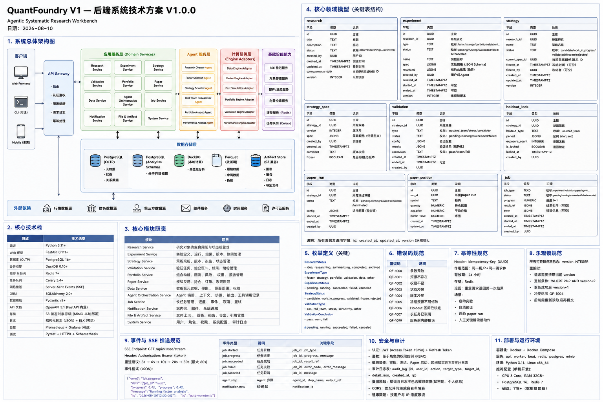
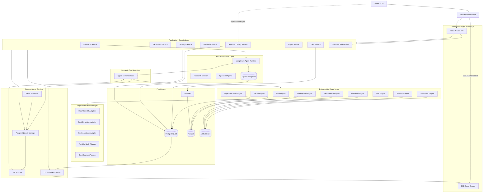

# QuantFoundry V1 — 后端系统技术方案

**产品名称：** QuantFoundry
**副标题：** Agentic Systematic Research Workbench
**后端方案版本：** V1.0.0
**对应 PRD：** `/QuantFoundry/docs/PRD/V1.0.0.md`
**对应 UI：** `/QuantFoundry/docs/UI设计方案/QuantFoundry_UI_Design_V1.0.0.md`
**对应前端：** `/QuantFoundry/docs/前端技术方案/QuantFoundry_Frontend_Technical_Design_V1.0.0.md`
**项目治理：** `/QuantFoundry/AGENTS.md`
**产品阶段：** MVP / First Usable Product
**部署模式：** Single-human-principal / Self-hosted
**文档状态：** Final V1.0 + UX-001 D1 contract amendment；D2 runtime implementation slice complete；PG/chaos/release closure pending
**日期：** 2026-08-13
**正式路径：** `/QuantFoundry/docs/后端系统技术方案/QuantFoundry_Backend_System_Technical_Design_V1.0.0.md`
**架构图路径：** `/QuantFoundry/docs/后端系统技术方案/assets/QuantFoundry 后端系统技术架构总览.png`

---

# 0. 文档定位

本文定义 QuantFoundry V1 后端的**实现级技术基线**。它不是对 PRD 的再次描述，而是把 PRD 与 `AGENTS.md` 中的业务纪律落到：

- 运行时拓扑；
- Python / API / 数据库 / Job / Agent Runtime 技术栈；
- 模块与进程边界；
- 数据模型与字段级 schema；
- HTTP / OpenAPI contract；
- 长任务与可靠重试；
- SSE 事件、重放与断线恢复；
- Agent checkpoint；
- deterministic engine / adapter boundary；
- 数据、快照、Parquet、DuckDB 与 Artifact Store；
- Provenance；
- Freeze / Validation / Holdout / Approval / Paper 的服务端强制围栏；
- 错误码；
- Idempotency；
- revision / ETag；
- 审计与可观测性；
- 安全、备份、恢复、测试和发布。

本方案同时冻结前端技术方案第 82 节所等待的 12 项前后端共建契约。

> 本文不赋予 AI 新权限，不弱化 Validation、Risk、Approval、Holdout 或 immutable record 的任何围栏。

---

# 1. 最高级后端约束

## 1.1 AI 与确定性系统边界必须由代码强制

任何正式数值、生命周期状态、验证结论、风险 gate、审批结果必须来自确定性系统和持久化事务。

允许：

```text
AI
→ propose experiment
→ call semantic tool
→ deterministic engine
→ structured result
→ AI interpretation
```

禁止：

```text
AI text
→ parse metric
→ persist as official metric
```

禁止：

```text
AI says "PASS"
→ mark validation PASS
```

`PASS/WARN/FAIL` 只能由 Validation Engine 的测试规则计算并持久化。

## 1.2 Domain DB 是业务事实源

以下均以 PostgreSQL domain tables 为唯一事实源：

```text
Research lifecycle
Experiment validity
Factor/Strategy versions
Strategy freeze
Validation state
Holdout exposure
Approval
Paper state
Risk result
Jobs
Audit
```

LangGraph checkpoint、SSE cache、前端 cache、Parquet artifact 都不是 lifecycle truth。

## 1.3 Immutable 不是“约定不修改”

历史 Experiment、Dataset Snapshot、Frozen Strategy Version、Audit Event、正式 Artifact：

- Application Service 不提供 update/delete capability；
- DB 角色默认无 UPDATE/DELETE 权限；
- 必要时使用数据库 trigger 拒绝 mutation；
- 新假设、新参数、新策略定义必须创建新对象/新版本；
- 所有变更产生 Audit Event。

## 1.4 Human Approval 必须是服务端 gate

Holdout Unlock、Paper Deployment、Paper Allocation Change、Retire Paper：

- Agent 无 approve tool；
- API 权限层拒绝 Agent actor；
- Approval 绑定对象 version + revision + hash；
- 决策时事务内重新校验 prerequisite；
- stale approval 不可复用。

## 1.5 Holdout 保护必须在数据访问层成立

Locked Holdout：

- 结果文件不进入普通 Research query；
- Research Agent service account/tool policy 没有 result access；
- SSE payload 不携带 holdout metrics；
- API `GET .../holdout/result` 对未授权 actor 返回错误；
- `run_holdout` 只允许一次正式 exposure；
- exposure 记录不可删除。

---

# 2. V1 架构决策摘要

| 决策 | V1 结论 | 理由 |
|---|---|---|
| 部署形态 | **模块化单体代码库 + 多进程** | 保留清晰逻辑边界，避免过早微服务网络复杂度 |
| API | FastAPI 0.139.x line | Typed OpenAPI、async HTTP、原生 SSE |
| Python | Python 3.14.x | 当前稳定 Python 线 |
| ORM / DB access | SQLAlchemy 2.0.x + psycopg 3.3.x | 明确 transaction / async 支持 |
| Migration | Alembic 1.18.x | Schema versioning |
| Core DB | PostgreSQL 18.x | Domain、jobs、events、audit、checkpoints |
| Job Broker | **PostgreSQL durable queue** | V1 单用户无需先引入 Redis/Celery；任务状态与事务同源 |
| Job claim | `FOR UPDATE SKIP LOCKED` + lease | 多 worker 安全竞争、可恢复 |
| Event stream | PostgreSQL `domain_events` + FastAPI SSE | 持久 cursor/replay；断线可恢复 |
| Wake-up hint | PostgreSQL LISTEN/NOTIFY | 仅降低轮询延迟，不作为可靠事件事实源 |
| Agent Runtime | LangGraph 1.x line | Durable execution / HITL / checkpoint |
| Agent checkpoint | LangGraph Postgres checkpointer，独立 schema | Runtime state 与 domain state 分离 |
| Large data | Parquet | Market/factor/large outputs |
| Analytical read | DuckDB 1.5.x line | In-process Parquet analytical query |
| Artifact Store | Local content-addressed store；S3 adapter 预留 | Self-hosted V1 简单、可迁移 |
| External quant libs | Adapter layer | Framework independence |
| API contract | OpenAPI 3.1 | 前端生成 TypeScript |
| Event protocol | SSE；非 WebSocket | V1 主要 server→client 状态流 |
| Auth | Same-origin session + server-side actor guard | 单用户仍需防越权；secret 不下发浏览器 |

V1 **不引入**：

```text
Kubernetes
Service Mesh
Kafka
RabbitMQ
Redis as mandatory dependency
Celery as mandatory dependency
GraphQL
Microservices
Event sourcing as full domain model
CQRS framework
Distributed transaction coordinator
```

如果未来吞吐、HA 或跨主机 worker 需求证明 PostgreSQL queue 成为瓶颈，再通过 `JobBroker` / `EventBus` adapter 替换，不改变 Domain Service contract。

---

# 3. 系统架构

## 3.1 ChatGPT 视觉架构图

正式文档应嵌入：

```markdown

```

该图是**沟通视图**；本节 Mermaid 与后续接口/字段定义才是工程事实。

## 3.2 工程权威架构图



## 3.3 最重要的边界

```text
AI Orchestrator
     │ proposes / interprets
     ▼
Semantic Tool Boundary
     │ typed request
     ▼
Deterministic Engine
     │ structured result + provenance
     ▼
Domain Transaction
     │ state + audit + event
     ▼
AI Interpretation / UI
```

AI 不直接连接：

- ORM Session；
- PostgreSQL；
- Artifact filesystem；
- provider secret；
- Approval mutation；
- Holdout raw result；
- Paper execution mutation。

Agent 只能通过注册的 Semantic Tool 调用 Application Service。

---

# 4. 运行时拓扑

## 4.1 进程

同一代码仓库，至少四类进程：

### `api`

职责：

- REST API；
- OpenAPI；
- Same-origin session；
- ETag / If-Match；
- Idempotency；
- synchronous domain commands；
- SSE stream；
- read models。

不执行重型量化计算。

### `worker`

职责：

- claim durable jobs；
- Data / Factor / Backtest / Validation / Portfolio / Performance；
- 写 Experiment Result / Artifact / Provenance；
- 事务性更新 Job；
- 心跳与 lease。

### `agent-worker`

职责：

- LangGraph agent run；
- checkpoint；
- semantic tool 调用；
- WAITING_USER interrupt；
- 不执行未经 tool boundary 的 deterministic calculation。

可与普通 worker 共享 binary，但使用独立 `queue_name=agent`。

### `scheduler`

职责：

- daily Paper due-time discovery；
- 以 `(paper_id, trading_date)` 为自然幂等键创建 `paper_daily_run`；
- 仅 enqueue，不在 scheduler 内完成交易模拟。

## 4.2 单机 V1 参考

```text
reverse-proxy
  ├─ frontend static
  └─ /api -> api:8000

api x1
worker x1~N
agent-worker x1
scheduler x1

postgres x1
local artifact volume
parquet volume
```

进程数量可变，不改变 schema 与 contract。

---

# 5. 技术栈与版本策略

## 5.1 Baseline

```text
Python              3.14.x
FastAPI             0.139.x line
Pydantic            2.x
SQLAlchemy          2.0.x
psycopg             3.3.x
Alembic             1.18.x
PostgreSQL          18.x
LangGraph           1.x
DuckDB              1.5.x
PyArrow / Parquet   exact lockfile version
pytest              current locked
```

精确 patch 版本由 lockfile 锁定；技术方案锁 major/minor baseline，patch 升级必须跑完整回归。

## 5.2 官方依据核对时点

核对时点：2026-08-10。

- Python 3.14 release line: https://www.python.org/downloads/
- FastAPI releases / SSE: https://fastapi.tiangolo.com/release-notes/ ; https://fastapi.tiangolo.com/advanced/server-sent-events/
- SQLAlchemy 2.0: https://docs.sqlalchemy.org/en/20/
- Psycopg 3: https://www.psycopg.org/psycopg3/docs/
- Alembic: https://alembic.sqlalchemy.org/
- PostgreSQL 18: https://www.postgresql.org/docs/18/
- PostgreSQL `SKIP LOCKED`: https://www.postgresql.org/docs/18/sql-select.html
- PostgreSQL LISTEN/NOTIFY: https://www.postgresql.org/docs/18/sql-listen.html
- LangGraph: https://docs.langchain.com/oss/python/langgraph/overview
- DuckDB: https://duckdb.org/docs/stable/

## 5.3 依赖政策

- Python dependencies 使用 lockfile；
- Production image 禁止 `pip install` 漂移；
- Engine adapter 的第三方依赖版本必须写入 Provenance；
- Major upgrade 必须 ADR；
- financial calculation library upgrade 必须 golden-result regression；
- Data provider adapter upgrade 必须 capability regression。

---

# 6. 后端代码目录

```text
backend/
├── pyproject.toml
├── uv.lock / equivalent lock
├── alembic.ini
├── src/quantfoundry/
│   ├── bootstrap/
│   ├── api/
│   │   ├── v1/
│   │   ├── middleware/
│   │   ├── dependencies/
│   │   ├── errors/
│   │   └── sse/
│   ├── application/
│   │   ├── research/
│   │   ├── experiment/
│   │   ├── factor/
│   │   ├── strategy/
│   │   ├── validation/
│   │   ├── portfolio/
│   │   ├── approval/
│   │   ├── paper/
│   │   ├── review/
│   │   ├── data/
│   │   └── system/
│   ├── domain/
│   │   ├── models/
│   │   ├── value_objects/
│   │   ├── policies/
│   │   ├── events/
│   │   └── errors/
│   ├── agents/
│   │   ├── runtime/
│   │   ├── graphs/
│   │   ├── prompts/
│   │   ├── policies/
│   │   └── tools/
│   ├── engines/
│   │   ├── data/
│   │   ├── data_quality/
│   │   ├── factor/
│   │   ├── simulation/
│   │   ├── portfolio/
│   │   ├── validation/
│   │   ├── risk/
│   │   ├── performance/
│   │   └── paper/
│   ├── adapters/
│   │   ├── data/
│   │   ├── simulation/
│   │   ├── factor/
│   │   ├── portfolio/
│   │   ├── strict_backtest/
│   │   └── storage/
│   ├── infrastructure/
│   │   ├── db/
│   │   ├── jobs/
│   │   ├── events/
│   │   ├── artifacts/
│   │   ├── crypto/
│   │   ├── logging/
│   │   └── clock/
│   ├── workers/
│   ├── scheduler/
│   └── contracts/
│       ├── openapi/
│       ├── events/
│       ├── tools/
│       └── artifacts/
├── migrations/
└── tests/
    ├── unit/
    ├── contract/
    ├── integration/
    ├── engine/
    ├── property/
    ├── migration/
    └── e2e/
```

## 6.1 依赖方向

```text
api
  ↓
application
  ↓
domain

workers / agents
  ↓
application
  ↓
domain

infrastructure / adapters
  └── implement domain/application ports
```

禁止：

```text
domain → FastAPI
domain → SQLAlchemy model
domain → LangGraph
engine → HTTP request
agent graph → ORM
adapter → UI contract
```

---

# 7. Transaction 与一致性模型

## 7.1 单个业务动作

所有 lifecycle mutation：

```text
BEGIN
  lock / verify current aggregate
  verify policy
  verify actor
  verify If-Match
  mutate domain rows
  append audit_events
  append domain_events
COMMIT
```

Audit + Event 与业务变更必须同事务。

## 7.2 Outbox 不是第二事实源

`domain_events` 用于：

- SSE；
- query invalidation；
-内部 wake-up。

其 payload 只描述“发生了什么”；重新读取对象事实仍走 detail API/domain table。

## 7.3 Isolation

默认 `READ COMMITTED`。

以下动作使用显式 row lock：

- Freeze；
- Approval decision；
- Holdout exposure；
- Paper daily run creation；
- Job claim；
- lifecycle transition；
- version increment。

不全局提升 SERIALIZABLE；对需要跨多行 invariant 的命令使用 lock + unique constraint + transaction。

---

# 8. Durable Job Model

## 8.1 为什么不用同步 HTTP

Research、Factor、Backtest、Validation、Portfolio Optimize、Paper Daily Run 可能长达秒到分钟/更久。

HTTP mutation只负责：

```text
validate request
→ create Job
→ return 202 JobAccepted
```

## 8.2 Job claim

Worker 使用类似：

```sql
WITH candidate AS (
  SELECT id
  FROM jobs
  WHERE status = 'QUEUED'
    AND queue_name = :queue
  ORDER BY priority ASC, queued_at ASC
  FOR UPDATE SKIP LOCKED
  LIMIT 1
)
UPDATE jobs j
SET status = 'RUNNING',
    lease_owner = :worker_id,
    lease_expires_at = now() + :lease_interval,
    heartbeat_at = now(),
    attempt = attempt + 1,
    started_at = COALESCE(started_at, now())
FROM candidate
WHERE j.id = candidate.id
RETURNING j.*;
```

## 8.3 Lease baseline

V1 默认配置：

```text
lease duration         60s
heartbeat interval     15s
claim idle poll        <=1s，LISTEN/NOTIFY 可唤醒
```

这些是运维配置，不进入业务 schema。

若 worker 死亡：

```text
RUNNING + lease expired
→ reaper evaluates retry policy
→ retry-safe job: QUEUED
→ unsafe/unknown job: FAILED_NEEDS_REVIEW equivalent domain error
```

**不得**盲目重跑可能产生状态副作用的任务。

## 8.4 Job retry 分类

自动可重试：

- read-only provider fetch；
- deterministic calculation before domain commit；
- explicitly idempotent snapshot creation；
- validation test with same input hash；
- experiment reproduce；
- daily paper run protected by unique `(paper_id,trading_date)` + exact run state.

默认不可自动重试：

- Approval decision；
- Holdout exposure after result became visible；
- irreversible state transition；
- unknown external side effect。

## 8.5 Progress

仅在工作天然可计数时写：

```text
progress_mode = UNITS
completed_units
total_units
progress_unit
```

未知进度：

```text
progress_mode = NONE
current_step_key
current_step_label
```

后端不伪造百分比。

如果 `total_units != NULL`，API 可返回服务端计算的 `progress_percent`；它不是持久化 truth。

## 8.6 Cancellation

`POST /jobs/{job_id}/cancel`：

- 设置 `cancel_requested_at`；
- Worker 在 safe checkpoint 读取；
- 未开始 Job 可直接 `CANCELLED`；
- 已进入不可中断 deterministic section 时返回 `cancel_pending=true`；
- 不 kill process 破坏 artifact/domain transaction。

---

# 9. SSE Event Stream

## 9.1 Endpoint

```http
GET /api/v1/events/stream
Accept: text/event-stream
Last-Event-ID: <sequence>
```

SSE `id:` 使用当前 authenticated workspace 的 `domain_events.sequence`，不是 UUID。连接建立时 server 从 auth context 冻结 `workspace_id`；不得接受 query/body 指定另一个 workspace，也不得跨 workspace 复用 cursor。

## 9.2 事件 Envelope

```json
{
  "schema_version": 1,
  "event_id": "EVT-01ARZ3NDEKTSV4RRFFQ69G5FAV",
  "sequence": 18201,
  "event_type": "job.updated",
  "occurred_at": "2026-08-10T08:12:32.123Z",
  "object_type": "job",
  "object_id": "JOB-01ARZ3NDEKTSV4RRFFQ69G5FAV",
  "object_version": null,
  "object_revision": 7,
  "request_id": "REQ-...",
  "job_id": "JOB-01ARZ3NDEKTSV4RRFFQ69G5FAV",
  "agent_run_id": null,
  "tool_call_id": null,
  "payload": {
    "status": "RUNNING",
    "progress_mode": "UNITS",
    "completed_units": 8,
    "total_units": 12,
    "current_step_key": "regime_analysis"
  }
}
```

## 9.3 Event Types P0 R2

```text
job.updated
research.created
research.updated
research.conclusion.created
experiment.created
experiment.updated
factor.updated
strategy.created
strategy.updated
validation.created
validation.updated
validation.holdout.updated
approval.created
approval.updated
paper.created
paper.updated
paper.run.updated
review.created
review.updated
data.provider.updated
data.capability.updated
data.quality.updated
agent.run.updated
tool.call.updated
memo.created
memo.updated
setup.completed
notification.created
notification.updated
system.health.updated
system.resync_required
```

上述 **31** 个精确 lowercase wire values 是 canonical OpenAPI `EventType` 唯一 allowlist；发布器、outbox/domain-event writer、SSE replay、前端 generated union 与 contract fixture 必须使用同一枚举。禁止自由 string、大小写别名、underscore/camelCase 变体或按 object type 自动拼接名称。`tool.call.updated` 是 Tool Call lifecycle notification；`memo.created/memo.updated` 对应生成记录创建与后续状态收敛；`setup.completed` 只在 setup transaction 成功提交后发布，不包含 credential 或 policy content。

### 9.3.1 Closed Event/Audit Object Locator

P0 R2 对全部 31 类事件冻结以下 **21 个** `object_type` branch。其中 14 个已有生产 writer（`job/research/experiment/factor/strategy_version/validation/approval/snapshot/agent_run/tool_call/memo/settings/provider_connection/agent_config`），`event_stream` 由 replay/resync 合成器产生；其余 branch 是已生效 EventType 所需的正式 locator，不得以自由 string 代替。

| `object_type` | `object_id` exact grammar | `object_version` | `object_revision` |
|---|---|---|---|
| `job` | `JOB-` public ID | nullable | nullable |
| `research` | `RSCH-` public ID | nullable | nullable |
| `conclusion` | `CONC-` public ID | nullable | nullable |
| `experiment` | `EXP-` public ID | nullable | nullable |
| `factor` | `FAC-` public ID | nullable | nullable |
| `strategy_version` | `STRAT-` aggregate public ID | required integer >=1; never encode in ID | required integer >=1 |
| `validation` | `VAL-` public ID | nullable | nullable |
| `approval` | `APR-` public ID | nullable | nullable |
| `paper` | `PAPER-` public ID | nullable | nullable |
| `paper_run` | `PRUN-` public ID | nullable | nullable |
| `review` | `REV-` public ID | nullable | nullable |
| `capability` | `CAP-` public ID | nullable | nullable |
| `snapshot` | `DS-` public ID | nullable | nullable |
| `agent_run` | `ARUN-` public ID | nullable | nullable |
| `tool_call` | `TCALL-` public ID | nullable | nullable |
| `memo` | `MEMO-` public ID | nullable | nullable |
| `notification` | `NOTIF-` public ID | nullable | nullable |
| `settings` | exact singleton `SETTINGS-DEFAULT` | null | required integer >=1 |
| `provider_connection` | canonical lowercase UUIDv4 `connection_id` | null | required integer >=1 |
| `agent_config` | six-role `AgentRoleKey` enum | null | required integer >=1 |
| `event_stream` | current envelope `EVT-` event ID | null | required integer >=1 |

| EventType | Required locator branch |
|---|---|
| `job.updated` | `job` |
| `research.created`, `research.updated` | `research` |
| `research.conclusion.created` | `conclusion` |
| `experiment.created`, `experiment.updated` | `experiment` |
| `factor.updated` | `factor` |
| `strategy.created`, `strategy.updated` | `strategy_version` |
| `validation.created`, `validation.updated`, `validation.holdout.updated` | `validation` |
| `approval.created`, `approval.updated` | `approval` |
| `paper.created`, `paper.updated` | `paper` |
| `paper.run.updated` | `paper_run` |
| `review.created`, `review.updated` | `review` |
| `data.provider.updated` | `provider_connection` |
| `data.capability.updated` | `capability` |
| `data.quality.updated` | `snapshot` |
| `agent.run.updated` | `agent_run` |
| `tool.call.updated` | `tool_call` |
| `memo.created`, `memo.updated` | `memo` |
| `setup.completed` | `settings` |
| `notification.created` | `notification` |
| `notification.updated` | `agent_config` |
| `system.health.updated`, `system.resync_required` | `event_stream` |

`strategy.created/updated` 不得发布为无 version 的 `strategy` locator；`setup.completed` 不得使用任意 Settings 字符串；`data.provider.updated` 不得将 provider catalog key 当成 connection ID；`notification.updated` 的 P0 writer 是 Agent config mutation，因此 locator 是 exact role key，不是 Notification public ID。未知 type、type/ID prefix 错配、特殊 branch version/revision 缺失、非小写 UUID 或跨 workspace 解析均 fail closed。新 object type 必须先修订 canonical contract/EventType 映射，不得在 replay 中忽略未知事件；未识别的未来 schema version 停止消费并进入显式 resync/升级流程。

未发布 R2 迁移必须先扫描 `domain_events/audit_events/agent_runs/notifications/jobs.result_ref/agent_runs.next_action` 的 locator tuple：只允许从同 workspace 的权威行回填 strategy version/revision 或 special locator；无法证明的历史 tuple 按 §14.0.2 隔离且阻断 replay/resume/completion，禁止以 current/max version 猜测。随后添加 closed CHECK `NOT VALID`，运行全量正/负 fixture，再 `VALIDATE CONSTRAINT`。发布器必须在同一 transaction 写入完整 locator；SSE adapter 不得将持久化 version 覆盖为 NULL。

P0 R2 `EventPayload` 仍为 closed notification payload，只允许 contract 中命名的 `status/state/reason_code/resync_from_sequence`、完整成对的 `object_type/object_id/object_version/object_revision`、Job progress 摘要与 Agent Run 摘要字段；`waiting_on` 仅允许 closed `{type:"JOB",job_id}`。它不是 REST detail 替代物，不得加入 holdout result/metric/chart point、credential、raw tool/model input/output、开放 metadata map，或任何 `paper_scheduler_evidence.v1` 字段（包括 trading date、attempt、lease、calendar/timezone、Artifact、failure review）。`validation.holdout.updated` 只能用 gate `status/state/reason_code` 通知，永不携带被锁定结果。

## 9.4 Replay

- `domain_events` replay retention：**7 days**；
- audit 永久保留，不等于 SSE replay；
- reconnect 带 `Last-Event-ID`；
- server 仅查询 `workspace_id = authenticated_workspace_id AND sequence > cursor` 顺序重放；
- event delivery at-least-once，前端在当前 workspace stream 内按 `sequence` 去重；
- 如果 cursor < 当前最早可 replay sequence：
  - 先发送 `system.resync_required`；
  - 关闭或继续从 watermark；
  - 前端 invalidate active queries 后 refetch。

发布与 replay 都必须在持久化/写网络前使用当前 `schema_version + EventType + EventPayload` 校验。当前 version 的 unknown event type、非 canonical case 或 unknown payload field 必须 fail closed：新写入拒绝并报警；replay 遇到历史异常行时不向客户端透传，发送可验证的 `system.resync_required` 并要求 REST refetch。未来事件只能先通过 canonical OpenAPI 扩展 allowlist/payload；若无法 additive 兼容，必须提升 `schema_version` 并使用 version-aware consumer，不得把 unknown string 当作“向前兼容”忽略后继续合并 payload。

## 9.5 Heartbeat

每 15s 发送 SSE comment heartbeat。

Heartbeat 不写 `domain_events`。

## 9.6 LISTEN/NOTIFY

允许 `NOTIFY qf_event` 作为“有新 event”的低延迟提示。

**禁止**依赖 NOTIFY payload 作为唯一状态，因为通知本身不是 durable log。

SSE streamer 的正确性路径始终是：

```text
domain_events table
→ sequence cursor
→ replay
```

---

# 10. Agent Runtime / LangGraph

## 10.1 职责

LangGraph 只管理：

- workflow position；
- durable interrupt；
- agent step；
- specialist handoff；
- tool request；
- resumable checkpoint。

不管理：

- official Strategy state；
- official Validation result；
- Approval；
- Paper capital state。

## 10.2 Checkpoint schema

使用独立 PostgreSQL schema：

```text
agent_checkpoint.*
```

由 LangGraph Postgres checkpointer 管理。

Domain tables 不读取其内部数据实现业务规则。

Checkpoint namespace/key 必须包含运行时捕获的 internal `workspace_id`；resume/handoff 先以 `(workspace_id,agent_run_id)` 解析 source run，再访问 checkpoint。相同 thread/public ID 在其他 workspace 必须不可见，禁止仅凭 `checkpoint_thread_id` 恢复。

## 10.3 可持久化 Agent state

允许：

```text
research_id
current objective
plan node
visible evidence refs
tool call refs
decision summary
next action
budget counters
interrupt metadata
```

禁止持久化/展示：

```text
hidden chain-of-thought
reasoning tokens
provider secret
raw credential
```

## 10.4 Tool permission

每个 tool 注册 metadata：

```text
tool_name
tool_version
allowed_agent_roles
input_schema
output_schema
idempotency_class
side_effect_class
required_policy_checks
timeout
```

Tool executor 在服务端重复检查 role，不相信 prompt；它从 captured Agent Run/auth context 取得 `workspace_id`，并对 Tool input 中每个 public/internal object ref 执行同 workspace 双 scope，global ID 命中不得跳过授权。

## 10.5 Tool Call Envelope

Request：

```json
{
  "schema_version": 1,
  "tool_call_id": "TCALL-01ARZ3NDEKTSV4RRFFQ69G5FAV",
  "actor": {
    "agent_role": "FactorScientist",
    "agent_run_id": "ARUN-01ARZ3NDEKTSV4RRFFQ69G5FAV"
  },
  "context": {
    "research_id": "RSCH-01ARZ3NDEKTSV4RRFFQ69G5FAV",
    "experiment_id": "EXP-01ARZ3NDEKTSV4RRFFQ69G5FAV"
  },
  "tool": {
    "name": "analyze_factor",
    "version": "1.0"
  },
  "input": {},
  "policy_refs": [
    {"type": "research_policy", "id": "RP-01ARZ3NDEKTSV4RRFFQ69G5FAV", "version": 1}
  ],
  "requested_at": "2026-08-10T08:12:32Z"
}
```

## 10.6 Remote Codex singleton runtime

Agent Worker 的模型执行固定通过 `RemoteCodexModel` 访问一个逻辑远程实例 `CODEX-DEFAULT`。六个 Runtime Role、所有 Agent Run 和所有 Graph node 均共享该 runtime identity；Role 配置不得创建或选择第二个 Provider/Model instance。

```text
Agent Run
→ LangGraph StateGraph
→ RemoteCodexModel
→ CODEX-DEFAULT
→ structured action
→ server-side Tool Policy / Semantic Tool Executor
```

Remote Codex 不能直接访问 SQL、filesystem、Shell、Python、任意 HTTP 或 approval tool。远程返回的 action 必须在 server-side 经过 schema、workspace、role、policy、idempotency 和 side-effect 校验后才能进入 Tool Runtime。

每次调用必须有稳定的 `invocation_id`，并绑定 `agent_run_id`、`context_sha256`、`remote_instance_id`、adapter/protocol version 和 redacted usage。原始请求/响应不得写入 checkpoint、普通日志或 Domain truth。Remote Codex outage 只允许 bounded retry 和 failed-safe；不得自动 fallback 到 LangGraph 内置 Agent 或其他 Provider。

Remote Codex 模式下，`AgentConfig` 的 provider/model 是 singleton projection，不是 Role 选择器。PUT 仅允许 enabled、runtime profile、timeout 和受限 budget 变更；legacy `openai-compatible` 与当前 singleton 值相同的 no-op 请求可兼容接受，实际变更 Provider/Model 必须返回 `RESOURCE_CONFLICT`。历史不兼容配置在 Agent admission 时返回 `AGENT_MODEL_UNAVAILABLE`。

Response：

```json
{
  "schema_version": 1,
  "tool_call_id": "TCALL-01ARZ3NDEKTSV4RRFFQ69G5FAV",
  "status": "SUCCESS",
  "result": {},
  "warnings": [],
  "artifacts": [
    {"artifact_id": "ART-01ARZ3NDEKTSV4RRFFQ69G5FAV", "kind": "PARQUET"}
  ],
  "provenance": {
    "provenance_id": "PROV-01ARZ3NDEKTSV4RRFFQ69G5FAV"
  },
  "completed_at": "2026-08-10T08:13:04Z"
}
```

---

# 11. Deterministic Engine 与 Adapter

## 11.1 Engine 是 QuantFoundry contract

核心 interface 概念：

```python
class FactorEngine(Protocol):
    def analyze(self, request: FactorAnalysisRequest) -> FactorAnalysisResult: ...

class SimulationEngine(Protocol):
    def run(self, request: SimulationRequest) -> SimulationResult: ...

class ValidationEngine(Protocol):
    def validate(self, request: ValidationRequest) -> ValidationResult: ...

class PortfolioEngine(Protocol):
    def analyze(self, request: PortfolioRequest) -> PortfolioResult: ...
```

Agent 与 API 不知道 vectorbt / Riskfolio / Alphalens / strict-engine 具体 API。

## 11.2 Adapter 规则

每个 adapter：

- 输入先转 QuantFoundry canonical model；
- 输出转 canonical result；
- 第三方异常映射到标准 Engine Error；
- adapter 版本写 Provenance；
- numerical golden tests；
- 不能把第三方对象 pickle 当长期事实格式。

## 11.3 Canonical Metrics

以下由 QuantFoundry 自己定义计算语义并测试：

```text
returns
CAGR
annualized volatility
Sharpe
Sortino
Calmar
drawdown
turnover
trade count
holding period
slippage
commission
exposure
risk contribution
```

若第三方库提供同名值，必须通过 adapter compatibility test 才能作为实现。

---

# 12. Data / Parquet / DuckDB / Artifact

## 12.1 Data flow

```text
Provider
→ Adapter
→ normalized canonical table
→ Data Quality
→ Parquet partition
→ immutable Snapshot Manifest
→ Experiment
```

## 12.2 Parquet partition

建议：

```text
market/prices/provider=<id>/year=YYYY/part-*.parquet
fundamentals/provider=<id>/asof_year=YYYY/part-*.parquet
universe/provider=<id>/year=YYYY/part-*.parquet
factor/<factor_id>/v=<n>/<snapshot_hash>/part-*.parquet
```

Partition 是物理优化，不进入业务 API。

## 12.3 Snapshot

Snapshot 不是“当前目录”。

它是 immutable manifest，至少固定：

- dataset；
- provider/source；
- as-of；
- partition/object hashes；
- schema hash；
- content hash；
- PIT semantics；
- Data Quality reference。

## 12.4 DuckDB

DuckDB 用于：

- Parquet predicate pushdown；
- snapshot inspection；
- local analytical aggregation；
- chart/pre-compute query。

DuckDB 文件本身不作为 lifecycle truth。

## 12.5 Artifact Store

V1 local root：

```text
/var/lib/quantfoundry/artifacts/
```

storage key 按 content hash 组织：

```text
sha256/ab/cd/<fullhash>
```

DB `artifacts` 保存 metadata。

未来 S3 compatible adapter 保持相同 `ArtifactStore` interface。

## 12.6 Artifact 写入原子性

```text
write temp
→ fsync
→ calculate SHA-256
→ atomic rename / object finalize
→ insert artifact metadata
→ link domain object
```

失败时 orphan temp 可 GC；不得先持久化一个不存在的正式 artifact ref。

---

# 13. 数据建模规范

## 13.1 ID

内部 PK：

```text
uuid DEFAULT uuidv7()
```

外部 API：

```text
research_id / strategy_id / job_id ...
```

使用语义 public ID，禁止把自增整数暴露为业务 ID；R2 的唯一合法 wire/storage grammar、prefix、长度与 migration 规则见 §14.0.1。

## 13.2 时间

- PostgreSQL：`timestamptz`；
- API：ISO-8601 UTC；
- 交易日：`date`；
- 前端负责按 user timezone 展示；
- 不接受无 timezone 的 datetime。

## 13.3 金融数值

Domain metadata/ledger：

- 金额：`numeric(38,18)`；
- 比例/收益/权重：`numeric(20,12)`。

Large analytical matrix/Parquet 可使用 IEEE float64，但：

- schema 写明 dtype；
- NaN/null 语义明确；
- 不用 JS/browser 重算 canonical metric。

## 13.4 JSONB

只用于：

- versioned specification；
- extensible typed result；
- nested policy；
- artifact refs。

每个 JSONB 必须有：

```text
schema_name
schema_version
Pydantic validation
contract tests
```

禁止“所有字段都塞 JSONB”。

## 13.5 revision

可变 aggregate 均有：

```text
revision bigint
```

每次成功 mutation `revision += 1`。

API ETag 与 revision 绑定。

## 13.6 删除

V1 正式业务记录不 hard delete。

“Archive / Retire / Invalid”是状态，不是删除历史。

---

# 14. PostgreSQL Schema — 字段级定义

下列为 V1 逻辑 schema。Migration 可在不改变 API contract 的前提下调整物理 index 名、分区策略和内部 constraint 实现。

本节精确冻结 **63 张正式表 / 967 列**：原 50 张领域表的 889 列与 13 张支撑/运行时表的 78 列（含 `paper_scheduler_states` 的 10 列）均是 normative schema，不存在“implementation extra”或不受约束的临时表。`users`、`workspaces` 是 identity/control-plane 根，`runtime_heartbeats` 是全局运行时租约观测表；其余 workspace-owned 表必须显式保存 non-null internal `workspace_id uuid REFERENCES workspaces(id)` 并建立 index。对 immutable child `snapshot_partitions` 的 ownership 由不可变的 scoped `snapshot_id` 复合 FK 继承，不得脱离父 Snapshot 独立解析。每张含 `id` 的 workspace-owned 表都必须提供 `UNIQUE(workspace_id,id)` 作为复合 FK target（无 `id` 的 join/event 表使用其 workspace 复合 PK）；所有内部 FK 必须以 `(workspace_id,target_id)` 引用同 workspace target。Repository/service 所有 SELECT/INSERT/UPDATE/DELETE/lock/existence check 均必须同时带 `workspace_id`；只按 public ID 或 internal UUID 查询视为越权缺陷。

Public semantic IDs 保留 global `UNIQUE`。Global uniqueness 只用于冲突防护/追踪，不授予任何跨 workspace 可见性；API 存在性、授权与 FK 解析仍必须双 scope。下表 `FK target(id)` 是可读性缩写，DDL 必须实现为 `FK(workspace_id,target_id) → target(workspace_id,id)`；禁止创建仅 target UUID 的非 scoped FK。

### 14.0.0 Workspace existence non-disclosure

对 detail resolver、parent/child resolver、lock、mutation 前置检查、ETag/revision 检查和自然键解析，首个能够决定资源存在性的有效数据库查询 MUST 已包含 trusted `workspace_id` 与目标 locator/natural key。禁止先按 global public ID/internal UUID 查询，再以 owner/workspace 比较并返回 `403`；不得以预查询、锁、计数、ETag、错误上下文或可观察时序泄漏 foreign row。其他 workspace 的有效 ID 与随机不存在 ID 必须走同一 canonical `404 RESOURCE_NOT_FOUND` 文档错误路径；仅当前 workspace 已可见资源上的 actor/policy/gate 拒绝使用 `403`。该规则同样适用于 Tool resolver、Agent checkpoint/handoff、Artifact、Job、idempotency record 与 migration backfill resolver。

### 14.0.1 Public semantic ID R2 exact contract

所有 public semantic ID 必须精确为 `PREFIX-` 加以下二者之一；服务端生成器、OpenAPI、Tool contract、DB `CHECK`、fixture 与日志校验必须共享同一规则，禁止 trim/case-fold、任意后缀、短序号或低熵占位值：

```text
ULID    = [0-7][0-9A-HJKMNP-TV-Z]{25}                            # uppercase canonical Crockford
UUIDv4  = [0-9a-f]{8}-[0-9a-f]{4}-4[0-9a-f]{3}-[89ab][0-9a-f]{3}-[0-9a-f]{12}
ID      = ^PREFIX-(ULID|UUIDv4)$
```

`ULID` 首字符限制为 `[0-7]`，排除溢出 128-bit timestamp；禁止 `I/L/O/U`、lowercase ULID、uppercase/mixed-case UUID、非 v4 UUID 与非 RFC variant。每类字段按下表精确 prefix 和长度冻结；DB `varchar` 必须等于该类 `maxLength`，不得用截断代替拒绝。

| Public object class | Canonical field | Prefix | ULID length | UUIDv4 length / DB varchar |
|---|---|---:|---:|---:|
| Research policy | `research_policy_id` / `policy_id` | `RP` | 29 | 39 |
| Risk policy | `risk_policy_id` / `policy_id` | `RISK` | 31 | 41 |
| Cost model | `cost_model_id` | `COST` | 31 | 41 |
| Credential | `credential_id` | `CRED` | 31 | 41 |
| Capability | `capability_id` | `CAP` | 30 | 40 |
| Dataset | `dataset_id` | `DSSET` | 32 | 42 |
| Dataset snapshot | `snapshot_id` / `data_snapshot_id` | `DS` | 29 | 39 |
| Data-quality run | `quality_run_id` | `DQ` | 29 | 39 |
| Data-quality issue | `issue_id` | `DQI` | 30 | 40 |
| Research | `research_id` | `RSCH` | 31 | 41 |
| Evidence | `evidence_id` | `EVID` | 31 | 41 |
| Conclusion | `conclusion_id` | `CONC` | 31 | 41 |
| Experiment | `experiment_id` | `EXP` | 30 | 40 |
| Factor | `factor_id` | `FAC` | 30 | 40 |
| Strategy | `strategy_id` | `STRAT` | 32 | 42 |
| Validation | `validation_id` | `VAL` | 30 | 40 |
| Holdout exposure | `exposure_id` | `HOLD` | 31 | 41 |
| Red-team run | `red_team_run_id` | `RT` | 29 | 39 |
| Portfolio scenario | `portfolio_id` | `PORT` | 31 | 41 |
| Investment memo | `memo_id` | `MEMO` | 31 | 41 |
| Approval | `approval_id` | `APR` | 30 | 40 |
| Paper deployment | `paper_id` | `PAPER` | 32 | 42 |
| Paper daily run | `paper_run_id` | `PRUN` | 31 | 41 |
| Paper order | `order_id` | `PORD` | 31 | 41 |
| Paper fill | `fill_id` | `PFILL` | 32 | 42 |
| Performance review | `review_id` | `REV` | 30 | 40 |
| Agent run | `agent_run_id` | `ARUN` | 31 | 41 |
| Tool call | `tool_call_id` | `TCALL` | 32 | 42 |
| Job | `job_id` | `JOB` | 30 | 40 |
| Domain event | `event_id` | `EVT` | 30 | 40 |
| Audit event | `event_id` | `AUD` | 30 | 40 |
| Artifact | `artifact_id` | `ART` | 30 | 40 |
| Notification | `notification_id` | `NOTIF` | 32 | 42 |
| Provenance | `provenance_id` | `PROV` | 31 | 41 |

多态 `object_id` / `subject_id` / `baseline_ref` 的 DB 宽度为全表最大 `varchar(42)`，但不是自由字符串：必须先以 type discriminator 选择上表单一规则，再做 exact validation；未知 type/prefix fail closed。JSONB public refs 入库前同样执行字段级 contract。Global `UNIQUE` 与以上 exact `CHECK` 同时存在。

以下值明确不是 public semantic object ID，不适用本表：internal `uuid` PK/FK（含 opaque `connection_id`）、`SETTINGS-DEFAULT` singleton、provider/catalog/universe key、`role_key`、`capability_key`、版本/revision/hash/idempotency key、`request_id`、`build_id`、actor/requester identity，以及仅在 closed read model 内使用的 `attention_id` / `finding_id` / `chart_id` / `series_id`。这些值继续按其各自自然键、scope 或格式约束治理；不得把它们伪装为上表 public ID。

R2 未发布迁移顺序固定为：扫描所有列/JSONB/ref/fixture → 报告不合规与疑似已截断值 → 对小于上表 `maxLength` 的列先扩容（如 `datasets.dataset_id` 40→42），大于目标宽度的列在此阶段保持原宽度 → 以相同 regex 增加 `CHECK ... NOT VALID` → 仅从可审计权威映射重建 public ID/ref → 验证 FK、global uniqueness、workspace 双 scope 与 `CHECK` → `VALIDATE CONSTRAINT` → 确认不存在超长/不合规值后才把过宽列收紧至上表 `maxLength` 并切换生成器。被历史列截断的 suffix 不可恢复，禁止猜测、补零或静默生成新 ID；无权威映射即阻断迁移并人工治理。回滚不得重新缩到旧的不足宽度或恢复宽松生成器。

### 14.0.2 Closed locator quartet 与 JSONB storage contract

数据库必须提供单一 immutable、schema-versioned predicate `qf_event_locator_quartet_valid(object_type, object_id, object_version, object_revision, allow_null)`；它必须由 canonical OpenAPI `x-quantfoundry-event-object-pair-rules` 生成并精确实现 §9.3.1 的 21 branch，禁止用开放 regex map 或 application-only validation 替代：

| branch class | `object_type/object_id` | `object_version` | `object_revision` |
|---|---|---|---|
| 16 ordinary public branches | exact branch enum + matching public-ID grammar | NULL or integer >=1 | NULL or bigint >=1 |
| `strategy_version` | exact `STRAT-` aggregate ID | required integer >=1 | required bigint >=1 |
| `settings` | `SETTINGS-DEFAULT` | NULL only | required bigint >=1 |
| `provider_connection` | canonical lowercase UUIDv4 | NULL only | required bigint >=1 |
| `agent_config` | six `AgentRoleKey` enum | NULL only | required bigint >=1 |
| `event_stream` | exact `EVT-` ID | NULL only | required bigint >=1 |
| absent optional locator | all four SQL NULL | NULL | NULL |

`allow_null=false` 时 absent branch 永远失败；`allow_null=true` 时只允许四列同时为 SQL NULL。任一半空 tuple、未知 type、type/ID mismatch、JSON `null` 与 SQL NULL 混淆、非整数/越界 version/revision 均返回 false；predicate 不得抛异常让坏值绕过 CHECK。`agent_runs`、`notifications` 使用 `allow_null=true`，`domain_events`、`audit_events` 使用 `allow_null=false`。普通 public branch 的两个数字字段按 canonical schema 独立 nullable；不得擅自收紧为必须成对，也不得放宽 special branch。

JSONB locator validator `qf_event_locator_json_valid(value, allow_null)` 必须先验证 JSON object、四个 required key、每个 JSON scalar type，再委托上述同源 branch predicate；不得先用 `->>` 把 number/boolean 宽松转成 string。以下两个 DB CHECK 与 generated schema 同构：

```sql
CONSTRAINT ck_jobs_result_ref_closed CHECK (
  result_ref IS NULL OR (
    jsonb_typeof(result_ref) = 'object'
    AND result_ref ?& ARRAY['object_type','object_id','object_version','object_revision','artifact_id']
    AND result_ref - ARRAY['object_type','object_id','object_version','object_revision','artifact_id'] = '{}'::jsonb
    AND qf_event_locator_json_valid(result_ref, true)
    AND qf_nullable_public_id_json_valid(result_ref->'artifact_id', 'ART')
  )
);

CONSTRAINT ck_agent_runs_next_action_closed CHECK (
  next_action IS NULL OR (
    jsonb_typeof(next_action) = 'object'
    AND next_action ?& ARRAY['action','object_type','object_id','object_version','object_revision']
    AND next_action - ARRAY['action','object_type','object_id','object_version','object_revision'] = '{}'::jsonb
    AND jsonb_typeof(next_action->'action') = 'string'
    AND qf_event_locator_json_valid(next_action, true)
  )
);
```

`qf_nullable_public_id_json_valid(...,'ART')` 仅接受 JSON null 或 exact `ART-` ULID/UUIDv4 string。所有 helper 必须 `IMMUTABLE`、fail closed、由同一 contract generator 固定函数体 hash；改变 branch/grammar 即视为 CHECK signature 变更。写入、读取投影、Job completion、Agent checkpoint/resume 都必须先用 generated `JobResultRef`/`NextAction` schema 验证，再由 DB CHECK 二次拒绝漂移；读到不合规值不得静默裁剪、补 NULL 或推断 current version。

未发布 R2 迁移顺序固定为：新增 5 个 nullable/no-default 列 → 全量扫描四个 locator 列与两个 JSONB 字段 → 只从同 workspace 权威 aggregate/version/revision 行回填，禁止以 current/max 或 global ID 猜测 → 将无法证明、wrong-prefix、额外/缺失 key、错误 JSON scalar type 的原始行复制到 access-restricted migration quarantine，并记录 workspace、table、PK、reason、payload hash 与审计 artifact → 从 active migration input 隔离，阻断 replay/resume/job completion → 添加下述 named CHECK `NOT VALID` → 正负 fixture → `VALIDATE CONSTRAINT`。`domain_events` 不新增列，但必须在 replay 开启前单独添加 `ck_domain_events_locator_quartet NOT VALID`、扫描全部 retained rows、隔离不合规 event 并阻断该 workspace replay，验证后再 `VALIDATE CONSTRAINT`；禁止跳过坏 event 或把 version/revision 清空。Quarantine 是临时迁移设施，不得成为第 64 张 production table；未完成权威修复/复导或仍有 quarantined row 时发布门禁失败，禁止通过删除审计证据或把 optional 字段清空来“修复”。

### 14.1 `app_settings`

| 字段 | PostgreSQL 类型 | Null | 默认/生成 | 约束/索引 | 语义 |
|---|---|---|---|---|---|
| `id` | `uuid` | NO | uuidv7() | PK | 内部主键；单用户 V1 通常仅一行 |
| `workspace_id` | `uuid` | NO | — | FK workspaces(id), INDEX, UNIQUE(workspace_id,id) | 内部 auth scope |
| `public_id` | `varchar(32)` | NO | 'SETTINGS-DEFAULT' | UNIQUE(workspace_id,public_id), UNIQUE(workspace_id) | workspace-local 稳定 API alias；每 workspace 一行 |
| `revision` | `bigint` | NO | 1 | CHECK > 0 | 乐观并发 revision |
| `language` | `varchar(16)` | NO | 'zh-CN' | CHECK in zh-CN,en | 界面语言 |
| `timezone` | `varchar(64)` | NO | 'UTC' |  | IANA timezone |
| `base_currency` | `char(3)` | NO | 'USD' |  | ISO 4217 |
| `number_format_locale` | `varchar(32)` | NO | 'zh-CN' |  | 数字格式 locale |
| `ai_connection_id` | `uuid` | NO | — | FK model_provider_connections(id) | 通过 P00 验证并选择的 AI provider/model connection；API 不回显 credential |
| `default_data_provider_id` | `uuid` | YES | NULL | FK data_providers(id) | 可选默认 Data provider；NULL 时 capability 必须明确 unavailable |
| `default_benchmark` | `varchar(32)` | NO | 'SPY' |  | 默认 benchmark symbol/ref |
| `default_frequency` | `varchar(16)` | NO | 'DAILY' | CHECK = DAILY for V1 | 研究频率 |
| `default_research_start` | `date` | YES | NULL |  | 默认研究起点 |
| `initial_paper_capital` | `numeric(38,18)` | NO | 100000 | CHECK > 0 | 默认虚拟资本 |
| `active_research_policy_id` | `uuid` | NO | — | FK research_policy_versions(id) | 当前研究政策版本；SetupStatus 以 public `research_policy_id` 投影 |
| `active_risk_policy_id` | `uuid` | NO | — | FK risk_policy_versions(id) | 当前 Paper 风险政策版本；SetupStatus 以 public `risk_policy_id` 投影 |
| `active_cost_model_id` | `uuid` | NO | — | FK cost_model_versions(id) | 当前成本模型版本；SetupStatus 以 public `cost_model_id` 投影 |
| `created_at` | `timestamptz` | NO | now() |  | 创建时间 |
| `updated_at` | `timestamptz` | NO | now() |  | 更新时间 |

### 14.2 `research_policy_versions`

| 字段 | PostgreSQL 类型 | Null | 默认/生成 | 约束/索引 | 语义 |
|---|---|---|---|---|---|
| `id` | `uuid` | NO | uuidv7() | PK | 内部主键 |
| `workspace_id` | `uuid` | NO | — | FK workspaces(id), INDEX, UNIQUE(workspace_id,id) | 内部 auth scope |
| `policy_id` | `varchar(39)` | NO | — | UNIQUE, CHECK exact RP grammar | 高熵全局唯一 public ID；`RP-` + canonical ULID/UUIDv4 |
| `version` | `integer` | NO | — | UNIQUE(workspace_id,policy_family,version) | workspace 内政策族版本 |
| `policy_family` | `varchar(32)` | NO | 'research' |  | 政策族 |
| `status` | `varchar(16)` | NO | 'DRAFT' | CHECK DRAFT\|ACTIVE\|RETIRED | 版本状态 |
| `rules` | `jsonb` | NO | — | JSON Schema validated | 完整 deterministic research policy |
| `require_cost_test` | `boolean` | NO | true |  | 成本测试 gate |
| `require_parameter_stability` | `boolean` | NO | true |  | 参数稳定性 gate |
| `require_oos` | `boolean` | NO | true |  | OOS gate |
| `require_holdout` | `boolean` | NO | true |  | Holdout gate |
| `require_red_team` | `boolean` | NO | true |  | Red Team gate |
| `max_research_steps` | `integer` | NO | — | CHECK > 0 | Agent workflow 步数上限 |
| `max_tool_calls` | `integer` | NO | — | CHECK > 0 | Tool call 上限 |
| `created_by` | `varchar(64)` | NO | 'owner' |  | 创建者 |
| `created_at` | `timestamptz` | NO | now() |  | 创建时间 |
| `activated_at` | `timestamptz` | YES | NULL |  | 激活时间 |
| `content_sha256` | `char(64)` | NO | — | UNIQUE(workspace_id,content_sha256) | workspace 内不可变内容指纹；跨 workspace 可重复 |
| `legacy_id` | `varchar(64)` | NO | — | UNIQUE | 未发布 R2 迁移期内部兼容 locator；仅用于受约束 FK 回填，不对 API 暴露 |

### 14.3 `risk_policy_versions`

| 字段 | PostgreSQL 类型 | Null | 默认/生成 | 约束/索引 | 语义 |
|---|---|---|---|---|---|
| `id` | `uuid` | NO | uuidv7() | PK | 内部主键 |
| `workspace_id` | `uuid` | NO | — | FK workspaces(id), INDEX, UNIQUE(workspace_id,id) | 内部 auth scope |
| `policy_id` | `varchar(41)` | NO | — | UNIQUE, CHECK exact RISK grammar | 高熵全局唯一 public ID；`RISK-` + canonical ULID/UUIDv4 |
| `version` | `integer` | NO | — | UNIQUE(workspace_id,policy_family,version) | workspace 内风险政策族版本 |
| `policy_family` | `varchar(32)` | NO | 'risk' | CHECK = risk | 风险政策族 |
| `status` | `varchar(16)` | NO | 'DRAFT' | CHECK DRAFT\|ACTIVE\|RETIRED | 状态 |
| `max_single_position` | `numeric(20,12)` | NO | — | CHECK 0..1 | 最大单仓权重 |
| `max_strategy_weight` | `numeric(20,12)` | NO | — | CHECK 0..1 | 最大策略权重 |
| `target_portfolio_vol` | `numeric(20,12)` | YES | NULL | CHECK >=0 | 目标波动率 |
| `max_paper_drawdown` | `numeric(20,12)` | NO | — | CHECK 0..1 | Paper 最大允许回撤绝对比例 |
| `max_turnover` | `numeric(20,12)` | YES | NULL | CHECK >=0 | 单周期换手上限 |
| `rules` | `jsonb` | NO | '{}' | JSON Schema validated | 扩展风险规则 |
| `created_at` | `timestamptz` | NO | now() |  | 创建 |
| `activated_at` | `timestamptz` | YES | NULL |  | 激活 |
| `content_sha256` | `char(64)` | NO | — |  | 内容 hash |
| `legacy_id` | `varchar(64)` | NO | — | UNIQUE | 未发布 R2 迁移期内部兼容 locator；仅用于受约束 FK 回填，不对 API 暴露 |

### 14.4 `cost_model_versions`

| 字段 | PostgreSQL 类型 | Null | 默认/生成 | 约束/索引 | 语义 |
|---|---|---|---|---|---|
| `id` | `uuid` | NO | uuidv7() | PK | 内部主键 |
| `workspace_id` | `uuid` | NO | — | FK workspaces(id), INDEX, UNIQUE(workspace_id,id) | 内部 auth scope |
| `cost_model_id` | `varchar(41)` | NO | — | UNIQUE, CHECK exact COST grammar | 高熵全局唯一 public ID；`COST-` + canonical ULID/UUIDv4 |
| `version` | `integer` | NO | — | UNIQUE(workspace_id,cost_model_id,version) | workspace 内成本模型版本 |
| `status` | `varchar(16)` | NO | 'DRAFT' | CHECK DRAFT\|ACTIVE\|RETIRED | 状态 |
| `commission_model` | `jsonb` | NO | — | JSON Schema validated | 佣金规则 |
| `slippage_model` | `jsonb` | NO | — | JSON Schema validated | 滑点规则 |
| `spread_model` | `jsonb` | YES | NULL | JSON Schema validated | 点差假设 |
| `rebalance_timing` | `varchar(32)` | NO | — |  | 如 NEXT_OPEN/CLOSE |
| `fill_assumption` | `varchar(32)` | NO | — |  | 成交假设 |
| `currency` | `char(3)` | NO | 'USD' |  | 基准货币 |
| `created_at` | `timestamptz` | NO | now() |  | 创建 |
| `content_sha256` | `char(64)` | NO | — |  | 不可变指纹 |
| `legacy_id` | `varchar(64)` | NO | — | UNIQUE | 未发布 R2 迁移期内部兼容 locator；仅用于受约束 FK 回填，不对 API 暴露 |
| `activated_at` | `timestamptz` | YES | NULL |  | 首次进入 ACTIVE 的审计时刻；DRAFT/RETIRED 可为 NULL |

### 14.5 `data_providers`

| 字段 | PostgreSQL 类型 | Null | 默认/生成 | 约束/索引 | 语义 |
|---|---|---|---|---|---|
| `id` | `uuid` | NO | uuidv7() | PK | 内部主键 |
| `workspace_id` | `uuid` | NO | — | FK workspaces(id), INDEX, UNIQUE(workspace_id,id) | 内部 auth scope |
| `provider_id` | `varchar(32)` | NO | — | UNIQUE(workspace_id,provider_id) | workspace-local provider/catalog key |
| `adapter_key` | `varchar(64)` | NO | — |  | Adapter 类型，如 openbb_xxx |
| `display_name` | `varchar(128)` | NO | — |  | 展示名 |
| `status` | `varchar(24)` | NO | 'DISCONNECTED' | CHECK DISCONNECTED\|CONNECTED\|DEGRADED\|ERROR | 连接状态 |
| `is_default` | `boolean` | NO | false | UNIQUE(workspace_id) WHERE is_default | 每 workspace 默认数据源 |
| `config` | `jsonb` | NO | '{}' | no secrets; schema validated | 非敏感配置 |
| `credential_ref` | `uuid` | YES | NULL | FK provider_credentials(id) | 密钥引用 |
| `last_tested_at` | `timestamptz` | YES | NULL |  | 最近连接测试 |
| `last_success_at` | `timestamptz` | YES | NULL |  | 最近成功 |
| `last_error_code` | `varchar(64)` | YES | NULL |  | 标准错误码 |
| `revision` | `bigint` | NO | 1 |  | 并发 revision |
| `created_at` | `timestamptz` | NO | now() |  | 创建 |
| `updated_at` | `timestamptz` | NO | now() |  | 更新 |

### 14.6 `provider_credentials`

| 字段 | PostgreSQL 类型 | Null | 默认/生成 | 约束/索引 | 语义 |
|---|---|---|---|---|---|
| `id` | `uuid` | NO | uuidv7() | PK | 内部主键 |
| `workspace_id` | `uuid` | NO | — | FK workspaces(id), INDEX, UNIQUE(workspace_id,id) | 内部 auth scope |
| `credential_id` | `varchar(41)` | NO | — | UNIQUE, CHECK exact CRED grammar | 高熵全局唯一 server reference；`CRED-` + canonical ULID/UUIDv4 |
| `provider_id` | `uuid` | NO | — | FK(workspace_id,provider_id) -> data_providers(workspace_id,id), UNIQUE(workspace_id,provider_id) | workspace 内 Provider 一对一 V1 |
| `ciphertext` | `bytea` | NO | — |  | AEAD 加密密文 |
| `nonce` | `bytea` | NO | — |  | AES-GCM nonce |
| `key_id` | `varchar(64)` | NO | — |  | 主密钥版本标识 |
| `masked_hint` | `varchar(64)` | YES | NULL |  | 仅供 UI 的不可逆掩码 |
| `created_at` | `timestamptz` | NO | now() |  | 创建 |
| `rotated_at` | `timestamptz` | YES | NULL |  | 轮换时间 |

### 14.6a `model_provider_connections`

P00 AI provider connection 使用独立的加密 credential aggregate。`POST /setup/provider-connections/validate` 的 credential 仅在请求内使用；返回的 `connection_id` 只在 validation 成功且短期有效时可被 `/setup/complete` 引用。API、event、audit 与 log 均不得记录 credential 原文。

| 字段 | PostgreSQL 类型 | Null | 默认/生成 | 约束/索引 | 语义 |
|---|---|---|---|---|---|
| `id` | `uuid` | NO | uuidv7() | PK | 内部 connection ref |
| `workspace_id` | `uuid` | NO | — | FK workspaces(id), INDEX, UNIQUE(workspace_id,id) | 内部 auth scope；connection 不可跨 workspace |
| `owner_actor_id` | `varchar(64)` | NO | — | INDEX | 发起验证的 Owner；connection ref 不可跨 actor 使用 |
| `provider_id` | `varchar(64)` | NO | — | INDEX | server capability catalog 中的 AI provider |
| `model_name` | `varchar(128)` | NO | — |  | 已验证模型 |
| `ciphertext` | `bytea` | NO | — |  | AEAD 密文 |
| `nonce` | `bytea` | NO | — |  | AEAD nonce |
| `key_id` | `varchar(64)` | NO | — |  | 主密钥版本 |
| `validation_state` | `varchar(16)` | NO | 'SUCCESS' | CHECK SUCCESS | 只允许 server validation 成功的 ref 完成 setup |
| `validated_at` | `timestamptz` | NO | now() |  | 最近验证 |
| `expires_at` | `timestamptz` | YES | NULL | INDEX | 未被 setup 引用的临时 validation ref 过期 |
| `consumed_at` | `timestamptz` | YES | NULL |  | `/setup/complete` 成功消费时间；不可再次绑定其他 settings |
| `kind` | `varchar(8)` | NO | — | CHECK AI\|DATA, INDEX(workspace_id,kind,status) | connection 类别；Setup 引用必须 kind 匹配 |
| `status` | `varchar(16)` | NO | 'VALIDATED' | CHECK VALIDATED\|ACTIVE\|REVOKED, INDEX(workspace_id,kind,status) | 服务端 lifecycle；REVOKED 不得被新设置引用 |

### 14.7 `data_capabilities`

| 字段 | PostgreSQL 类型 | Null | 默认/生成 | 约束/索引 | 语义 |
|---|---|---|---|---|---|
| `id` | `uuid` | NO | uuidv7() | PK | 内部主键 |
| `workspace_id` | `uuid` | NO | — | FK workspaces(id), INDEX, UNIQUE(workspace_id,id) | 内部 auth scope |
| `capability_id` | `varchar(40)` | NO | — | UNIQUE, CHECK exact CAP grammar | 高熵全局唯一 public ID；`CAP-` + canonical ULID/UUIDv4 |
| `provider_id` | `uuid` | NO | — | FK data_providers(id), INDEX | Provider |
| `capability_key` | `varchar(64)` | NO | — | UNIQUE(workspace_id,provider_id,capability_key,asset_class,frequency) | 如 PIT_FUNDAMENTALS |
| `state` | `varchar(16)` | NO | — | CHECK SUPPORTED\|PARTIAL\|UNAVAILABLE\|UNKNOWN | 能力状态 |
| `asset_class` | `varchar(32)` | NO | 'US_EQUITY' |  | 资产类别 |
| `frequency` | `varchar(16)` | YES | NULL |  | DAILY 等 |
| `coverage_start` | `date` | YES | NULL |  | 可用起点 |
| `coverage_end` | `date` | YES | NULL |  | 可用终点 |
| `pit_supported` | `boolean` | YES | NULL |  | 是否具备 PIT 语义 |
| `pit_available_from` | `date` | YES | NULL |  | PIT 可用起点 |
| `fields` | `jsonb` | NO | '[]' | array schema validated | 支持字段 |
| `limitations` | `jsonb` | NO | '[]' | array schema validated | 已知限制 |
| `evidence` | `jsonb` | NO | '{}' | schema validated | 能力验证依据/adapter metadata |
| `checked_at` | `timestamptz` | NO | now() |  | 最近评估时间 |
| `revision` | `bigint` | NO | 1 |  | 并发 revision |

### 14.8 `datasets`

| 字段 | PostgreSQL 类型 | Null | 默认/生成 | 约束/索引 | 语义 |
|---|---|---|---|---|---|
| `id` | `uuid` | NO | uuidv7() | PK | 内部主键 |
| `workspace_id` | `uuid` | NO | — | FK workspaces(id), INDEX, UNIQUE(workspace_id,id) | 内部 auth scope |
| `dataset_id` | `varchar(42)` | NO | — | UNIQUE, CHECK exact R2 DatasetId grammar | 高熵全局唯一 public ID；`DSSET-` + canonical ULID 或 lowercase UUIDv4 |
| `provider_id` | `uuid` | NO | — | FK data_providers(id), INDEX | 来源 provider |
| `name` | `varchar(128)` | NO | — |  | 名称 |
| `kind` | `varchar(32)` | NO | — |  | PRICE\|FUNDAMENTAL\|UNIVERSE\|MACRO\|CORPORATE_ACTION |
| `asset_class` | `varchar(32)` | NO | — |  | 资产类别 |
| `frequency` | `varchar(16)` | YES | NULL |  | 频率 |
| `schema_version` | `integer` | NO | 1 |  | 数据 schema |
| `coverage_start` | `date` | YES | NULL |  | 覆盖起点 |
| `coverage_end` | `date` | YES | NULL |  | 覆盖终点 |
| `pit_semantics` | `varchar(32)` | NO | 'UNKNOWN' | CHECK VERIFIED\|DECLARED\|UNAVAILABLE\|UNKNOWN | PIT 保证等级 |
| `latest_partition_at` | `timestamptz` | YES | NULL |  | 最新分区 |
| `quality_state` | `varchar(16)` | NO | 'UNKNOWN' | CHECK HEALTHY\|WARN\|BLOCKED\|UNKNOWN | 汇总质量状态 |
| `metadata` | `jsonb` | NO | '{}' | schema validated | 扩展元数据 |
| `revision` | `bigint` | NO | 1 |  | 并发 revision |
| `created_at` | `timestamptz` | NO | now() |  | 创建 |
| `updated_at` | `timestamptz` | NO | now() |  | 更新 |

#### 14.8.1 DatasetId R2 exact contract

未发布 R2 的 DatasetId wire/storage grammar 精确冻结为：

```regex
^DSSET-(?:[0-7][0-9A-HJKMNP-TV-Z]{25}|[0-9a-f]{8}-[0-9a-f]{4}-4[0-9a-f]{3}-[89ab][0-9a-f]{3}-[0-9a-f]{12})$
```

- 长度只能为 32（`DSSET-` + 26 位 canonical uppercase Crockford ULID）或 42（`DSSET-` + canonical lowercase RFC 4122 UUIDv4）；schema 仍显式 `minLength=32,maxLength=42`。
- ULID 首字符限定 `0..7`，排除 `I/L/O/U`；UUID 必须 lowercase、version nibble=`4`、variant=`8|9|a|b`。禁止 arbitrary slug、混合/大写 UUID、UUID 非 v4、trim/case-fold 或静默截断。
- 新 ID 由 server generator 生成；HTTP path、DatasetSnapshot read model、Job `ObjectRef(type=dataset)` 与 Agent Tool input 使用等价 Draft 2020-12 schema。正例：`DSSET-01ARZ3NDEKTSV4RRFFQ69G5FAV`、`DSSET-550e8400-e29b-41d4-a716-446655440000`。
- `datasets.dataset_id` 的 global unique B-tree index 保持不变；列扩为 `varchar(42)`，生成与入库前均执行 exact grammar，global uniqueness 仍不替代 workspace authorization。
- 迁移顺序：先 read-only audit 长度/grammar/collision，再无损扩大 `varchar(40)→varchar(42)`，随后添加 exact CHECK（可先 `NOT VALID`）并在清理后 `VALIDATE CONSTRAINT`；禁止以窄列 cast、substring 或 suffix append 修复。
- 已被 `varchar(40)` 截断的 UUID 无法从存量值恢复最后两位，migration 必须 fail closed 并要求从 authoritative source 恢复或对未发布开发数据显式 reseed；不得猜测。旧 slug/非 canonical case 也必须显式 remap 所有引用或 reseed 后才能通过 constraint，不得后台隐式改 ID。

### 14.9 `dataset_snapshots`

| 字段 | PostgreSQL 类型 | Null | 默认/生成 | 约束/索引 | 语义 |
|---|---|---|---|---|---|
| `id` | `uuid` | NO | uuidv7() | PK | 内部主键 |
| `workspace_id` | `uuid` | NO | — | FK workspaces(id), INDEX, UNIQUE(workspace_id,id) | 内部 auth scope |
| `snapshot_id` | `varchar(39)` | NO | — | UNIQUE, CHECK exact DS grammar | 高熵全局唯一 public ID；`DS-` + canonical ULID/UUIDv4 |
| `dataset_id` | `uuid` | NO | — | FK datasets(id), INDEX | 来源 dataset |
| `snapshot_kind` | `varchar(24)` | NO | 'RESEARCH' |  | 用途 |
| `as_of_time` | `timestamptz` | NO | — |  | 快照 cutoff/as-of |
| `coverage_start` | `date` | NO | — |  | 覆盖起点 |
| `coverage_end` | `date` | NO | — |  | 覆盖终点 |
| `manifest_artifact_id` | `uuid` | NO | — | FK artifacts(id) | Parquet manifest |
| `row_count` | `bigint` | YES | NULL |  | 记录数 |
| `schema_sha256` | `char(64)` | NO | — |  | schema 指纹 |
| `content_sha256` | `char(64)` | NO | — | UNIQUE(workspace_id,dataset_id,content_sha256) | workspace 内快照内容指纹；跨 workspace 可重复 |
| `provider_metadata` | `jsonb` | NO | '{}' | schema validated | 来源/version/source URLs 等 |
| `quality_run_id` | `uuid` | YES | NULL | FK data_quality_runs(id) | 快照质量报告 |
| `created_at` | `timestamptz` | NO | now() |  | 创建 |
| `created_by_job_id` | `uuid` | YES | NULL | FK jobs(id) | 产生 Job |

### 14.10 `data_quality_runs`

| 字段 | PostgreSQL 类型 | Null | 默认/生成 | 约束/索引 | 语义 |
|---|---|---|---|---|---|
| `id` | `uuid` | NO | uuidv7() | PK | 内部主键 |
| `workspace_id` | `uuid` | NO | — | FK workspaces(id), INDEX, UNIQUE(workspace_id,id) | 内部 auth scope |
| `quality_run_id` | `varchar(39)` | NO | — | UNIQUE, CHECK exact DQ grammar | 高熵全局唯一 public ID；`DQ-` + canonical ULID/UUIDv4 |
| `dataset_id` | `uuid` | NO | — | FK datasets(id), INDEX | 数据集 |
| `snapshot_id` | `uuid` | YES | NULL | FK dataset_snapshots(id) | 快照 |
| `status` | `varchar(16)` | NO | — | CHECK QUEUED\|RUNNING\|COMPLETED\|FAILED | 执行状态 |
| `result_state` | `varchar(16)` | YES | NULL | CHECK HEALTHY\|WARN\|BLOCKED | 确定性结论 |
| `coverage_ratio` | `numeric(20,12)` | YES | NULL | CHECK 0..1 | 覆盖率 |
| `duplicate_rows` | `bigint` | YES | NULL | CHECK >=0 | 重复行 |
| `missing_sessions` | `integer` | YES | NULL | CHECK >=0 | 缺失交易日 |
| `lookahead_detected` | `boolean` | YES | NULL |  | 前视风险 |
| `survivorship_safe` | `boolean` | YES | NULL |  | 幸存者安全 |
| `stale_data_detected` | `boolean` | YES | NULL |  | 陈旧数据 |
| `checks` | `jsonb` | NO | '[]' | schema validated | 各检查结构化输出 |
| `provenance_id` | `uuid` | YES | NULL | FK provenance_records(id) | 计算 provenance |
| `started_at` | `timestamptz` | YES | NULL |  | 开始 |
| `finished_at` | `timestamptz` | YES | NULL |  | 结束 |

### 14.11 `data_quality_issues`

| 字段 | PostgreSQL 类型 | Null | 默认/生成 | 约束/索引 | 语义 |
|---|---|---|---|---|---|
| `id` | `uuid` | NO | uuidv7() | PK | 内部主键 |
| `workspace_id` | `uuid` | NO | — | FK workspaces(id), INDEX, UNIQUE(workspace_id,id) | 内部 auth scope |
| `issue_id` | `varchar(40)` | NO | — | UNIQUE, CHECK exact DQI grammar | 高熵全局唯一 public ID；`DQI-` + canonical ULID/UUIDv4 |
| `quality_run_id` | `uuid` | NO | — | FK data_quality_runs(id), INDEX | 父检查 |
| `severity` | `varchar(16)` | NO | — | CHECK INFO\|WARN\|BLOCKER | 严重度 |
| `code` | `varchar(64)` | NO | — |  | 稳定 issue code |
| `field_name` | `varchar(128)` | YES | NULL |  | 受影响字段 |
| `symbol` | `varchar(64)` | YES | NULL |  | 受影响标的 |
| `date_start` | `date` | YES | NULL |  | 影响时间范围 |
| `date_end` | `date` | YES | NULL |  | 影响时间范围 |
| `count` | `bigint` | YES | NULL |  | 影响数量 |
| `detail` | `text` | NO | — |  | 人类可读说明 |
| `metadata` | `jsonb` | NO | '{}' |  | 结构化上下文 |

### 14.12 `research_cases`

| 字段 | PostgreSQL 类型 | Null | 默认/生成 | 约束/索引 | 语义 |
|---|---|---|---|---|---|
| `id` | `uuid` | NO | uuidv7() | PK | 内部主键 |
| `workspace_id` | `uuid` | NO | — | FK workspaces(id), INDEX, UNIQUE(workspace_id,id) | 内部 auth scope |
| `research_id` | `varchar(41)` | NO | — | UNIQUE, CHECK exact RSCH grammar | 高熵全局唯一 public ID；`RSCH-` + canonical ULID/UUIDv4 |
| `title` | `varchar(256)` | NO | — |  | 标题 |
| `original_user_prompt` | `text` | NO | — |  | 原始用户输入 |
| `normalized_question` | `text` | YES | NULL |  | Director 规范化问题 |
| `status` | `varchar(24)` | NO | 'DRAFT' | CHECK DRAFT\|PLANNING\|RUNNING\|WAITING_USER\|PAUSED\|CANDIDATE_FOUND\|COMPLETED\|REJECTED\|FAILED, INDEX | PRD Research lifecycle 精确枚举；未知值 fail closed |
| `evidence_status` | `varchar(16)` | NO | 'INSUFFICIENT' | CHECK INSUFFICIENT\|WEAK\|MIXED\|SUPPORTIVE\|STRONG | Evidence 汇总 |
| `current_revision_no` | `integer` | NO | 1 | CHECK >0 | 当前 Research Brief revision |
| `active_plan_version` | `integer` | YES | NULL |  | 当前 Plan version |
| `research_policy_id` | `uuid` | NO | — | FK research_policy_versions(id) | 绑定不可变 Policy |
| `director_agent_version` | `varchar(64)` | YES | NULL |  | Director prompt/tool policy version |
| `current_agent_run_id` | `uuid` | YES | NULL | FK agent_runs(id) | 当前 agent run |
| `current_job_id` | `uuid` | YES | NULL | FK jobs(id) | 当前 job |
| `revision` | `bigint` | NO | 1 | CHECK >0 | 并发 revision |
| `created_at` | `timestamptz` | NO | now() |  | 创建 |
| `updated_at` | `timestamptz` | NO | now() | INDEX DESC | 更新 |
| `completed_at` | `timestamptz` | YES | NULL |  | 终止时间 |
| `detail` | `text` | NO | '{}' | closed `ResearchDetail` JSON serialization, CHECK schema before write | R2 投影快照；不得代替规范化列/FK，出库前按 canonical schema 验证 |

### 14.13 `research_revisions`

| 字段 | PostgreSQL 类型 | Null | 默认/生成 | 约束/索引 | 语义 |
|---|---|---|---|---|---|
| `id` | `uuid` | NO | uuidv7() | PK | 内部主键 |
| `workspace_id` | `uuid` | NO | — | FK workspaces(id), INDEX, UNIQUE(workspace_id,id) | 内部 auth scope |
| `research_id` | `uuid` | NO | — | FK research_cases(id), INDEX | 父研究 |
| `revision_no` | `integer` | NO | — | UNIQUE(workspace_id,research_id,revision_no) | workspace 内 Brief 版本 |
| `question` | `text` | NO | — |  | 问题 |
| `hypothesis` | `text` | YES | NULL |  | 假设 |
| `economic_rationale` | `text` | YES | NULL |  | 经济/行为逻辑 |
| `supporting_evidence_definition` | `text` | YES | NULL |  | 支持证据预注册 |
| `disconfirming_evidence_definition` | `text` | YES | NULL |  | 反证预注册 |
| `universe_spec` | `jsonb` | NO | — | schema validated | Universe |
| `benchmark_ref` | `jsonb` | NO | — | schema validated | Benchmark |
| `date_range` | `jsonb` | NO | — | schema validated | 研究区间 |
| `frequency` | `varchar(16)` | NO | 'DAILY' |  | 频率 |
| `change_reason` | `text` | YES | NULL |  | 修改原因 |
| `created_by` | `varchar(64)` | NO | — |  | owner/agent role |
| `created_at` | `timestamptz` | NO | now() |  | 创建 |
| `content_sha256` | `char(64)` | NO | — |  | 不可变 hash |

### 14.14 `research_plan_versions`

| 字段 | PostgreSQL 类型 | Null | 默认/生成 | 约束/索引 | 语义 |
|---|---|---|---|---|---|
| `id` | `uuid` | NO | uuidv7() | PK | 内部主键 |
| `workspace_id` | `uuid` | NO | — | FK workspaces(id), INDEX, UNIQUE(workspace_id,id) | 内部 auth scope |
| `research_id` | `uuid` | NO | — | FK research_cases(id), INDEX | 研究 |
| `plan_version` | `integer` | NO | — | UNIQUE(workspace_id,research_id,plan_version) | workspace 内 Plan 版本 |
| `source_revision_no` | `integer` | NO | — |  | 基于哪版 Brief |
| `status` | `varchar(16)` | NO | 'ACTIVE' | CHECK ACTIVE\|SUPERSEDED | 状态 |
| `rationale_summary` | `text` | YES | NULL |  | 可展示的计划摘要，非 CoT |
| `created_by_agent_run_id` | `uuid` | YES | NULL | FK agent_runs(id) | 生成 Agent Run |
| `created_at` | `timestamptz` | NO | now() |  | 创建 |
| `content_sha256` | `char(64)` | NO | — |  | hash |

### 14.15 `research_plan_nodes`

| 字段 | PostgreSQL 类型 | Null | 默认/生成 | 约束/索引 | 语义 |
|---|---|---|---|---|---|
| `id` | `uuid` | NO | uuidv7() | PK | 内部主键 |
| `workspace_id` | `uuid` | NO | — | FK workspaces(id), INDEX, UNIQUE(workspace_id,id) | 内部 auth scope |
| `plan_id` | `uuid` | NO | — | FK research_plan_versions(id), INDEX | Plan |
| `node_key` | `varchar(64)` | NO | — | UNIQUE(workspace_id,plan_id,node_key) | workspace 内 DAG node key |
| `title` | `varchar(256)` | NO | — |  | 节点标题 |
| `owner_agent_role` | `varchar(64)` | YES | NULL |  | 责任 Agent |
| `status` | `varchar(16)` | NO | 'PENDING' | CHECK PENDING\|RUNNING\|COMPLETED\|FAILED\|SKIPPED | 状态 |
| `depends_on` | `jsonb` | NO | '[]' | array of node_key | 依赖 |
| `objective` | `text` | YES | NULL |  | 节点目标 |
| `finding_summary` | `text` | YES | NULL |  | 可展示结论 |
| `experiment_count` | `integer` | NO | 0 | CHECK >=0 | 关联实验数 |
| `sort_order` | `integer` | NO | 0 |  | 稳定展示顺序 |

### 14.16 `evidence_items`

| 字段 | PostgreSQL 类型 | Null | 默认/生成 | 约束/索引 | 语义 |
|---|---|---|---|---|---|
| `id` | `uuid` | NO | uuidv7() | PK | 内部主键 |
| `workspace_id` | `uuid` | NO | — | FK workspaces(id), INDEX, UNIQUE(workspace_id,id) | 内部 auth scope |
| `evidence_id` | `varchar(41)` | NO | — | UNIQUE, CHECK exact EVID grammar | 高熵全局唯一 public ID；`EVID-` + canonical ULID/UUIDv4 |
| `research_id` | `uuid` | NO | — | FK research_cases(id), INDEX | 研究 |
| `stance` | `varchar(16)` | NO | — | CHECK SUPPORTING\|CONTRADICTING\|NEUTRAL | 证据方向 |
| `claim` | `text` | NO | — |  | 证据支持/反驳的 claim |
| `experiment_id` | `uuid` | NO | — | FK experiments(id), INDEX | 必须来自正式 Experiment |
| `result_locator` | `jsonb` | NO | — | schema validated | Result 内路径/metric ref |
| `strength` | `varchar(16)` | NO | — | CHECK WEAK\|MODERATE\|STRONG | 证据强度，不是概率 |
| `limitations` | `text` | YES | NULL |  | 限制 |
| `is_invalidated` | `boolean` | NO | false |  | 实验失效后不默认参与 |
| `pinned_by` | `varchar(64)` | NO | — |  | Agent/owner |
| `created_at` | `timestamptz` | NO | now() |  | 创建 |

### 14.17 `research_conclusions`

| 字段 | PostgreSQL 类型 | Null | 默认/生成 | 约束/索引 | 语义 |
|---|---|---|---|---|---|
| `id` | `uuid` | NO | uuidv7() | PK | 内部主键 |
| `workspace_id` | `uuid` | NO | — | FK workspaces(id), INDEX, UNIQUE(workspace_id,id) | 内部 auth scope |
| `conclusion_id` | `varchar(41)` | NO | — | UNIQUE, CHECK exact CONC grammar | 高熵全局唯一 public ID；`CONC-` + canonical ULID/UUIDv4 |
| `research_id` | `uuid` | NO | — | FK research_cases(id), INDEX | 研究 |
| `research_revision_no` | `integer` | NO | — |  | 绑定 Brief revision |
| `evidence_status` | `varchar(16)` | NO | — |  | 证据状态 |
| `summary_markdown` | `text` | NO | — |  | AI interpretation |
| `evidence_refs` | `jsonb` | NO | — | non-empty array of evidence_id | 引用证据 |
| `uncertainties` | `jsonb` | NO | '[]' |  | 未决事项 |
| `recommendation` | `varchar(32)` | YES | NULL |  | 下一步建议 |
| `agent_run_id` | `uuid` | NO | — | FK agent_runs(id) | 生成 Agent |
| `created_at` | `timestamptz` | NO | now() |  | 创建 |

### 14.18 `experiments`

| 字段 | PostgreSQL 类型 | Null | 默认/生成 | 约束/索引 | 语义 |
|---|---|---|---|---|---|
| `id` | `uuid` | NO | uuidv7() | PK | 内部主键 |
| `workspace_id` | `uuid` | NO | — | FK workspaces(id), INDEX, UNIQUE(workspace_id,id) | 内部 auth scope |
| `experiment_id` | `varchar(40)` | NO | — | UNIQUE, CHECK exact EXP grammar | 高熵全局唯一 public ID；`EXP-` + canonical ULID/UUIDv4 |
| `research_id` | `uuid` | NO | — | FK research_cases(id), INDEX | 研究 |
| `parent_experiment_id` | `uuid` | YES | NULL | FK experiments(id), INDEX | Fork lineage |
| `source_experiment_id` | `uuid` | YES | NULL | FK experiments(id), INDEX | Reproduce lineage；仅复制源输入创建新 Experiment，不修改源对象 |
| `research_revision_no` | `integer` | NO | — |  | 绑定 Brief 版本 |
| `objective` | `text` | NO | — |  | 实验目标 |
| `hypothesis` | `text` | NO | — |  | 预注册假设 |
| `experiment_type` | `varchar(64)` | NO | — | INDEX | FACTOR_ANALYSIS/BACKTEST/... |
| `status` | `varchar(24)` | NO | 'QUEUED' | CHECK DRAFT\|QUEUED\|RUNNING\|COMPLETED\|FAILED\|INVALID\|CANCELLED | 执行状态 |
| `validity_state` | `varchar(24)` | NO | 'PENDING' | CHECK PENDING\|VALID\|INVALID\|NON_REPRODUCIBLE | 研究有效性 |
| `data_snapshot_id` | `uuid` | NO | — | FK dataset_snapshots(id) | 正式实验必须有 Snapshot |
| `factor_version_id` | `uuid` | YES | NULL | FK factor_versions(id) | Factor 版本 |
| `strategy_version_id` | `uuid` | YES | NULL | FK strategy_versions(id) | Strategy 版本 |
| `cost_model_id` | `uuid` | NO | — | FK cost_model_versions(id) | 成本模型 |
| `research_policy_id` | `uuid` | NO | — | FK research_policy_versions(id) | Policy |
| `parameters` | `jsonb` | NO | — | schema versioned | 显式参数 |
| `parameters_sha256` | `char(64)` | NO | — |  | canonical 参数 hash |
| `search_space` | `jsonb` | NO | '[]' | validated `ExperimentSearchDimension[]` | Search Tab `kind=SET\|RANGE` closed union；非搜索实验为空数组 |
| `search_configuration` | `jsonb` | YES | NULL | validated `ExperimentSearchConfiguration` | Search 方法/目标/预算；非搜索实验为 NULL |
| `engine_key` | `varchar(64)` | NO | — |  | QuantFoundry Engine |
| `engine_version` | `varchar(64)` | NO | — |  | Engine 版本 |
| `adapter_key` | `varchar(64)` | YES | NULL |  | 第三方适配器 |
| `adapter_version` | `varchar(64)` | YES | NULL |  | 适配器版本 |
| `code_version` | `varchar(64)` | NO | — |  | Git commit/build |
| `job_id` | `uuid` | YES | NULL | FK jobs(id) | 执行 Job |
| `provenance_id` | `uuid` | YES | NULL | FK provenance_records(id) | 统一 provenance |
| `started_at` | `timestamptz` | YES | NULL |  | 开始 |
| `finished_at` | `timestamptz` | YES | NULL |  | 结束 |
| `created_at` | `timestamptz` | NO | now() |  | 创建 |
| `invalidated_at` | `timestamptz` | YES | NULL |  | 失效时间 |
| `invalid_reason_code` | `varchar(64)` | YES | NULL |  | 失效原因 |
| `invalid_reason_detail` | `text` | YES | NULL |  | 说明 |
| `research_public_id` | `varchar(41)` | NO | — | INDEX, CHECK exact RSCH grammar | 高熵全局唯一 Research public locator 镜像；仍以 scoped internal FK 授权 |
| `source_experiment_public_id` | `varchar(40)` | YES | NULL | INDEX, CHECK exact EXP grammar | Reproduce 的 immutable source public locator；非 reproduce 为 NULL |
| `immutable` | `boolean` | NO | true | CHECK completed terminal rows=true | 防止覆盖原 Experiment/result；reproduce 创建新行 |
| `revision` | `integer` | NO | 1 | CHECK >=1 | R2 运行时投影/ETag revision |
| `detail` | `text` | NO | '{}' | closed `ExperimentDetail` JSON serialization, CHECK schema before write | Search/result/metrics/artifacts/provenance 投影；禁止开放 map |

### 14.19 `experiment_results`

| 字段 | PostgreSQL 类型 | Null | 默认/生成 | 约束/索引 | 语义 |
|---|---|---|---|---|---|
| `id` | `uuid` | NO | uuidv7() | PK | 内部主键 |
| `workspace_id` | `uuid` | NO | — | FK workspaces(id), INDEX, UNIQUE(workspace_id,id) | 内部 auth scope |
| `experiment_id` | `uuid` | NO | — | FK experiments(id), UNIQUE(workspace_id,experiment_id) | workspace 内一份 canonical result manifest |
| `schema_version` | `integer` | NO | 1 |  | Result schema |
| `summary_metrics` | `jsonb` | NO | '{}' | typed metric map | 小型正式指标 |
| `search_result` | `jsonb` | NO | '{"state":"NOT_APPLICABLE","evaluated_count":0,"selected_parameters":[],"selected_metric":null,"result_ref":null,"failure_code":null}' | validated `ExperimentSearchResult` | Search 服务端结果；所有 Experiment 都有显式状态 |
| `warnings` | `jsonb` | NO | '[]' |  | 结构化 warnings |
| `result_artifact_id` | `uuid` | YES | NULL | FK artifacts(id) | 大结果 artifact |
| `chart_artifact_ids` | `jsonb` | NO | '[]' |  | 预聚合 chart artifact refs |
| `result_sha256` | `char(64)` | NO | — |  | 结果 hash |
| `calculated_at` | `timestamptz` | NO | — |  | 确定性计算时间 |

### 14.20 `factors`

| 字段 | PostgreSQL 类型 | Null | 默认/生成 | 约束/索引 | 语义 |
|---|---|---|---|---|---|
| `id` | `uuid` | NO | uuidv7() | PK | 内部主键 |
| `workspace_id` | `uuid` | NO | — | FK workspaces(id), INDEX, UNIQUE(workspace_id,id) | 内部 auth scope |
| `factor_id` | `varchar(40)` | NO | — | UNIQUE, CHECK exact FAC grammar | 高熵全局唯一 public ID；`FAC-` + canonical ULID/UUIDv4 |
| `name` | `varchar(128)` | NO | — |  | Factor 名 |
| `category` | `varchar(64)` | NO | — | INDEX | Momentum/Quality/... |
| `current_version` | `integer` | NO | 1 |  | 当前版本 |
| `status` | `varchar(24)` | NO | 'DRAFT' | CHECK DRAFT\|RESEARCHING\|PROMISING\|VALIDATED\|REJECTED\|ARCHIVED | 聚合状态 |
| `created_by` | `varchar(64)` | NO | — |  | owner/agent |
| `created_at` | `timestamptz` | NO | now() |  | 创建 |
| `updated_at` | `timestamptz` | NO | now() |  | 更新 |
| `revision` | `bigint` | NO | 1 |  | 并发 revision |
| `research_id` | `varchar(41)` | NO | — | INDEX, CHECK exact RSCH grammar | 来源 Research public locator；全部查询仍 workspace 双 scope |
| `detail` | `text` | NO | '{}' | closed `FactorDetail` JSON serialization, CHECK schema before write | 运行时读投影快照；规范化 factor/version 列为真相 |

### 14.21 `factor_versions`

| 字段 | PostgreSQL 类型 | Null | 默认/生成 | 约束/索引 | 语义 |
|---|---|---|---|---|---|
| `id` | `uuid` | NO | uuidv7() | PK | 内部主键 |
| `workspace_id` | `uuid` | NO | — | FK workspaces(id), INDEX, UNIQUE(workspace_id,id) | 内部 auth scope |
| `factor_id` | `uuid` | NO | — | FK factors(id), INDEX | Factor |
| `version` | `integer` | NO | — | UNIQUE(workspace_id,factor_id,version) | workspace 内 Factor 版本 |
| `description` | `text` | NO | — |  | 定义 |
| `economic_rationale` | `text` | NO | — |  | 经济逻辑 |
| `formula_spec` | `jsonb` | NO | — | schema validated | 机器可读公式/表达式 |
| `required_fields` | `jsonb` | NO | — |  | 字段依赖 |
| `universe_spec` | `jsonb` | NO | — |  | Universe |
| `frequency` | `varchar(16)` | NO | 'DAILY' |  | 频率 |
| `normalization` | `jsonb` | NO | '{}' |  | 标准化 |
| `winsorization` | `jsonb` | NO | '{}' |  | 去极值 |
| `neutralization` | `jsonb` | NO | '{}' |  | 中性化 |
| `status` | `varchar(24)` | NO | 'DRAFT' |  | 版本状态 |
| `definition_sha256` | `char(64)` | NO | — |  | 定义 hash |
| `created_at` | `timestamptz` | NO | now() |  | 创建 |

### 14.22 `strategies`

| 字段 | PostgreSQL 类型 | Null | 默认/生成 | 约束/索引 | 语义 |
|---|---|---|---|---|---|
| `id` | `uuid` | NO | uuidv7() | PK | 内部主键 |
| `workspace_id` | `uuid` | NO | — | FK workspaces(id), INDEX, UNIQUE(workspace_id,id) | 内部 auth scope |
| `strategy_id` | `varchar(42)` | NO | — | UNIQUE, CHECK exact STRAT grammar | 高熵全局唯一 public ID；`STRAT-` + canonical ULID/UUIDv4 |
| `name` | `varchar(160)` | NO | — |  | 名称 |
| `current_version` | `integer` | NO | 1 |  | 当前版本 |
| `status` | `varchar(24)` | NO | 'IDEA' | CHECK IDEA\|RESEARCH\|CANDIDATE\|FROZEN\|VALIDATING\|VALIDATED\|PAPER\|REJECTED\|PAUSED\|RETIRED, INDEX | PRD Strategy aggregate lifecycle 精确枚举；未知值 fail closed |
| `origin_research_id` | `uuid` | YES | NULL | FK research_cases(id) | 来源 Research |
| `revision` | `bigint` | NO | 1 |  | 并发 revision |
| `created_at` | `timestamptz` | NO | now() |  | 创建 |
| `updated_at` | `timestamptz` | NO | now() | INDEX DESC | 更新 |
| `research_id` | `varchar(41)` | NO | — | INDEX, CHECK exact RSCH grammar | 来源 Research public locator；与 `origin_research_id` 一致且 workspace 双 scope |
| `detail` | `text` | NO | '{}' | closed current Strategy read projection, CHECK schema before write | 聚合投影；current-version resolver 不得从此 JSON 猜测最大版本 |

### 14.23 `strategy_versions`

| 字段 | PostgreSQL 类型 | Null | 默认/生成 | 约束/索引 | 语义 |
|---|---|---|---|---|---|
| `id` | `uuid` | NO | uuidv7() | PK | 内部主键 |
| `workspace_id` | `uuid` | NO | — | FK workspaces(id), INDEX, UNIQUE(workspace_id,id) | 内部 auth scope |
| `strategy_id` | `uuid` | NO | — | FK strategies(id), INDEX | Strategy |
| `version` | `integer` | NO | — | UNIQUE(workspace_id,strategy_id,version) | workspace 内 Strategy 版本 |
| `lifecycle_state` | `varchar(24)` | NO | 'CANDIDATE' | CHECK CANDIDATE\|FROZEN\|VALIDATING\|VALIDATED\|REJECTED\|PAPER\|RETIRED | 版本状态 |
| `is_frozen` | `boolean` | NO | false |  | Frozen flag |
| `thesis` | `text` | NO | — |  | 投资逻辑 |
| `universe_spec` | `jsonb` | NO | — |  | Universe |
| `signals` | `jsonb` | NO | — |  | Signals |
| `selection_rules` | `jsonb` | NO | — |  | Selection |
| `position_sizing` | `jsonb` | NO | — |  | Sizing |
| `portfolio_rules` | `jsonb` | NO | — |  | 组合规则 |
| `rebalance_rules` | `jsonb` | NO | — |  | 调仓 |
| `exit_rules` | `jsonb` | NO | '{}' |  | 退出 |
| `cost_model_id` | `uuid` | NO | — | FK cost_model_versions(id) | 成本 |
| `benchmark_ref` | `jsonb` | NO | — |  | Benchmark |
| `research_period` | `daterange` | NO | — |  | 研究期 |
| `validation_period` | `daterange` | NO | — |  | 验证期 |
| `holdout_period` | `daterange` | YES | NULL |  | Holdout；结果权限另控 |
| `risk_constraints` | `jsonb` | NO | — |  | 风险约束 |
| `required_dataset_refs` | `jsonb` | NO | — |  | 数据依赖 |
| `known_failure_modes` | `jsonb` | NO | '[]' |  | 已知失效模式 |
| `expected_turnover` | `numeric(20,12)` | YES | NULL |  | 预期换手 |
| `spec_sha256` | `char(64)` | NO | — | UNIQUE(workspace_id,strategy_id,version,spec_sha256) | workspace 内操作定义指纹 |
| `revision` | `bigint` | NO | 1 | CHECK >0 | 读模型/ETag 并发 revision；frozen 后不再增长 |
| `frozen_at` | `timestamptz` | YES | NULL |  | 冻结时间 |
| `frozen_by` | `varchar(64)` | YES | NULL |  | 冻结 actor |
| `created_at` | `timestamptz` | NO | now() |  | 创建 |
| `legacy_id` | `varchar(64)` | NO | — | UNIQUE | 内部兼容 FK locator；不是 public ID，未发布 R2 迁移后不对 API 暴露 |
| `strategy_public_id` | `varchar(42)` | NO | — | UNIQUE(workspace_id,strategy_public_id,version), CHECK exact STRAT grammar | public aggregate locator；版本必须由 `version` 单独表达 |
| `state` | `varchar(24)` | NO | 'CANDIDATE' | CHECK CANDIDATE\|FROZEN\|VALIDATING\|VALIDATED\|REJECTED\|PAPER\|RETIRED | 运行时 lifecycle 镜像；必须与 `lifecycle_state` 一致 |
| `detail` | `text` | NO | '{}' | closed `StrategyVersionDetail` JSON serialization, CHECK schema before write | P09 八 Tab 投影；Frozen 时不可变 |

### 14.24 `validation_runs`

| 字段 | PostgreSQL 类型 | Null | 默认/生成 | 约束/索引 | 语义 |
|---|---|---|---|---|---|
| `id` | `uuid` | NO | uuidv7() | PK | 内部主键 |
| `workspace_id` | `uuid` | NO | — | FK workspaces(id), INDEX, UNIQUE(workspace_id,id) | 内部 auth scope |
| `validation_id` | `varchar(40)` | NO | — | UNIQUE, CHECK exact VAL grammar | 高熵全局唯一 public ID；`VAL-` + canonical ULID/UUIDv4 |
| `strategy_version_id` | `uuid` | NO | — | FK strategy_versions(id), INDEX | 精确策略版本 |
| `policy_id` | `uuid` | NO | — | FK research_policy_versions(id) | 验证 policy |
| `strict_engine_key` | `varchar(64)` | NO | — |  | 严格引擎 |
| `strict_engine_version` | `varchar(64)` | NO | — |  | 版本 |
| `status` | `varchar(24)` | NO | 'QUEUED' | CHECK QUEUED\|RUNNING\|WAITING_HOLDOUT\|COMPLETED\|FAILED\|CANCELLED | 运行状态 |
| `result` | `varchar(16)` | YES | NULL | CHECK PASS\|WARN\|FAIL | 最终确定性结论 |
| `test_suite_version` | `varchar(64)` | NO | — |  | suite 版本 |
| `test_plan` | `jsonb` | NO | — |  | 计划及 skipped reason |
| `warnings` | `jsonb` | NO | '[]' |  | 汇总 warnings |
| `failures` | `jsonb` | NO | '[]' |  | 汇总 failures |
| `holdout_state` | `varchar(24)` | NO | 'LOCKED' | CHECK LOCKED\|APPROVAL_PENDING\|UNLOCKED\|RUNNING\|EXPOSED\|FAILED | Holdout gate |
| `red_team_run_id` | `uuid` | YES | NULL | FK red_team_runs(id) | Red Team |
| `job_id` | `uuid` | YES | NULL | FK jobs(id) | 执行 Job |
| `revision` | `bigint` | NO | 1 |  | 并发 revision |
| `started_at` | `timestamptz` | YES | NULL |  | 开始 |
| `finished_at` | `timestamptz` | YES | NULL |  | 完成 |
| `created_at` | `timestamptz` | NO | now() |  | 创建 |

### 14.25 `validation_test_results`

| 字段 | PostgreSQL 类型 | Null | 默认/生成 | 约束/索引 | 语义 |
|---|---|---|---|---|---|
| `id` | `uuid` | NO | uuidv7() | PK | 内部主键 |
| `workspace_id` | `uuid` | NO | — | FK workspaces(id), INDEX, UNIQUE(workspace_id,id) | 内部 auth scope |
| `validation_run_id` | `uuid` | NO | — | FK validation_runs(id), INDEX | Validation |
| `test_key` | `varchar(64)` | NO | — | UNIQUE(workspace_id,validation_run_id,test_key,attempt_no) | workspace 内测试 key |
| `attempt_no` | `integer` | NO | 1 |  | 重跑尝试 |
| `test_version` | `varchar(64)` | NO | — |  | 测试实现版本 |
| `state` | `varchar(16)` | NO | 'PENDING' | CHECK PENDING\|RUNNING\|PASS\|WARN\|FAIL\|LOCKED\|SKIPPED | 状态 |
| `purpose` | `text` | NO | — |  | 测试目的 |
| `configuration` | `jsonb` | NO | — |  | 确定性配置 |
| `result_summary` | `jsonb` | YES | NULL |  | 结构化结果 |
| `failure_code` | `varchar(64)` | YES | NULL |  | 失败码 |
| `failure_detail` | `text` | YES | NULL |  | FAIL 的可展示 failure reason |
| `interpretation` | `text` | YES | NULL |  | AI interpretation；不是 deterministic truth |
| `override_permitted` | `boolean` | NO | false | CHECK = false | V1 Validation FAIL 无 override |
| `warning_codes` | `jsonb` | NO | '[]' |  | warnings |
| `artifact_ids` | `jsonb` | NO | '[]' |  | 结果 artifacts |
| `provenance_id` | `uuid` | YES | NULL | FK provenance_records(id) | Provenance |
| `started_at` | `timestamptz` | YES | NULL |  | 开始 |
| `finished_at` | `timestamptz` | YES | NULL |  | 完成 |

### 14.26 `holdout_exposures`

| 字段 | PostgreSQL 类型 | Null | 默认/生成 | 约束/索引 | 语义 |
|---|---|---|---|---|---|
| `id` | `uuid` | NO | uuidv7() | PK | 内部主键 |
| `workspace_id` | `uuid` | NO | — | FK workspaces(id), INDEX, UNIQUE(workspace_id,id) | 内部 auth scope |
| `exposure_id` | `varchar(41)` | NO | — | UNIQUE, CHECK exact HOLD grammar | 高熵全局唯一 public ID；`HOLD-` + canonical ULID/UUIDv4 |
| `validation_run_id` | `uuid` | NO | — | FK validation_runs(id), INDEX | Validation |
| `strategy_version_id` | `uuid` | NO | — | FK strategy_versions(id), INDEX | 版本 |
| `approval_id` | `uuid` | NO | — | FK approval_requests(id) | 批准来源 |
| `exposure_count` | `integer` | NO | — | CHECK >0 | 该版本累计暴露次数 |
| `holdout_period` | `daterange` | NO | — |  | 暴露区间 |
| `result_artifact_id` | `uuid` | NO | — | FK artifacts(id) | Holdout 结果 |
| `provenance_id` | `uuid` | NO | — | FK provenance_records(id) | 结果来源 |
| `exposed_at` | `timestamptz` | NO | now() |  | 不可逆暴露时间 |
| `exposed_by_job_id` | `uuid` | NO | — | FK jobs(id) | 执行 Job |
| `contaminated_for_future_versions` | `boolean` | NO | true |  | 对衍生版本视为已知 |
| `validation_id` | `varchar(40)` | NO | — | UNIQUE(workspace_id,validation_id), CHECK exact VAL grammar | 归属 Validation public locator；与 internal validation FK 同 workspace |
| `strategy_version_public_id` | `varchar(64)` | NO | — | CHECK closed `STRAT-ID@version` locator | Strategy aggregate public ID + 正整数 version；禁止仅 STRAT 猜测 current |
| `approval_public_id` | `varchar(40)` | NO | — | UNIQUE(workspace_id,approval_public_id), CHECK exact APR grammar | 解锁审批 public locator |
| `job_id` | `varchar(40)` | NO | — | UNIQUE(workspace_id,job_id), CHECK exact JOB grammar | 产生暴露结果的 Job public locator |
| `result_artifact_public_id` | `varchar(40)` | NO | — | CHECK exact ART grammar | 不可变结果 artifact public locator |
| `provenance_public_id` | `varchar(41)` | NO | — | CHECK exact PROV grammar | 不可变 provenance public locator |
| `result_sha256` | `varchar(64)` | NO | — | CHECK lowercase hex SHA-256 | Holdout 结果指纹；不包含 protected value |
| `period` | `text` | NO | — | CHECK parses canonical half-open date range | 实际 Holdout period serialization；必须与 `holdout_period` daterange 等价 |
| `result` | `text` | NO | — | encrypted/closed validation result serialization | 受权限的原始结果；REST/SSE 不得旁路泄漏 |
| `contamination` | `boolean` | NO | false | CHECK false→true monotonic | 未来版本 contamination 标记；不可回退 |

### 14.27 `red_team_runs`

| 字段 | PostgreSQL 类型 | Null | 默认/生成 | 约束/索引 | 语义 |
|---|---|---|---|---|---|
| `id` | `uuid` | NO | uuidv7() | PK | 内部主键 |
| `workspace_id` | `uuid` | NO | — | FK workspaces(id), INDEX, UNIQUE(workspace_id,id) | 内部 auth scope |
| `red_team_run_id` | `varchar(39)` | NO | — | UNIQUE, CHECK exact RT grammar | 高熵全局唯一 public ID；`RT-` + canonical ULID/UUIDv4 |
| `validation_run_id` | `uuid` | NO | — | FK validation_runs(id), INDEX | 父验证 |
| `agent_run_id` | `uuid` | NO | — | FK agent_runs(id) | Red Team Agent |
| `status` | `varchar(16)` | NO | 'RUNNING' | CHECK RUNNING\|COMPLETED\|FAILED | 状态 |
| `concerns` | `jsonb` | NO | '[]' |  | 结构化攻击假设 |
| `requested_tests` | `jsonb` | NO | '[]' |  | 追加 deterministic tests |
| `report_artifact_id` | `uuid` | YES | NULL | FK artifacts(id) | 报告 |
| `started_at` | `timestamptz` | NO | now() |  | 开始 |
| `finished_at` | `timestamptz` | YES | NULL |  | 结束 |

### 14.28 `portfolio_scenarios`

| 字段 | PostgreSQL 类型 | Null | 默认/生成 | 约束/索引 | 语义 |
|---|---|---|---|---|---|
| `id` | `uuid` | NO | uuidv7() | PK | 内部主键 |
| `workspace_id` | `uuid` | NO | — | FK workspaces(id), INDEX, UNIQUE(workspace_id,id) | 内部 auth scope |
| `portfolio_id` | `varchar(41)` | NO | — | UNIQUE, CHECK exact PORT grammar | 高熵全局唯一 public ID；`PORT-` + canonical ULID/UUIDv4 |
| `name` | `varchar(160)` | NO | — |  | 名称 |
| `status` | `varchar(16)` | NO | 'DRAFT' | CHECK DRAFT\|COMPUTING\|READY\|FAILED\|ARCHIVED | 状态 |
| `baseline_type` | `varchar(32)` | NO | — |  | EMPTY\|SCENARIO\|PAPER |
| `baseline_ref` | `varchar(42)` | YES | NULL | CHECK exact public semantic ID grammar | SCENARIO/PAPER 基线 public ID；按引用对象 prefix 校验 |
| `optimization_method` | `varchar(32)` | NO | — |  | EQUAL/INV_VOL/RISK_PARITY/MIN_VAR/CUSTOM |
| `constraints` | `jsonb` | NO | '{}' |  | 约束 |
| `benchmark_ref` | `jsonb` | NO | — |  | Benchmark |
| `result_artifact_id` | `uuid` | YES | NULL | FK artifacts(id) | 结果 |
| `provenance_id` | `uuid` | YES | NULL | FK provenance_records(id) | Provenance |
| `created_from` | `jsonb` | NO | '{}' |  | 来源对象 |
| `revision` | `bigint` | NO | 1 |  | 并发 |
| `created_at` | `timestamptz` | NO | now() |  | 创建 |
| `updated_at` | `timestamptz` | NO | now() |  | 更新 |

### 14.29 `portfolio_components`

| 字段 | PostgreSQL 类型 | Null | 默认/生成 | 约束/索引 | 语义 |
|---|---|---|---|---|---|
| `id` | `uuid` | NO | uuidv7() | PK | 内部主键 |
| `workspace_id` | `uuid` | NO | — | FK workspaces(id), INDEX, UNIQUE(workspace_id,id) | 内部 auth scope |
| `portfolio_scenario_id` | `uuid` | NO | — | FK portfolio_scenarios(id), INDEX | Scenario |
| `component_type` | `varchar(24)` | NO | — | CHECK STRATEGY\|ETF\|BENCHMARK | 类型 |
| `component_ref` | `varchar(64)` | NO | — | UNIQUE(workspace_id,portfolio_scenario_id,component_type,component_ref) | Strategy version / symbol；workspace-local natural key |
| `input_weight` | `numeric(20,12)` | YES | NULL | CHECK 0..1 | 自定义输入 |
| `computed_weight` | `numeric(20,12)` | YES | NULL | CHECK 0..1 | 引擎结果 |
| `role` | `varchar(64)` | YES | NULL |  | 组合角色 |
| `metadata` | `jsonb` | NO | '{}' |  | 扩展 |

### 14.30 `investment_memos`

| 字段 | PostgreSQL 类型 | Null | 默认/生成 | 约束/索引 | 语义 |
|---|---|---|---|---|---|
| `id` | `uuid` | NO | uuidv7() | PK | 内部主键 |
| `workspace_id` | `uuid` | NO | — | FK workspaces(id), INDEX, UNIQUE(workspace_id,id) | 内部 auth scope |
| `memo_id` | `varchar(41)` | NO | — | UNIQUE, CHECK exact MEMO grammar | 高熵全局唯一 public ID；`MEMO-` + canonical ULID/UUIDv4 |
| `strategy_version_id` | `uuid` | NO | — | FK strategy_versions(id), INDEX | 策略版本 |
| `research_id` | `uuid` | NO | — | FK research_cases(id) | 研究 |
| `validation_run_id` | `uuid` | NO | — | FK validation_runs(id) | 验证 |
| `portfolio_scenario_id` | `uuid` | YES | NULL | FK portfolio_scenarios(id) | 组合 |
| `status` | `varchar(16)` | NO | 'GENERATING' | CHECK GENERATING\|FINAL\|FAILED | P0 生成/最终/失败状态 |
| `sections` | `jsonb` | NO | — | schema validated | Memo 结构化 sections |
| `recommendation` | `varchar(32)` | NO | — |  | 推荐 |
| `evidence_refs` | `jsonb` | NO | — | non-empty | 证据 refs |
| `artifact_id` | `uuid` | YES | NULL | FK artifacts(id) | Markdown/PDF |
| `agent_run_id` | `uuid` | NO | — | FK agent_runs(id) | 生成 Agent |
| `revision` | `bigint` | NO | 1 | CHECK >=1 | 生成状态/内容的 mutable ETag revision |
| `generated_at` | `timestamptz` | NO | now() |  | 生成 |
| `updated_at` | `timestamptz` | NO | now() |  | 状态或最终内容变更 |
| `content_sha256` | `char(64)` | NO | — |  | 不可变 |

### 14.31 `approval_requests`

| 字段 | PostgreSQL 类型 | Null | 默认/生成 | 约束/索引 | 语义 |
|---|---|---|---|---|---|
| `id` | `uuid` | NO | uuidv7() | PK | 内部主键 |
| `workspace_id` | `uuid` | NO | — | FK workspaces(id), INDEX, UNIQUE(workspace_id,id) | 内部 auth scope |
| `approval_id` | `varchar(40)` | NO | — | UNIQUE, CHECK exact APR grammar | 高熵全局唯一 public ID；`APR-` + canonical ULID/UUIDv4 |
| `type` | `varchar(32)` | NO | — | CHECK HOLDOUT_UNLOCK\|PAPER_DEPLOYMENT\|PAPER_ALLOCATION_CHANGE\|RETIRE_PAPER | 审批类型 |
| `subject_type` | `varchar(32)` | NO | — |  | STRATEGY_VERSION\|VALIDATION\|PAPER |
| `subject_id` | `varchar(42)` | NO | — | INDEX, CHECK exact public semantic ID grammar | API public object ID；prefix 必须与 `subject_type` 匹配 |
| `subject_version` | `integer` | YES | NULL |  | 对象版本 |
| `subject_revision` | `bigint` | NO | — |  | 请求时 revision |
| `subject_hash` | `char(64)` | NO | — |  | 请求时 canonical hash |
| `requested_by_type` | `varchar(16)` | NO | — |  | AGENT\|SYSTEM\|OWNER |
| `requested_by_id` | `varchar(64)` | NO | — |  | Requester ref |
| `reason` | `text` | NO | — |  | 申请原因 |
| `prerequisites` | `jsonb` | NO | — |  | 请求时前置条件 snapshot |
| `risk_summary` | `jsonb` | NO | — |  | 风险摘要 |
| `effects` | `jsonb` | NO | — |  | 批准后的明确后果 |
| `status` | `varchar(16)` | NO | 'PENDING' | CHECK PENDING\|APPROVED\|REJECTED\|STALE\|CANCELLED, INDEX | 状态 |
| `decision_reason` | `text` | YES | NULL |  | 拒绝/取消原因 |
| `requested_at` | `timestamptz` | NO | now() |  | 申请 |
| `decided_at` | `timestamptz` | YES | NULL |  | 决定 |
| `decided_by` | `varchar(64)` | YES | NULL |  | Owner |
| `revision` | `bigint` | NO | 1 |  | approval 自身 revision |
| `validation_id` | `varchar(40)` | YES | NULL | INDEX, CHECK exact VAL grammar | 关联 Validation public locator；subject 非 validation 时可 NULL |
| `subject_sha256` | `varchar(64)` | NO | — | CHECK lowercase hex SHA-256 | 决策时的主体指纹 |
| `subject_spec_sha256` | `varchar(64)` | NO | — | CHECK lowercase hex SHA-256 | 被审批 immutable specification 指纹 |
| `prerequisites_sha256` | `varchar(64)` | NO | — | CHECK lowercase hex SHA-256 | 决策前置集指纹；变化必须 stale |
| `detail` | `text` | NO | '{}' | closed `ApprovalDetail` JSON serialization, CHECK schema before write | P14 列表/详情投影；决策仍以规范列为准 |

### 14.32 `paper_deployments`

| 字段 | PostgreSQL 类型 | Null | 默认/生成 | 约束/索引 | 语义 |
|---|---|---|---|---|---|
| `id` | `uuid` | NO | uuidv7() | PK | 内部主键 |
| `workspace_id` | `uuid` | NO | — | FK workspaces(id), INDEX, UNIQUE(workspace_id,id) | 内部 auth scope |
| `paper_id` | `varchar(42)` | NO | — | UNIQUE, CHECK exact PAPER grammar | 高熵全局唯一 public ID；`PAPER-` + canonical ULID/UUIDv4 |
| `strategy_version_id` | `uuid` | NO | — | FK strategy_versions(id), INDEX | 必须 Frozen+Validated |
| `approval_id` | `uuid` | NO | — | FK approval_requests(id), UNIQUE(workspace_id,approval_id) | Paper 审批；workspace-local one-to-one |
| `risk_policy_id` | `uuid` | NO | — | FK risk_policy_versions(id) | 风险 policy |
| `initial_capital` | `numeric(38,18)` | NO | — | CHECK >0 | 虚拟资本 |
| `currency` | `char(3)` | NO | 'USD' |  | 币种 |
| `start_date` | `date` | NO | — |  | 起始日 |
| `execution_assumption` | `jsonb` | NO | — |  | 模拟执行假设 |
| `status` | `varchar(16)` | NO | 'ACTIVE' | CHECK PENDING\|ACTIVE\|PAUSED\|DISABLED\|FAILED | deployment lifecycle；`STOPPED` 仅为受控迁移输入，迁移后不得再写入 |
| `current_nav` | `numeric(38,18)` | NO | — | CHECK >=0 | 最新 NAV cache/read model |
| `last_run_date` | `date` | YES | NULL |  | 最后日跑 |
| `last_success_at` | `timestamptz` | YES | NULL |  | 最近成功 |
| `revision` | `bigint` | NO | 1 |  | 并发 |
| `created_at` | `timestamptz` | NO | now() |  | 创建 |
| `updated_at` | `timestamptz` | NO | now() |  | 更新 |

`execution_assumption` 同时是 Paper scheduler 的唯一配置权威，必须为 closed/versioned JSON object。必填 `schedule_timezone`（IANA timezone）、`daily_due_time`（本地 `HH:MM`）与 `trading_calendar`（nullable、版本可追溯 calendar identifier；NULL=`WEEKDAY_ONLY`）。禁止另设 host-local、环境变量或第二 JSON 路径覆盖这些字段。所有 timestamp/lease/retry 比较与持久化使用 UTC；`trading_date` 仅以 `schedule_timezone` 映射。无效配置、未知时区、不可解析日历或日历不可用均 fail closed。

### 14.32a `paper_scheduler_states`

这是 Paper scheduler suppression 的唯一 mutable durable truth；它与 `paper_deployments.status` 一致但不以该列替代 watermark。每个 deployment 恰有一行，所有定位、锁定和授权均先使用 `(workspace_id,paper_id)`。完整状态历史不复制到此表：每次状态迁移的 append-only Audit `summary` 内 `paper_scheduler_state_evidence.v1` structured detail 是权威 history；state transition 不创建 Job 或 Artifact。

| 字段 | PostgreSQL 类型 | Null | 默认/生成 | 约束/索引 | 语义 |
|---|---|---|---|---|---|
| `id` | `uuid` | NO | uuidv7() | PK | 内部主键 |
| `workspace_id` | `uuid` | NO | — | FK workspaces(id), INDEX, UNIQUE(workspace_id,id) | 内部 auth scope |
| `paper_id` | `uuid` | NO | — | FK paper_deployments(id), UNIQUE(workspace_id,paper_id) | deployment locator；每 deployment 一行 |
| `scheduler_status` | `varchar(16)` | NO | — | CHECK ACTIVE\|PAUSED\|DISABLED, INDEX(workspace_id,scheduler_status) | scheduler executable lifecycle |
| `suppressed_since_utc` | `timestamptz` | YES | NULL | CHECK state invariant | PAUSED/DISABLED 的 suppression 起点；ACTIVE 必为 NULL |
| `resume_watermark_utc` | `timestamptz` | NO | — | CHECK state invariant | ACTIVE transition/initialization UTC instant；仅 due instant 严格晚于它的日期可被考虑 |
| `last_eligible_trading_date` | `date` | YES | NULL | — | 已被 scheduler 判定为 watermark 后 eligible 的最近业务日；仅为可审计 frontier，不能绕过 natural key |
| `revision` | `bigint` | NO | 1 | CHECK >=1 | transition CAS revision |
| `created_at` | `timestamptz` | NO | now() | — | 首次初始化 |
| `updated_at` | `timestamptz` | NO | — | — | 最后原子 state transition/frontier update |

Exact state invariant: `scheduler_status=ACTIVE` iff `suppressed_since_utc IS NULL`; `PAUSED|DISABLED` iff `suppressed_since_utc IS NOT NULL`; `resume_watermark_utc` is always non-null. Scheduler execution additionally requires `paper_deployments.status=ACTIVE` and `scheduler_status=ACTIVE`; any other pairing, missing state row, unknown enum, null/invalid watermark, or state revision race is fail-closed. A transition to `PAUSED`/`DISABLED` sets `suppressed_since_utc` to the transaction UTC instant. A transition to `ACTIVE` clears `suppressed_since_utc` and sets `resume_watermark_utc` to that same transaction UTC instant. No writer may carry a pre-suppression watermark forward on resume.

The state row is created only by an explicit deployment create/lifecycle transaction or the controlled initialization migration below; it has no database default that silently makes legacy deployments schedulable. Each create or transition atomically locks the state and deployment, updates both compatible lifecycle values, appends Audit with `summary.paper_scheduler_state_evidence.v1` and `detail_artifact_id=NULL`, and appends exactly the canonical closed `paper.updated` Domain Event. It neither creates a Job nor an Artifact; `job.updated` is permitted only for an independently changed existing Job in the same transaction. No EventPayload field is added.

### 14.33 `paper_daily_runs`

| 字段 | PostgreSQL 类型 | Null | 默认/生成 | 约束/索引 | 语义 |
|---|---|---|---|---|---|
| `id` | `uuid` | NO | uuidv7() | PK | 内部主键 |
| `workspace_id` | `uuid` | NO | — | FK workspaces(id), INDEX, UNIQUE(workspace_id,id) | 内部 auth scope |
| `paper_run_id` | `varchar(41)` | NO | — | UNIQUE, CHECK exact PRUN grammar | 高熵全局唯一 public ID；`PRUN-` + canonical ULID/UUIDv4 |
| `paper_id` | `uuid` | NO | — | FK paper_deployments(id), INDEX | Paper |
| `trading_date` | `date` | NO | — | UNIQUE(workspace_id,paper_id,trading_date) | workspace-local 自然幂等键 |
| `status` | `varchar(16)` | NO | 'QUEUED' | CHECK QUEUED\|RUNNING\|COMPLETED\|BLOCKED\|FAILED | 状态 |
| `data_snapshot_id` | `uuid` | YES | NULL | FK dataset_snapshots(id) | 当日数据 |
| `data_quality_run_id` | `uuid` | YES | NULL | FK data_quality_runs(id) | 质量 gate |
| `signal_artifact_id` | `uuid` | YES | NULL | FK artifacts(id) | Signals |
| `target_portfolio_artifact_id` | `uuid` | YES | NULL | FK artifacts(id) | Target |
| `risk_result` | `jsonb` | YES | NULL |  | Risk Engine 结果 |
| `block_reason_code` | `varchar(64)` | YES | NULL |  | BLOCK 原因 |
| `job_id` | `uuid` | NO | — | FK jobs(id) | Job |
| `started_at` | `timestamptz` | YES | NULL |  | 开始 |
| `finished_at` | `timestamptz` | YES | NULL |  | 结束 |

`UNIQUE(workspace_id,paper_id,trading_date)` 是 scheduler、worker、恢复和人工重复投递共享的唯一自然幂等键。`trading_date` 由 deployment `execution_assumption.schedule_timezone` 和绑定 calendar 判定，绝不是 UTC date。`COMPLETED`/`BLOCKED` 为不可重跑终态；`FAILED` 是 fail-closed 终态，只有持有有效 lease 的恢复流程可在同一 row、同一 key 上作明确审计的受控 retry，不能另建 run。

attempt、lease owner/expiry、heartbeat、fencing token、retry policy/时间及 error/reason 的 authoritative durable columns 位于关联的同 workspace `jobs` row；不得复制为第二套 `paper_daily_runs` state。每一个日跑 transition 的完整审计证据使用 §23.4.1 的 immutable Artifact，通过同一 Audit 的 `detail_artifact_id` 链接。

### 14.34 `paper_positions`

| 字段 | PostgreSQL 类型 | Null | 默认/生成 | 约束/索引 | 语义 |
|---|---|---|---|---|---|
| `id` | `uuid` | NO | uuidv7() | PK | 内部主键 |
| `workspace_id` | `uuid` | NO | — | FK workspaces(id), INDEX, UNIQUE(workspace_id,id) | 内部 auth scope |
| `paper_id` | `uuid` | NO | — | FK paper_deployments(id), INDEX | Paper |
| `as_of_date` | `date` | NO | — | UNIQUE(workspace_id,paper_id,as_of_date,symbol) | workspace-local 快照日 |
| `symbol` | `varchar(32)` | NO | — | INDEX | 标的 |
| `quantity` | `numeric(38,18)` | NO | 0 |  | 持仓量 |
| `weight` | `numeric(20,12)` | NO | 0 |  | 权重 |
| `cost_basis` | `numeric(38,18)` | YES | NULL |  | 成本 |
| `market_price` | `numeric(38,18)` | YES | NULL |  | 收盘/估值价 |
| `market_value` | `numeric(38,18)` | YES | NULL |  | 市值 |
| `unrealized_pnl` | `numeric(38,18)` | YES | NULL |  | 未实现 PnL |
| `contribution` | `numeric(20,12)` | YES | NULL |  | 贡献 |
| `source_run_id` | `uuid` | NO | — | FK paper_daily_runs(id) | 来源日跑 |

### 14.35 `paper_orders`

| 字段 | PostgreSQL 类型 | Null | 默认/生成 | 约束/索引 | 语义 |
|---|---|---|---|---|---|
| `id` | `uuid` | NO | uuidv7() | PK | 内部主键 |
| `workspace_id` | `uuid` | NO | — | FK workspaces(id), INDEX, UNIQUE(workspace_id,id) | 内部 auth scope |
| `order_id` | `varchar(41)` | NO | — | UNIQUE, CHECK exact PORD grammar | 高熵全局唯一 public ID；`PORD-` + canonical ULID/UUIDv4 |
| `paper_id` | `uuid` | NO | — | FK paper_deployments(id), INDEX | Paper |
| `paper_run_id` | `uuid` | NO | — | FK paper_daily_runs(id), INDEX | 日跑 |
| `symbol` | `varchar(32)` | NO | — |  | 标的 |
| `side` | `varchar(8)` | NO | — | CHECK BUY\|SELL | 方向 |
| `target_quantity` | `numeric(38,18)` | YES | NULL |  | 目标数量 |
| `target_weight` | `numeric(20,12)` | YES | NULL |  | 目标权重 |
| `order_type` | `varchar(16)` | NO | 'MARKET' |  | V1 模拟订单类型 |
| `status` | `varchar(16)` | NO | 'CREATED' | CHECK CREATED\|FILLED\|PARTIAL\|CANCELLED\|REJECTED | 状态 |
| `signal_time` | `timestamptz` | NO | — |  | 信号时间 |
| `scheduled_fill_time` | `timestamptz` | NO | — |  | 假设成交时间 |
| `created_at` | `timestamptz` | NO | now() |  | 创建 |

### 14.36 `paper_fills`

| 字段 | PostgreSQL 类型 | Null | 默认/生成 | 约束/索引 | 语义 |
|---|---|---|---|---|---|
| `id` | `uuid` | NO | uuidv7() | PK | 内部主键 |
| `workspace_id` | `uuid` | NO | — | FK workspaces(id), INDEX, UNIQUE(workspace_id,id) | 内部 auth scope |
| `fill_id` | `varchar(42)` | NO | — | UNIQUE, CHECK exact PFILL grammar | 高熵全局唯一 public ID；`PFILL-` + canonical ULID/UUIDv4 |
| `order_id` | `uuid` | NO | — | FK paper_orders(id), INDEX | 订单 |
| `quantity` | `numeric(38,18)` | NO | — |  | 成交量 |
| `reference_price` | `numeric(38,18)` | NO | — |  | 无滑点参考价 |
| `fill_price` | `numeric(38,18)` | NO | — |  | 模拟成交价 |
| `commission` | `numeric(38,18)` | NO | 0 |  | 佣金 |
| `slippage_amount` | `numeric(38,18)` | NO | 0 |  | 滑点金额 |
| `slippage_bps` | `numeric(20,12)` | YES | NULL |  | 滑点 bps |
| `filled_at` | `timestamptz` | NO | — |  | 成交时间 |
| `provenance_id` | `uuid` | NO | — | FK provenance_records(id) | 执行来源 |

### 14.37 `paper_nav`

| 字段 | PostgreSQL 类型 | Null | 默认/生成 | 约束/索引 | 语义 |
|---|---|---|---|---|---|
| `id` | `uuid` | NO | uuidv7() | PK | 内部主键 |
| `workspace_id` | `uuid` | NO | — | FK workspaces(id), INDEX, UNIQUE(workspace_id,id) | 内部 auth scope |
| `paper_id` | `uuid` | NO | — | FK paper_deployments(id), INDEX | Paper |
| `as_of_date` | `date` | NO | — | UNIQUE(workspace_id,paper_id,as_of_date) | workspace-local 交易日 |
| `nav` | `numeric(38,18)` | NO | — | CHECK >=0 | NAV |
| `benchmark_nav` | `numeric(38,18)` | YES | NULL |  | Benchmark NAV |
| `cash` | `numeric(38,18)` | NO | — |  | 现金 |
| `daily_return` | `numeric(20,12)` | YES | NULL |  | 日收益 |
| `cumulative_return` | `numeric(20,12)` | YES | NULL |  | 累计收益 |
| `drawdown` | `numeric(20,12)` | YES | NULL |  | 回撤 |
| `turnover` | `numeric(20,12)` | YES | NULL |  | 当日/周期换手 |
| `source_run_id` | `uuid` | NO | — | FK paper_daily_runs(id) | 来源 |

### 14.38 `performance_reviews`

| 字段 | PostgreSQL 类型 | Null | 默认/生成 | 约束/索引 | 语义 |
|---|---|---|---|---|---|
| `id` | `uuid` | NO | uuidv7() | PK | 内部主键 |
| `workspace_id` | `uuid` | NO | — | FK workspaces(id), INDEX, UNIQUE(workspace_id,id) | 内部 auth scope |
| `review_id` | `varchar(40)` | NO | — | UNIQUE, CHECK exact REV grammar | 高熵全局唯一 public ID；`REV-` + canonical ULID/UUIDv4 |
| `paper_id` | `uuid` | NO | — | FK paper_deployments(id), INDEX | Paper |
| `review_type` | `varchar(24)` | NO | — | CHECK PERIODIC\|DRAWDOWN_TRIGGER\|DEVIATION_TRIGGER\|MANUAL | 类型 |
| `period_start` | `date` | NO | — |  | 区间 |
| `period_end` | `date` | NO | — |  | 区间 |
| `status` | `varchar(16)` | NO | 'GENERATING' | CHECK GENERATING\|READY\|RESOLVED\|FAILED | 状态 |
| `facts` | `jsonb` | YES | NULL |  | Performance Engine 事实 |
| `interpretation` | `text` | YES | NULL |  | AI interpretation |
| `uncertainty` | `jsonb` | NO | '[]' |  | 不确定性 |
| `recommendation` | `varchar(16)` | YES | NULL | CHECK CONTINUE\|INVESTIGATE\|REDUCE\|PAUSE\|RETIRE | 建议 |
| `performance_provenance_id` | `uuid` | YES | NULL | FK provenance_records(id) | Facts provenance |
| `agent_run_id` | `uuid` | YES | NULL | FK agent_runs(id) | AI 分析 |
| `created_at` | `timestamptz` | NO | now() |  | 创建 |
| `resolved_at` | `timestamptz` | YES | NULL |  | 处理 |
| `resolution_reason` | `text` | YES | NULL |  | Dismiss/Apply reason |

### 14.39 `agent_configs`

Agent runtime config is a mutable aggregate. It controls model/runtime limits only; the hard role permission matrix, approval authority, holdout access, and risk authority remain versioned server policy/code and are not fields in this table or mutation API.

| 字段 | PostgreSQL 类型 | Null | 默认/生成 | 约束/索引 | 语义 |
|---|---|---:|---|---|---|
| `id` | `uuid` | NO | uuidv7() | PK | 内部主键 |
| `workspace_id` | `uuid` | NO | — | FK workspaces(id), INDEX, UNIQUE(workspace_id,id) | 内部 auth scope |
| `role_key` | `varchar(64)` | NO | — | UNIQUE(workspace_id,role_key), allowlist | workspace-local；Six runtime roles only |
| `enabled` | `boolean` | NO | true |  | Allows new runs |
| `model_provider` | `varchar(64)` | NO | — |  | Selected provider |
| `model_name` | `varchar(128)` | NO | — |  | Selected model |
| `runtime_profile` | `varchar(32)` | NO | — |  | Model-adapter profile |
| `tool_timeout_seconds` | `integer` | NO | — | CHECK >0 | Per-call timeout cap |
| `max_steps_override` | `integer` | YES | NULL | CHECK >0; may only tighten policy | Optional stricter run cap |
| `max_tool_calls_override` | `integer` | YES | NULL | CHECK >0; may only tighten policy | Optional stricter tool cap |
| `revision` | `bigint` | NO | 1 | CHECK >=1 | Mutable ETag revision |
| `created_at` | `timestamptz` | NO | now() |  | Creation |
| `updated_at` | `timestamptz` | NO | now() |  | Last mutation |

### 14.40 `agent_runs`

| 字段 | PostgreSQL 类型 | Null | 默认/生成 | 约束/索引 | 语义 |
|---|---|---|---|---|---|
| `id` | `uuid` | NO | uuidv7() | PK | 内部主键 |
| `workspace_id` | `uuid` | NO | — | FK workspaces(id), INDEX, UNIQUE(workspace_id,id) | 内部 auth scope |
| `agent_run_id` | `varchar(41)` | NO | — | UNIQUE, CHECK exact ARUN grammar | 高熵全局唯一 public ID；`ARUN-` + canonical ULID/UUIDv4 |
| `agent_role` | `varchar(64)` | NO | — | INDEX | 角色 |
| `agent_version` | `varchar(64)` | NO | — |  | Prompt/tool-policy version |
| `model_provider` | `varchar(64)` | NO | — |  | Provider |
| `model_name` | `varchar(128)` | NO | — |  | Model |
| `ai_connection_id` | `varchar` | NO | `CODEX-DEFAULT` |  | Installation-level Remote Codex connection identity |
| `ai_connection_revision` | `bigint` | NO | 1 |  | Captured connection revision |
| `effective_configuration_revision` | `bigint` | NO | 1 |  | Effective installation configuration snapshot |
| `effective_configuration_sha256` | `varchar(64)` | NO | zero hash | CHECK lowercase hex SHA-256 | Effective configuration snapshot hash |
| `agent_configuration_revision` | `bigint` | NO | 1 |  | Captured role projection revision |
| `runtime_profile` | `varchar` | NO | `DEFAULT` |  | Resolved runtime profile |
| `tool_timeout_seconds` | `integer` | NO | 30 |  | Captured tool timeout |
| `max_steps` | `integer` | NO | 25 |  | Captured run step cap |
| `max_tool_calls` | `integer` | NO | 50 |  | Captured tool-call cap |
| `prompt_manifest_sha256` | `varchar(64)` | NO | zero hash | CHECK lowercase hex SHA-256 | Prompt manifest binding |
| `tool_registry_sha256` | `varchar(64)` | NO | zero hash | CHECK lowercase hex SHA-256 | Canonical tool registry binding |
| `research_id` | `uuid` | YES | NULL | FK research_cases(id), INDEX | Research context |
| `object_type` | `varchar(32)` | YES | NULL | CHECK `ck_agent_runs_locator_quartet` | 主要对象类型；optional quartet 只允许四列同时 NULL |
| `object_id` | `varchar(42)` | YES | NULL | no standalone index; CHECK `ck_agent_runs_locator_quartet` | public/special locator；type↔id 按 §9.3.1 fail closed |
| `object_version` | `integer` | YES | NULL | no standalone index; CHECK `ck_agent_runs_locator_quartet` | Strategy Version 必填；ordinary public nullable；special 必须 NULL |
| `object_revision` | `bigint` | YES | NULL | no standalone index; CHECK `ck_agent_runs_locator_quartet` | Strategy/special 必填 >=1；ordinary public nullable；与本行 `revision` 不混用 |
| `objective` | `text` | NO | — |  | 可展示 objective |
| `status` | `varchar(16)` | NO | 'RUNNING' | CHECK QUEUED\|RUNNING\|WAITING_USER\|COMPLETED\|FAILED\|CANCELLED | 状态 |
| `decision_summary` | `text` | YES | NULL |  | 可展示决策摘要；不存 CoT |
| `next_action` | `jsonb` | YES | NULL | CHECK `ck_agent_runs_next_action_closed` | generated `NextAction` 同构 closed object；required/allowed keys 与 21-branch quartet 均由 DB 校验 |
| `checkpoint_thread_id` | `varchar(128)` | YES | NULL |  | LangGraph checkpoint/thread ref |
| `root_agent_run_id` | `uuid` | YES | NULL | FK agent_runs(id), INDEX | Lineage root; root run is NULL |
| `parent_agent_run_id` | `uuid` | YES | NULL | FK agent_runs(id), INDEX | Direct parent / handoff source |
| `context_sha256` | `char(64)` | NO | — | hex SHA-256 | Canonical constructed-context hash |
| `model_call_count` | `integer` | NO | 0 | CHECK >=0 | Provider call count |
| `input_tokens` | `bigint` | NO | 0 | CHECK >=0 | Provider input-token usage |
| `output_tokens` | `bigint` | NO | 0 | CHECK >=0 | Provider output-token usage |
| `tool_call_count` | `integer` | NO | 0 | CHECK >=0 | 计数 |
| `step_count` | `integer` | NO | 0 | CHECK >=0 | 计数 |
| `started_at` | `timestamptz` | YES | NULL |  | 开始 |
| `ended_at` | `timestamptz` | YES | NULL |  | 结束 |
| `created_at` | `timestamptz` | NO | now() |  | 创建 |
| `checkpoint` | `text` | YES | NULL | closed redacted checkpoint schema | durable resumable checkpoint；禁止 CoT/credential/raw provider payload |
| `pending_resume_token_hash` | `varchar(64)` | YES | NULL | CHECK lowercase hex SHA-256 | 一次性 resume token 哈希；绝不存明文 |
| `resume_fencing_token` | `integer` | NO | 0 | CHECK >=0 | resume lease fence；只允许单调增长 |
| `revision` | `integer` | NO | 1 | CHECK >=1 | AgentRun detail/ETag/event revision |
| `research_public_id` | `varchar(41)` | YES | NULL | CHECK exact RSCH grammar | Research public locator 镜像；与 scoped internal `research_id` 一致 |
| `root_agent_run_public_id` | `varchar(41)` | YES | NULL | INDEX, CHECK exact ARUN grammar | lineage root public locator；root run 为 NULL |
| `parent_agent_run_public_id` | `varchar(41)` | YES | NULL | INDEX, CHECK exact ARUN grammar | direct parent/handoff public locator |

### 14.41 `tool_calls`

| 字段 | PostgreSQL 类型 | Null | 默认/生成 | 约束/索引 | 语义 |
|---|---|---|---|---|---|
| `id` | `uuid` | NO | uuidv7() | PK | 内部主键 |
| `workspace_id` | `uuid` | NO | — | FK workspaces(id), INDEX, UNIQUE(workspace_id,id) | 内部 auth scope |
| `tool_call_id` | `varchar(42)` | NO | — | UNIQUE, CHECK exact TCALL grammar | 高熵全局唯一 public ID；`TCALL-` + canonical ULID/UUIDv4 |
| `agent_run_id` | `uuid` | NO | — | FK agent_runs(id), INDEX | Agent Run |
| `tool_name` | `varchar(96)` | NO | — | INDEX | Semantic tool |
| `tool_version` | `varchar(64)` | NO | — |  | Tool contract version |
| `objective` | `text` | YES | NULL |  | 调用目标 |
| `research_id` | `uuid` | YES | NULL | FK research_cases(id) | 上下文 |
| `experiment_id` | `uuid` | YES | NULL | FK experiments(id) | 上下文 |
| `job_id` | `uuid` | YES | NULL | FK jobs(id), INDEX | Async tool's Quant Job; enables Agent Run→Tool Call→Job trace |
| `input` | `jsonb` | NO | — | redacted + schema validated | 结构化输入 |
| `input_sha256` | `char(64)` | NO | — |  | 输入 hash |
| `policy_version_ref` | `varchar(64)` | NO | — |  | Policy |
| `status` | `varchar(16)` | NO | 'RUNNING' | CHECK RUNNING\|SUCCESS\|ERROR\|CANCELLED | 结果 |
| `result_summary` | `jsonb` | YES | NULL |  | 小型结构化摘要 |
| `output_artifact_id` | `uuid` | YES | NULL | FK artifacts(id) | 大输出 |
| `warnings` | `jsonb` | NO | '[]' |  | Warnings |
| `provenance_id` | `uuid` | YES | NULL | FK provenance_records(id) | Provenance |
| `started_at` | `timestamptz` | NO | now() |  | 开始 |
| `finished_at` | `timestamptz` | YES | NULL |  | 结束 |
| `duration_ms` | `bigint` | YES | NULL | CHECK >=0 | 耗时 |
| `agent_run_public_id` | `varchar(41)` | NO | — | INDEX, CHECK exact ARUN grammar | Agent Run public locator；与 internal FK 一致 |
| `input_payload` | `text` | NO | '{}' | closed semantic-tool input, redacted before persistence | durable retry input；credential/raw secret 禁止 |
| `semantic_scope` | `varchar(96)` | NO | — | INDEX(workspace_id,semantic_scope,started_at) | 工具幂等/权限 scope；由 server 生成 |
| `research_public_id` | `varchar(41)` | YES | NULL | CHECK exact RSCH grammar | optional Research public context |
| `experiment_public_id` | `varchar(40)` | YES | NULL | CHECK exact EXP grammar | optional Experiment public context |
| `job_public_id` | `varchar(40)` | YES | NULL | INDEX, CHECK exact JOB grammar | async Job public locator |
| `output_artifact_public_id` | `varchar(40)` | YES | NULL | CHECK exact ART grammar | 大输出 artifact public locator |
| `provenance` | `text` | YES | NULL | closed `ProvenanceRef` serialization | 小型 provenance locator；不复制原始输出 |
| `effective_configuration_revision` | `bigint` | NO | 1 |  | Captured installation configuration snapshot |
| `configuration_sha256` | `varchar(64)` | NO | zero hash | CHECK lowercase hex SHA-256 | Captured configuration hash |
| `tool_registry_sha256` | `varchar(64)` | NO | zero hash | CHECK lowercase hex SHA-256 | Canonical tool registry binding |

### 14.42 `jobs`

| 字段 | PostgreSQL 类型 | Null | 默认/生成 | 约束/索引 | 语义 |
|---|---|---|---|---|---|
| `id` | `uuid` | NO | uuidv7() | PK | 内部主键 |
| `workspace_id` | `uuid` | NO | — | FK workspaces(id), INDEX, UNIQUE(workspace_id,id) | 内部 auth scope |
| `job_id` | `varchar(40)` | NO | — | UNIQUE, CHECK exact JOB grammar | 高熵全局唯一 public ID；`JOB-` + canonical ULID/UUIDv4 |
| `job_type` | `varchar(64)` | NO | — | INDEX | 任务类型 |
| `queue_name` | `varchar(32)` | NO | 'default' | INDEX | 队列 |
| `status` | `varchar(20)` | NO | 'QUEUED' | CHECK QUEUED\|RUNNING\|WAITING_USER\|COMPLETED\|FAILED\|CANCELLED, INDEX | 状态 |
| `priority` | `smallint` | NO | 100 | INDEX | 越小越优先 |
| `payload` | `jsonb` | NO | — | schema validated | Job 输入 |
| `payload_sha256` | `char(64)` | NO | — |  | 输入 hash |
| `result_ref` | `jsonb` | YES | NULL | CHECK `ck_jobs_result_ref_closed` | generated `JobResultRef` 同构 closed object；required/allowed keys、21-branch quartet 与 nullable exact ART ref 均由 DB 校验 |
| `error_code` | `varchar(64)` | YES | NULL |  | 标准错误 |
| `error_detail` | `text` | YES | NULL |  | 安全摘要 |
| `attempt` | `integer` | NO | 0 | CHECK >=0 | 已开始尝试次数 |
| `max_attempts` | `integer` | NO | 1 | CHECK >0 | 最大尝试 |
| `lease_owner` | `varchar(128)` | YES | NULL | INDEX | worker identity |
| `lease_expires_at` | `timestamptz` | YES | NULL | INDEX | lease 截止 |
| `heartbeat_at` | `timestamptz` | YES | NULL |  | 心跳 |
| `cancel_requested_at` | `timestamptz` | YES | NULL |  | 协作取消 |
| `progress_mode` | `varchar(12)` | NO | 'NONE' | CHECK NONE\|UNITS | 进度模式 |
| `completed_units` | `bigint` | YES | NULL | CHECK >=0 | 已完成单位 |
| `total_units` | `bigint` | YES | NULL | CHECK >0 | 总单位；未知则 NULL |
| `progress_unit` | `varchar(32)` | YES | NULL |  | 如 checks/experiments |
| `current_step_key` | `varchar(64)` | YES | NULL |  | 机器 step |
| `current_step_label` | `varchar(160)` | YES | NULL |  | 用户可见 step |
| `created_by_type` | `varchar(16)` | NO | — |  | OWNER\|AGENT\|SYSTEM |
| `created_by_id` | `varchar(64)` | NO | — |  | Actor |
| `correlation_id` | `varchar(64)` | YES | NULL | INDEX | 跨链路 |
| `queued_at` | `timestamptz` | NO | now() | INDEX | 入队 |
| `started_at` | `timestamptz` | YES | NULL |  | 开始 |
| `finished_at` | `timestamptz` | YES | NULL |  | 结束 |
| `revision` | `bigint` | NO | 1 |  | 事件版本 |
| `input_payload` | `text` | NO | '{}' | closed job-type input, CHECK schema before enqueue | durable worker input；与 `payload_sha256` 绑定 |
| `fencing_token` | `integer` | NO | 0 | CHECK >=0 | worker lease fencing token；每次 claim/reclaim 递增 |
| `retry_safe` | `boolean` | NO | false |  | handler 显式声明可重试；默认 fail closed |
| `request_id` | `varchar(64)` | YES | NULL | INDEX | 创建 Job 的 HTTP request correlation |
| `resume_token_hash` | `varchar(64)` | YES | NULL | INDEX, CHECK lowercase hex SHA-256 | WAITING_USER resume token 哈希 |
| `resume_fencing_token` | `integer` | YES | NULL | CHECK >=0 | resume CAS fence；非 resumable Job 为 NULL |

`PAPER_DAILY_RUN` Job 的 `input_payload` 只保存启动所需的 closed command locator，至少为同 workspace 的 `paper_id`、`paper_run_id`、`trading_date` 和 `execution_assumption` revision/hash；它不是 transition evidence。attempt、lease、fence、retry 和 error columns仍是 scheduler execution 的唯一 mutable durable truth；每个 decision 的冻结快照必须写入 §23.4.1 Artifact。

### 14.43 `job_dependencies`

| 字段 | PostgreSQL 类型 | Null | 默认/生成 | 约束/索引 | 语义 |
|---|---|---|---|---|---|
| `workspace_id` | `uuid` | NO | — | FK workspaces(id), INDEX, PK(workspace_id,job_id,depends_on_job_id) | 内部 auth scope；workspace-local composite PK |
| `job_id` | `uuid` | NO | — | FK(workspace_id,job_id)→jobs(workspace_id,id), INDEX | 当前 Job |
| `depends_on_job_id` | `uuid` | NO | — | FK(workspace_id,depends_on_job_id)→jobs(workspace_id,id), INDEX | 依赖 Job |
| `dependency_type` | `varchar(16)` | NO | 'SUCCESS' | CHECK SUCCESS\|TERMINAL | 触发条件 |
| `job_public_id` | `varchar(40)` | NO | — | UNIQUE(workspace_id,job_public_id,depends_on_job_public_id), CHECK exact JOB grammar | 当前 Job public locator |
| `depends_on_job_public_id` | `varchar(40)` | NO | — | UNIQUE(workspace_id,job_public_id,depends_on_job_public_id), INDEX, CHECK exact JOB grammar | 被依赖 Job public locator |

### 14.44 `domain_events`

| 字段 | PostgreSQL 类型 | Null | 默认/生成 | 约束/索引 | 语义 |
|---|---|---|---|---|---|
| `workspace_id` | `uuid` | NO | — | FK workspaces(id), INDEX, PK(workspace_id,sequence) | 内部 auth scope；workspace-local stream partition |
| `sequence` | `bigint` | NO | workspace sequence allocator | PK(workspace_id,sequence) | 当前 workspace 内 SSE replay 单调 cursor；Last-Event-ID |
| `event_id` | `varchar(40)` | NO | — | UNIQUE, CHECK exact EVT grammar | 高熵全局唯一 public ID；`EVT-` + canonical ULID/UUIDv4 |
| `schema_version` | `smallint` | NO | 1 |  | Envelope schema |
| `event_type` | `varchar(96)` | NO | — | INDEX, CHECK canonical `EventType` | P0 R2 精确 lowercase allowlist；禁止自由 string |
| `occurred_at` | `timestamptz` | NO | now() | INDEX | 事件时间 |
| `object_type` | `varchar(32)` | NO | — | INDEX(object_type,object_id), CHECK `ck_domain_events_locator_quartet` | §9.3.1 唯一 locator discriminator；locator 不得缺失 |
| `object_id` | `varchar(42)` | NO | — | CHECK `ck_domain_events_locator_quartet` | public ID 或 settings/connection/role/event-stream 特殊 locator；type↔id fail closed，仍 workspace 双 scope |
| `object_version` | `integer` | YES | NULL | no standalone index; CHECK `ck_domain_events_locator_quartet` | Strategy Version 必填；ordinary public nullable；special 必须 NULL |
| `object_revision` | `bigint` | YES | NULL | no standalone index; CHECK `ck_domain_events_locator_quartet` | Strategy/special 必填 >=1；ordinary public nullable；不与 `revision` 混用 |
| `request_id` | `varchar(64)` | YES | NULL | INDEX | HTTP request |
| `job_id` | `varchar(40)` | YES | NULL | INDEX, CHECK exact JOB grammar | Job public ID |
| `agent_run_id` | `varchar(41)` | YES | NULL | CHECK exact ARUN grammar | Agent Run |
| `tool_call_id` | `varchar(42)` | YES | NULL | CHECK exact TCALL grammar | Tool Call |
| `payload` | `jsonb` | NO | '{}' | closed `EventPayload` validated | 仅命名 notification 字段；禁止 holdout result/metric 泄漏 |
| `expires_at` | `timestamptz` | NO | now()+interval '7 days' | INDEX | SSE replay retention；audit 另存 |
| `actor_id` | `varchar(64)` | YES | NULL | INDEX | 服务端可信 actor；system event 可为 `system` |
| `revision` | `integer` | YES | NULL | CHECK equals `object_revision` when either is non-null | 现有 writer 兼容镜像；canonical wire/新 writer 只使用 `object_revision`，迁移必须双向回填并禁止分叉 |
| `correlation_id` | `varchar(64)` | YES | NULL | INDEX | 跨 request/job/agent 关联 ID |
| `causation_id` | `varchar(64)` | YES | NULL |  | 直接触发上游 event/request ID |

Paper scheduler Domain Event only publishes the canonical `paper.run.updated`/`job.updated` event type and exact `paper_run`/`job` locator. `payload` may contain only the existing legal notification fields; it cannot reference or embed `paper_scheduler_evidence.v1`.

### 14.45 `audit_events`

| 字段 | PostgreSQL 类型 | Null | 默认/生成 | 约束/索引 | 语义 |
|---|---|---|---|---|---|
| `id` | `uuid` | NO | uuidv7() | PK | 内部主键 |
| `workspace_id` | `uuid` | NO | — | FK workspaces(id), INDEX, UNIQUE(workspace_id,id) | 内部 auth scope；workspace-local audit partition |
| `sequence` | `bigint` | NO | workspace sequence allocator | UNIQUE(workspace_id,sequence), INDEX | 当前 workspace 内单调审计序列 |
| `event_id` | `varchar(40)` | NO | — | UNIQUE, CHECK exact AUD grammar | 高熵全局唯一 public ID；`AUD-` + canonical ULID/UUIDv4 |
| `occurred_at` | `timestamptz` | NO | now() | INDEX DESC | 时间 |
| `actor_type` | `varchar(16)` | NO | — | CHECK OWNER\|AGENT\|SYSTEM\|WORKER | Actor |
| `actor_id` | `varchar(64)` | NO | — | INDEX | Actor ID |
| `action_type` | `varchar(96)` | NO | — | INDEX | 动作 |
| `object_type` | `varchar(32)` | NO | — | INDEX(object_type,object_id), CHECK `ck_audit_events_locator_quartet` | §9.3.1 唯一 audit locator discriminator；locator 不得缺失 |
| `object_id` | `varchar(42)` | NO | — | CHECK `ck_audit_events_locator_quartet` | public ID 或正式特殊 locator；type↔id fail closed，不得以 global ID 越权 |
| `object_version` | `integer` | YES | NULL | no standalone index; CHECK `ck_audit_events_locator_quartet` | Strategy Version 必填；ordinary public nullable；special 必须 NULL |
| `object_revision` | `bigint` | YES | NULL | no standalone index; CHECK `ck_audit_events_locator_quartet` | Strategy/special 必填 >=1；ordinary public nullable |
| `result` | `varchar(16)` | NO | — | CHECK SUCCESS\|DENIED\|FAILED | 结果 |
| `request_id` | `varchar(64)` | YES | NULL | INDEX | 请求 |
| `job_id` | `varchar(40)` | YES | NULL | INDEX, CHECK exact JOB grammar | Job |
| `agent_run_id` | `varchar(41)` | YES | NULL | INDEX, CHECK exact ARUN grammar | Agent |
| `tool_call_id` | `varchar(42)` | YES | NULL | INDEX, CHECK exact TCALL grammar | Tool |
| `input_hash` | `char(64)` | YES | NULL |  | 输入 hash |
| `before_hash` | `char(64)` | YES | NULL |  | 变更前 hash |
| `after_hash` | `char(64)` | YES | NULL |  | 变更后 hash |
| `summary` | `jsonb` | NO | '{}' | redacted | 可展示摘要 |
| `detail_artifact_id` | `uuid` | YES | NULL | FK artifacts(id) | 详细 JSON artifact |
| `prev_event_hash` | `char(64)` | YES | NULL |  | 当前 workspace 的前一审计事件 hash；首条为 NULL |
| `event_hash` | `char(64)` | NO | — | UNIQUE(workspace_id,event_hash) | 当前 workspace append-only hash-chain hash；canonical hash input 包含完整 locator quartet（含 `object_revision`） |

Scheduler evidence uses two mutually exclusive Audit shapes. For execution transitions (create, lease acquire/loss, retry, gate block, complete, fail, recovery), `detail_artifact_id` is required and resolves in the same workspace to the immutable `paper_scheduler_evidence` v1 Artifact defined in §23.4.1; that Artifact must bind the non-null `PAPER_DAILY_RUN` Job. For state initialize/pause/disable/resume, `detail_artifact_id` must be NULL and `summary` is the sole durable detail location: it must be the closed, append-only `paper_scheduler_state_evidence.v1` JSON object with no unknown keys.

| `summary.paper_scheduler_state_evidence.v1` field | Type / nullability | Semantics |
|---|---|---|
| `state_transition_id` | UUID/string, non-null | Unique immutable transition locator; queryable only inside its workspace. |
| `workspace_id` | UUID, non-null | Must equal `audit_events.workspace_id`. |
| `paper_id` | Paper public locator, non-null | Must equal the Audit paper object locator and resolve in the same workspace. |
| `from_state` | `ACTIVE\|PAUSED\|DISABLED\|null` | Null only for controlled initialization. |
| `to_state` | `ACTIVE\|PAUSED\|DISABLED`, non-null | Persisted scheduler state after this transition. |
| `effective_at_utc` | RFC 3339 UTC timestamp, non-null | Single transaction instant used for the state change. |
| `suppressed_since_utc` | RFC 3339 UTC timestamp or null | Non-null exactly for PAUSED/DISABLED; null exactly for ACTIVE. |
| `resume_watermark_utc` | RFC 3339 UTC timestamp, non-null | Persisted watermark; equals `effective_at_utc` for initialization or transition to ACTIVE. |
| `initialization_utc` | RFC 3339 UTC timestamp or null | Non-null only for controlled legacy initialization; then equals `effective_at_utc`. |
| `revision` | integer >=1, non-null | Post-transition `paper_scheduler_states.revision`. |
| `reason_code` | stable string, non-null | Includes `SCHEDULER_STATE_INITIALIZED_NO_HISTORY` for controlled legacy initialization. |
| `actor` | closed `{type,id}`, non-null | Server-trusted actor that caused the transition. |
| `system` | closed `{service,instance_id}`, non-null | Writer service and runtime instance; no credential or free-form metadata. |
| `commit_build_locator` | closed `{commit_sha,build_id}`, non-null | Deployed code/build provenance for the writer. |

The state Audit `summary` is a queryable structured detail, not an Artifact substitute or SSE extension. It may be read only through authenticated workspace-scoped Audit review; Audit remains INSERT/SELECT append-only. A state row/deployment update, this exact summary, Audit hash-chain append, and closed `paper.updated` Domain Event are one transaction; failure rolls back all four. The execution Audit summary remains a redacted projection and never bypasses Artifact authorization.

### 14.46 `artifacts`

| 字段 | PostgreSQL 类型 | Null | 默认/生成 | 约束/索引 | 语义 |
|---|---|---|---|---|---|
| `id` | `uuid` | NO | uuidv7() | PK | 内部主键 |
| `workspace_id` | `uuid` | NO | — | FK workspaces(id), INDEX, UNIQUE(workspace_id,id) | 内部 auth scope |
| `artifact_id` | `varchar(40)` | NO | — | UNIQUE, CHECK exact ART grammar | 高熵全局唯一 public ID；`ART-` + canonical ULID/UUIDv4 |
| `kind` | `varchar(64)` | NO | — | INDEX | PARQUET/JSON/MARKDOWN/CHART/... |
| `media_type` | `varchar(128)` | NO | — |  | MIME |
| `storage_backend` | `varchar(16)` | NO | 'LOCAL' | CHECK LOCAL\|S3 | 后端 |
| `storage_key` | `text` | NO | — | UNIQUE(workspace_id,storage_key) | workspace-local 对象 key |
| `size_bytes` | `bigint` | NO | — | CHECK >=0 | 大小 |
| `sha256` | `char(64)` | NO | — | INDEX | 内容 hash；允许同一/不同 workspace 重复，不是授权凭据 |
| `schema_name` | `varchar(96)` | YES | NULL |  | 结构化 artifact schema |
| `schema_version` | `integer` | YES | NULL |  | schema 版本 |
| `compression` | `varchar(16)` | YES | NULL |  | zstd/gzip |
| `metadata` | `jsonb` | NO | '{}' |  | 非敏感元数据 |
| `created_at` | `timestamptz` | NO | now() |  | 创建 |
| `immutable` | `boolean` | NO | true |  | 默认不可变 |
| `job_id` | `varchar(40)` | NO | — | INDEX, CHECK exact JOB grammar | 产生 artifact 的 durable Job public locator |
| `publication_state` | `varchar(16)` | NO | 'STAGED' | CHECK STAGED\|PUBLISHED\|FAILED, INDEX | stage→publish 状态；metadata 先行不代表 blob 可读 |
| `publication_error` | `varchar(128)` | YES | NULL | redacted | 发布失败稳定摘要；禁止 credential/storage secret |
| `published_at` | `timestamptz` | YES | NULL | CHECK PUBLISHED iff non-null | blob + metadata 原子可见时刻 |

`paper_scheduler_evidence` v1 Artifacts use the existing Artifact row and storage lifecycle; no new public Artifact type or endpoint is introduced. They are execution evidence only: each must have non-null `job_id` for a `PAPER_DAILY_RUN` Job and be linked by the execution Audit `detail_artifact_id`. Their metadata must be non-sensitive indexed locators only (`paper_id`, `paper_run_id`, `trading_date`, `transition`, `reason_code`), all scoped by `workspace_id`; the complete envelope remains immutable JSON content and is reached only through authorized Audit review. Scheduler state transition must not create an Artifact, must leave `detail_artifact_id=NULL`, and cannot satisfy this requirement with an empty or arbitrary Artifact.

底层 blob dedupe 仅是物理存储优化：授权、签名 URL、读取、删除与引用计数必须先以 `(workspace_id,artifact_id|storage_key)` 解析 metadata；不得因 `sha256` 相同而跨 workspace 返回/复用 storage key、signed URL、密钥或密文。hash 相等不授予访问权。

### 14.47 `notifications`

| 字段 | PostgreSQL 类型 | Null | 默认/生成 | 约束/索引 | 语义 |
|---|---|---|---|---|---|
| `id` | `uuid` | NO | uuidv7() | PK | 内部主键 |
| `workspace_id` | `uuid` | NO | — | FK workspaces(id), INDEX, UNIQUE(workspace_id,id) | 内部 auth scope |
| `notification_id` | `varchar(42)` | NO | — | UNIQUE, CHECK exact NOTIF grammar | 高熵全局唯一 public ID；`NOTIF-` + canonical ULID/UUIDv4 |
| `type` | `varchar(64)` | NO | — |  | 通知类型 |
| `severity` | `varchar(16)` | NO | — | CHECK INFO\|ACTION_REQUIRED\|CRITICAL | 级别 |
| `title` | `varchar(256)` | NO | — |  | 标题 |
| `message` | `text` | NO | — |  | 内容 |
| `object_type` | `varchar(32)` | YES | NULL | CHECK `ck_notifications_locator_quartet` | 关联对象；optional quartet 只允许四列同时 NULL |
| `object_id` | `varchar(42)` | YES | NULL | INDEX, CHECK `ck_notifications_locator_quartet` | public/special locator；type↔id 按 §9.3.1 fail closed |
| `object_version` | `integer` | YES | NULL | no standalone index; CHECK `ck_notifications_locator_quartet` | Strategy Version 必填；ordinary public nullable；special 必须 NULL |
| `object_revision` | `bigint` | YES | NULL | no standalone index; CHECK `ck_notifications_locator_quartet` | Strategy/special 必填 >=1；ordinary public nullable |
| `action_ref` | `jsonb` | YES | NULL |  | 跳转/动作能力 ref |
| `status` | `varchar(16)` | NO | 'UNREAD' | CHECK UNREAD\|READ\|RESOLVED | 状态 |
| `dismissible` | `boolean` | NO | true |  | 审批通知为 false |
| `created_at` | `timestamptz` | NO | now() | INDEX DESC | 创建 |
| `read_at` | `timestamptz` | YES | NULL |  | 已读 |
| `resolved_at` | `timestamptz` | YES | NULL |  | 解决 |

### 14.48 `idempotency_records`

| 字段 | PostgreSQL 类型 | Null | 默认/生成 | 约束/索引 | 语义 |
|---|---|---|---|---|---|
| `id` | `uuid` | NO | uuidv7() | PK | 内部主键 |
| `workspace_id` | `uuid` | NO | — | FK workspaces(id), INDEX, UNIQUE(workspace_id,id) | 内部 auth scope |
| `actor_id` | `varchar(64)` | NO | — | INDEX | 已认证 actor 的稳定 ID |
| `key` | `varchar(128)` | NO | — | UNIQUE(workspace_id,actor_id,method,normalized_route,key) | 客户端 Idempotency-Key；精确 workspace/actor/operation scope |
| `method` | `varchar(8)` | NO | — |  | uppercase HTTP method |
| `normalized_route` | `text` | NO | — |  | canonical route template；不使用原始 path 拼接 scope |
| `request_sha256` | `char(64)` | NO | — |  | 请求 body + relevant headers hash |
| `state` | `varchar(16)` | NO | 'PROCESSING' | CHECK PROCESSING\|SUCCEEDED\|FAILED | 状态 |
| `lease_owner_id` | `varchar(64)` | YES | NULL |  | PROCESSING lease holder |
| `lease_expires_at` | `timestamptz` | YES | NULL | INDEX | PROCESSING 60 秒 lease；terminal 为 NULL |
| `response_status` | `integer` | YES | NULL |  | HTTP 状态 |
| `response_body` | `jsonb` | YES | NULL |  | 可重放安全响应 |
| `resource_ref` | `jsonb` | YES | NULL |  | 产生对象/Job |
| `created_at` | `timestamptz` | NO | now() |  | 创建 |
| `completed_at` | `timestamptz` | YES | NULL |  | 完成 |
| `expires_at` | `timestamptz` | NO | now()+interval '7 days' | INDEX | V1 统一保留 7d |

### 14.49 `provenance_records`

| 字段 | PostgreSQL 类型 | Null | 默认/生成 | 约束/索引 | 语义 |
|---|---|---|---|---|---|
| `id` | `uuid` | NO | uuidv7() | PK | 内部主键 |
| `workspace_id` | `uuid` | NO | — | FK workspaces(id), INDEX, UNIQUE(workspace_id,id) | 内部 auth scope |
| `provenance_id` | `varchar(41)` | NO | — | UNIQUE, CHECK exact PROV grammar | 高熵全局唯一 public ID；`PROV-` + canonical ULID/UUIDv4 |
| `schema_version` | `smallint` | NO | 1 |  | schema |
| `experiment_id` | `varchar(40)` | YES | NULL | INDEX, CHECK exact EXP grammar | Experiment public ID |
| `source_experiment_id` | `varchar(40)` | YES | NULL | INDEX, CHECK exact EXP grammar | Reproduce 源 Experiment public ID；普通计算为 NULL |
| `tool_call_id` | `varchar(42)` | YES | NULL | INDEX, CHECK exact TCALL grammar | Tool call |
| `data_snapshot_ids` | `jsonb` | NO | '[]' | array of public IDs | 一到多个 Snapshot |
| `engine_name` | `varchar(64)` | NO | — |  | QuantFoundry engine |
| `engine_version` | `varchar(64)` | NO | — |  | engine version |
| `adapter_name` | `varchar(64)` | YES | NULL |  | adapter |
| `adapter_version` | `varchar(64)` | YES | NULL |  | adapter version |
| `code_commit` | `varchar(64)` | NO | — |  | Git commit |
| `build_id` | `varchar(64)` | NO | — |  | 可部署 build |
| `policy_refs` | `jsonb` | NO | '[]' | typed refs | Research/Risk policies |
| `strategy_ref` | `jsonb` | YES | NULL |  | {id,version,hash} |
| `factor_refs` | `jsonb` | NO | '[]' |  | factor refs |
| `cost_model_ref` | `jsonb` | YES | NULL |  | 成本模型 |
| `parameters_sha256` | `char(64)` | YES | NULL |  | 参数 hash |
| `input_sha256` | `char(64)` | NO | — |  | 输入 hash |
| `output_sha256` | `char(64)` | NO | — |  | 输出 hash |
| `calculated_at` | `timestamptz` | NO | — |  | 确定性计算时点 |
| `created_at` | `timestamptz` | NO | now() |  | 记录时间 |

### 14.50 `audit_chain_heads`

| 字段 | PostgreSQL 类型 | Null | 默认/生成 | 约束/索引 | 语义 |
|---|---|---|---|---|---|
| `workspace_id` | `uuid` | NO | — | PK, FK workspaces(id) | workspace-local audit hash-chain 唯一 head；`SELECT FOR UPDATE` 锁定 |
| `event_sha256` | `varchar(64)` | YES | NULL | CHECK lowercase hex SHA-256 | 最新 audit event hash；无事件的 genesis workspace 为 NULL |
| `revision` | `integer` | NO | 0 | CHECK >=0 | head CAS revision；append 每次 +1 |

### 14.51 `data_snapshots`

| 字段 | PostgreSQL 类型 | Null | 默认/生成 | 约束/索引 | 语义 |
|---|---|---|---|---|---|
| `id` | `varchar(39)` | NO | — | PK, UNIQUE, CHECK exact DS grammar, UNIQUE(workspace_id,id) | Dataset Snapshot public ID；高熵全局唯一 |
| `workspace_id` | `uuid` | NO | — | FK workspaces(id), INDEX, UNIQUE(workspace_id,id) | server-derived owner scope |
| `dataset_id` | `varchar(42)` | NO | — | INDEX, CHECK exact DSSET grammar | 父 Dataset public locator；解析必须同 workspace |
| `content_sha256` | `varchar(64)` | NO | — | CHECK lowercase hex SHA-256, UNIQUE(workspace_id,content_sha256) | workspace-local immutable content identity；不授权跨 workspace dedupe |
| `immutable` | `boolean` | NO | true | CHECK immutable=true | Snapshot 创建后不可 UPDATE/DELETE |
| `revision` | `integer` | NO | 1 | CHECK revision=1 | immutable snapshot revision |
| `detail` | `text` | NO | '{}' | closed Snapshot detail serialization, CHECK schema before write | 受权投影；HOLDOUT partition/raw value 禁止泄漏 |

### 14.52 `data_sources`

| 字段 | PostgreSQL 类型 | Null | 默认/生成 | 约束/索引 | 语义 |
|---|---|---|---|---|---|
| `id` | `varchar(42)` | NO | — | PK(workspace_id,id), CHECK exact DSSET grammar | Dataset public locator；workspace 内 source aggregate |
| `workspace_id` | `uuid` | NO | — | PK(workspace_id,id), FK workspaces(id), INDEX | server-derived owner scope |
| `provider_id` | `varchar(128)` | NO | — | INDEX(workspace_id,provider_id) | server capability catalog provider key；不是 public ID |
| `status` | `varchar(16)` | NO | 'ACTIVE' | CHECK ACTIVE\|VALID\|INVALID | Dataset validation source lifecycle |
| `revision` | `integer` | NO | 1 | CHECK >=1 | mutable source CAS revision |

### 14.53 `event_stream_watermarks`

| 字段 | PostgreSQL 类型 | Null | 默认/生成 | 约束/索引 | 语义 |
|---|---|---|---|---|---|
| `workspace_id` | `uuid` | NO | — | PK, FK workspaces(id) | workspace-local SSE sequence allocator/watermark；行锁分配 |
| `last_sequence` | `integer` | NO | 0 | CHECK >=0 | 已提交最大 sequence；严格单调 |
| `expired_through_sequence` | `integer` | NO | 0 | CHECK 0<=expired<=last_sequence | 已超出 replay retention 的最大 cursor |

### 14.54 `records`

| 字段 | PostgreSQL 类型 | Null | 默认/生成 | 约束/索引 | 语义 |
|---|---|---|---|---|---|
| `id` | `uuid` | NO | uuidv7() | PK, UNIQUE(workspace_id,id) | 全局 internal row identity；永不作为 public/settings locator |
| `workspace_id` | `uuid` | NO | — | FK workspaces(id), INDEX, UNIQUE(workspace_id,id), UNIQUE(workspace_id,record_key) | server-derived owner scope；所有解析双 scope |
| `record_key` | `varchar(42)` | NO | — | UNIQUE(workspace_id,record_key), CHECK `ck_records_kind_record_key` | workspace-local semantic/compatibility key；`SETTINGS-DEFAULT` 可在不同 workspace 重复 |
| `kind` | `varchar(32)` | NO | — | INDEX, CHECK `ck_records_kind_record_key` | exact allowlist `settings`, `artifact`, `provenance`, `memo`；选择 `record_key/body` 唯一 schema |
| `revision` | `integer` | NO | 1 | CHECK >=1 | record CAS/ETag revision |
| `body` | `text` | NO | '{}' | closed kind-specific JSON serialization, CHECK schema before write | 过渡投影；不得存 credential/holdout/raw CoT |
| `created_at` | `timestamptz` | NO | now() |  | 创建时刻 |
| `updated_at` | `timestamptz` | NO | now() | INDEX(workspace_id,kind,updated_at DESC) | 最后成功 mutation |

### 14.55 `runtime_heartbeats`

| 字段 | PostgreSQL 类型 | Null | 默认/生成 | 约束/索引 | 语义 |
|---|---|---|---|---|---|
| `component` | `varchar(64)` | NO | — | PK(component,instance_id), CHECK deployed component allowlist | 运行组件类型；全局观测自然键 |
| `instance_id` | `varchar(128)` | NO | — | PK(component,instance_id) | process/pod 实例 ID；不是 actor/public ID |
| `queue_name` | `varchar(32)` | YES | NULL | INDEX(queue_name,occurred_at DESC) | worker 队列；非 worker 为 NULL |
| `occurred_at` | `timestamptz` | NO | now() | INDEX | 最新 heartbeat；health 仅按 TTL 计算 |

### 14.56 `session_tokens`

| 字段 | PostgreSQL 类型 | Null | 默认/生成 | 约束/索引 | 语义 |
|---|---|---|---|---|---|
| `token_sha256` | `varchar(64)` | NO | — | PK, CHECK lowercase hex SHA-256 | opaque bearer token verifier；明文永不落库 |
| `actor_id` | `varchar(64)` | NO | — | FK users(id), INDEX | 经验证 actor |
| `workspace_id` | `uuid` | NO | — | FK workspaces(id), INDEX | token 唯一授权 scope；不接受请求覆盖 |
| `expires_at` | `timestamptz` | NO | — | INDEX | 到期后 fail closed |
| `revoked_at` | `timestamptz` | YES | NULL | INDEX WHERE revoked_at IS NOT NULL | 服务端撤销时刻；非 NULL 即不可用 |

### 14.57 `setup_bindings`

| 字段 | PostgreSQL 类型 | Null | 默认/生成 | 约束/索引 | 语义 |
|---|---|---|---|---|---|
| `workspace_id` | `uuid` | NO | — | PK, FK workspaces(id) | 每 workspace 唯一 Setup 持久绑定 |
| `settings_record_id` | `varchar(42)` | NO | 'SETTINGS-DEFAULT' | CHECK `ck_setup_bindings_settings_record_id`, FK(workspace_id,settings_record_id)→records(workspace_id,record_key); no standalone index | 保留 API/兼容字段名；每 workspace 只能引用本 workspace `kind=settings` singleton，不再全局 UNIQUE |
| `ai_connection_id` | `uuid` | NO | — | FK(workspace_id,ai_connection_id)→model_provider_connections(workspace_id,id) | validated active owner-bound AI connection |
| `data_connection_id` | `uuid` | YES | NULL | FK(workspace_id,data_connection_id)→model_provider_connections(workspace_id,id) | optional validated DATA connection |
| `research_policy_version_id` | `varchar(64)` | NO | — | FK research_policy_versions(legacy_id) + workspace scope | ACTIVE research policy version internal binding |
| `risk_policy_version_id` | `varchar(64)` | NO | — | FK risk_policy_versions(legacy_id) + workspace scope | ACTIVE risk policy version internal binding |
| `cost_model_version_id` | `varchar(64)` | NO | — | FK cost_model_versions(legacy_id) + workspace scope | ACTIVE cost model version internal binding |
| `revision` | `integer` | NO | 1 | CHECK >=1 | setup/settings transaction revision |
| `created_at` | `timestamptz` | NO | now() |  | 首次完成 Setup |
| `updated_at` | `timestamptz` | NO | now() |  | 最后原子重绑定 |

### 14.58 `snapshot_partitions`

| 字段 | PostgreSQL 类型 | Null | 默认/生成 | 约束/索引 | 语义 |
|---|---|---|---|---|---|
| `id` | `varchar(64)` | NO | — | PK | internal immutable partition key；不是 public semantic ID |
| `snapshot_id` | `varchar(39)` | NO | — | FK data_snapshots(id), INDEX, UNIQUE(snapshot_id,partition) | 父 Snapshot public locator；ownership 仅由 scoped immutable 父链继承 |
| `partition` | `varchar(16)` | NO | — | CHECK RESEARCH\|VALIDATION\|HOLDOUT, UNIQUE(snapshot_id,partition) | 预注册的时间分区 |
| `artifact_id` | `varchar(40)` | NO | — | UNIQUE, CHECK exact ART grammar | immutable partition artifact public locator |
| `content_sha256` | `varchar(64)` | NO | — | CHECK lowercase hex SHA-256 | partition content fingerprint |
| `row_count` | `integer` | NO | — | CHECK >=0 | 行数；不暴露 protected value |
| `created_at` | `timestamptz` | NO | now() |  | 物化时刻；UPDATE/DELETE trigger 拒绝 |

### 14.59 `users`

| 字段 | PostgreSQL 类型 | Null | 默认/生成 | 约束/索引 | 语义 |
|---|---|---|---|---|---|
| `id` | `varchar(64)` | NO | — | PK | server-trusted actor identity；不是 public semantic ID |
| `email` | `varchar(320)` | NO | — | UNIQUE, CHECK normalized email | owner login identity；日志必须脱敏 |
| `role` | `varchar(16)` | NO | 'OWNER' | CHECK OWNER | P0 R2 仅 owner session；不是 Agent role |
| `revision` | `integer` | NO | 1 | CHECK >=1 | identity record CAS revision |

### 14.60 `validations`

| 字段 | PostgreSQL 类型 | Null | 默认/生成 | 约束/索引 | 语义 |
|---|---|---|---|---|---|
| `id` | `varchar(40)` | NO | — | PK, UNIQUE, CHECK exact VAL grammar, UNIQUE(workspace_id,id) | Validation public ID |
| `workspace_id` | `uuid` | NO | — | FK workspaces(id), INDEX, UNIQUE(workspace_id,id) | server-derived owner scope |
| `strategy_version_id` | `varchar(64)` | NO | — | FK strategy_versions(legacy_id) + workspace scope | immutable Strategy Version internal locator |
| `status` | `varchar(24)` | NO | 'QUEUED' | CHECK QUEUED\|RUNNING\|WAITING_HOLDOUT\|COMPLETED\|FAILED\|CANCELLED | Validation lifecycle |
| `holdout_state` | `varchar(24)` | NO | 'LOCKED' | CHECK LOCKED\|APPROVAL_PENDING\|UNLOCKED\|RUNNING\|EXPOSED\|FAILED | no-override Holdout gate state machine |
| `exposure_count` | `integer` | NO | 0 | CHECK >=0; CHECK EXPOSED iff 1 else 0 | P0 单次暴露计数；只能单调 |
| `revision` | `integer` | NO | 1 | CHECK >=1 | Validation detail/ETag/event revision |
| `detail` | `text` | NO | '{}' | closed `ValidationDetail` serialization, CHECK schema before write | P11 matrix/failure 投影；LOCKED 时不含 protected result |

### 14.61 `workspaces`

| 字段 | PostgreSQL 类型 | Null | 默认/生成 | 约束/索引 | 语义 |
|---|---|---|---|---|---|
| `id` | `uuid` | NO | uuidv7() | PK | internal authorization boundary；不是 public ID |
| `owner_id` | `varchar(64)` | NO | — | FK users(id), INDEX | 唯一 P0 owner actor |
| `name` | `varchar(160)` | NO | — |  | 显示名；不参与授权解析 |
| `revision` | `integer` | NO | 1 | CHECK >=1 | control-plane CAS revision |

`records` 的 P0 closed key predicate 精确为：

```text
ck_records_kind_record_key :=
  kind = 'settings'   AND record_key = 'SETTINGS-DEFAULT'
  OR kind = 'artifact'   AND record_key matches exact ART public-ID grammar
  OR kind = 'provenance' AND record_key matches exact PROV public-ID grammar
  OR kind = 'memo'       AND record_key matches exact MEMO public-ID grammar
```

未知 kind、任意 suffix、wrong prefix、低熵/非 canonical ID 一律拒绝；测试专用 `test-effect`、`recovery_test`、`scheduler_test` 等不得进入 production allowlist。`ck_setup_bindings_settings_record_id` 精确为 `settings_record_id = 'SETTINGS-DEFAULT'`；复合 FK 再保证目标 row 同 workspace 存在。目标 `UNIQUE(workspace_id,record_key)` 提供 FK lookup index；`setup_bindings` 以 `workspace_id` 为 PK 且每 workspace 仅一行，因此不为 `settings_record_id` 增加 standalone index。读取/更新 record 必须先以 `(workspace_id,record_key)` 定位，再校验 kind；internal `id` 不参与 HTTP、event 或 ObjectRef。

R2 迁移必须在开启 schema gate 前完成支撑表硬化：为 `data_snapshots.workspace_id`、`records.workspace_id`、`validations.workspace_id` 执行可审计 owner backfill，确认无 orphan 后改为 `NOT NULL + FK + INDEX + UNIQUE(workspace_id,id)`；为 `audit_chain_heads/event_stream_watermarks` 增加 workspace FK；将 `setup_bindings` 中所有领域 FK 收紧为 workspace 复合 FK。`records` 迁移必须在停写/受 fencing writer 下先新增 nullable `record_key varchar(42)` 与临时 `new_id uuid`，只将旧 `id` 复制给同 workspace 且满足上述 kind/key branch 的行，并为每行生成 UUIDv7 `new_id`；建立 `(workspace_id,record_key)` UQ，原子切换 `setup_bindings` FK target 并移除 `settings_record_id` 的 global UQ 后，删除旧 varchar `id`、将 `new_id` 重命名为 `id` 并重建 UUID PK/`(workspace_id,id)` UQ。多 workspace 各自建立 `SETTINGS-DEFAULT` row；缺失 singleton 只能从该 workspace 的 authoritative `app_settings + setup_bindings` 重建，禁止复制其他 workspace body。owner 不明、同 workspace key 冲突、kind/key mismatch、旧全局 PK 导致的缺失/错绑均复制到 access-restricted migration quarantine，记录 row hash/workspace/reason 并阻断 setup/readiness；不得 first-row-wins、随机改 key 或跨 workspace 合并。完成正负 fixture 后将 `record_key` 设为 NOT NULL、验证 named CHECK/FK/UQ，再删除迁移临时列/设施；quarantine 不得成为第 64 张正式表。`data_snapshots`、`snapshot_partitions`、audit chain 必须在 PostgreSQL 以 trigger/role privilege 保持 immutable/append-only，不得仅依赖 SQLite 或 application convention。无法确定 owner 的旧行不得猜测归属，必须隔离并阻断发布。

---

# 15. 核心索引与约束

## 15.0 Section-14 Exact Schema Gate

### 15.0.1 Schema authority, derivation and required commands

唯一 schema authority 是声明式 SQLAlchemy metadata 加 Alembic revisions；二者必须一致并共同定义可迁移 schema。canonical manifest、migration expected/physical snapshot、generated ORM/client models 与 metadata-comparison report 均为派生物，不能手工编辑、不能反向覆盖 authority，也不能作为 schema 变更的唯一输入。

任何 schema 变更必须按以下固定顺序执行并在同一变更中保存派生物：

```text
edit declarative SQLAlchemy metadata + Alembic revision
→ make schema-manifest
→ make schema-snapshot
→ make schema-generated-models
→ make schema-verify
```

命令语义固定：`make schema-manifest` 从声明式 metadata/Alembic 生成 canonical manifest；`make schema-snapshot` 在空 PostgreSQL 上升级至 `head` 后生成 physical snapshot；`make schema-generated-models` 只从 manifest/authority 生成模型或类型；`make schema-verify` 执行 `alembic check`、upgrade-to-head 与 manifest/expected snapshot/metadata/physical catalog 的四方 exact diff。任一命令的输入、生成物或 diff 非零即失败。禁止手工修改 manifest、snapshot、generated models 或 comparison report；修复必须回到 metadata/Alembic 后重新生成。

authority inversion 明确禁止：迁移与运行期 SQLAlchemy metadata/model 只能由声明式 metadata + Alembic revision 决定，不得读取 committed physical snapshot 反向决定建表/约束/index/default。committed physical snapshot、schema manifest、generated models 与 comparison report 仅是从 canonical authority 确定性派生出的验证物；它们可被 exact 校验，但不是 schema authority，也不能作为迁移输入。

R2 schema gate 不得只比较表/列总数。它必须从本文档的 63 个字段表生成唯一 canonical manifest，并对 PostgreSQL metadata、migration snapshot 与 ORM metadata 做双向 exact set/signature diff。`audit_chain_heads,data_snapshots,data_sources,event_stream_watermarks,records,runtime_heartbeats,session_tokens,setup_bindings,snapshot_partitions,users,validations,workspaces,paper_scheduler_states` 是正式 schema，不得从 checker 过滤。

| Gate dimension | R2 frozen inventory | Failure condition |
|---|---:|---|
| tables | 63 | missing/extra/renamed table |
| columns | 967 | missing/extra column or wrong owner table |
| primary keys | exact table-level signatures; implementation-inventory baseline is 63 PK / 68 PK columns | wrong order, width, member or composite scope |
| unique constraints | exact named/member/order/predicate signatures; implementation-inventory baseline is 130 | wrong member/order/predicate/scope; global public-ID UNIQUE 不可被 workspace UNIQUE 取代 |
| foreign keys | exact source/target/order/on-delete signatures; implementation-inventory baseline is 163 | wrong source/target member, target table, composite workspace scope or delete action |
| indexes | exact member/order/uniqueness/predicate signatures; implementation-inventory baseline is 165 | wrong member/order/uniqueness/predicate; required workspace/read/replay/lease path missing |
| checks | exact normalized SQL/semantic signatures; R2 target is **191** (`189` prior target + two `paper_scheduler_states` checks) | enum/range/hash/public-ID/object-locator/lifecycle/immutability grammar 不等价 |

63 表 exact allowlist 为：

```text
agent_configs, agent_runs, app_settings, approval_requests, artifacts,
audit_chain_heads, audit_events, cost_model_versions, data_capabilities,
data_providers, data_quality_issues, data_quality_runs, data_snapshots,
data_sources, dataset_snapshots, datasets, domain_events,
event_stream_watermarks, evidence_items, experiment_results, experiments,
factor_versions, factors, holdout_exposures, idempotency_records,
investment_memos, job_dependencies, jobs, model_provider_connections,
notifications, paper_daily_runs, paper_deployments, paper_scheduler_states, paper_fills, paper_nav,
paper_orders, paper_positions, performance_reviews, portfolio_components,
portfolio_scenarios, provenance_records, provider_credentials, records,
red_team_runs, research_cases, research_conclusions, research_plan_nodes,
research_plan_versions, research_policy_versions, research_revisions,
risk_policy_versions, runtime_heartbeats, session_tokens, setup_bindings,
snapshot_partitions, strategies, strategy_versions, tool_calls, users,
validation_runs, validation_test_results, validations, workspaces
```

Checker 还必须比较每列 `postgres_type` 参数、nullability、server default/generation、PK/UNIQUE/FK/INDEX/CHECK 签名与 owner/scope 语义；仅数量相等不通过。上表 constraint/index baseline 仅用于让迁移报告可解释旧 implementation snapshot，不能覆盖本轮新增的 lifecycle/object-locator/workspace/check 签名；实现后的 expected set 必须由 canonical 63-table manifest 重生成并与 metadata 完全相等。当前任何 `expected 50`/`804 columns` 或先前 62-table column-count 硬编码必须 fail，更新为从 canonical manifest 读取 63/967；发现 doc-only 或 implementation-only 签名时输出完整 symmetric diff，不得降级成 warning。

physical snapshot exact gate 必须 fail-closed 比较以下结构化 PostgreSQL catalog signature，禁止以弱化字符串标准化掩盖语义差异：

- column signature：`name/type/nullability/default/generation/identity/autoincrement`
- index signature：`name/method/ordered columns-or-expressions/sort direction/nulls direction/INCLUDE/predicate/uniqueness`
- PK/UQ/FK/CHECK：named symmetric exact diff，source/target/member/order/predicate/sql 任一差异都失败

CHECK SQL 的安全归一化只允许处理 PostgreSQL deparser 的非语义格式差异，例如空白、外围括号、等价 cast/rendering；**不得** lower-case CHECK 字符串字面量，也不得大小写折叠 quoted identifier、operator、regex、enum literal、JSON key 或其他可能改变语义的 token。default/generation/identity/autoincrement、index method、sort/nulls direction、INCLUDE、predicate/partial、expression text 也都必须保真进入 exact signature。

本 gate 必须包含 mutation negatives：lower-case literal、default drift、generation/identity/autoincrement drift、index method drift 均需失败；任何只保留“看起来相近”的字符串比较而接受这些变异，均视为 gate 失效。

本轮 canonical CHECK exact set 对 locator storage 冻结以下签名；名字、列顺序、helper contract hash、allowed/required JSON keys 与 21-branch CASE 任一差异均为 gate failure：

| Constraint | Exact semantic signature | Inventory delta |
|---|---|---:|
| `ck_agent_runs_locator_quartet` | `qf_event_locator_quartet_valid(object_type,object_id,object_version,object_revision,true)`；替换 `ck_agent_runs_object_id_type_prefix` | 0 |
| `ck_notifications_locator_quartet` | `qf_event_locator_quartet_valid(object_type,object_id,object_version,object_revision,true)`；替换 `ck_notifications_object_id_type_prefix` | 0 |
| `ck_domain_events_locator_quartet` | `qf_event_locator_quartet_valid(object_type,object_id,object_version,object_revision,false)` | +1 |
| `ck_audit_events_locator_quartet` | `qf_event_locator_quartet_valid(object_type,object_id,object_version,object_revision,false)` | +1 |
| `ck_jobs_result_ref_closed` | §14.0.2 exact five-key `JobResultRef` JSONB predicate | +1 |
| `ck_agent_runs_next_action_closed` | §14.0.2 exact five-key `NextAction` JSONB predicate | +1 |
| `ck_records_kind_record_key` | §14.54 exact four-branch `kind`↔`record_key` predicate；同时关闭 kind allowlist 与 key grammar | +1 |
| `ck_setup_bindings_settings_record_id` | exact `settings_record_id = 'SETTINGS-DEFAULT'` | +1 |
| `ck_paper_scheduler_states_status` | exact allowlist `ACTIVE\|PAUSED\|DISABLED` | +1 |
| `ck_paper_scheduler_states_suppression_invariant` | `ACTIVE ⇔ suppressed_since_utc IS NULL`; `PAUSED|DISABLED ⇔ suppressed_since_utc IS NOT NULL`; `resume_watermark_utc IS NOT NULL` | +1 |

`domain_events/audit_events/agent_runs/notifications` 的 `object_version/object_revision` 不建 standalone index；`domain_events(workspace_id,object_type,object_id,sequence DESC)`、`audit_events(workspace_id,object_type,object_id,occurred_at DESC)` 与 `notifications` existing object lookup index 先限定候选集，再以完整 quartet 精确过滤。`ck_domain_events_locator_quartet` 不改变既有 domain-event index signature或显式 index count。若实现增加 version/revision 查询路径，必须先以 workload evidence 修订本节 exact index set，不得隐式增加 index。

`records/setup_bindings` exact relational signatures 为：`records.id uuid PRIMARY KEY`、`UNIQUE records(workspace_id,id)`、`UNIQUE records(workspace_id,record_key)`、`FK records(workspace_id)→workspaces(id)`、`FK setup_bindings(workspace_id,settings_record_id)→records(workspace_id,record_key)`；旧 `records.id varchar(42)` PK、旧 setup FK target `(workspace_id,id)` 与 `UNIQUE setup_bindings(settings_record_id)` 均必须从 expected set 删除。新增 parent UQ 与删除 child global UQ 的 unique-constraint inventory delta 为 0；FK replacement、PK member count与显式 index inventory delta也均为 0。

除各表字段中已列出的 UNIQUE / INDEX 外，至少建立：

```text
research_cases(workspace_id, status, updated_at DESC)
experiments(workspace_id, research_id, created_at DESC)
experiments(workspace_id, status, created_at)
strategies(workspace_id, status, updated_at DESC)
strategy_versions(workspace_id, strategy_id, version DESC)
validation_runs(workspace_id, strategy_version_id, created_at DESC)
validation_test_results(workspace_id, validation_run_id, state)
approval_requests(workspace_id, status, requested_at DESC)
paper_deployments(workspace_id, status, updated_at DESC)
paper_scheduler_states(workspace_id, scheduler_status, updated_at DESC)
paper_daily_runs(workspace_id, paper_id, trading_date DESC)
agent_runs(workspace_id, research_id, created_at DESC)
tool_calls(workspace_id, agent_run_id, started_at)
jobs(workspace_id, status, queue_name, priority, queued_at)
jobs(workspace_id, status, lease_expires_at)
domain_events(workspace_id, sequence)
domain_events(workspace_id, object_type, object_id, sequence DESC)
audit_events(workspace_id, sequence)
audit_events(workspace_id, object_type, object_id, occurred_at DESC)
audit_events(workspace_id, agent_run_id, occurred_at DESC)
notifications(workspace_id, status, severity, created_at DESC)
idempotency_records(workspace_id, actor_id, method, normalized_route, key)
artifacts(workspace_id, storage_key)
artifacts(sha256) -- non-unique physical-dedupe lookup only
```

关键数据库 invariant：

1. `strategy_versions.is_frozen=true` 后 application role 无权修改 specification columns；
2. `approval_requests(status != PENDING)` 不可再次 decision；
3. 同一 `(workspace_id,paper_id,trading_date)` 只有一个 `paper_daily_run`；
4. 同一正式 Holdout exposure 的计数单调递增，历史不可删；
5. Audit append-only；
6. Dataset Snapshot immutable；
7. Experiment result 一旦 `COMPLETED + VALID` 不覆盖；reproduce 产生新 Experiment；
8. version number 在 `(workspace_id,aggregate)` 内单调递增；
9. 所有 workspace-owned row 的内部 FK 由 `(workspace_id,target_id)` 复合约束保证同 workspace，DB constraint/trigger/RLS 必须拒绝 mismatch；
10. public semantic ID 的 global `UNIQUE` 不是 authorization 条件，所有读取/写入/404 existence check 仍以 authenticated `workspace_id` 双 scope；
11. `domain_events.sequence`、`audit_events.sequence` 与 audit hash chain 分别在每个 workspace 内单调/连续链接，不存在跨 workspace 全局 cursor/chain；
12. artifact `sha256` 可重复；dedupe 不得跨 workspace 复用授权材料或暴露 metadata。
13. `records.id` 只承载 internal UUID identity；`SETTINGS-DEFAULT` 仅作为 `(workspace_id,record_key)` 自然键存在，跨 workspace 重复合法且不得被 global UNIQUE/PK 冲突。

## 15.1 PG18 Populated Migration Release Gate

PostgreSQL 18 release gate 必须在同一数据库完成 full suite 两次后，对 populated `0016 → 0015_langgraph_checkpoint → head` 执行内容与 schema 往返验证。最低覆盖是单调下界，不是 exact fixture equality：

| Gate | P0 R2 minimum | Failure |
|---|---:|---|
| application tables | exactly 63 | 缺表、增表或 table allowlist 漂移 |
| populated rows | **>= 2503** | `<2503`；不得以旧阈值、四舍五入或仅测试 subset 放行 |
| non-empty tables | **>= 38** | `<38`，即使总行数满足也失败 |
| workspace-role tuples | **>= 12** distinct `(workspace_id,role_key)` | `<12`、tuple 重复填充或 downgrade `role` 映射不一致 |
| critical-table floors | committed full-suite fixture manifest 中每表 minimum 均满足 | 用单一高行数表填充总量、任何关键表退化为空/低于自身 floor |
| content fingerprint | 63 表逐表 `(row_count, canonical sorted-row SHA-256)` before = after | 任一 row count/hash 改变；禁止只比较 aggregate hash |
| schema/constraints | §15.0 exact manifest、PK/UQ/FK/index/191 CHECK signatures 在 upgrade 前后均通过 | `alembic check`、schema manifest 或 constraint symmetric diff 非零 |

`2503` 是当前正式 full-suite populated fixture 的最低行数，运行时可多于该值。Fixture 增长到更高的稳定 committed count 时，同一变更必须把 `minimum_rows` 与 PG18 CI 显式参数至少提升到新 count；阈值只能单调提高，不得因测试删除、随机数据波动、迁移失败或为恢复绿色而降低。总行数增长也不得降低/删除任何 per-critical-table floor、38-table non-empty floor 或 12-tuple floor。Release evidence 必须记录实际 total/nonempty/role tuple 数、逐表 hash diff 结果与 exact constraint gate 结果。

---

# 16. OpenAPI / HTTP 通用规范

## 16.1 Base

```text
/api/v1
Content-Type: application/json
OpenAPI: 3.1
Default auth: `Authorization: Bearer <token>`
```

Committed OpenAPI applies bearer auth globally. Only `/system/health` is explicitly `security: []`; setup remains authenticated because it mutates owner-controlled configuration. The selected ingress/session implementation may evolve, but it MUST present this bearer contract to `/api/v1`.

Bearer resolution must yield a server-trusted `workspace_id`. Every authenticated repository lookup, mutation, list, lock, ETag check, idempotency lookup and 404 existence probe uses `(workspace_id, public/internal ID)`; request path IDs are high-entropy globally unique locators only, never authorization tokens. A valid ID owned by another workspace is non-visible and must not leak distinguishable existence detail.

## 16.2 Response metadata

所有可变 detail response：

```http
ETag: W/"<public_id>:<revision>"
```

Body 同时返回：

```json
{
  "revision": 17,
  "updated_at": "..."
}
```

## 16.3 Mutation concurrency

基于已读取对象的 mutation 必须带：

```http
If-Match: W/"STRAT-01ARZ3NDEKTSV4RRFFQ69G5FAV:17"
```

缺失：

```text
428 PRECONDITION_REQUIRED
```

revision 已变化：

```text
412 REVISION_MISMATCH
```

Approval stale 是更强业务语义，使用：

```text
409 APPROVAL_STALE
```

## 16.4 Immutable object ETag

Frozen Strategy Version、Snapshot、Artifact metadata：

```http
ETag: "<content_sha256>"
Cache-Control: private, immutable
```

## 16.5 Pagination

Server-side list：

```text
limit      default 50, max 200
cursor     opaque
sort       allowlisted canonical field
order      asc|desc
```

Response：

```json
{
  "items": [],
  "page": {
    "next_cursor": "...",
    "has_more": false
  }
}
```

禁止 `offset` 用于高增长 Audit/Timeline 主路径。

## 16.6 Request ID

客户端可传：

```http
X-Request-ID
```

服务端验证格式；无则生成。

Response：

```http
X-Request-ID: REQ-...
```

所有 logs/audit/events 关联 request_id。

---

# 17. API Endpoint Catalog

## 17.1 Setup / Settings / System

| Method | Path | Response | 说明 |
|---|---|---|---|
| GET | `/setup/status` | SetupStatus | 首次设置状态 |
| GET | `/setup/capabilities` | SetupCapabilityCatalog | P00 五步向导可选 AI/Data provider、model 与已知 data capability；仅 server-supported/redacted catalog |
| POST | `/setup/provider-connections/validate` | SetupProviderConnectionValidationResult | P00 AI/Data provider write-only credential connection test；仅 SUCCESS variant 返回临时 connection ref；FAILED variant 无该字段且不得被 setup 引用 |
| POST | `/setup/complete` | SettingsDetail + required ETag | 完成必需 setup；ETag 对应 persisted settings revision |
| GET | `/settings` | SettingsDetail | 当前设置 |
| PUT | `/settings/general` | SettingsDetail | 非版本化设置，If-Match |
| POST | `/policies/research/versions` | ResearchPolicyVersion | 创建新 policy |
| POST | `/policies/research/{id}/activate` | ResearchPolicyVersion | 激活 |
| POST | `/policies/risk/versions` | RiskPolicyVersion | 创建 |
| POST | `/cost-models/versions` | CostModelVersion | 创建 |
| GET | `/system/health` | SystemHealth | 分组件 health |
| POST | `/system/health-checks` | JobAccepted | 深度 health job |

### 17.1.1 P0 R2 setup tightening 与迁移

`SetupCompleteRequest.ai_connection_id` 从 R2 起为 required。这是对尚未发布 P0 executable baseline 的 intentional breaking tightening，不是可选 additive field；runtime、fixture、generated client 与 contract test 必须同批升级。

`SetupStatus.ai_connection_id` 同样是 required nullable，仅在当前 Owner 选定的 connection 仍为 `validated + active + unexpired + kind=AI` 时返回 opaque ref。无效、过期、已删除、wrong-kind 或未选择时统一返回 `null`，且 `ai_provider_configured=false`、`completed=false`；读取该状态不回显 credential、provider secret 或 validation detail，也不将这类可恢复状态伪装成 4xx。P00 reload 只可在该字段非 null 时恢复已验证 AI 选择；不得从 boolean、local storage 或 model/provider name 重建可提交 ref。

`SetupStatus.research_policy_id/risk_policy_id/cost_model_id` 也都是 required nullable server truth，并分别与 `research_policy_active/risk_policy_active/cost_model_active` 双向一致。Policy/Cost validity 只有一个精确定义：对应 version `status=ACTIVE`、属于当前 Owner/workspace，且来自正确 kind/aggregate（`RESEARCH_POLICY`、`RISK_POLICY`、`COST_MODEL`）。只有满足全部条件时 boolean 才为 true 且 public ref 非 null；`DRAFT`/`RETIRED` 统一属于 inactive，与缺失、wrong-kind 或 cross-scope ref 一样必须映射为 false + null + `completed=false`。Policy/Cost 仅使用上述三个条件；AI connection 仍独立执行时效校验。读取不回显内部 UUID、policy content 或对象是否存在的越权细节。Canonical request 名称是 `research_policy_id/risk_policy_id/cost_model_id`；不存在 `portfolio_policy_id`，P00 Research Constitution 通过前两者表达。

`fallback_step` 是 required nullable，只表示 server reference 失效导致的最早恢复点：AI ref 无效为 `AI_PROVIDER`；AI 有效但 cost model 无效为 `RESEARCH_DEFAULTS`；前述有效但 research/risk policy 无效为 `RESEARCH_CONSTITUTION`；三类 ref 均有效则为 null。它不是泛化的 wizard cursor，也不能单独证明 setup complete。前端 reload 必须按该 server 值回退，不排序 boolean 或从 local draft 猜测。

已有 `app_settings` 的升级顺序：

1. migration 先以 nullable column 加入 `ai_connection_id`，保留原 settings row，不伪造 provider ref；
2. 若旧安装没有已验证且 active/unexpired/kind=`AI` 的 connection，`GET /setup/status` 必须返回 `ai_connection_id=null`、`ai_provider_configured=false`、`completed=false`，普通业务路由保持 setup gate；Owner 必须重新完成 AI connection validation；
3. validation SUCCESS 的 `connection_id` 必须未过期、未被消费、属于当前 Owner 且 `kind=AI`；过期返回 `409 CONNECTION_VALIDATION_EXPIRED`，wrong-kind 返回 `422 CONNECTION_KIND_MISMATCH`，FAILED response 因无 `connection_id` 不可提交；
4. `/setup/complete` 事务内锁定并消费 connection ref、写入 settings、生成 audit；replay 仅由同一 `Idempotency-Key` 记录返回同一结果；
5. 单用户 row 完成 backfill 后将 column 收紧为 NOT NULL。禁止从 `agent_configs.model_provider/model_name` 推断 credential 已验证，也禁止迁移脚本发起隐式外部连接。
6. R2 启动前对已有 `active_research_policy_id/active_risk_policy_id/active_cost_model_id` 执行 read-only backfill audit；只在精确 FK table/kind、`status=ACTIVE` 且当前 Owner/workspace 可见时生成 public refs。DRAFT/RETIRED、missing、wrong-kind 或 cross-scope 行不自动切换到“最新”版本、不自动激活、不从显示名反查；SetupStatus 返回 null/fallback，由 Owner 重新确认后事务写入。
7. `/setup/complete` 对三个 public ref 在同一事务中执行精确 kind/aggregate、`status=ACTIVE`、Owner/workspace-scope 校验并写入内部 FK；missing/inactive（DRAFT/RETIRED）/wrong-kind/cross-scope 统一返回 `422 INVALID_REQUEST` + 字段级错误，不区分“存在但无权”，防止 ID enumeration。任何 status 读取、log、event 与 audit 都不得附带 policy 原文或越权对象细节。

`completeSetup` 的 `200` 响应必须同时返回 required `ETag: W/"{settings_id}:{revision}"`，其 `settings_id/revision` 必须与事务已提交后读回的 `SettingsDetail` 完全一致。ETag 不得从 request body、预期 revision 或 client state 推导；响应构造必须使用同一 persisted representation。同一 `Idempotency-Key` 的合法 replay 返回首次成功的同一 body 与 ETag；缺 header、header/body revision 不一致或 ETag 格式错误都是 contract failure。

## 17.2 Overview

| Method | Path | Response |
|---|---|---|
| GET | `/overview` | `OverviewReadModel` |

## 17.3 Research

| Method | Path | Response |
|---|---|---|
| GET | `/research` | paged ResearchSummary |
| POST | `/research` | ResearchDetail / 201 |
| GET | `/research/{research_id}` | ResearchDetail |
| POST | `/research/{research_id}/start` | JobAccepted |
| POST | `/research/{research_id}/pause` | ResearchDetail |
| POST | `/research/{research_id}/resume` | JobAccepted |
| POST | `/research/{research_id}/stop` | ResearchDetail |
| POST | `/research/{research_id}/revisions` | ResearchRevision |
| GET | `/research/{research_id}/plans` | Plan versions |
| POST | `/research/{research_id}/replan` | JobAccepted |
| GET | `/research/{research_id}/timeline` | paged TimelineItem |
| GET | `/research/{research_id}/evidence` | paged EvidenceItem |
| POST | `/research/{research_id}/questions` | JobAccepted |

### 17.3.1 P04 七 Tab canonical read model

P0 R2 不为 Tab 新增 canonical operation；`GET /research/{research_id}` 的 closed `ResearchDetail` 是七 Tab server truth，且 `overview`、`plan`、`timeline`、`experiments`、`evidence`、`artifacts`、`audit` 全部 required：

- `overview` 固定包含 current revision brief、nullable current conclusion、plan-node progress、latest evidence 与 nullable current agent work；不返回 CoT、raw tool payload 或 secret；
- 尚未生成 plan/conclusion/current agent work 时返回 `null`；没有列表数据时返回 `items=[]`，不省略字段；
- `timeline|experiments|evidence|artifacts|audit` 均使用 closed item schema + `PageInfo`。R2 embedded projection 返回当前授权范围的完整稳定排序集，因此 `page.has_more=false`、`next_cursor=null`；后续若需真正 cursor continuation，须先单独进入 canonical contract revision；
- `ObjectRef`、`ProvenanceRef`、`ResearchStatus`、`ExperimentStatus`、`ExperimentValidityState` 为共享语义，禁止在 controller/fixture 中另造松散 string map；
- projection 来自 `research_cases + research_revisions + research_conclusions + research_plan_versions/nodes + experiments + evidence_items + artifacts + audit_events/agent_runs/provenance_records`，不新建可与这些表分叉的 Tab truth table。

## 17.4 Experiments

| Method | Path | Response |
|---|---|---|
| GET | `/experiments` | paged ExperimentSummary |
| POST | `/experiments` | JobAccepted |
| GET | `/experiments/{experiment_id}` | ExperimentDetail |
| POST | `/experiments/{experiment_id}/reproduce` | ExperimentReproduceAccepted / 202 + required `Location`；P0 R2 canonical，创建新 Experiment/Job，源对象 immutable |
| POST | `/experiments/{id}/rerun` | `FUTURE_STAGED` JobAccepted；独立 action，但未进入 P0 R2 canonical OpenAPI |
| POST | `/experiments/{id}/fork` | ExperimentDetail / JobAccepted |
| POST | `/experiments/{id}/invalidate` | ExperimentDetail |
| POST | `/experiments/{id}/evidence` | EvidenceItem |
| GET | `/experiments/{id}/results` | ExperimentResult |
| GET | `/experiments/{id}/artifacts` | ArtifactRef[] |

`Reproduce` 默认固定原 Snapshot / params / engine/adapter/policy/cost/code contract；`Rerun` 明确使用请求指定的当前环境，不得混为一个 endpoint。P0 R2 `Reproduce` 请求 `{}` 或 `mode=EXACT`；只有历史执行版本不可用等必要诊断场景才可显式使用 `CONTROLLED_OVERRIDE`，并提供 reason。override 只允许 `engine_version`、`adapter_version`、`code_version`，不得改 Snapshot、parameters、policy、cost model、factor/strategy version；若业务输入需改变，应进入未来独立 Rerun/Fork，而不是伪装成 Reproduce。

该 POST 继承 Bearer auth，必须带 `Idempotency-Key`，不要求 `If-Match`：它只读取 immutable source 并创建新对象，不修改 source。`202 Location` 为 required，并与专用 closed `ExperimentReproduceAccepted.resource_ref` 指向同一个新 Experiment；该 ref 非 null、`type=experiment`、`version=null`、创建 revision=1。response 同时返回 `source_experiment_id` 与 `source_provenance`；通用 `JobAccepted` 保持不变。ExperimentDetail 的 `action_capabilities` 决定 Reproduce 是否展示/可执行。source 不存在返回 404；无权读取返回 403；缺 reproducibility field/provenance 返回 422 `NON_REPRODUCIBLE`；重复/处理中 idempotency key 使用 canonical 409 Problem；预算/速率限制返回 429。

`ExperimentDetail` 同时是 P05 Search/Inputs/Results/Artifacts 的 typed server projection：`search_space`、`search_configuration`、`search_result`、`metrics`、`artifacts`、`provenance` 全部 required。非 parameter-search Experiment 必须返回 `search_space=[]`、`search_configuration=null`、`search_result.state=NOT_APPLICABLE`；尚未产生 result row 时同样由 service projection 生成该 typed default，不返回空 object。`metrics=[]`/`artifacts=[]` 表示无可展示产物；`provenance=null` 表示尚未形成正式结果，不可被解读为可复现。Search space/configuration 是 immutable input contract 的一部分，必须被 canonical input/parameter hash 覆盖；search result/metrics/artifacts 是 output，不反向修改输入 hash。

Search machine invariants：

- `ExperimentSearchDimension` 以 required `kind` 分流：`SET` 必须 `values` 非空且去重，`minimum/maximum/step` 全为 null；`RANGE` 只允许 INTEGER/DECIMAL，`values=[]`，`minimum/maximum/step` 全为 canonical numeric string。service 在 schema 之上仍必须验证 `minimum < maximum`、`step > 0`，INTEGER 边界/步长无小数；
- `ExperimentSearchResult` 以 required `state` 分流且每个 branch 均 closed：`NOT_APPLICABLE`/`PENDING` 强制 `evaluated_count=0`，`RUNNING` 仅允许非负 count，三者都禁止 selected/result/failure；`COMPLETED` 强制 count>0、非空 selected parameters、metric/result ref 且 failure=null；`FAILED` 强制 selected/metric/result 为空/null 并必须有 canonical `failure_code`。runtime、DB CHECK/JSON validation、fixtures 与 generated client 禁止接受跨 branch 的矛盾组合。

## 17.5 Factors

| Method | Path | Response |
|---|---|---|
| GET | `/factors` | paged FactorSummary |
| POST | `/factors` | FactorDetail |
| GET | `/factors/{factor_id}` | FactorDetail |
| GET | `/factors/{factor_id}/versions/{version}` | FactorVersion |
| POST | `/factors/{factor_id}/versions` | FactorVersion |
| POST | `/factors/{factor_id}/analyses` | JobAccepted |
| POST | `/factors/compare` | JobAccepted |

## 17.6 Strategies

| Method | Path | Response |
|---|---|---|
| GET | `/strategies` | paged StrategySummary |
| POST | `/strategies` | StrategyDetail |
| GET | `/strategies/{strategy_id}` | StrategyDetail |
| GET | `/strategies/{strategy_id}/current-version` | StrategyVersionDetail | 无 version 页面入口的 canonical resolver；`Content-Location` 指向显式 version URL |
| GET | `/strategies/{strategy_id}/versions/{version}` | StrategyVersionDetail |
| POST | `/strategies/{strategy_id}/versions` | StrategyVersionDetail |
| POST | `/strategies/{strategy_id}/versions/{version}/backtests` | JobAccepted |
| POST | `/strategies/{strategy_id}/versions/{version}/freeze` | StrategyVersionDetail |
| POST | `/strategies/compare` | JobAccepted |

Freeze 同步提交 immutable transaction；不由 Agent/UI optimistic 推导。

### 17.6.1 P09 version Tab projection

`GET /strategies/{strategy_id}/current-version` 与显式 version detail 必须返回同一 closed `StrategyVersionDetail` 投影：

- `specification` 是对现有顶层 thesis/universe/signals/rules/cost/period/failure-mode 字段的 typed 可读映射，两处值必须逐字段一致并共用 `spec_sha256`；这是 R2 additive read-model bridge，不是第二份可写定义；
- `latest_backtest` 为 closed union：`AVAILABLE` 必须带 non-null result/metrics/chart；`EMPTY` 或 `LOCKED` 必须是 `result=null`、`metrics=[]`、`chart=null`。`LOCKED` 不得用零值指标、空 chart 点或普通回测伪装 holdout 结果；
- `validation_summary=null` 仅表示该 version 尚无 validation run；非 null 时必须显式返回 status/result/holdout_state/test counts/revision，FAIL 仍 no-override；
- `artifacts=[]`、`provenance=[]` 表示无已授权产物/来源，不得省略；`action_capabilities` 为唯一 UI action authority，frozen version 只读且任何写操作仍由 server hard deny；
- latest selection 必须在精确 `strategy_id + version` 内使用 server `finished_at DESC, experiment_id DESC` 决定；validation 在同一 version 内使用 `created_at DESC, validation_id DESC`。前端不排序列表猜测 latest/current。

read model 来自 `strategy_versions + experiments/experiment_results + validation_runs/validation_test_results + artifacts + provenance_records`；除 `experiments.search_space/search_configuration`、`experiment_results.search_result` 为此轮明确的 typed persistence 外，不新增可写 Tab 副本。

`ResearchDetail`、`ExperimentDetail`、`StrategyVersionDetail` 本轮 required-field 扩展属于历史 baseline 兼容说明；UX001_D1_R1 的 server projection、generated clients/types、fixtures 与 contract tests 必须随 D1 machine source 同批升级，禁止以 optional 或 untyped fallback 平滑掩盖缺字段。

## 17.7 Validation / Holdout / Red Team

| Method | Path | Response |
|---|---|---|
| GET | `/validations` | paged ValidationSummary |
| POST | `/validations` | JobAccepted |
| GET | `/validations/{validation_id}` | ValidationDetail |
| POST | `/validations/{id}/pause` | ValidationDetail |
| POST | `/validations/{id}/red-team-runs` | JobAccepted |
| GET | `/validations/{id}/holdout` | HoldoutGate |
| POST | `/validations/{id}/holdout-approval-requests` | ApprovalDetail |
| POST | `/validations/{id}/holdout-runs` | JobAccepted |
| GET | `/validations/{id}/holdout/result` | HoldoutResult |

`holdout/result` 在 gate 不满足时 hard deny；Research Agent tool registry 中不存在该读取能力。

## 17.8 Portfolio

| Method | Path | Response |
|---|---|---|
| GET | `/portfolio-scenarios` | paged PortfolioSummary |
| POST | `/portfolio-scenarios` | JobAccepted |
| GET | `/portfolio-scenarios/{id}` | PortfolioDetail |
| POST | `/portfolio-scenarios/{id}/optimizations` | JobAccepted |
| POST | `/portfolio-scenarios/compare` | JobAccepted |

正式 component selector endpoint 只返回 Validated Strategy / ETF / Benchmark。

## 17.9 Memo

| Method | Path | Response |
|---|---|---|
| GET | `/memos/{memo_id}` | MemoDetail |
| POST | `/memos` | JobAccepted |
| GET | `/memos/{memo_id}/export?format=MARKDOWN` | Markdown artifact | P0 仅 Markdown；PDF UI 保留但仍为 P1，不得将其伪装为 P0 API |
| POST | `/memos/{memo_id}/paper-approval-requests` | ApprovalDetail |

## 17.10 Approvals

| Method | Path | Response |
|---|---|---|
| GET | `/approvals` | ApprovalPage<ApprovalListItem> |
| GET | `/approvals/{approval_id}` | ApprovalDetail |
| POST | `/approvals/{approval_id}/approve` | ApprovalDecisionResult |
| POST | `/approvals/{approval_id}/reject` | ApprovalDecisionResult |

Approve/Reject 必须：

```text
Idempotency-Key
If-Match approval ETag
```

Approve 时事务内再次检查 subject hash/revision/prerequisites。

## 17.11 Paper

| Method | Path | Response |
|---|---|---|
| GET | `/paper` | paged PaperSummary |
| GET | `/paper/{paper_id}` | PaperDetail |
| POST | `/paper/{paper_id}/pause` | PaperDetail |
| POST | `/paper/{paper_id}/resume` | PaperDetail |
| POST | `/paper/{paper_id}/stop` | PaperDetail |
| POST | `/paper/{paper_id}/reviews` | JobAccepted |
| GET | `/paper/{paper_id}/positions` | paged Position |
| GET | `/paper/{paper_id}/orders` | paged Order |
| GET | `/paper/{paper_id}/performance` | PerformanceResult |
| GET | `/paper/{paper_id}/deviation` | DeviationResult |
| GET | `/paper/{paper_id}/runs` | paged PaperRun |

**不存在** `/paper/create` 给普通用户/Agent；Paper 只能由 Approved Paper Deployment 流程创建。

## 17.12 Reviews

| Method | Path | Response |
|---|---|---|
| GET | `/reviews` | paged ReviewSummary |
| GET | `/reviews/{review_id}` | ReviewDetail |
| POST | `/reviews/{id}/investigations` | ResearchDetail / JobAccepted |
| POST | `/reviews/{id}/apply` | Approval or Paper action result |
| POST | `/reviews/{id}/dismiss` | ReviewDetail |

## 17.13 Data

| Method | Path | Response |
|---|---|---|
| GET | `/data/providers` | Provider[] |
| POST | `/data/providers` | Provider |
| POST | `/data/providers/{id}/test` | ProviderTestResult |
| POST | `/data/providers/{id}/sync` | JobAccepted |
| GET | `/data/capabilities` | DataCapability[] |
| POST | `/data/capabilities/evaluate` | CapabilityEvaluation |
| GET | `/data/datasets` | paged Dataset |
| GET | `/data/datasets/{id}` | DatasetDetail |
| POST | `/data/datasets/{id}/validate` | JobAccepted |
| POST | `/data/datasets/{id}/snapshots` | JobAccepted |
| GET | `/data/snapshots/{snapshot_id}` | DatasetSnapshot |
| GET | `/data/quality-runs/{id}` | DataQualityResult |

## 17.14 Agents

| Method | Path | Response |
|---|---|---|
| GET | `/agents` | AgentConfig[] |
| GET | `/agents/{role}` | `FUTURE_STAGED` AgentDetail；非 P0 R2；禁止当前实现、codegen、fixture 与 release gate |
| GET | `/agents/{role}/config` | AgentConfig | 返回该 mutable aggregate 的 `ETag`，是 PUT `If-Match` 的 canonical read path |
| PUT | `/agents/{role}/config` | AgentConfig | Requires `If-Match: W/"agent:{role}:{revision}"`; updates documented mutable fields including `enabled` |
| POST | `/agents/{role}/test` | `FUTURE_STAGED` JobAccepted；非 P0 R2；禁止当前实现、codegen、fixture 与 release gate |
| GET | `/agent-runs` | paged AgentRun |
| GET | `/agent-runs/{id}` | AgentRunDetail |
| GET | `/tool-calls/{id}` | ToolCallDetail |

P0 R2 唯一 Agent 单资源配置读取是 `GET /agents/{role}/config`。其 `{role}` 只在 authenticated workspace 内以 `(workspace_id,role_key)` 解析；GET/PUT/If-Match 均不得访问或碰撞其他 workspace 的同名 role config。`GET /agents/{role}` 的 enriched detail 与 `POST /agents/{role}/test` 在 canonical OpenAPI 提交前不得作为 P0 R2 MUST、实现目标或验收依赖。

Agent configuration mutation不能改变 hard permission matrix；permission matrix 是 versioned server policy/code。`enabled=false` is the canonical Disable action: it blocks creation of new Agent Runs with `AGENT_DISABLED`, does not cancel or mutate already durable/checkpointed runs, increments `agent_configs.revision`, emits an audit event and an Agent config domain event. `enabled=true` resumes only future admission. Both transitions require Owner authorization, `If-Match`, append-only audit, and return the new ETag; they are not separate permission-changing operations.

## 17.15 Jobs / Audit / Events

| Method | Path | Response |
|---|---|---|
| GET | `/jobs/{job_id}` | JobDetail |
| POST | `/jobs/{job_id}/cancel` | JobDetail |
| GET | `/activity` | paged AuditEvent |
| GET | `/activity/{event_id}` | AuditEventDetail |
| GET | `/events/stream` | SSE |

---

# 18. 前后端共建契约 — 已冻结

本节是前端第 82 节 12 项待定内容的后端最终结论。

## 18.1 `ActionCapability`：替代字符串 `allowed_actions`

所有重要 detail response 返回：

```json
{
  "action_capabilities": [
    {
      "action": "freeze",
      "visibility": "SHOW",
      "allowed": true,
      "reason_code": null,
      "reason_detail": null,
      "requires_confirmation": true,
      "idempotency_required": true,
      "if_match_required": true,
      "result_mode": "IMMEDIATE",
      "danger_level": "IRREVERSIBLE"
    },
    {
      "action": "run_holdout",
      "visibility": "SHOW",
      "allowed": false,
      "reason_code": "HOLDOUT_APPROVAL_REQUIRED",
      "reason_detail": null,
      "requires_confirmation": true,
      "idempotency_required": true,
      "if_match_required": true,
      "result_mode": "JOB",
      "danger_level": "IRREVERSIBLE"
    }
  ]
}
```

字段：

| 字段 | 类型 | 必填 | 说明 |
|---|---|---|---|
| `action` | canonical enum string | 是 | 前后端稳定 action key |
| `visibility` | `SHOW|HIDE` | 是 | 是否在当前 UI surface 暴露；不是权限边界 |
| `allowed` | boolean | 是 | 当前 server truth 能否执行 |
| `reason_code` | Error/Reason code \| null | 是 | 不允许时稳定原因 |
| `reason_detail` | string \| null | 是 | 可选安全补充，不作为逻辑判断 |
| `requires_confirmation` | boolean | 是 | UI 是否必须确认 |
| `idempotency_required` | boolean | 是 | 请求要求 Idempotency-Key |
| `if_match_required` | boolean | 是 | 请求要求 If-Match |
| `result_mode` | `IMMEDIATE|JOB` | 是 | 结果模式 |
| `danger_level` | `NORMAL|STATE_CHANGE|IRREVERSIBLE|CAPITAL_GATE` | 是 | UI 风险语义 |

前端不得通过 lifecycle if/else 自己重建完整 permission policy。

## 18.2 Job Progress

最终统一：

```json
{
  "job_id": "JOB-01ARZ3NDEKTSV4RRFFQ69G5FAV",
  "status": "RUNNING",
  "progress": {
    "mode": "UNITS",
    "completed_units": 8,
    "total_units": 12,
    "unit": "checks",
    "percent": 66.666667,
    "current_step_key": "regime_analysis",
    "current_step_label": "Regime analysis"
  },
  "last_updated_at": "..."
}
```

规则：

- `mode=NONE` 时 `completed_units/total_units/percent=null`；
- `mode=UNITS` 必须有 `completed_units`；
- `total_units` 允许 null（工作总量暂未知）；
- `percent` 仅由后端在 total 已知时计算；
- 前端不可用 elapsed time 伪造进度。

## 18.3 Provenance Schema

```json
{
  "provenance_id": "PROV-01ARZ3NDEKTSV4RRFFQ69G5FAV",
  "schema_version": 1,
  "experiment_id": "EXP-01ARZ3NDEKTSV4RRFFQ69G5FAV",
  "source_experiment_id": null,
  "tool_call_id": "TCALL-01ARZ3NDEKTSV4RRFFQ69G5FAV",
  "data_snapshot_ids": ["DS-01ARZ3NDEKTSV4RRFFQ69G5FAV"],
  "engine": {
    "name": "factor-engine",
    "version": "1.0.0"
  },
  "adapter": {
    "name": "alphalens-adapter",
    "version": "1.0.0"
  },
  "code": {
    "commit": "abc123...",
    "build_id": "qf-20260810.1"
  },
  "policies": [
    {"type": "research_policy", "id": "RP-01ARZ3NDEKTSV4RRFFQ69G5FAV", "version": 1}
  ],
  "strategy": {
    "id": "STRAT-01ARZ3NDEKTSV4RRFFQ69G5FAV",
    "version": 4,
    "sha256": "..."
  },
  "factors": [
    {"id": "FAC-01ARZ3NDEKTSV4RRFFQ69G5FAV", "version": 3, "sha256": "..."}
  ],
  "cost_model": {
    "id": "COST-01ARZ3NDEKTSV4RRFFQ69G5FAV",
    "version": 1,
    "sha256": "..."
  },
  "parameters_sha256": "...",
  "input_sha256": "...",
  "output_sha256": "...",
  "calculated_at": "..."
}
```

`experiment_id/tool_call_id/adapter/strategy/factors/cost_model` 按实际计算允许 null/empty；正式 metric 至少必须有：

```text
engine
code
data_snapshot_ids（若使用外部数据）
input_sha256
output_sha256
calculated_at
```

## 18.4 Canonical Error Contract

Content-Type：

```text
application/problem+json
```

```json
{
  "type": "https://quantfoundry.local/problems/strategy-version-frozen",
  "title": "Strategy version is frozen",
  "status": 409,
  "code": "STRATEGY_VERSION_FROZEN",
  "detail": "Create a new strategy version.",
  "instance": "/api/v1/strategies/STRAT-01ARZ3NDEKTSV4RRFFQ69G5FAV/versions/4",
  "request_id": "REQ-...",
  "retryable": false,
  "field_errors": [],
  "context": {
    "strategy_id": "STRAT-01ARZ3NDEKTSV4RRFFQ69G5FAV",
    "version": 4
  }
}
```

`detail`/`title` 不作为前端逻辑字段；逻辑只基于 `status + code`。

### 核心错误码

#### Generic / concurrency

```text
INVALID_REQUEST
RESOURCE_NOT_FOUND
PRECONDITION_REQUIRED
REVISION_MISMATCH
IDEMPOTENCY_CONFLICT
IDEMPOTENCY_IN_PROGRESS
RESOURCE_CONFLICT
SERVICE_DEGRADED
INTERNAL_ERROR
```

#### Authority

```text
UNAUTHENTICATED
PERMISSION_DENIED
HUMAN_APPROVAL_REQUIRED
```

#### Research / Experiment

```text
RESEARCH_NOT_MUTABLE
RESEARCH_WAITING_USER
EXPERIMENT_IMMUTABLE
EXPERIMENT_INVALID
NON_REPRODUCIBLE
MULTIPLE_TESTING_LIMIT_REACHED
```

#### Strategy

```text
STRATEGY_VERSION_FROZEN
STRATEGY_VERSION_MISMATCH
STRATEGY_NOT_FROZEN
STRATEGY_NOT_VALIDATED
```

#### Validation

```text
VALIDATION_IN_PROGRESS
VALIDATION_FAILED
VALIDATION_PREREQUISITES_INCOMPLETE
VALIDATION_TEST_BLOCKED
```

#### Holdout

```text
HOLDOUT_LOCKED
HOLDOUT_APPROVAL_REQUIRED
HOLDOUT_PREREQUISITES_INCOMPLETE
HOLDOUT_ALREADY_EXPOSED
HOLDOUT_RESULT_FORBIDDEN
```

#### Approval

```text
APPROVAL_STALE
APPROVAL_ALREADY_RESOLVED
APPROVAL_PREREQUISITES_CHANGED
APPROVAL_TYPE_MISMATCH
```

#### Data

```text
DATA_CAPABILITY_MISSING
DATA_QUALITY_BLOCKED
DATA_SNAPSHOT_MISSING
PIT_GUARANTEE_UNAVAILABLE
STALE_DATA
PROVIDER_UNAVAILABLE
```

#### Job

```text
JOB_CONFLICT
JOB_NOT_CANCELLABLE
JOB_LEASE_LOST
JOB_FAILED
```

#### Paper / Risk

```text
PAPER_APPROVAL_REQUIRED
PAPER_RISK_BLOCKED
PAPER_DATA_BLOCKED
PAPER_DUPLICATE_RUN
PAPER_VERSION_MISMATCH
RISK_LIMIT_EXCEEDED
```

#### Agent / Tool

```text
AGENT_DISABLED
AGENT_TOOL_FORBIDDEN
AGENT_BUDGET_EXCEEDED
AGENT_OUTPUT_INVALID
AGENT_MODEL_UNAVAILABLE
AGENT_RESUME_CONFLICT
AGENT_CONTEXT_STALE
AGENT_RETRY_EXHAUSTED
TOOL_INPUT_INVALID
TOOL_EXECUTION_FAILED
```

#### Credential

```text
CREDENTIAL_INVALID
CREDENTIAL_NOT_CONFIGURED
CONNECTION_VALIDATION_EXPIRED
CONNECTION_KIND_MISMATCH
```

## 18.5 Idempotency-Key 生命周期

要求 header：

```http
Idempotency-Key: <client generated 20..128 char opaque key>
```

后端 scope：

```text
(workspace_id, actor_id, uppercase HTTP method, normalized route template, key)
```

`workspace_id` 与 `actor_id` 只取已认证 server context；`normalized route template` 使用 operation 的 canonical template（例如 `/experiments/{experiment_id}/reproduce`），不得使用可伪造 header、raw URL 或 body workspace。数据库唯一约束精确为 `UNIQUE(workspace_id,actor_id,method,normalized_route,key)`。

规则：

1. 首次请求原子创建 `idempotency_records(state=PROCESSING)` 并取得 **60 秒** PROCESSING lease；仅 lease holder 可续租或写 terminal response；
2. request canonical hash 固定；
3. 同 key + 同 hash：
   - PROCESSING → `409 IDEMPOTENCY_IN_PROGRESS`，可带 existing job/resource ref；
   - SUCCEEDED → 返回**同一语义响应**与 resource ref；
4. 同 key + 不同 hash → `409 IDEMPOTENCY_CONFLICT`；
5. lease 到期后只能在事务内 lock exact five-part scope row，并依据 side-effect/Job evidence 安全 takeover；无法证明副作用状态时继续冲突，不得盲目重放；
6. 失败是否可 replay 由 failure class 决定，不将 unknown side effect 当作安全重试；
7. V1 record 自创建（terminal 可按完成时延后）统一保留 **7 days**；
8. 相同 actor/key 在不同 workspace 不冲突、不重放且不可观察；
9. `Idempotency-Key` 不能替代 `If-Match`；
10. natural idempotency unique key（如 Paper Daily Run）仍保留 workspace-prefixed DB unique constraint。

## 18.6 Approval stale-version

Approval 创建时固定：

```text
subject_type
subject_id
subject_version
subject_revision
subject_hash
prerequisites snapshot
```

Approve transaction：

```text
lock approval
→ require PENDING
→ lock subject
→ compare version/revision/hash
→ recompute mandatory prerequisites
→ mismatch: mark STALE + audit + 409 APPROVAL_STALE
→ pass: APPROVED + side effect + audit + domain event in one transaction
```

前端收到 `APPROVAL_STALE`：

- 不允许“仍然批准”；
- 关闭旧确认流；
- refetch subject；
- 要求重新 Review 并创建/获取新 Approval。

## 18.7 ETag / revision

可变对象：

```text
revision bigint
ETag: W/"<public_id>:<revision>"
```

GET list item也应返回 revision，detail 为权威。

安全 mutation：

```text
If-Match required
```

非安全 read 无需 If-Match。

Immutable content：

```text
ETag: "<sha256>"
```

## 18.8 Overview Read Model

`GET /api/v1/overview`

```json
{
  "as_of": "2026-08-10T08:00:00Z",
  "revision": 381,
  "needs_attention": [
    {
      "attention_id": "ATTN-...",
      "type": "APPROVAL_REQUIRED",
      "severity": "ACTION_REQUIRED",
      "object": {
        "type": "validation",
        "id": "VAL-01ARZ3NDEKTSV4RRFFQ69G5FAV",
        "version": null,
        "revision": 12
      },
      "title_key": "attention.holdout_ready",
      "summary": "Base validation is complete.",
      "reason_code": "HOLDOUT_APPROVAL_REQUIRED",
      "action_capabilities": []
    }
  ],
  "active_research": [
    {
      "research_id": "RSCH-01ARZ3NDEKTSV4RRFFQ69G5FAV",
      "title": "Quality + Momentum",
      "status": "RUNNING",
      "evidence_status": "MIXED",
      "progress": {"mode": "UNITS", "completed_units": 7, "total_units": 11, "unit": "experiments", "percent": 63.6364, "current_step_key": "factor_test", "current_step_label": "Testing sector-neutral momentum"},
      "current_agent": {
        "role": "FACTOR_SCIENTIST",
        "agent_run_id": "ARUN-01ARZ3NDEKTSV4RRFFQ69G5FAV"
      },
      "revision": 12,
      "action_capabilities": [],
      "updated_at": "..."
    }
  ],
  "strategy_pipeline": {
    "candidate": 2,
    "frozen": 1,
    "validating": 1,
    "validated": 0,
    "paper": 1
  },
  "paper_summary": {
    "active_count": 1,
    "total_nav": "101245.22",
    "currency": "USD",
    "daily_return": "0.0012",
    "mtd_return": "0.021",
    "since_start_return": "0.033",
    "benchmark_since_start_return": "0.026",
    "as_of_date": "2026-08-07",
    "provenance": {"provenance_id": "PROV-01ARZ3NDEKTSV4RRFFQ69G5FAV"}
  },
  "paper_performance_chart": null,
  "recent_findings": [],
  "agent_activity": [],
  "data_health": {
    "state": "HEALTHY",
    "blocker_count": 0,
    "warning_count": 1,
    "checked_at": "...",
    "action_capabilities": []
  },
  "provenance": [{"provenance_id": "PROV-01ARZ3NDEKTSV4RRFFQ69G5FAV"}],
  "action_capabilities": []
}
```

这是 read model；其中每项 ID/revision 指向 canonical object。Overview 不产生独立业务事实。`GET /overview` 继承 global bearer auth，返回 `W/"overview:<revision>"`；projection 无法安全生成时返回 canonical Problem，而不是部分 shape。确定性 paper summary/finding/chart 必须带 ProvenanceRef，页面动作必须来自 ActionCapability。

排序优先级由后端：

```text
CRITICAL
→ APPROVAL_REQUIRED
→ AGENT_WAITING
→ VALIDATION_FAILURE
→ other action-required
```

## 18.9 Chart Aggregate Schema

前端不得接收 raw matrix 后自己计算 canonical metric。

P0 machine contract 当前只提交 `EQUITY_CURVE` aggregate；其 summary params 为 closed `{ending_nav, benchmark_ending_nav}`。新增 chart type 或 summary 参数组合必须先扩展 canonical OpenAPI，不能通过任意 JSON map 绕过 closed schema。

```json
{
  "schema_version": 1,
  "chart_id": "CHART-...",
  "chart_type": "EQUITY_CURVE",
  "metric_key": "strategy.equity_curve",
  "x_axis": {
    "kind": "TIME",
    "timezone": "UTC"
  },
  "series": [
    {
      "series_id": "strategy",
      "series_key": "strategy",
      "display_label": "Quality Momentum 20",
      "unit": "NAV",
      "value_format": {
        "kind": "DECIMAL",
        "precision": 2
      },
      "points": [
        {"x": "2025-01-02", "y": "100.00"},
        {"x": "2025-01-03", "y": "100.42"}
      ]
    }
  ],
  "period_markers": [
    {
      "period_type": "RESEARCH",
      "start": "2005-01-01",
      "end": "2018-12-31",
      "state": "EXPOSED"
    },
    {
      "period_type": "HOLDOUT",
      "start": "2022-01-01",
      "end": "2024-12-31",
      "state": "LOCKED"
    }
  ],
  "assumptions": [
    {"key": "transaction_cost_bps", "value": "10", "unit": "BPS"}
  ],
  "summary": {
    "template_key": "chart.equity_curve.summary",
    "params": {
      "ending_nav": "154.2",
      "benchmark_ending_nav": "132.8"
    }
  },
  "downsampling": {
    "applied": false,
    "source_points": 2520,
    "returned_points": 2520,
    "method": null
  },
  "provenance": {
    "provenance_id": "PROV-01ARZ3NDEKTSV4RRFFQ69G5FAV"
  },
  "generated_at": "..."
}
```

Holdout LOCKED 时：

- `period_markers` 可给边界；
- **series points 不含 Holdout 区间数据**；
- summary params 不含其指标。

## 18.10 Data Capability Schema

Canonical capability：

```json
{
  "capability_id": "CAP-01ARZ3NDEKTSV4RRFFQ69G5FAV",
  "provider_id": "openbb-primary",
  "capability_key": "PIT_FUNDAMENTALS",
  "state": "PARTIAL",
  "asset_classes": ["US_EQUITY"],
  "frequencies": ["DAILY"],
  "coverage": {
    "start": "2014-01-01",
    "end": null
  },
  "point_in_time": {
    "supported": true,
    "available_from": "2014-01-01",
    "semantics": "RELEASE_TIMESTAMP"
  },
  "fields": ["revenue", "net_income", "total_assets"],
  "limitations": [
    {
      "code": "PIT_COVERAGE_START",
      "detail": "PIT fundamentals are unavailable before 2014-01-01."
    }
  ],
  "checked_at": "..."
}
```

Research-specific evaluation：

```http
POST /data/capabilities/evaluate
```

Request：

```json
{
  "requirements": [
    {
      "capability_key": "PIT_FUNDAMENTALS",
      "asset_class": "US_EQUITY",
      "frequency": "DAILY",
      "start": "2005-01-01",
      "fields": ["net_income", "total_assets"],
      "pit_required": true
    }
  ]
}
```

Response：

```json
{
  "overall_state": "BLOCKED",
  "requirements": [
    {
      "requirement_index": 0,
      "state": "UNAVAILABLE",
      "provider_id": "openbb-primary",
      "reason_code": "PIT_GUARANTEE_UNAVAILABLE",
      "available_from": "2014-01-01"
    }
  ]
}
```

## 18.11 SSE Replay retention

已冻结：

```text
persistent event source: domain_events
retention: 7 days
cursor: sequence bigint
Last-Event-ID: sequence
delivery: at-least-once
heartbeat: 15s
cursor expired: system.resync_required
```

## 18.12 OpenAPI

- 唯一正式 machine-readable schema：`/QuantFoundry/docs/后端系统技术方案/contracts/openapi-v1.yaml`；
- 当前 target scope 为 `UX001_D1`；未在该文件定义的 endpoint 不得用于 codegen、fixture 或 runtime contract test；
- contract stage=`UX001_D1`；contract revision=`UX001_D1_R1`；当前生成 **65 operations / 186 schemas / 75 canonical errors**。D1 前 `P0_EXECUTABLE_R2` 的 45-operation/65-error 是历史 baseline，不得作为新实现目标；
- Runtime `/api/v1/openapi.json` 必须与 committed schema CI diff 为零；
- 前端从此 schema 生成 types；
- Breaking field removal/semantic change 需要 API version/ADR。
- `UX001_D1` adds singleton Owner login/session, general access-key lifecycle, Control DB configuration candidate/validate/activate/rollback, and Domain DB candidate/validate/activate/revert. Auth/config/database operations are control-plane HTTP surfaces, never Agent Semantic Tools.

### P0 R2 read/mutation invariants

- `/agents/{role}/config` GET is the only canonical single-resource read for the mutable Agent config; its `ETag` MUST be used by PUT `If-Match`. Owner-only auth, audit/event emission, `412 REVISION_MISMATCH` and `428 PRECONDITION_REQUIRED` remain mandatory.
- `/strategies/{strategy_id}/current-version` is the canonical no-version resolver and returns `Content-Location: /api/v1/strategies/{strategy_id}/versions/{resolved_version}` plus the selected version ETag. `/strategies/{strategy_id}/versions/{version}` remains the exact historical/current version read. A frozen version returns its immutable content ETag; a candidate returns its aggregate revision ETag. Returned `action_capabilities` remain server-authoritative.
- `POST /experiments/{experiment_id}/reproduce` is the P05 canonical Reproduce action. It creates a new Experiment plus durable Job, records `source_experiment_id`, preserves source immutability, and binds source/new provenance. Idempotency is mandatory; `If-Match` is intentionally absent because no source mutation occurs.
- `GET /validations/{validation_id}` returns the complete typed matrix. Every FAIL test exposes `failure_code` plus `failure_detail`; `override_permitted=false` is invariant and no override route exists.
- `GET /approvals` is authenticated owner read, paged and server-status authoritative; list items carry enough subject/request/action state for P14, while all decisions still require a fresh detail read, ETag and subject hash acknowledgement.
- Memo P0 is `POST /memos` (idempotent job), `GET /memos/{memo_id}` and `GET .../export?format=MARKDOWN`. Memo sections link only structured experiment/provenance references; PDF export stays P1.
- P00 connection validation is authenticated and idempotent. Credentials are write-only, never logged/events/returned. `SetupProviderConnectionValidationResult` is a closed `oneOf`: SUCCESS includes a short-lived `connection_id`; FAILED includes `error_code` and cannot contain `connection_id`. Only a successful AI ref or verified Data provider ID may be committed by setup. Data capability remains explicit even after transport success. `SetupStatus` additionally machine-couples each readiness boolean to required nullable `ai_connection_id/research_policy_id/risk_policy_id/cost_model_id` and returns the earliest reference-recovery `fallback_step`; generated clients must not infer or synthesize any ref.

---

# 19. Freeze Transaction

`POST /strategies/{id}/versions/{version}/freeze`

Preconditions：

```text
actor allowed
If-Match matches Strategy aggregate revision
version == target
target lifecycle == CANDIDATE
spec complete
required datasets defined
cost model bound
research policy bound
no mutable validation attached
```

Transaction：

```text
lock strategy
lock strategy_version
revalidate
calculate canonical spec_sha256
set is_frozen=true
set lifecycle=FROZEN
set frozen_at/by
increment strategy.revision
append audit
append strategy.updated event
commit
```

任何后续 edit：

```text
409 STRATEGY_VERSION_FROZEN
```

Create new version：

- copy specification；
- `version=n+1`；
- `is_frozen=false`；
- 新 hash；
- 不继承“holdout unseen”声称：若父版本已 exposure，污染 lineage 必须记录并由 validation policy 判断。

---

# 20. Validation 与 FAIL

Validation 只接受 Frozen version。

Validation Test Result 是确定性 state：

```text
PASS
WARN
FAIL
RUNNING
LOCKED
SKIPPED
```

Final aggregator：

- policy 定义 mandatory tests；
- mandatory FAIL → Validation FAIL；
- required test missing/blocked → 不得 PASS；
- WARN 是否阻止 final 由 policy 决定；
- AI interpretation 不能改状态。

不存在：

```text
override_validation
force_pass
agent_approve_validation
```

---

# 21. Holdout Gate

## 21.1 状态机

```text
LOCKED
  ↓ request approval
APPROVAL_PENDING
  ↓ human approve
UNLOCKED
  ↓ run once
RUNNING
  ↓ result persisted
EXPOSED
```

异常：

```text
approval stale → LOCKED / new approval required
run failure before exposure → UNLOCKED or FAILED according to side-effect evidence
result became visible → exposure must be recorded even if downstream processing later fails
```

## 21.2 Exposure atomicity

最关键顺序：

```text
compute result to private temp artifact
→ begin DB transaction
→ verify approved + not exposed
→ finalize immutable result artifact
→ insert holdout_exposures
→ update validation holdout_state=EXPOSED
→ audit
→ event (no metric payload)
→ commit
```

如果无法证明结果未被任何 research actor 读取，按已 exposure 处理，宁可保守记录污染。

---

# 22. Approval Transaction

Approval detail 打开时前端 refetch 是 UX 保护；**真正保护仍是后端事务**。

Approve：

```text
Idempotency-Key
If-Match approval ETag
```

事务：

1. 从 auth context 取得 `workspace_id` 与 actor，拒绝 body/query workspace override；
2. 以 `(workspace_id,approval_id)` lock Approval；
3. PENDING；
4. subject 以同一 `workspace_id` + public/internal ID 解析精确版本，跨 workspace 视为不可见；
5. subject revision/hash 未变化；
6. mandatory prerequisites 在同 workspace 实时重算；
7. actor == Owner approval authority；
8. 以精确五元 idempotency scope 校验/锁定记录；
9. set APPROVED；
10. 执行同事务可完成的 side-effect，或创建同 workspace 的明确 Job；
11. 写同 workspace Audit 与 Event；
12. commit。

如果 side effect 必须异步：

Approval 可以 APPROVED，但返回 `next_job_id`；对 Paper Deployment，创建 Paper record 建议仍与 approval transaction 原子完成，后续 daily execution 异步。

---

# 23. Paper Trading

V1 = Forward Shadow Portfolio，不是 Broker Live。

## 23.1 创建条件

全部满足：

```text
Strategy Version FROZEN
Validation final result PASS/WARN-allowed-by-policy
Investment Memo FINAL exists
Paper Approval APPROVED and not stale
Data capability sufficient
Risk Policy bound
Cost Model bound
```

## 23.2 Daily pipeline

```text
Scheduler due
→ unique PaperDailyRun
→ Data update / snapshot
→ Data Quality
→ Signal
→ Target portfolio
→ Risk Engine
→ Paper Orders
→ Simulated Fills
→ Positions
→ NAV / performance
→ Audit / event / notifications
```

任何关键 gate FAIL：

```text
paper_daily_run.status = BLOCKED
no orders generated after failed gate
```

禁止“用昨天数据猜今天”。

## 23.3 Duplicate

`UNIQUE(workspace_id,paper_id,trading_date)`：

- scheduler duplicate → no second run；
- API/scheduler 获得 existing run；
- Audit 可记录 duplicate ignored；
- error code `PAPER_DUPLICATE_RUN` 仅在需要提示调用者时返回。

## 23.4 Scheduler timing, calendar and recovery (P0)

本节实现 PRD §52.1–§52.2 的后端契约，不引入 HTTP operation 或 Semantic Tool。

1. discovery 仅读取 `paper_deployments.execution_assumption.schedule_timezone`、`daily_due_time`、`trading_calendar` 及同 workspace `paper_scheduler_states`；scheduler host timezone 禁止参与业务判定。state row 缺失、未知 state、watermark 缺失/无效或 deployment/state 不一致时必须拒绝 discovery，不得回退到 deployment timestamp、last run 或 host time。
2. 当前时间、due comparison、lease heartbeat/expiry、retry backoff、Audit/Event `occurred_at` 均是 UTC；以 deployment timezone 取得业务本地 date/time 后，达到 `daily_due_time` 才可评估该 date。
3. 有 `trading_calendar` 时以该 deployment 绑定且版本可追溯的 calendar 为准；周末、节假日和闭市日均跳过。calendar 为 NULL 时只能 `WEEKDAY_ONLY`，不得假设节假日交易。calendar 解析/版本/可用性异常必须 fail closed。
4. catch-up 只选择 `resume_watermark_utc` 之后最近一个已到 due-time、未完成的 trading date，窗口严格为 1；不得批量补历史日、跨日无限 replay。`PAUSED|DISABLED` state 期间不 discovery、不创建 run/Job，也不累计 debt。恢复 `ACTIVE` 必须原子写新的 watermark；恢复时已到期或早于该 watermark 的日期永久不可补跑。`PENDING|PAUSED|DISABLED|FAILED` deployment 或任何 lifecycle/state 不一致都不 discovery；历史 `STOPPED` 只可由迁移显式映射为 `DISABLED`。
5. 多 scheduler/process wake-up 必须通过自然幂等键的 insert-or-get 和持久化 run lease 收敛。lease owner 才能从 `QUEUED` 推进 `RUNNING` 或写终态，并必须 heartbeat；expiry 后的 taker 先原子 acquire 再恢复。duplicate wake-up 只能返回/关联既有 run，不得新建 Job、order、Audit 或 Event。
6. retry 只作用于同一 `paper_daily_runs` row，有限、带 attempt、UTC retry schedule、lease owner 和稳定 reason code。崩溃前未提交订单的阶段可安全 retry；任一订单/成交提交结果不确定时置 `FAILED` 并人工 review，禁止自动 replay。gate 拒绝置 `BLOCKED`，两种状态都禁止后续订单。
7. state 与日跑状态变更、对应 Audit 和 Domain Event 必须在同一 transaction commit；Event/Audit locator 使用 canonical `paper_run`/`paper` rules。每个 suppression state create/transition 写现有 Audit `summary.paper_scheduler_state_evidence.v1`、`detail_artifact_id=NULL` 和 closed `paper.updated`; it creates no Job/Artifact. Each execution decision writes the Job-bound `paper_scheduler_evidence.v1` Artifact and execution Audit link. State detail includes paper/deployment locator、state 前后值、suppression/watermark UTC timestamps、initialization/revision/reason、actor/system/build locator；execution Artifact additionally covers run public ID、trading_date、Job ID、attempt、lease owner/expiry。

### 23.4.0 Suppression initialization and migration (P0)

`paper_scheduler_states` 的声明式 SQLAlchemy model 与 Alembic revision 是唯一 schema authority。Alembic 必须创建表、named state-invariant CHECK、workspace/deployment foreign keys、workspace-scoped unique natural locator 和 required indexes；随后才运行 `make schema-manifest`、`make schema-snapshot`、`make schema-generated-models` 与 `make schema-verify`。manifest、physical snapshot 与 generated models 都是派生物，禁止手工编辑。

Migration/backfill is fail-closed. It must not infer historical pause start, missing run history, or a legacy catch-up entitlement. Before scheduler readiness, every existing deployment must receive one explicit, audit-backed initialization transaction at a single recorded `initialization_utc`: legacy `ACTIVE` becomes state `ACTIVE` with `resume_watermark_utc=initialization_utc`; legacy `PAUSED` becomes `PAUSED` with `suppressed_since_utc=initialization_utc`; legacy `STOPPED` becomes deployment/state `DISABLED` with `suppressed_since_utc=initialization_utc`; legacy `PENDING|FAILED` becomes state `DISABLED` with `suppressed_since_utc=initialization_utc`. These timestamps mean “scheduler baseline established”, never a claim about past status. Each row writes `SCHEDULER_STATE_INITIALIZED_NO_HISTORY` in the state Audit `summary.paper_scheduler_state_evidence.v1` plus closed `paper.updated` Event in the same transaction; it creates neither Job nor Artifact and `detail_artifact_id` is NULL. Missing, duplicate, ambiguous, or unclassifiable legacy data is quarantined with its locator/hash/reason and blocks scheduler startup/readiness; it cannot receive a default row or be guessed from `last_run_date`/`last_success_at`.

0017 initialization revision must run in an explicit transaction boundary and end with explicit `commit` or `rollback`; partial success is forbidden. restart-idempotent 的定义是：若某 deployment 已处于合法唯一 state baseline，则重跑 0017 不得创建第二条 state、第二份 baseline Audit 或改变既有 watermark/suppression；它只能 no-op 并保持 readiness 可证明。缺失 state、重复 state、同一 deployment 多行、legacy status 无法单射映射、或任一历史歧义都必须 fail-closed，显式 rollback 当前 revision 并阻断 scheduler startup/readiness；不得 silent continue、best-effort 跳过、或猜测“最可能”的历史 state。

### 23.4.1 Durable scheduler evidence envelope (P0)

`paper_scheduler_evidence.v1` is the complete execution-transition evidence contract, not a state-transition contract. It is an immutable Artifact with `kind=JSON`, `media_type=application/json`, `schema_name=paper_scheduler_evidence`, `schema_version=1`, and a non-null `job_id` resolving to the same-workspace `PAPER_DAILY_RUN` Job; its execution Audit links it through `detail_artifact_id`. Artifact, Audit, Job and PaperDailyRun all resolve by server-trusted `workspace_id`. State initialize/pause/disable/resume instead use the field-level `audit_events.summary.paper_scheduler_state_evidence.v1` schema in §14.45, with `detail_artifact_id=NULL`, and create neither Job nor Artifact. Neither contract is an HTTP resource, Semantic Tool schema, `domain_events.payload`, or SSE `EventPayload` extension.

每个 create、lease acquire/loss、retry schedule/exhaustion、gate block、complete、fail、recovery decision 必须有一份 envelope；`duplicate ignored` 仅在实际写 Audit 时需要 envelope，且不得表示第二次 execution。envelope 为 closed JSON object，未知字段拒绝写入，至少包含：

| Section | Required fields |
|---|---|
| identity | `evidence_version=1`, `workspace_id`, `paper_id`, `paper_run_id`, `trading_date`, `idempotency_locator={workspace_id,paper_id,trading_date}` |
| decision | `transition`, `from_status`, `to_status`, `reason_code`, `reason_detail`（redacted stable summary）, `side_effect_certainty={NONE,SAFE_PRE_ORDER,UNKNOWN_POST_SIDE_EFFECT}` |
| job/lease | `job_id`, `attempt`, `max_attempts`, `lease_owner`, `lease_expires_at`, `heartbeat_at`, `fencing_token`, `retry_safe`, `next_retry_at` |
| time/calendar | `occurred_at`, `created_at`, `started_at`, `finished_at`（all UTC RFC 3339 or null where inapplicable）, `schedule_timezone`, `daily_due_time`, `trading_calendar` (`{id,version}` or `WEEKDAY_ONLY`) |
| review | `review_required`, `review_reason_code`, `replay_disposition={NOT_APPLICABLE,SAFE_RETRY_SAME_RUN,NO_AUTOMATIC_REPLAY}` |

`UNKNOWN_POST_SIDE_EFFECT` requires `to_status=FAILED`, `review_required=true`, and `replay_disposition=NO_AUTOMATIC_REPLAY`. A gate rejection uses `to_status=BLOCKED`, `side_effect_certainty=NONE`, and no subsequent order. A retry may only use `SAFE_RETRY_SAME_RUN` for the same natural key, Job and fenced lease.

Artifact blob finalization follows §12.6 before the business commit. In one DB transaction, the implementation must persist/link the Artifact metadata, mutate the run/Job state, append the Audit with `detail_artifact_id`, and append the Domain Event. Any failure rolls back the business rows and emits no event; an unlinked staged blob is GC-eligible. `domain_events` retains only the canonical `paper.run.updated` or `job.updated` locator and legal closed `EventPayload` notification fields; no evidence field, Artifact ID, calendar detail, lease, attempt, or reason detail may be serialized into it beyond existing `status/state/reason_code` and `job_id` positions.

Audit/review lookup starts with authenticated workspace scope and one of `paper_run_id`, `job_id`, or `(paper_id,trading_date)`, then resolves the Audit `detail_artifact_id`. Artifact hash/storage key/event sequence are correlation data, never authorization or a cross-workspace lookup key. Scheduler structured logs and metrics must carry the same public locators plus transition and reason code; secrets and unredacted detail remain only in authorized evidence storage.

---

# 24. Security

## 24.1 Secrets

Raw API credential：

- 仅 API process 接收；
- request body 不记录；
- application log redaction；
- 使用 AEAD（AES-256-GCM 或等价）加密 at rest；
- master key 从 deployment secret/environment 注入，不存 DB；
- `key_id` 支持轮换；
- frontend 只得到 `masked_hint`。

## 24.2 Browser/session

推荐同源：

```text
https://quantfoundry.local/
  /
  /api/
```

Session：

```text
Secure
HttpOnly
SameSite=Strict/Lax per deployment
```

State-changing browser request启用 CSRF 保护。

注意：PRD 未定义独立 Login 页面；部署层必须至少提供受保护 ingress/本地 owner session。若后续加入多用户，这是 V2 独立权限项目，不提前构建 RBAC 大框架。

## 24.3 Agent secret isolation

Agent prompt/context 不注入：

- provider API key；
- DB password；
- master encryption key；
- session secret。

Semantic Tool 在 server side 使用 credential ref。

## 24.4 Artifact access

Artifact API 不直接暴露 filesystem path。

下载需要：

```text
artifact_id
→ permission/policy
→ streamed content
```

Holdout artifact 有独立 access classification。

## 24.5 Logs

必须 redaction：

```text
Authorization
Cookie
API key
credential
secret
raw provider request containing secret
```

---

# 25. Audit

## 25.1 必审计动作

100%：

```text
Research create/start/pause/resume/stop/revision
Experiment create/complete/invalidate/reproduce
Factor version
Strategy create/version/freeze
Validation start/result
Holdout request/approve/expose
Approval create/decision/stale
Paper create/pause/resume/stop/daily run block
Policy version/activate
Provider credential create/rotate/test result
Agent enable/disable
Tool call
System backup/restore
```

## 25.2 Append-only

`audit_events`：

- application role INSERT/SELECT；
- no UPDATE/DELETE；
- optional trigger hard deny；
- `(workspace_id,sequence)` 单调序列与每 workspace 独立的 `prev_event_hash → event_hash` 提供 tamper-evident 检查；
- append/verify 查询必须同时 scope `workspace_id`，禁止把一个 workspace 的末尾 hash 接入另一个 workspace。

这不是区块链；目标是本地审计篡改可检测。

## 25.3 Raw input/output

Activity 页面默认读 redacted summary。

大型 raw detail 进 immutable Artifact，包含：

- schema version；
- hash；
- source refs；
- sensitive redaction。

---

# 26. Observability

Structured log 必备字段：

```text
timestamp
level
service
process_id
workspace_id
request_id
correlation_id
job_id
research_id
experiment_id
strategy_id
validation_id
paper_id
agent_run_id
tool_call_id
event_id
error_code
duration_ms
```

Metrics：

```text
http_requests_total / latency
jobs_queued/running/failed
job_queue_age_seconds
worker_lease_expired_total
agent_runs_total / failures
tool_calls_total / latency
sse_connections
sse_replay_events
sse_resync_required_total
db_pool_usage
artifact_write_failures
provider_failures
paper_scheduler_transitions_total
paper_scheduler_failures_total
paper_scheduler_lease_expired_total
paper_scheduler_evidence_write_failures_total
paper_blocked_runs
validation_failures by test_key
```

System Health 聚合，但每个 component 状态来自实际 health probe。

---

# 27. Reproducibility Contract

正式 Experiment `VALID` 必须有：

```text
data_snapshot_id
parameters_sha256
engine_key + engine_version
adapter key/version if used
code_version
research_policy_id
cost_model_id
strategy_version hash if strategy experiment
factor version hash if factor experiment
input_sha256
output_sha256
```

缺任何必需项：

```text
validity_state = NON_REPRODUCIBLE
```

并阻止：

```text
promote to Candidate
official Evidence default inclusion
Validation start
```

`Reproduce`：

- 创建新 Experiment；
- 新 Experiment 的 `source_experiment_id` 指向源，`parent_experiment_id` 保留给 Fork lineage；
- 指向原 Snapshot；
- 固定 params；
- 默认固定 engine/adapter contract；
- 新输出 hash 与原结果比较；
- 生成 reproducibility comparison；
- source Experiment、result、artifact、provenance 均不更新/覆盖；
- `EXACT` 是默认；`CONTROLLED_OVERRIDE` 只允许 execution version override 且必须记录 reason/audit，不能声明为“完全同环境复现”；
- 创建事务写新 Experiment `QUEUED`、Job、idempotency record、audit event 与 domain event；worker 完成后写新 result/provenance，其中 `source_experiment_id` 保持可追溯。

状态约束：source 必须是不可变 terminal Experiment 且具备完整 reproducibility fields。新 Experiment 按 `QUEUED → RUNNING → COMPLETED|FAILED` 推进；EXACT 输入/输出 hash 均匹配时可为 `VALID`，缺字段或结果不匹配为 `NON_REPRODUCIBLE`。`CONTROLLED_OVERRIDE` 结果始终标记 `NON_REPRODUCIBLE`（相对源的 exact claim），但保留为可审计诊断结果。

---

# 28. Error Handling

## 28.1 HTTP mapping

| 类别 | HTTP |
|---|---:|
| validation/input | 400 / 422 |
| unauthenticated | 401 |
| permission / locked result | 403 |
| not found | 404 |
| If-Match mismatch | 412 |
| conflict/lifecycle/stale approval | 409 |
| missing If-Match | 428 |
| provider dependency temporary | 503 |
| unknown server error | 500 |

Validation FAIL 本身通常是 **200 domain result**，不是 500。

## 28.2 Retryable

Problem field `retryable` 由 server 判定。

前端不能按“500 就自动重试 mutation”。

---

# 29. Overview Read Model 实现

Overview 是 query projection，而非新 domain store。

V1 优先：

- 直接 SQL/CTE 从 canonical tables 查询；
- 必要时小型 materialized projection table，但每个条目带 source refs/revision；
- target P95 < 300ms on self-host normal dataset metadata；
- 不为了 Overview 重复复制财务 timeseries。

Paper summary 从 `paper_nav` 最新记录聚合。

Needs Attention 由：

```text
pending approvals
waiting-user research
validation failures/action required
critical data issues
paper risk/data blocks
critical notifications
```

规则化生成，优先级 server-controlled。

---

# 30. Chart 聚合服务

Chart endpoint 不把 ECharts option 存入后端。

后端输出 domain-neutral `ChartAggregate`。

职责：

- Query canonical result/artifact；
- deterministic aggregation/downsample；
- enforce Holdout region protection；
- attach Provenance；
- provide summary template params；
- no UI colors/layout.

前端职责：

- ECharts option；
- colors；
- tooltip；
- zoom；
- localized label；
- accessibility rendering。

---

# 31. Data Capability Engine

Capability 不是 provider 名称 hardcode。

来源：

1. Adapter 宣告的 capabilities；
2. 实际 connection test；
3. Dataset metadata；
4. PIT semantics；
5. coverage；
6. Data Quality evidence。

Research start 前 Director/Application Service 调：

```text
evaluate(requirements)
```

若 mandatory requirement blocked：

```text
Research status may remain DRAFT/WAITING_USER
DATA_CAPABILITY_MISSING / PIT_GUARANTEE_UNAVAILABLE
```

不得启动一个明知违反 PIT 的正式 Experiment。

---

# 32. Backup / Restore

## 32.1 Backup 内容

必须一致包含：

```text
PostgreSQL dump / physical backup
Artifact Store
Parquet data
application config excluding raw env secret
manifest with versions + hashes
```

## 32.2 Backup barrier

V1 简化方案：

- scheduler 暂停新 Paper Job；
- block new state-changing jobs；
-等待 running critical transaction 完成；
- PostgreSQL consistent dump；
- snapshot artifact/parquet manifests；
- hash manifest。

## 32.3 Restore

Restore 先进入 maintenance mode。

完成：

```text
DB migration compatibility check
artifact manifest hash verify
Parquet presence verify
policy refs verify
latest Paper state consistency check
LangGraph checkpoint schema compatibility check
```

再开放 API。

---

# 33. Deployment

推荐容器：

```text
quantfoundry-api
quantfoundry-worker
quantfoundry-agent-worker
quantfoundry-scheduler
postgres
```

共享持久卷：

```text
/var/lib/quantfoundry/artifacts
/var/lib/quantfoundry/data
```

Reverse proxy：

- `/api/v1/events/stream` 禁止 buffering；
- heartbeat 不被缓存；
- long timeout；
- hashed frontend assets long cache；
- `/api/*` never SPA fallback。

## 33.1 DB migration

Startup 不自动并发跑 destructive migration。

Release：

```text
backup
→ alembic preflight
→ migrate
→ PG18 full suite pass 1
→ PG18 full suite pass 2 on the same database
→ populated migration roundtrip gate (>=2503 rows / >=38 non-empty tables / >=12 workspace-role tuples)
→ exact schema + constraint gate
→ start new processes
→ health check
```

Large data migration 必须可 resume。Populated roundtrip 必须执行 `head → 0015_langgraph_checkpoint → head`，并保持所有 63 表逐表 row count + canonical content SHA-256、critical-table floor、Agent role mapping 与 §15.0 constraint signatures完全一致；任一 quarantine、hash/constraint diff 或 coverage floor 不满足都阻断 release。`minimum_rows` 使用 `>=2503` 比较，禁止 exact-equality断言；fixture 后续增长必须在同一提交单调上调门禁，禁止回退阈值。

### 33.2 Agent runtime schema migration

The migration introducing Agent Runtime V1 MUST create `agent_configs` with non-null `workspace_id` and `UNIQUE(workspace_id,role_key)`, add non-null `workspace_id` to `agent_runs` / `tool_calls`, and add nullable self-FKs `root_agent_run_id` / `parent_agent_run_id`; every lineage/context/job FK MUST be composite with `workspace_id`. Existing rows may be backfilled only from an authoritative owning aggregate/auth mapping; ambiguous or mixed-workspace lineage MUST fail migration and require remediation, never default to another workspace. Then backfill each existing `agent_runs` row with `root_agent_run_id = NULL`, `parent_agent_run_id = NULL`, a deterministic non-null `context_sha256`, and zero usage counters. It MUST add nullable `tool_calls.job_id` without rewriting historical calls. Add scoped indexes before enabling new traffic: `agent_runs(workspace_id,root_agent_run_id)`, `agent_runs(workspace_id,parent_agent_run_id)`, and `tool_calls(workspace_id,job_id)`. New-write code MUST persist workspace, captured config/model values and lineage atomically with the run; every read/write/lock is double scoped and rollback must remain possible while old rows have no job linkage. No migration may infer or grant hard Agent permissions.

---

# 34. Testing Strategy

## 34.1 Unit

- Domain state machines；
- policy evaluation；
- metric formulas；
- idempotency logic；
- ETag parser；
- action capability mapping；
- holdout access policy；
- approval stale detection。

## 34.2 Engine golden tests

固定 fixture：

- returns；
- CAGR；
- Sharpe；
- drawdown；
- turnover；
- cost；
- IC；
- neutralization；
- risk contribution。

第三方 adapter upgrade 必须通过。

## 34.3 Property tests

重点：

- weights sum invariant；
- drawdown range；
- turnover nonnegative；
- no future timestamp in PIT query；
- immutable version mutation always rejected；
- approval cannot authorize another subject hash；
- Holdout exposure count never decreases。

## 34.4 Integration

真实 PostgreSQL：

- Job `SKIP LOCKED` competition；
- worker lease expiry；
- idempotency replay；
- ETag concurrent mutation；
- transaction audit+event atomicity；
- SSE replay / cursor expiry；
- LISTEN/NOTIFY loss does not lose event；
- artifact commit；
- Alembic migration；
- PG18 populated downgrade/upgrade：`>=2503` rows、`>=38` non-empty tables、`>=12` distinct workspace-role tuples、全部 critical-table floor、63-table content hash 与 exact constraints 均保持；另测 2502 拒绝、2503 接受、>2503 接受及阈值不可下降。

## 34.5 Security

- secret never in response/log；
- Agent cannot call approve；
- Agent cannot read locked holdout；
- frozen mutation server rejects；
- approval stale attack；
- forged If-Match；
- path traversal artifact；
- malicious AI markdown not backend concern beyond structured content storage；
- CSRF/session tests。

## 34.6 E2E Golden Flow

后端必须支持前端同一 Golden Flow：

```text
Research
→ Experiment
→ Candidate
→ Freeze
→ Validation
→ Holdout Approval
→ Holdout
→ Memo
→ Paper Approval
→ Paper
→ Review
```

并测试失败路径：

```text
Data capability blocked
Experiment non-reproducible
Validation FAIL
Approval stale
Paper risk blocked
SSE gap/resync
worker crash/recovery
```

---

# 35. Performance / Reliability Budget

V1 单用户，不追求不必要 QPS 指标。

目标：

```text
ordinary detail/list API P95        < 500ms
Overview P95                        < 300ms metadata-only normal case
state-changing request accepted     < 1s when no heavy compute
Job visible as queued/running       < 2s
SSE state visibility                < 2s end-to-end normal case
SSE reconnect                       automatic
Domain state after process restart  recoverable
Formal lifecycle audit coverage     100%
```

Heavy quant jobs没有固定同步 latency SLA；必须可观察、可恢复、可终止/失败。

---

# 36. Failure Semantics

失败是正常 domain outcome。

区分：

```text
Validation FAIL        = valid research result
Data Quality BLOCKED   = policy/domain gate
Research REJECTED      = valid research conclusion
Job FAILED             = execution failure
Agent FAILED           = orchestration failure
System ERROR           = infrastructure failure
```

UI 与 API 不得把前四类全部包装为 “Something went wrong”。

---

# 37. 前端联动变更

前端现有方案需要从“建议/待后端确认”更新为以下确定 contract：

1. `allowed_actions: string[]` → `action_capabilities: ActionCapability[]`；
2. SSE envelope 增加 `schema_version/object_revision/request_id/job_id/agent_run_id/tool_call_id`；
3. `Last-Event-ID` 明确为 `sequence`，replay 7 days；
4. Job Progress 明确 `NONE|UNITS`，percent 只由后端返回；
5. Provenance 改为 `provenance_id` 主引用 +完整统一 schema；
6. Error Contract 固定 Problem + canonical code；
7. Idempotency 统一 7-day record semantics；
8. Approval stale = `409 APPROVAL_STALE` + approval 状态 `STALE`；
9. mutable detail 使用 weak ETag/revision；safety mutation `If-Match`；
10. `/overview` schema 固定；
11. Chart 使用 `ChartAggregate`，locked holdout 不包含 points；
12. Data Capability + `/data/capabilities/evaluate` 固定；
13. Approval/Holdout/Paper/Safety mutation 不做 optimistic success；
14. 前端 generated OpenAPI type 是唯一 API type source。

前端共建 Patch 已合并进正式前端方案；`QuantFoundry_Frontend_Technical_Design_V1.0.0_Backend_CoBuild_Patch.md` 仅保留为历史归档，不得作为当前实现或测试事实源。

---

# 38. 与 `AGENTS.md` 一致性检查

本方案将以下准则转成后端硬约束：

- AI 不计算正式数值；
- AI 不直接写 domain DB；
- Deterministic Engine 负责计算；
- Semantic Tool boundary；
- Framework independence via adapters；
- Hypothesis / Experiment / Evidence / Validation 分层；
- Experiment immutable；
- Strategy Freeze immutable；
- Holdout protected + exposure count；
- Validation FAIL 无 override；
- Risk software-enforced；
- Approval server-enforced；
- Paper before Live；
- no Live in V1；
- contradictory evidence 不删除；
- Reproducibility field complete；
- audit append-only；
- multiple testing metadata可记录；
- correctness / research integrity 优先于 automation。

未发现原则性冲突。

---

# 39. 与 PRD / UI / Frontend 一致性检查

已覆盖 PRD 的：

```text
Domain Objects
Agent Tool Contract
Data Architecture
Storage Architecture
Backend Service Boundaries
Long-running Job
Reproducibility
Research Guardrails
Paper Scheduler
Paper Risk
Audit / Observability
Security
```

同时没有把 PRD 的逻辑模块强行拆成独立网络微服务。

与 UI/Frontend 的关键一致性：

```text
Server Truth
No optimistic safety success
No hidden fetched holdout result
Provenance deep link
Version/immutability
Approval object+version
Paper != Live
SSE reconnect
Typed error
Data capability before research
Chart is visualization, not calculation engine
```

---

# 40. V1 有意保留的待决项

以下不阻塞 V1 backend baseline，但实现前应在 ADR/implementation ticket 中确认：

1. **具体 AI Provider / model adapter**：由 Setup 支持清单决定，不影响 Agent/Tool contract；
2. **Strict Backtest adapter 最终实现**：LEAN direct/container 或其他实现需单独技术 spike，不能改变 `ValidationEngine` contract；
3. **Data provider 实际集合**：capability schema 已固定，provider 本身可替换；
4. **部署认证入口（current baseline historical item）**：本项已由 §41 `UX-001` 与 UX001_D1_R1 的单 Owner、多通用密钥与 cookie session contract 冻结；在 Bootstrap schema、generated transport 与 runtime gate 完成前，现有 protected ingress / Bearer 叙述只能用于识别 current baseline，不得作为 UX-001 实现选项；
5. **Artifact backup medium**：local volume 是 baseline，S3 adapter 为扩展；
6. **商业发行前第三方库许可审查**：尤其任何非纯 permissive dependency；
7. **V1 是否让 Research Director 在 Holdout exposure 后看到 raw metrics**：默认本方案禁止 Research Agent raw read，仅允许 Validation summary / Memo 流程获得政策允许的结构化结论；若产品要改变，必须显式修改 Holdout policy，不得在实现中偷偷开放。

这些均不得通过降低 `AGENTS.md` 围栏来“简化”。

---

# 41. UX-001 — 单用户通用密钥与数据库配置目标规范

## 41.1 规范状态、优先级与代码门禁

| 属性 | 冻结值 |
|---|---|
| Change ID | `UX-001` |
| 目标状态 | `TARGET_NORMATIVE` |
| 当前交付阶段 | `D3_FRONTEND_CONTROL_PLANE_IMPLEMENTED` |
| 机器契约阶段 | `UX001_D1_R1_FROZEN` |
| 代码、migration、fixture、codegen | `D3_IMPLEMENTATION_COMPLETE_TARGETED` |

本节是 `UX-001` 在身份、认证、配置、数据库自举、Agent 配置消费与运行安全方面的 **target normative**。与本文既有 `users` / email / role、多 workspace 授权、Bearer-only、deployment environment secret 或分散 Settings 叙述冲突时，本节决定 UX-001 的目标语义；既有叙述仅保留为 current baseline 事实，不得继续扩展。

`D1_CONTRACT_FROZEN` 表示 Bootstrap Control DB target schema、configuration catalog、canonical OpenAPI 与 executable matrix 已冻结。D2 targeted implementation 已完成 auth/config/database/Agent runtime slice；真实 PostgreSQL、chaos、存量迁移与独立 release evidence 仍需后续 gate：

1. 联动 PRD、UI、Frontend、Backend、Agent 与 Test 有效文档；
2. 继续校验 canonical `openapi-v1.yaml` 的 auth/config/database paths、security schemes、closed schemas、events 与 errors；
3. 冻结 Bootstrap Control DB 与 Domain PostgreSQL 的字段级 schema、constraints、indexes、encryption envelope 与 migration；
4. 由生成器重算并校验所有 exact table/column/CHECK/operation/schema/error/auth 计数；
5. 更新 generated models/clients、fixture manifest、contract tests、migration gates 与 release evidence schema。

D2 implementation Agent 已在上述 D1 machine sources 之上落地 auth、session、Settings、database connection、Agent config consumption 代码、migration 与 targeted tests。

> **Current-baseline count fence:** 本文现有 `63 tables / 953 columns`、其 CHECK/index/FK 计数、OpenAPI `45 operations / 65 errors` 与 Test Plan 的 `44 secured operations / >=12 workspace-role tuples` 都只描述 UX-001 之前的 current baseline。D1 不得把本节的目标逻辑表直接加入旧 manifest 制造假一致，也不得手填数据库计数；Control 与 Domain 目标 counts 只能从各自修订后的 canonical machine sources 生成。

## 41.2 单 Owner 与 singleton namespace

UX-001 的产品身份模型只有一个逻辑人类主体：

```text
human actor = OWNER
human user count = 1
user registration/invitation/switching = absent
RBAC/user-role management = absent
```

目标 schema 与 API **MUST** 删除 `users`、email login identity、human `role` 字段、`workspaces.owner_id` 以及任何 user list/create/update/delete、invite、password、OAuth 或 role-assignment 语义。审计中的 `SYSTEM|WORKER|AGENT` 仍是执行主体类型，不是可管理的人类用户。

为保留领域 FK、event partition、Artifact ownership 与迁移可证性，Domain PostgreSQL **MUST** 保留且仅保留一个 internal singleton namespace。它不是产品 workspace 能力：

- 不得 create/list/switch/delete；
- 不得从 path/query/body/header/cookie/key 接受 namespace ID；
- 所有 Domain repository 从安装级 server context 取得同一 singleton ID；
- 请求伪造 `user_id/owner_id/role/workspace_id` 必须被 closed schema 拒绝；
- 旧 cross-workspace non-disclosure 逻辑在 D1 迁移完成前仅用于保护 legacy rows，不得继续作为产品功能。

多个通用密钥都得到完全相同的 `OWNER` 权限与 singleton namespace；密钥之间不得形成用户、角色、租户或对象权限差异。

## 41.3 Bootstrap Control DB 与自举边界

### 41.3.1 唯一配置事实源

所有 bootstrap/connection 配置、普通可变配置、closed catalog、global revision 与 active/LKG pointer 必须存入固定的 **Bootstrap Control DB**。它是产品管理的嵌入式数据库，不是 YAML/TOML/JSON/`.env` 配置文件；其位置和打开方式是不可配置的产品启动不变量：部署数据目录下固定为 `control.db`（`QF_DATA_ROOT` 仅是该部署目录 locator，不是 effective configuration）。需要 domain lineage 的 immutable/versioned Research/Risk Policy、Cost Model 及其他 domain object 继续以 Domain PostgreSQL 为内容事实源；Control DB active revision 只保存其 exact object/revision binding。每个 catalog entry 必须声明唯一 storage authority，同一 value 不得在两库双写或以任一库作 fallback。

Bootstrap Control DB 至少包含以下逻辑关系；它们是 UX-001 target model，D0 不将其计入现有 63 张 PostgreSQL application table：

| 逻辑关系 | 职责 |
|---|---|
| `bootstrap_state` | installation ID、schema version、bootstrap/readiness state、active/LKG pointers |
| `general_access_keys` | 多通用密钥 verifier 与 lifecycle metadata |
| `owner_sessions` | 短期 Owner session、expiry、revocation、CSRF verifier |
| `configuration_catalog` | closed typed 配置目录与应用规则 |
| `configuration_revisions` | immutable candidate/validated/active/failed/rollback revision |
| `configuration_values` | revision 内 typed value 或 encrypted value |
| `active_configuration` | singleton global CAS pointer、active revision、last-known-good revision |
| `configuration_consumer_states` | 各进程 desired/applied revision、ACK、error、heartbeat |
| `domain_database_connection_revisions` | 加密 Domain PostgreSQL candidate/active/LKG connection |
| `bootstrap_audit_events` | auth/config/database 的 append-only、hash-chained bootstrap audit |

Domain PostgreSQL 继续是业务事实源，但不得成为“如何连接 Domain PostgreSQL”的唯一事实源。否则必然出现“先连接才能读连接配置”的自举悖论。API 必须在 Domain DB 不可用时仍可启动最小 bootstrap/auth/config surface，允许 Owner 验证通用密钥、查看不泄密的失败状态、验证新数据库 candidate 并恢复连接；业务 API 保持 fail closed。

### 41.3.2 Root key 唯一例外

AEAD root key / pepper 只能来自 OS keychain、TPM 或经授权的 external secret injection。它是 cryptographic root-of-trust，不是普通系统配置，不得：

- 写入配置文件、Control DB、Domain DB、log、Audit、Artifact 或 API response；
- 通过普通 environment/CLI 配置覆盖或 fallback；
- 被 Agent prompt/checkpoint、Semantic Tool、frontend 或 provider payload 读取。

若 root key 不可用，系统进入 `BOOTSTRAP_LOCKED`，不得以新 key、空密码、旧明文 DSN 或环境 fallback 猜测恢复。root key 恢复必须是独立的运维仪式并产生可验证 evidence。

### 41.3.3 DB-only 无 fallback 规则

除上述 root-of-trust 外，所有 effective configuration selection 只能从 active Control DB revision 读取；若 catalog entry 的内容权威是 Domain PostgreSQL 中的 immutable/versioned object，则必须再按 active revision 保存的 exact object/revision ref 解析，不得读 latest/default 或第二份可变副本。生产运行时 **MUST NOT** 存在以下任一行为：

```text
configuration file value
environment value
CLI flag value
working-directory override
legacy app_settings fallback
compiled default used after active configuration exists
remote/unpinned configuration source
```

进程启动可以使用编译期 safe bootstrap defaults 来打开 Control DB，但这些值不是可配置项、不得覆盖 active revision，也不得伪装成用户设置。旧 file/env 只允许在显式、一次性、可审计的 D1 import migration 中读取；完成 typed validation、secret encryption、effective parity 与 restart verification 后必须关闭读路径，不得 silent fallback。

## 41.4 多通用密钥与 Owner session

### 41.4.1 密钥格式、哈希与存储

通用密钥是 authentication credential，不是用户记录、API 对象授权 token 或长期 browser session。默认生成格式必须包含可公开查找的 `key_id` 与至少 256-bit CSPRNG secret；原始 secret 只在 create/rotate 成功后显示一次。

`general_access_keys` 必须保存：

```text
key_id
label
verifier_phc
hash_algorithm = ARGON2ID
hash_parameters_version
per_key_random_salt
pepper_key_id
masked_hint
status = ACTIVE | REVOKED | EXPIRED
expires_at
created_at
last_used_at
revoked_at
revision
```

验证必须使用 versioned Argon2id、per-key random salt、root-keystore pepper 与 constant-time comparison。成功登录可以在同一安全事务中升级过时 hash parameters；不得存储可解密的原始通用密钥、raw lookup hash 或可恢复 hint。

### 41.4.2 Lifecycle 与防锁死

- 允许多个 `ACTIVE` 密钥，但所有密钥都映射到同一 `OWNER`；
- rotation 必须先创建并一次显示 replacement，再显式 revoke 旧 key；
- revoke/expire 不做 hard delete，必须保留 verifier metadata 与 Audit；
- 默认禁止 revoke、expire 或重设 `expires_at` 而使 active+unexpired key 数变为 `0`；必须先在同一事务建立 replacement，只有受控 local recovery ceremony 才可突破；
- revoke/expire 必须立即撤销由该 key 派生的全部 Owner sessions；
- failed login 返回同质 `UNAUTHENTICATED`，不得区分 missing/revoked/expired/wrong secret；
- 登录必须有 installation-global 与 source-aware rate limit、bounded backoff 与不泄密 Audit。

### 41.4.3 Cookie session 与 CSRF

browser 认证流程冻结为：

```text
general key
→ public login exchange
→ random opaque owner session
→ Secure + HttpOnly + SameSite cookie
→ server-side session lookup
```

原始通用密钥不得作为每个业务请求的 Bearer token，不得进入 localStorage/sessionStorage、URL、SSE cursor、log 或 Playwright storage-state。`owner_sessions` 只保存高熵 session token 的 SHA-256 verifier、source `key_id`、issued/last-seen、idle/absolute expiry、revocation reason、auth epoch 与 CSRF verifier；明文 session token 只在 HttpOnly cookie 中存在。

所有 state-changing browser request 必须同时验证 session cookie、CSRF token、Origin/Fetch Metadata 与 content type。login 成功必须轮换 session ID 防止 fixation；logout、key revoke、session expiry、auth epoch 变化后必须 fail closed。D1 canonical OpenAPI 至少要建模 login、current session、logout、key metadata/create/rotate/revoke，并冻结 cookie security scheme 与 CSRF header；D0 不预先伪造 operation count。

## 41.5 Closed Configuration Catalog

### 41.5.1 完整性与可配置边界

每个可变运行项都必须在 `configuration_catalog` 中有唯一 closed definition，并由配置页可见、可验证、可修改或以明确的不可编辑原因展示。catalog entry 至少包含：

```text
key
group
value_schema + schema_version
scope = INSTALLATION
sensitivity = PUBLIC | MASKED | SECRET
apply_mode = LIVE_NEW_WORK | DRAIN_RELOAD | RESTART_REQUIRED | SECURITY_IMMEDIATE
consumers
validator
dependencies
safe_range
default_for_first_materialization
introduced/deprecated version
```

以下属于 server/code 强制不变量，不是可配置项：canonical OpenAPI/Tool schema、Semantic Tool exact allowlist、Agent hard role permission、Approval authority、Holdout isolation、Risk/Validation authority、DB schema constraints、cryptographic minimums 与配置 safe-range 下限。配置页可只读展示它们的 version/health，但不得伪装成可编辑字段。

Release gate 必须证明：

```text
declared configurable consumer keys
== Control DB catalog keys
== canonical API configuration schema keys
== configuration UI field keys
```

任一 missing/extra/shadow key、未登记 environment read 或手写 frontend-only setting 都是发布阻断。

### 41.5.2 Typed value、密文与快照

`configuration_values` 必须与 catalog schema 逐项验证。`SECRET` 值使用带 `key_id`、nonce、AAD 与 ciphertext 的 AEAD envelope；AAD 必须绑定 installation、config key、revision 与 schema version。read API 只能返回 `configured`、`masked_hint`、`last_rotated_at` 等不可恢复投影；secret update 是 write-only，不传回旧值。

每个 `configuration_revision` 是 immutable closed snapshot/change-set，必须绑定 base revision、catalog version、canonical hash、validation result、actor session、created/activated timestamp。所有跨 key 依赖必须在 candidate validation 中整体成功，不得逐行 partial apply。

### 41.5.3 并发、激活、热更新与回滚

- 配置写入使用 active revision 的 global `If-Match`；stale base 返回 `REVISION_MISMATCH`；
- 同一时刻最多一个 activation 持有 installation-global fence；
- `LIVE_NEW_WORK` 只影响新 request/job/Agent Run，已经捕获 snapshot 的工作不中途换值；
- `DRAIN_RELOAD` 先关闭新 admission，等待或安全收口在途工作，再切换；
- `RESTART_REQUIRED` 只可 staged，required consumers 全部重启并 ACK 前不得宣称 fully applied；
- `SECURITY_IMMEDIATE` 用于 key/credential/session revoke，从下一安全边界立即拒绝旧权限；
- 每个 consumer 必须在 `configuration_consumer_states` 写入 desired/applied revision、ACK/error 和 heartbeat；所有 required ACK 未收敛前 readiness 不得为 `READY`；
- rollback 不得把 active pointer 倒退或覆盖历史；它必须以旧 snapshot 为源创建新的单调 revision，重做当前 schema/dependency/secret 验证；
- 已 revoke/expired、无法解密或已不兼容的 secret 不得随 rollback 重新激活。

配置变更、验证失败、activation、consumer ACK/failure 与 rollback 都必须写 bootstrap Audit；Audit 只记录 key set、before/after hash、masked summary、revision、session/key locator 和结果，不记录明文 secret。

## 41.6 Domain PostgreSQL connection 变更协议

Domain DB connection 是 Control DB 配置，不得存入目标 Domain DB 作为唯一拷贝。host/port/database/TLS/pool 等非密字段也必须进入 typed revision；username/password/client key 等使用 AEAD envelope。任何 connection 变更都必须按以下顺序执行：

```text
create candidate against current global If-Match
→ closed field/dependency validation
→ network + TLS + credential + PostgreSQL version validation
→ required privilege + schema/migration compatibility validation
→ enter maintenance and stop new domain mutations/jobs/Agent admissions
→ drain or safely fence in-flight consumers
→ CAS active connection pointer in Control DB
→ reconnect canary and required consumer ACK
→ commit ACTIVE + new last-known-good pointer
```

任一 validation、CAS、reconnect、canary 或 ACK 失败必须保留 candidate/evidence，恢复到前一 last-known-good connection，重新收集 required consumer ACK，并保持业务 API fail closed。不得在新旧两个 DB 之间双写、随机读、以旧连接假报新 revision 已应用，或在失败后从 file/env/CLI 重建 DSN。

新目标 DB 若为空库，初始化必须是显式 Owner action；若为已有 QuantFoundry DB，必须在切换前通过 exact schema、migration history、singleton namespace、Audit chain、Artifact/Parquet manifest 与 data compatibility 检查。candidate validation 不得隐式执行 destructive migration。

## 41.7 Agent、Tool、Audit、Event 与 Backup 边界

### Agent / Remote Codex

Remote Codex 仍只有一个 `CODEX-DEFAULT` runtime identity。endpoint/model/credential 来自 active installation-level AI connection；per-role `model_provider/model_name` 在 target contract 中是 read-only projection，不是可变 Role 选择器。D1 必须从 `AgentConfigUpdate` 删除这两个可写字段，并为 Agent Run 冻结：

```text
effective_configuration_revision
agent_configuration_revision
AI connection id + revision
resolved runtime profile/timeout/budgets
prompt manifest hash
Tool registry/policy hash
```

新 Run 只在 admission 时原子捕获 snapshot；普通 resume 继续使用原 snapshot。只有 `SECURITY_IMMEDIATE` 的 credential/key revoke 可在下一 Tool/model 安全边界强制停止旧 Run。

### Semantic Tool

`contracts/tools/v1-p0.yaml` 仍是 exact 13-entry canonical authority。auth、general key、session、configuration、database validation/switch/rollback 都是 Owner HTTP/Domain control-plane action，永远不是 Agent Semantic Tool。runtime config 可调整执行限额，但不得替换 registry path/hash、增删 Tool、改变 allowed roles/side effects 或绕过 startup exact-set check。

### Audit / Event

key create/rotate/revoke/expire、login success/failure/rate-limit、session revoke、config candidate/validate/activate/fail/rollback、DB candidate/switch/LKG recovery 必须审计。Domain DB 可用时，bootstrap Audit 的 hash/sequence anchor 必须关联到 Domain Audit；Domain DB 不可用时，bootstrap Audit 独立 append-only 且待恢复后补 anchor，不得伪造原始 Domain transaction 已发生。

UX001_D1_R1 已冻结 `configuration.updated`、`configuration.apply_failed`、`database.connection.updated` 与 `database.connection.failed` EventType；generated event locator 与 runtime consumer 仍待 schema/migration gate。任何 event/SSE 都不得携带 key hint、session token、DSN、credential、ciphertext、nonce、pepper/root key locator 或 validation raw detail。

### Backup / Restore

backup 边界必须扩展为 Control DB + Domain PostgreSQL + Artifact + Parquet 的一致恢复点，包含 catalog/revision/active/LKG pointers、consumer state、key verifier/session policy、encrypted DB connections、bootstrap Audit hash chain 与 root-key recovery metadata。backup 不得包含明文 general key/session/DSN/root key。restore 必须先验证 root-key 可用性、Control DB chain、connection decrypt、Domain reconnect/schema、active config hash 与 consumer ACK，再开放业务 API。

## 41.8 D1 schema/migration 与 readiness 必要条件

D1 迁移必须先停写并盘点 legacy identity/config：

1. 只有能被权威 evidence 证明为单 Owner + singleton namespace 的安装可自动迁移；
2. multiple users、multiple active product workspaces、owner 不明、cross-owner rows 或冲突 settings 必须 quarantine 并阻断发布，不得 first-row-wins、merge 或猜测；
3. 旧 session 全部撤销；不得从 email、password hash、Bearer token 或 provider credential 派生新 general key；
4. 首个 general key 只能通过 localhost/one-time installation claim 创建，不得提供默认 key；
5. legacy file/env config import 按 §41.3.3 显式迁移并在验证后彻底关闭旧读路径；
6. Domain tables 中 `users`、`workspaces.owner_id`、`session_tokens.actor_id`、`app_settings`、`agent_configs` 的去留/转换必须在字段级 target schema 中一次冻结，不得先写 migration 后补文档；
7. 新 exact counts 必须由 Bootstrap schema manifest + Domain schema manifest + canonical OpenAPI 各自生成；不得把两类 DB 表合并成旧 `63` 计数。

目标 readiness 至少有：

```text
BOOTSTRAP_LOCKED
DATABASE_DISCONNECTED
CONFIG_VALIDATING
CONFIG_APPLYING
RESTART_REQUIRED
DEGRADED
READY
```

`READY` 只在 root key、Control DB schema/Audit、active config hash、Domain DB connection/schema、singleton namespace、required consumer ACK、Tool registry exact set 全部成功时成立。UI 友好、某个进程存活、旧连接仍能查询或 current-baseline tests green 都不能代替 UX-001 readiness proof。

---

# 附录 A — 状态枚举基线

## Research

```text
DRAFT
PLANNING
RUNNING
WAITING_USER
PAUSED
CANDIDATE_FOUND
COMPLETED
REJECTED
FAILED
```

## Experiment

```text
DRAFT
QUEUED
RUNNING
COMPLETED
FAILED
INVALID
CANCELLED
```

## Strategy Version

```text
CANDIDATE
FROZEN
VALIDATING
VALIDATED
REJECTED
PAPER
RETIRED
```

## Validation Test

```text
PENDING
RUNNING
PASS
WARN
FAIL
LOCKED
SKIPPED
```

## Job

```text
QUEUED
RUNNING
WAITING_USER
COMPLETED
FAILED
CANCELLED
```

## Approval

```text
PENDING
APPROVED
REJECTED
STALE
CANCELLED
```

## Paper

```text
PENDING
ACTIVE
PAUSED
STOPPED
FAILED
```

---

# 附录 B — 强制 Idempotency API

至少：

```text
POST /research/{id}/start
POST /research/{id}/resume
POST /research/{id}/replan
POST /experiments
POST /experiments/{experiment_id}/reproduce
POST /experiments/{id}/rerun
POST /factors/{id}/analyses
POST /strategies/{id}/versions/{v}/backtests
POST /strategies/{id}/versions/{v}/freeze
POST /validations
POST /validations/{id}/red-team-runs
POST /validations/{id}/holdout-approval-requests
POST /validations/{id}/holdout-runs
POST /portfolio-scenarios
POST /portfolio-scenarios/{id}/optimizations
POST /memos
POST /memos/{id}/paper-approval-requests
POST /approvals/{id}/approve
POST /approvals/{id}/reject
POST /paper/{id}/pause
POST /paper/{id}/resume
POST /paper/{id}/stop
POST /paper/{id}/reviews
POST /data/providers/{id}/sync
POST /data/datasets/{id}/validate
POST /data/datasets/{id}/snapshots
```

是否还要求 `If-Match` 由 `ActionCapability.if_match_required` 和 endpoint contract 指定。

---

# 附录 C — Definition of Done

后端 P0 endpoint 只有满足以下条件才算完成：

- OpenAPI 3.1 schema；
- typed request/response；
- field-level validation；
- canonical Error Code；
- request_id；
- actor authorization；
- ETag/If-Match 如适用；
- Idempotency 如适用；
- transaction boundary；
- Audit 如涉及正式对象；
- Domain Event 如涉及 UI server truth；
- Unit test；
- Integration test；
- Contract test；
- security negative test；
- no secret leakage；
- provenance 如返回 deterministic result；
- immutable semantics 如涉及 version/snapshot/audit；
- Golden Flow coverage 如属于 P0 主链。
