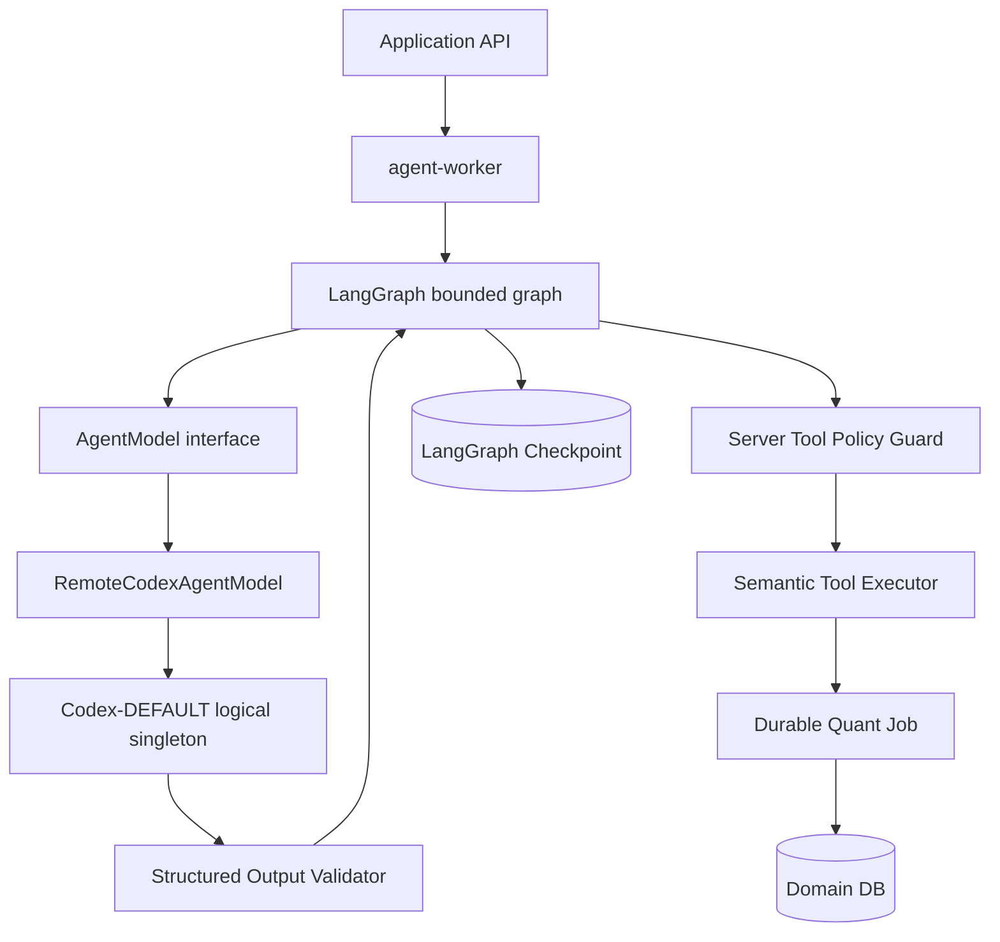

# QuantFoundry — 远程单实例 Codex Agent 替换方案

**方案版本：** V1.0.0  
**状态：** READY FOR LIVE EVALUATION；仓库内实现与自动化验证已完成，真实远端验收待部署凭据  
**日期：** 2026-08-13  
**适用范围：** Agent Runtime、后端运行时、Setup、System Health、Agent Center、全栈测试  
**前置事实源：** `AGENTS.md`、PRD、Agent 技术方案、后端系统技术方案、前端技术方案、全栈测试方案及 canonical OpenAPI/Tool contracts

## 0. 结论

QuantFoundry 保留 LangGraph 作为：

```text
workflow position
checkpoint
interrupt
resume
bounded subgraph
handoff
```

替换对象是 LangGraph 当前使用的内置 Agent/LLM 执行器，不是整个 LangGraph workflow。

目标结构：

```text
QuantFoundry Agent Role
    ↓ role prompt + context + server tool descriptors
LangGraph bounded graph
    ↓ AgentModel interface
RemoteCodexAgentModel
    ↓ one logical remote runtime
Codex-DEFAULT
    ↓ structured decision / tool intent
QuantFoundry output validator + Tool Policy + Semantic Tool Executor
```

六个 Runtime AI Role 共享同一个远程 Codex 基础设施：

```text
Research Director
Factor Scientist
Strategy Scientist
Portfolio Analyst
Red Team Researcher
Performance Analyst
        └── same Codex-DEFAULT
```

不允许：

```text
每个 Role 一个 Codex 实例
每个 Agent Run 一个 Codex 实例
按故障自动切换到其他 Provider
远程 Codex 直接访问 PostgreSQL / 文件 / Shell / Python / 任意 HTTP
远程 Codex 直接执行 approval、risk、holdout 或 paper mutation
```

### 0.1 当前实施状态

已落地：

```text
RemoteCodexModel 适配器及固定 CODEX-DEFAULT runtime identity
REMOTE_CODEX Setup catalog/credential validation 路径
Chat Completions-compatible structured action transport
local-provider Codex transport harness、重试与稳定 invocation id
compose、CI、fresh local smoke 与后端 runtime/provider 测试接线
AgentConfig singleton projection、Provider/Model override rejection 与 bootstrap fail-closed 校验
backend/frontend 静态检查、契约检查和全量回归
```

仍待完成：

```text
真实远端 Codex endpoint 的 live evaluation 与协议证据
真实部署的 readiness/admission 证据
全量 RC-001..RC-015 独立证据与发布门禁
```

当前实现是可回滚的兼容切片：旧 `OPENAI_COMPATIBLE` 配置仅作为同一
Remote Codex adapter 的兼容入口，不能选择第二个模型 Provider；
`LOCAL_DETERMINISTIC` 仅保留给显式测试/本地 harness。

## 1. 当前基线与变更边界

当前正式文档已经确定：

1. LangGraph 是 Agent Workflow Runtime，不是量化计算平台。
2. Agent 通过 `AgentModel` / Provider Adapter 抽象获得模型能力。
3. Agent 只能调用 Semantic Tool，不能直接访问基础设施。
4. Domain DB 是业务事实源，LangGraph checkpoint 只保存 workflow position 和受限引用。
5. Agent 无审批、资本、风险和 locked Holdout 权限。
6. Agent Runtime 使用 `agent-worker`，长任务通过 durable Job、interrupt 和 resume 完成。
7. `agent_configs.model_provider` / `model_name` 已在 Remote Codex 模式下收敛为单实例派生投影；不允许按 Role 改写实际 Provider/Model，历史不兼容值运行时 fail closed。

本方案只改变：

```text
模型执行边界
Provider/Runtime 配置语义
远程调用协议适配
单实例生命周期、健康检查、审计与故障语义
相关 API/UI/测试契约
```

本方案不改变：

```text
Research / Validation / Portfolio / Paper 领域状态机
确定性 Quant Engine
Semantic Tool 名称、权限和 side-effect 规则
Human Approval authority
Holdout access policy
LangGraph checkpoint 作为 workflow state 的定位
```

## 2. 目标架构



### 2.1 责任归属

| 组件 | 责任 | 明确不负责 |
| --- | --- | --- |
| LangGraph | graph route、interrupt、checkpoint、resume、handoff | Domain truth、provider auth、tool authorization |
| `AgentModel` | 稳定的结构化模型调用接口 | 直接绑定 Codex SDK 或业务规则 |
| `RemoteCodexAgentModel` | 将 `AgentModel` 调用转换为远程 Codex 协议 | 绕过 Tool Policy、写 Domain DB |
| `Codex-DEFAULT` | 提供远程推理能力和远程调用关联 ID | 成为 QuantFoundry 权限边界或业务事实源 |
| Output Validator | schema、字段、decision envelope 校验 | 从自然语言解析正式数值或状态 |
| Tool Policy / Executor | 角色、workspace、policy、side-effect、idempotency 校验与执行 | 相信 Codex 自报角色或权限 |
| Domain Service / Quant Engine | 正式状态、数值、实验、验证和审计 | 接受 Codex 文本作为事实 |

## 3. 单一 Codex 基础设施不变量

### 3.1 逻辑定义

`Codex-DEFAULT` 是 QuantFoundry deployment 看到的唯一远程 Codex logical runtime。远程服务内部是否有连接复用、并发 worker 或供应商级 replica，不进入 QuantFoundry 的 Agent 实例模型；它们仍属于同一个 logical runtime，只能由远程 Codex 服务自身保证一致的 instance identity。

Agent Run 的 remote session/invocation 是调用上下文，不是新的 Codex 实例。

### 3.2 强制不变量

启动和运行时必须 fail closed：

```text
active Codex runtime count == 1
runtime key == CODEX-DEFAULT
all six role resolutions -> same runtime identity
runtime endpoint / credential / protocol version are non-empty and valid
no per-role provider override
no automatic provider/model fallback
```

以下情况不得启动新 Agent Run：

```text
0 个 active Codex runtime
>1 个 active Codex runtime
runtime identity 在一次 Run 中途变化
健康检查失败且不满足显式恢复条件
协议版本不兼容
credential 无效、过期或无法解析
```

### 3.3 客户端生命周期

`agent-worker` 启动时创建一个进程级 `CodexRuntimeClient`，通过依赖注入提供给所有 Graph/Role。不得在 node、Role 或 Run 内部构造新的 Codex client/Agent。

进程级 client 的连接池、HTTP keep-alive 和并发请求不改变“一个远程 Codex logical runtime”的不变量。多进程部署时，所有 client 必须解析到同一 `remote_instance_id`；不能用多套 endpoint 或多套 credential 形成隐式 fallback。

## 4. Remote Codex Adapter

### 4.1 保持稳定的内部接口

现有接口继续作为 Graph 的唯一依赖：

```python
class AgentModel(Protocol):
    async def invoke_structured(
        self,
        *,
        messages: list[Message],
        output_schema: type[BaseModel],
        tools: list[ToolDescriptor],
        runtime: ModelRuntimeOptions,
    ) -> ModelStructuredResponse: ...
```

Graph node 不得 import Codex-specific SDK、HTTP client 或 provider-specific model class；只依赖 `AgentModel` 和 `ModelRouter`。

### 4.2 远程请求最小字段

远程协议最终以正式 Adapter Contract 固化，至少需要：

```json
{
  "protocol_version": "1",
  "invocation_id": "opaque-idempotency-key",
  "remote_instance_id": "opaque-instance-ref",
  "agent_role": "RESEARCH_DIRECTOR",
  "agent_run_id": "ARUN-...",
  "root_agent_run_id": "ARUN-...",
  "parent_agent_run_id": null,
  "runtime_profile": "reasoning_high",
  "context_sha256": "...",
  "messages": [],
  "tools": [],
  "output_schema": {},
  "remaining_budget": {},
  "timeout_seconds": 60
}
```

约束：

- `agent_role`、`agent_run_id`、workspace scope 和 policy refs 由服务端生成，不信任 Codex 回传值。
- `messages` 仅包含 Context Builder 允许的最小上下文；不包含 credential、hidden Chain-of-Thought、locked Holdout result 或原始基础设施凭据。
- `tools` 仅是当前 Role 的 server-generated Semantic Tool descriptors；不是权限授予。
- `output_schema` 必须来自服务端版本化 schema；模型不得自行扩展 schema。
- `invocation_id` 必须稳定，可用于远程 retry 和本地 resume 幂等关联。

### 4.3 远程响应最小字段

```json
{
  "protocol_version": "1",
  "invocation_id": "opaque-idempotency-key",
  "remote_instance_id": "opaque-instance-ref",
  "remote_request_id": "opaque-request-ref",
  "status": "SUCCESS",
  "structured_output": {},
  "tool_intents": [],
  "finish_reason": "tool_request|decision|waiting|error",
  "usage": {
    "input_tokens": 0,
    "output_tokens": 0
  },
  "actual_model": "opaque-or-redacted-model-ref",
  "server_checked_at": "2026-08-13T00:00:00Z"
}
```

服务端必须重新校验：

```text
remote_instance_id == configured singleton identity
invocation_id == local pending invocation
structured_output matches expected schema
tool_intents belong to current role allowlist
usage is telemetry, not business truth
```

Codex 的原始请求/响应 payload 不写入普通日志、Domain DB 或 checkpoint。只保存 redacted summary、hash、opaque remote refs 和必要的 usage/provenance。

### 4.4 工具调用模式

远程 Codex 可以返回 tool intent，但不能直接执行工具：

```text
Codex tool intent
→ server schema validation
→ captured Agent Run / workspace resolution
→ role/tool/policy check
→ Tool Call Envelope
→ Semantic Tool Executor
→ async Job / result ref
→ LangGraph interrupt + resume
```

禁止把 `shell`、`python_exec`、`sql`、`filesystem`、`generic_http` 或任何 approval tool 作为 Codex descriptor 发送给 Runtime Role。

## 5. Role、Prompt 与配置语义

### 5.1 Role 不变，模型基础设施统一

六个 Role 继续拥有独立的：

```text
role prompt
constitution
runtime_profile
hard step/tool budget
Semantic Tool allowlist
output schema
stop conditions
```

差异来自 Server-side role contract，不来自六个 Codex 实例。

### 5.2 `agent_configs` 目标语义

实施目标：

1. `enabled`、`runtime_profile`、timeout 和只能收紧的 budget override 继续保留。
2. `model_provider`、`model_name` 不再是 Role 可写的模型选择器。
3. Agent Config read model 可显示 Codex 固定 provider/runtime 摘要，但该值由 singleton 派生，不可按 Role 修改。
4. Agent Center 不出现“为某个 Role 选择另一个 Provider/Model”的路径。
5. 任何历史配置中的非 Codex provider 都必须在迁移时显式标记为 incompatible/blocked，不能静默转换或静默 fallback。

### 5.3 Setup 目标语义

P00 AI Provider 改为单一远程 Codex 基础设施连接：

```text
固定 Provider: Remote Codex
固定 Logical Runtime: CODEX-DEFAULT
服务端验证 credential / endpoint / protocol compatibility
成功后绑定 singleton
```

endpoint、认证方式和远程 instance identity 由部署配置/受保护连接提供，不由浏览器直接访问，也不将 raw credential 返回前端。是否允许 Owner 在 Setup 中录入 endpoint，必须以远程协议和部署治理最终决定；不得在未定义 endpoint allowlist 前开放任意 URL。

## 6. 状态、checkpoint、resume 与审计

### 6.1 checkpoint 允许保存

```text
local invocation_id
remote_request_id
remote_instance_id
context_sha256
agent_version
codex protocol / adapter version
redacted decision summary
pending tool_call_id
budget counters
interrupt metadata
```

### 6.2 checkpoint 禁止保存

```text
hidden Chain-of-Thought
reasoning token 内容
raw credential
完整远程会话 transcript（除非未来单独批准并定义 retention）
未经校验的 Codex tool result
locked Holdout result
```

Resume 默认重建 Context 并向同一 `Codex-DEFAULT` 发起新 invocation；不能把远程会话记忆当作 QuantFoundry truth。若协议支持 remote session continuation，只能作为优化，仍必须携带本地 `context_sha256` 和 Agent Run lineage。

### 6.3 审计与 provenance

每次远程调用至少绑定：

```text
agent_run_id
role_key
root/parent lineage
singleton runtime identity
adapter version
protocol version
context hash
invocation / remote request ref
actual model ref（如远程协议提供）
usage summary
finish reason
retry count
```

审计记录不得把远程 raw payload 当作业务结论；正式数值和 lifecycle 状态仍从 Domain/Engine provenance 产生。

## 7. 故障、重试与回退

### 7.1 统一策略

```text
remote timeout / rate limit / transient 5xx
→ bounded retry with same invocation_id
→ retry exhausted
→ AGENT_MODEL_UNAVAILABLE or AGENT_RETRY_EXHAUSTED
→ failed-safe / WAITING_USER
```

不自动切换：

```text
Remote Codex → LangGraph built-in Agent
Remote Codex → another provider
Remote Codex → another model
```

“回退”只允许：停止新 admission、保留已提交 deterministic Job、等待用户恢复或显式修改基础设施配置。不得用回退掩盖模型行为变化。

### 7.2 未知副作用

如果远程调用结果未知，必须：

```text
保留 invocation/request refs
不重复执行可能产生副作用的 Tool
标记 retry/review 状态
等远程幂等查询或人工恢复
```

Codex 没有资格猜测某个 Tool 是否已经执行。

### 7.3 单实例健康

健康状态至少区分：

```text
agent-worker local health
Codex-DEFAULT connectivity
Codex protocol compatibility
Codex admission readiness
```

远程 Codex 不可用时，deterministic worker、Domain API 和已有证据读取可继续；需要模型的新 Agent Run 必须明确失败或等待，不得显示成功。

## 8. 安全与研究完整性

必须保留现有 Agent Security 约束，并增加：

1. Agent Worker 到远程 Codex 使用 TLS；部署可要求 mTLS；endpoint 必须 allowlist，禁止用户输入形成任意 SSRF。
2. credential 仅由 server-side encrypted connection/secret resolver 使用；不进入 prompt、checkpoint、普通 log、event payload 或 UI。
3. 远程 Codex 只接收最小 Context；external text 标记为 untrusted data。
4. Holdout locked 期间不向 Codex 发送结果、artifact、sentinel、chart points 或 result summary。
5. Tool 权限由 server-side role/policy 决定；Codex 回传的 actor、role、policy 或 approval 意图全部视为不可信输入。
6. 原始远程响应必须 redaction；错误 detail 不暴露 credential、endpoint secret、内部网络拓扑或跨 workspace 信息。
7. Codex instance identity 不能作为 workspace authorization；每次本地 Agent Run 仍必须做 workspace scope resolution。

## 9. 需要联动更新的正式事实源

本方案批准后，代码实现前按以下顺序联动更新；当前提案不直接修改这些 Final V1 章节，也不新增平行 HTTP/Tool contract。

| 事实源 | 必须更新的内容 |
| --- | --- |
| PRD | §2.7、§8、§13 P00.2、§37 Agent Center、§39 AI Models、§42 Agent Workflow、§72 推荐架构；明确 LangGraph 保留、内置 Agent 被 Remote Codex Adapter 替换、单实例和无 fallback |
| Agent 技术方案 | §2、§4、§5、§7、§35、§40、§42、§43、§60、§61、§82、§83；增加 singleton invariant、remote envelope、adapter、health、resume 和 release gate |
| 后端系统技术方案 | §4、§10、§14.6a/Agent runtime schema、§17 Agents、§18 OpenAPI、§24 Security、§26 Observability、§28 Error、§33 Deployment、§35 Reliability、§36 Failure；定义 singleton persistence/config 与 health |
| canonical OpenAPI | `AgentConfig`/`AgentConfigUpdate` 的 provider/model 可写语义、Agent Run provenance/health 字段；如需新增 operation 或 error，先 bump revision 并同步 codegen/fixture/test |
| 前端技术方案 | P00.2、Agent Config/Agent Center、System Health、AI Models、Error/Retry；去除 per-role provider picker，展示固定 Codex runtime 和降级状态 |
| 全栈测试方案 | §7 contract、§14 Agent Runtime、§15 crash/resume、§16 live eval、§30 security、§35 reliability、§38 CI；增加单实例、协议、无 fallback、未知副作用和真实远程证据门禁 |
| 治理 registry | 若实施被判定为 P0 架构/安全发布阻断，更新 `p0-blockers.yaml`、known issues 与 release evidence criteria；未完成独立证据前不得关闭 |

## 10. 实施阶段与依赖

### Phase 0 — Protocol and boundary freeze

前置产物：

```text
remote Codex endpoint/base protocol
authentication / credential lifecycle
remote instance identity semantics
request timeout / retry / idempotency semantics
tool-intent format
structured-output / usage / error response schema
```

门禁：协议字段、错误映射、secret redaction、workspace scope 和 no-fallback 语义完成评审；未完成不得写 Adapter。

### Phase 1 — Documentation and contract update

按 §9 联动更新正式文档，再更新：

```text
canonical OpenAPI
generated types
Tool/Agent fixtures
DB schema/migration authority（如引入 singleton aggregate）
```

门禁：OpenAPI、Agent schema、Backend schema、Frontend expectations、Test matrix 无冲突；不得先写实现。

### Phase 2 — Adapter and singleton runtime

实现工作包：

```text
CodexRuntimeConfig / singleton resolver
CodexRuntimeClient lifecycle
RemoteCodexAgentModel
request/response validator
idempotent invocation store/ref
health/readiness probe
redaction and telemetry
```

门禁：本地 fake Codex server 可模拟成功、schema invalid、timeout、duplicate、outage、forbidden tool 和 malformed instance identity。

### Phase 3 — LangGraph integration

替换 Graph 节点的 model construction；保持：

```text
bounded graph topology
checkpoint namespace
interrupt/resume
Tool Call → Job
role policy
Domain truth boundary
```

静态门禁：runtime role graph 不再创建 LangGraph built-in Agent；不再按 Role 创建 provider-specific model；不存在直接 Codex → infrastructure tool 路径。

### Phase 4 — Contract/UI/health integration

接入 Setup、Agent Center、System Health、Audit/Provenance 和 error mapping。UI 只展示 server truth：

```text
Codex runtime configured / not configured
healthy / degraded / unavailable
fixed shared runtime identity (redacted)
new-run admission state
```

不得展示不存在的 Current Run、provider fallback、伪造成功统计或 remote raw transcript。

### Phase 5 — Independent validation and rollout

顺序：

```text
fake protocol tests
contract/schema tests
graph/policy tests
crash/resume/chaos tests
security and prompt-injection tests
one real remote Codex live evaluation
full-stack golden flow
independent review
release evidence
```

生产故障处置为 disable/admission stop/WAITING_USER/failed-safe；不恢复 LangGraph 内置 Agent 作为运行时 fallback。

## 11. 验收矩阵

| ID | 场景 | 必须证明 |
| --- | --- | --- |
| RC-001 | six roles resolve runtime | 六个 Role 得到同一个 `remote_instance_id` |
| RC-002 | zero runtime | 新 Run 被拒绝，返回 canonical unavailable 错误，无 checkpoint/tool side effect |
| RC-003 | duplicate runtime | startup/readiness fail closed，不任选一个运行 |
| RC-004 | role override | `AgentConfigUpdate` 不能改变 provider/model/runtime identity |
| RC-005 | valid call | structured output schema、context hash、lineage、usage 和 audit 完整 |
| RC-006 | malformed output | 一次 bounded repair 后仍失败为 `AGENT_OUTPUT_INVALID`，不写 Domain truth |
| RC-007 | forbidden tool | server deny + audit，Domain 无变化 |
| RC-008 | timeout/retry | same invocation id；不重复可能有副作用的 Tool |
| RC-009 | worker crash | checkpoint/resume 可恢复；Tool/Job/Resume 不重复 |
| RC-010 | remote outage | deterministic jobs 可继续；模型 Run 明确失败/等待；无 provider fallback |
| RC-011 | prompt injection | role、allowlist、policy、workspace scope 不变，无 secret/approval |
| RC-012 | holdout locked | Codex request 不含 locked result 或可推导结果的引用 |
| RC-013 | health | local agent-worker 与 remote Codex health 可区分；状态与 admission 一致 |
| RC-014 | real evaluation | 真实远程 Codex 的结构化输出、工具纪律、失败语义和证据被独立记录 |
| RC-015 | release | contract hash、adapter version、singleton config semantics、测试和 review evidence 绑定同一 release commit |

## 12. 风险与处理

| 风险 | 处理 |
| --- | --- |
| 单实例成为全局单点 | 明确 degraded/WAITING_USER；确定性任务与读取路径保持可用；不以隐式 fallback 破坏可审计性 |
| 远程协议无法保证幂等 | 使用本地 invocation ledger；未知副作用 fail closed；禁止盲重试 |
| Codex tool calling 能力与 LangGraph 不同 | 以 `AgentModel`/structured tool-intent adapter 隔离；不让 Graph 依赖 Codex 私有语义 |
| remote session 记忆污染恢复 | Context hash + Domain truth 重建；remote session 仅优化，不是事实源 |
| 旧 per-role model 配置残留 | 迁移显式标记 incompatible；读模型派生；写接口拒绝 provider/model mutation |
| endpoint 配置形成 SSRF | server-side allowlist、固定部署配置或受治理 Setup 字段；不允许任意 URL |
| 真实 Codex 质量仍不稳定 | live evaluation、role-specific prompt/schema、bounded retry 和人工等待；不把“模型更强”当验收结论 |

## 13. 完整交付完成定义

完整替换只有在以下条件全部满足后，才能关闭实施：

```text
Remote Codex protocol is concrete and testable
singleton identity and lifecycle are concrete
per-role model override is removed or made derived/read-only
all affected formal docs are synchronized
canonical OpenAPI/DB/Tool contracts are updated where required
no-fallback and unknown-side-effect semantics are accepted
test matrix and independent evidence requirements are accepted
```

以下剩余工作不得以本地 fake transport 的通过结果替代：

```text
用 fake Codex 或本地模型结果宣称远程 Codex 替换完成
以单元测试替代真实远端 Codex live evaluation
以配置存在替代 singleton runtime health/readiness 证据
以 provider/model 兼容字段替代最终 AgentConfig 迁移结论
```
