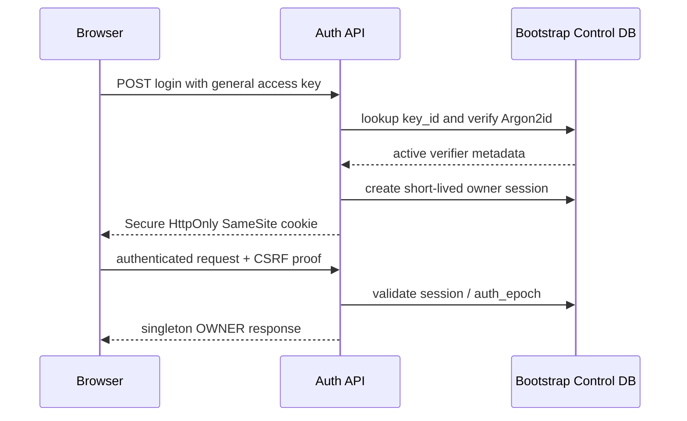
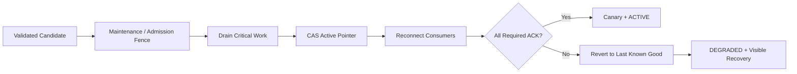

# QuantFoundry 用户交互优化跨层方案

**方案版本：** V1.0.0  
**变更事务：** `UX-001`  
**日期：** 2026-08-13  
**状态：** D0 文档联动已完成；D1 machine contract / schema 尚未冻结；禁止进入代码实现  
**适用范围：** 产品身份、认证、配置控制面、数据库自举、UI/UX、前端、后端、Agent、测试与发布门禁  
**不包含：** 本文档事务不修改源代码、测试代码、运行配置、数据库或部署状态

---

# 0. 文档定位与权威边界

本文件记录用户提出的三项跨层变更及其实施顺序：

1. 删除多用户产品能力，仅保留一个固定人类主体，并只允许使用通用密钥登录；
2. Settings 覆盖系统全部可配置项，支持配置和切换 Domain PostgreSQL，所有可变配置只进入数据库；
3. 依据指定前端教程的方法，重做 QuantFoundry 的信息架构、视觉语言、交互状态、响应式与视觉验收流程。

本文件是 `UX-001` 的跨层实施与迁移方案，不替代 PRD、UI、前端、后端、Agent、OpenAPI、Tool Contract 或全栈测试方案。字段级、wire-level、DDL-level 与测试 case-level 事实必须在 D1 阶段写回各自 canonical 事实源后，代码实施才可开始。

当前 committed OpenAPI、Schema 与测试精确计数只代表 `UX-001` 之前的 baseline。本文不猜测新的 operation、schema、error、table、column、constraint 或 fixture count；D1 必须由更新后的 machine-readable 事实源和生成器重新计算。

冲突处理：

- 本方案的产品目标已确定；旧文档中“未来增加多用户”“User 菜单”“可切换 workspace”“email/password owner account”“配置文件或环境变量作为普通配置源”等方向不再是允许的目标状态；
- 在 D1 machine contract / schema 完成前，旧 contract 仍仅用于描述当前实现，不得被当作新目标实现输入；
- 任何 Agent 在 D1 前发现需要写代码，必须停止并报告 `UX-001-CONTRACT-NOT-FROZEN`。

---

# 1. 用户要求到规范性目标

| 用户要求 | 规范性目标 | 不接受的替代 |
|---|---|---|
| 删除多用户系统 | 每个 installation 恰好一个固定 human principal；无账户、成员、角色、团队、邀请、workspace 创建/选择/切换 | 仅在 UI 隐藏用户管理，但后端仍保留可创建多个用户/tenant 的产品能力 |
| 多个通用密钥登录 | 多个等权 access key 均认证到同一 principal；密钥只用于换取短期 session | 每个 key 建成不同用户、角色或权限 scope；长期把 raw key 当浏览器 bearer |
| Settings 配置所有可配置项 | closed `Configuration Catalog` 是可配置项全集；Settings 是唯一写入口 | 在 Data/Agent/System 页面各维护第二套表单或隐藏配置 |
| 连接数据库 | Settings 可创建、验证、激活和回退 Domain PostgreSQL connection | 直接覆盖当前 DSN；连接失败后系统整体失联 |
| 配置严禁写配置文件 | 普通 mutable value/secret/effective selection 只存 Bootstrap Control DB；Domain DB 只存 immutable/versioned object content；运行时不读取普通配置文件、`.env`、env/CLI override 或 fallback | “数据库优先，文件兜底”；启动时把文件值覆盖回数据库 |
| 全面优化前端 | 叙事、IA、视觉方向、设计系统、布局工程、状态、响应式、a11y、截图 QA 与独立复核同时改造 | 只换颜色、圆角、组件库或增加动画 |

---

# 2. 术语与系统不变量

## 2.1 Singleton Human Principal

每个 QuantFoundry installation 恰好存在一个逻辑人类主体：

```text
principal = OWNER
cardinality = exactly 1
selectable = false
creatable = false
deletable = false
```

`OWNER` 是审计主体常量，不是数据库中的用户账号或可分配角色。

以下产品能力永久不属于本目标架构：

- user/account CRUD；
- username、email、password；
- signup、invite、member、team、organization；
- password reset、social login、SSO、MFA enrollment；
- RBAC/ABAC for human users；
- workspace create/list/switch/share；
- key-specific permission scope。

System、Worker、Scheduler 与六个 Agent Role 继续作为非人类审计 actor；它们不得被建模成人类用户。

## 2.2 Singleton Namespace

为保留现有领域数据的归属、幂等、复合 FK、event partition 与迁移可追溯性，V1 目标允许保留一个不可见、不可切换的 internal namespace：

```text
installation_namespace cardinality = exactly 1
request override = forbidden
public API enumeration = forbidden
UI switcher = forbidden
```

该 namespace 不是 tenant、用户 workspace 或授权选择器。服务端从 installation bootstrap state 固定解析它；request path、query、body、header、cookie 与 public ID 均不得覆盖。

保留 internal `workspace_id` 列不等于保留多用户产品。D1 必须删除多 workspace fixture、用户归属和 cross-workspace 产品语义，改为 singleton namespace invariant；若未来要重新引入多租户，必须作为新的产品版本重新治理。

## 2.3 Configuration

“配置”指在不修改源码与数据库 schema 的情况下，Owner 被产品明确允许改变、并可能影响未来运行行为的 installation-level value。

以下不是配置：

- canonical OpenAPI / Tool Contract；
- database schema 与 migration history；
- public ID grammar；
- Agent Role allowlist；
- Semantic Tool permission matrix；
- Validation、Holdout、Approval、Risk 与 no-live hard gate；
- encryption algorithm minimum、secret redaction rule、last-active-key lockout rule；
- release gate 与 evidence contract。

这些是不可变产品/安全规则。Settings 可只读展示其版本和健康状态，但不得提供修改入口。

---

# 3. 认证模型：多个等权通用密钥

## 3.1 Key Format

默认由服务端生成：

```text
qfk_<key_id>.<secret>
```

- `key_id` 是非秘密 lookup identifier；
- `secret` 至少 256-bit CSPRNG；
- 明文只在创建或 rotate 成功响应中展示一次；
- 后续 read/list/export/backup 均不得返回明文；
- UI 只显示 label、fingerprint/masked hint、状态、创建时间、最后使用时间、可选到期时间与 revision。

V1 不接受低熵自定义 key。Owner 通过“创建密钥”配置多个密钥，不通过手工设置可猜测口令配置它们。

## 3.2 Verifier

Control DB 只存：

```text
key_id
label
fingerprint / masked_hint
verifier_phc
hash_algorithm = ARGON2ID
hash_parameters
salt
pepper_key_id
status = ACTIVE | REVOKED | EXPIRED
expires_at?
created_at
last_used_at?
revoked_at?
revision
```

规则：

- verifier 使用 versioned Argon2id + per-key random salt；
- pepper 由 root-of-trust 经 HKDF 派生，不进入数据库；
- lookup 后采用 constant-time comparison；
- 参数升级可在一次成功认证后原子 rehash；
- plaintext、可逆 ciphertext、raw hash input 均不得持久化。

## 3.3 Lifecycle

支持：

```text
create
rename label
rotate = create replacement + revoke old
revoke
expire
```

所有 key 权限相同。禁止：

- 为 key 配权限、role、workspace 或资源 scope；
- hard delete 历史记录；
- 恢复已 revoke/expired key；
- 撤销最后一个 `ACTIVE + unexpired` key，除非同一事务创建 replacement，或进入受审计的 local recovery ceremony。

撤销/过期 key 必须立即使其派生的全部 active session 失效。

## 3.4 Login and Session

通用密钥只用于认证交换：



Browser session：

- opaque random session token；数据库仅存 SHA-256 verifier；
- `Secure`、`HttpOnly`、`SameSite=Strict`；
- state-changing request 需要 session-bound CSRF token，并验证 `Origin` / Fetch Metadata；
- idle TTL 默认 30 分钟、absolute TTL 默认 12 小时；允许在安全范围内由 DB 配置；
- logout、key revoke、security epoch rotation、restore 均可级联撤销；
- session fixation、cookie replay、CSRF、rate-limit 与 brute-force 必须有负向测试。

登录失败只返回统一 `UNAUTHENTICATED`，不区分 unknown/revoked/expired/wrong key。失败按 installation + source bucket 限速、指数退避并记录无秘密审计。

## 3.5 First Key Claim

系统不得携带默认密钥。

首次启动进入 `UNCLAIMED`：

- 仅 trusted local host / installation channel 可执行一次性 claim；
- claim 原子创建首个 key、singleton namespace 与 bootstrap state；
- 明文 key 展示一次；
- claim 完成即永久关闭匿名 claim endpoint；
- 远程、代理头伪造、并发双 claim 均 fail closed。

---

# 4. Database-only Configuration Architecture

## 4.1 Bootstrap Paradox

Domain PostgreSQL 的 connection secret 无法只存于“尚未连接的同一个 Domain PostgreSQL”。加密根也无法只存于它要解密的数据库。任何声称消除这两个 bootstrap dependency 的方案都不真实。

本方案采用两层数据库：

```text
Bootstrap Control DB
  - authentication
  - session
  - configuration catalog and revisions
  - encrypted integration secrets
  - Domain PostgreSQL connection candidates / active pointer
  - bootstrap audit

Domain PostgreSQL
  - research domain truth
  - immutable/versioned policy objects
  - jobs/events/audit/artifact metadata
  - business data
```

两者都是数据库，不是配置文件。

权威边界冻结为：所有普通 mutable configuration、global revision/active/LKG pointer 与 effective selection 位于 Control DB；Domain DB 只保存需要 domain lineage 的 immutable/versioned configuration object 内容。Control DB active revision 对这类对象只保存 exact object/revision ref，不双写内容、不解析 latest/default。每个 catalog entry 必须声明唯一 value authority。

## 4.2 Bootstrap Control DB

Control DB 是固定应用数据位置的嵌入式事务数据库。其 locator 属于安装包/volume layout contract，不是用户可变配置；应用不读取 `config.yaml`、`.env` 或任意 path override 决定它的位置。

最低能力：

- ACID transaction；
- WAL / crash recovery；
- schema migration；
- file permission hardening；
- backup / restore；
- integrity check；
- single-writer or fenced multi-process coordination。

Control DB 损坏、schema 不兼容或 root key 不可用时，系统只进入 fail-closed recovery mode，绝不使用配置文件 fallback。

## 4.3 Root of Trust

AEAD encryption root 只能来自：

- OS Keychain / Keyring；
- TPM / Secure Enclave；
- external secret manager；
- 受治理的 deployment secret injection。

它只承载 cryptographic root material，不承载普通应用配置。禁止：

- 存在 repository、`.env`、YAML/TOML/JSON；
- 写入 Control DB 或 Domain DB；
- 进入 backup；
- 进入 UI、API、log、Audit、Agent context；
- 用缺省硬编码 key 启动。

所有敏感配置使用 versioned envelope encryption / AEAD，至少包含 `ciphertext`、`nonce`、`key_id`、`algorithm` 与 AAD binding；AAD 必须绑定 installation、config key、revision 与 record identity。

## 4.4 No Configuration File Rule

运行时有效配置的唯一来源是 active database revision。以下一律禁止作为普通配置源：

```text
.env
YAML / TOML / JSON / INI
environment variables
CLI flags
container labels
mounted config files
source-tree constants pretending to be mutable values
```

允许的例外只有：

- compiled hard invariant / schema；
- Control DB 固定 locator；
- cryptographic root injection；
- process bootstrap facts such as executable path and build identity。

例外不得携带 provider、database、Agent、scheduler、storage、notification、UI 或 research configuration。

旧配置文件只允许由一次性迁移器读取为 candidate：typed validate → encrypt secrets → parity report → explicit activation。激活后 runtime 必须证明改变或删除旧文件不会改变 effective config；迁移器不自动删除用户文件。

---

# 5. Closed Configuration Catalog

## 5.1 Catalog Contract

系统全部可配置项由 closed `Configuration Catalog` 枚举。每项至少声明：

```text
key
group
title / description / documentation
value_schema + schema_version
scope = INSTALLATION
sensitivity = PUBLIC | MASKED | SECRET
default_value or required-without-default
safe_range / allowlist
dependencies
validator
apply_mode
consumers
mutable
deprecated
```

`apply_mode` 仅允许：

```text
LIVE_NEW_WORK
DRAIN_RELOAD
RESTART_REQUIRED
SECURITY_IMMEDIATE
```

Catalog schema 可以由代码/DB migration 固化；effective/default value 必须作为数据库 revision 持久化。UI 通过 server catalog 生成 Settings，不维护第二份字段表。

Parity gate：

```text
runtime configurable keys
= Control DB catalog keys
= OpenAPI configuration schemas
= Settings rendered fields
= test matrix keys
```

任一 missing/extra/unknown key 阻断发布。

## 5.2 Required Capability Groups

Settings 必须覆盖下列 closed capability groups；D1 为每项冻结字段、schema、safe range 与 apply mode。这是 catalog capability taxonomy，不是第二套路由导航；一个固定 UI category 可聚合多个 capability group，但不得遗漏字段。唯一 UI category/route 映射见 §7.2。

| Group | 可配置内容 | 关键边界 |
|---|---|---|
| Overview | completeness、health、pending apply/restart、last change | 只读汇总，不是第二份值 |
| Access Keys & Sessions | key lifecycle、session TTL / limits | 无权限 scope；last-key lockout |
| Domain Database | PostgreSQL endpoint、database、credential、TLS、pool/timeouts、active/LKG | candidate 两阶段；secret write-only |
| AI Provider & Model | singleton Remote Codex endpoint、credential、model、instance、timeout/retry/concurrency | server allowlist / SSRF protection；无 per-role provider |
| Data Providers | adapter、endpoint、credential、default、capability refresh | connection success 与 data capability 分离 |
| Agents & Runtime | enabled、runtime profile、tool timeout、step/tool limits | 只能收紧 hard policy；13 Tool registry 不可配置 |
| Research Defaults | benchmark、date range、frequency、universe、paper capital | 不改变历史 object binding |
| Research Policy | versioned immutable policy + active ref | 新版本，不覆盖历史 |
| Risk Policy | versioned immutable policy + active ref | hard minimum 不可弱化 |
| Cost Model | versioned immutable model + active ref | 新版本，不覆盖历史 |
| Jobs & Scheduler | concurrency、lease/poll/retry safe values、timezone/calendar/catch-up bound | 不可绕过 Paper/Data/Risk gate |
| Storage & Artifacts | backend、location、credential、retention、quota | protected artifact classification 不可配置掉 |
| Notifications | in-app categories、delivery integration、quiet hours | Approval/Critical 不允许用 dismiss/toggle 掩盖 truth |
| Appearance & Locale | language、timezone、number/date format、theme、density、sidebar preference | 同样 DB-only，不使用 localStorage truth |
| Backup & Retention | schedule、destination、retention、encryption ref | root key不进入 backup |
| Observability | safe log level、retention、metrics/export endpoint | secret/raw payload 永远禁止 |
| System / Diagnostics | build/schema/contract health、backup/restore、health check | hard facts只读；动作不是配置 |

未进入 catalog 的值不得由隐藏 endpoint、env、文件或前端 local state长期改变运行行为。

## 5.3 Revision and Activation

配置使用 immutable revision + active pointer：

```text
draft candidate
→ closed-schema validation
→ cross-field / dependency validation
→ connection / capability validation where needed
→ impact preview
→ global If-Match compare-and-swap
→ active revision
→ consumer apply / ACK
→ READY or DEGRADED
```

规则：

- 一个 candidate 可原子修改多个 key；
- validation 失败不得部分写入 active values；
- active revision 单调递增；
- rollback 不是指针倒退，而是从旧 snapshot 创建一个新的单调 revision；
- 已撤销、过期或不可解密 secret 不得被 rollback 恢复；
- Audit 记录 key、before/after digest、actor/access-key ref、impact 与 revision，不记录 secret/value plaintext；
- read API 对 secret 仅返回 `configured`、masked hint、last rotated time 与 revision；
- write API 的 secret 字段必须 `writeOnly`。

## 5.4 Consumer Semantics

每个 consumer 维护：

```text
desired_revision
applied_revision
status = PENDING | APPLIED | FAILED | RESTART_REQUIRED
error_code?
ack_at?
```

- `LIVE_NEW_WORK`：只影响新 request/job/run；
- `DRAIN_RELOAD`：停止新 admission，等待安全边界后切换；
- `RESTART_REQUIRED`：staged 后显示明确 restart action，未完成前 readiness 不得假装 active；
- `SECURITY_IMMEDIATE`：key/credential revoke 等立刻阻止新使用，并在下一安全边界中止旧 snapshot。

Agent Run admission 必须捕获 effective config revision、role config revision、AI connection revision、runtime profile、budgets、prompt hash 与 Tool policy hash；正常 resume 继续固定 snapshot，不在中途静默切换。

---

# 6. Domain PostgreSQL Connection Lifecycle

## 6.1 State Machine

```text
UNCONFIGURED
→ TESTING
→ VALIDATED_CANDIDATE
→ ACTIVATING
→ ACTIVE
→ DEGRADED
→ REVERTING
→ ACTIVE(previous LKG)
```

`FAILED` 是一次 validation/apply attempt 的结果，不得覆盖当前 active connection。

## 6.2 Candidate Validation

必须依次验证：

- URL/host/port syntax 与 SSRF/network policy；
- DNS/TCP/TLS；
- credential；
- PostgreSQL supported version；
- database identity；
- required extension/collation/timezone；
- least-privilege read/write/transaction/lock；
- schema/Alembic compatibility；
- migration preflight；
- latency/timeout budget；
- no secret in response/log/audit。

UI 同时显示 transport success、schema readiness、permission readiness 与 migration impact，禁止用单一绿色 `Connected` 混为一谈。

## 6.3 Activation



激活必须：

1. 展示受影响任务、downtime、migration 与回退条件；
2. 要求显式确认；
3. fence 新 state-changing admission；
4. drain 或 fail closed 处理正在运行的关键任务；
5. Control DB 以 CAS 写 candidate revision 与 previous LKG；
6. required consumers reconnect 并 ACK；
7. 运行 canary/readiness；
8. 成功后标记 ACTIVE；任一失败自动回 LKG，不带错误连接继续报 READY。

Domain DB 不可用时，Browser 仍可通过 Control DB 登录，但只允许进入：

- Database Recovery；
- Access Keys / Sessions；
- Configuration diagnostics；
- Backup / Restore；
- System Health / logs 的安全摘要；
- Logout。

业务页面必须显示明确 unavailable 状态，不得用空数据伪装成功。

---

# 7. 目标信息架构与交互

详细视觉与参考研究见：

`docs/UI设计方案/QuantFoundry_UI_Interaction_Redesign_Brief_V1.0.0.md`

## 7.1 Global IA

```text
RESEARCH
  Overview
  Research
  Factors
  Strategies

VALIDATE & DECIDE
  Validation
  Portfolio
  Approvals
  Paper
  Reviews

OPERATIONS
  Data
  Agents
  Activity

Settings
```

Header：

```text
Breadcrumb | Search | Context Action | Approvals | Notifications | Health | Session/Lock
```

禁止 User/avatar/workspace switcher。

## 7.2 Routes

新增：

```text
/login
/settings/overview
/settings/access-keys
/settings/database
/settings/ai
/settings/data
/settings/agents
/settings/research
/settings/policy
/settings/risk
/settings/cost
/settings/jobs
/settings/scheduler
/settings/storage
/settings/notifications
/settings/appearance
/settings/system
```

上述 16 个 category/route 是 PRD、UI 与 Frontend 共享的唯一导航 taxonomy；OpenAPI operation 在 D1 冻结。`/setup` 是 installation-only 的 Settings guided presentation，只能复用同一 catalog、category key、组件、client 与 mutation，不构成第二写入面；Setup 完成后的配置变更只从 `/settings/*` 进入。Data Center、Agent Center 与 contextual system surfaces 只显示运行状态和深链，不保留独立可写配置表单。

## 7.3 Responsive Web

V1 仍不提供原生移动 App，但 Web 不再在 `<1180px` 整体阻断：

| Width | 目标 |
|---|---|
| `>=1180` | dense multi-pane Research OS；完整表格/图表/inspector |
| `768–1179` | drawer navigation、single-column composition、on-demand inspector；完整工作流 |
| `390–767` | progressive disclosure、stacked facts/actions、table explicit horizontal scroll or semantic cards；关键工作流可完成 |
| `<390` | minimum safety layout；不得泄漏/错操作，允许提示使用更宽设备处理高密度分析 |

Mobile App 是非目标，不等于 responsive Web 是非目标。

## 7.4 Visual Direction

目标是 **Evidence Foundry**：研究报告的克制、操作台的密度、证据链的可追溯性。

必须保留：

- AI Interpretation / Calculated Fact / Evidence / Policy Gate 的强语义边界；
- provenance、version、failure、contradiction 与 human authority；
- data-dense but legible。

必须消除：

- purple-blue gradient / glow；
- three equal cards as default composition；
- card soup；
- Inter-first / generic system-font personality；
- oversized centered hero；
- excessive 8–16px rounded rectangles / shadows；
- fake metrics、logos、quotes、confidence；
- desktop-only success state；
- spinner/toast-only feedback。

---

# 8. Frontend Design Workflow Gate

依据用户指定教程，本项目的前端工作固定为：

```text
Narrative
→ Information Architecture
→ Visual Direction
→ Design System
→ Layout Engineering
→ Screenshot QA
→ Independent/Human Review
```

实现前必须：

1. 明确页面类型、目标用户、首屏必须回答的问题与主任务；
2. 选择 3–5 个高质量同类产品/流程参考；
3. 归档 desktop、tablet/mobile 与关键 state 截图；
4. 逐项记录可抽象原则、禁止复制内容与 QuantFoundry 改造动作；
5. 冻结 design brief、token、component/state/responsive contract；
6. 才允许写页面代码；
7. 实现后运行 Playwright 多 viewport 截图、overflow、keyboard、a11y 与真实内容检查；
8. pixel diff 之后必须有独立/人工视觉审查。

外部参考只提供设计输入，不是生产依赖或可复制源码。

---

# 9. Cross-layer Change Matrix

| 事实源 | D1 必改内容 |
|---|---|
| PRD | singleton principal、Login、key lifecycle、Settings 全量 IA、DB recovery、responsive acceptance、migration |
| UI | Evidence Foundry brief、Login/Settings/DB flows、tokens、states、responsive、WCAG 2.2 AA、screenshot gate |
| Frontend | cookie session/CSRF、session epoch、zero config/browser storage、generated Config UI、candidate/apply state |
| Backend | Control DB、key/session/config/connection models、singleton namespace、secret resolver、recovery mode |
| OpenAPI | breaking revision；auth/key/config/database operation + closed schema；security scheme；errors/events；no guessed count |
| Tool Contract | 13-entry scope unchanged；明确 auth/config/DB 永不成为 Tool；config 不能替换 registry authority |
| Agent | singleton Remote Codex、config snapshot pinning、no secret/config authority、emergency revoke semantics |
| Test Plan | auth/config parity/bootstrap/DB chaos/migration/no-file-fallback/responsive visual/a11y/security |
| Governance/P0 | 更新 OpenAPI/Schema/Security/Architecture closure criteria；不新增随意 waiver |

---

# 10. Target Data Model Families

D1 必须定义字段级 schema，至少包含以下 Control DB aggregates：

```text
installation_state
general_access_keys
owner_sessions
configuration_catalog
configuration_revisions
configuration_values
active_configuration
configuration_consumer_states
database_connections
bootstrap_audit_events
```

要求：

- immutable revision 与 append-only audit；
- all timestamps UTC；
- secret write-only / encrypted；
- CAS revision；
- active/LKG pointer；
- no user/email/role/workspace selection；
- restore 后 session 默认全部 revoke；
- schema count 由 D1 generator 产生，本文不提供猜测数字。

Domain DB 目标：

- 删除 `users` 与 `session_tokens → users` 依赖；
- 保留 singleton namespace 仅作内部归属；
- provider/AI secret 移至 Control DB secret resolver，Domain DB 只持 opaque connection ref；
- versioned Research/Risk/Cost objects 保持 immutable；
- Agent Run 增加 effective config snapshot refs；
- migration 对多 owner / 多 active workspace / ambiguous ownership fail closed，不 first-row-wins。

---

# 11. API Contract Direction

D1 需要一个新的 canonical OpenAPI revision。它必须：

- 原位受控 breaking revision；项目尚未发布，不维护旧账号认证双轨；
- browser canonical auth 改为 session cookie；mutation 具备 CSRF header/contract；
- 仅 login/first-claim 必要入口可匿名，并具严格 bootstrap/rate-limit 约束；
- 增加 auth session、access key、configuration catalog/revision、database candidate/activate/revert 等 operation；
- secret request field 标记 `writeOnly`，read model 只返回 masked metadata；
- mutation 使用 ETag/If-Match、Idempotency 与 canonical Problem；
- Event payload 不包含 key fingerprint、session token、DSN、credential、ciphertext 或内部网络细节；
- 不改变 13 个 Semantic Tool 的名称、权限或 scope。

推荐 operation families（exact path/method 由 D1 冻结）：

```text
auth login / session / logout / first-claim
access-key list / create / rename / rotate / revoke
configuration catalog / active / candidate / validate / activate / rollback
database connection list / validate / activate / revert / status
provider connection lifecycle
consumer apply status
```

不得提前填写新的 operation/schema/error count。D1 完成条件是 canonical file、Backend endpoint catalog、Frontend generated client、Test operation matrix 与 runtime discovery 全部一致。

---

# 12. Migration

## 12.1 Identity Migration

Preflight 必须盘点：

- human user/account count；
- workspace/namespace count；
- active session；
- ownership ambiguity；
- cross-workspace refs；
- existing credentials/config sources。

自动迁移仅允许：

```text
one provable human owner
and
one provable active workspace/namespace
and
zero ambiguous ownership/ref
```

否则 quarantine + release block + 人工选择/导出方案。禁止自动合并、first-row-wins、复制另一个 workspace 数据或从 email/password/旧 token 推导新通用密钥。

所有旧 session 在 cutover 时 revoke；新首 key 通过 trusted local claim 创建。

## 12.2 Configuration Import

旧 file/env config 迁移：

```text
discover source inventory
→ redact-safe report
→ typed candidate import
→ encrypt secrets
→ compare effective parity
→ Owner explicit activate
→ restart/reconnect verification
→ runtime no-fallback proof
```

DB 已有值与旧来源冲突时停止并呈现差异，不猜优先级。

## 12.3 Backup / Restore

Backup 必须覆盖：

- Control DB schema/data；
- key verifier metadata；
- configuration catalog/revisions/active pointer；
- encrypted DB/provider connection values；
- consumer state；
- Domain DB + Artifact/Parquet；
- cross-store manifest/hash。

不得包含：

- plaintext general key；
- raw session token；
- root key；
- plaintext DSN/password/provider credential。

Restore 必须先验证 root key可用、Control DB integrity、ciphertext 可解密、Domain DB reconnect/schema compatibility，再开放业务 API；既有 session 默认 revoke。

---

# 13. Security and Failure Semantics

以下为 `UX-001` no-waiver security properties：

- no default/general key plaintext persistence；
- no user/account/workspace selection path；
- no config file/env/CLI ordinary config fallback；
- no raw key as long-lived browser bearer；
- no secret in response/SSE/DOM/browser storage/log/Audit/Agent/checkpoint/artifact metadata/screenshot；
- no last-active-key lockout；
- no config partial activation；
- no wrong DB remaining READY；
- no per-role Remote Codex provider/model divergence；
- no Agent access to auth/config/database mutation；
- no hard gate changed by configuration。

Severity：

| Defect | Minimum severity |
|---|---|
| plaintext key/root/credential exposure；auth bypass | S0 |
| wrong DB activation、partial config apply、LKG unavailable、last key lockout | S1 |
| catalog/UI/runtime drift、stale overwrite、silent file fallback | S1 |
| responsive/a11y critical blocker on P0 flow | S1 |
| isolated visual inconsistency without semantic impact | S2/S3 per test plan |

---

# 14. Required Test Gates

## 14.1 Authentication

- multiple keys → same OWNER；
- one-time reveal；Argon2id/salt/pepper/rehash；
- wrong/revoked/expired/unknown indistinguishable；
- create/rotate/revoke concurrency；
- last-active-key protection；
- key revoke → session cascade；
- idle/absolute expiry、logout、restore revoke；
- rate-limit/brute force；
- cookie flags、CSRF、Origin、session fixation/replay；
- no user/email/password/OAuth/RBAC/workspace route/schema/UI；
- secret sentinel zero outside authorized harness/encrypted store。

## 14.2 Configuration

- catalog/runtime/OpenAPI/UI/test exact parity；
- closed schema、safe range、dependency validation；
- AEAD/AAD/masking/key rotation；
- atomic multi-key candidate；
- stale global If-Match；
- Audit/Event same transaction；
- consumer ACK；
- all apply modes；
- monotonic rollback；
- secret rollback rejection；
- file/env/CLI mutation has zero effect after cutover。

## 14.3 Database Chaos

- Domain DB unavailable while Control DB login/recovery remains usable；
- invalid DNS/TLS/credential/version/privilege/schema；
- crash before/after pointer CAS；
- consumer reconnect/ACK failure；
- canary failure；
- automatic LKG rollback；
- root key missing；Control DB corruption；
- concurrent activation；
- no stale connection reporting READY。

## 14.4 Agent

- old/new config revisions run concurrently without cross-contamination；
- run/resume snapshot pinning；
- emergency credential revoke；
- singleton Remote Codex projection；
- config cannot replace Tool registry；
- auth/config/DB operation absent from 13 Tool registry and prompt authority。

## 14.5 UI/UX

- all pages have loading/empty/error/active/disabled/stale/degraded/conflict states where applicable；
- zh-CN/en/long content/200% zoom/keyboard/reduced-motion；
- Login/Settings/DB/Access Keys at 390/768/1180/1440；
- core P0 pages at 390/768/1180/1280/1440/1600 with declared adaptive pattern；
- no unsupported horizontal page overflow；
- Playwright visual baseline uses trusted ancestor；
- independent/human review verifies brief and reference abstraction, not only pixel equality；
- WCAG 2.2 AA critical checks；
- no secret in screenshot/a11y tree/DOM。

---

# 15. Staged Delivery

| Stage | Deliverable | Exit Gate | Current status |
|---|---|---|---|
| D0 | requirements, cross-layer plan, design brief, canonical doc linkage | no unresolved product contradiction | COMPLETE; documentation only |
| D1 | canonical OpenAPI、Config Catalog、Control/Domain schema、generated counts、migration/test matrices | machine facts exact and independently reviewed | PENDING; code prohibited |
| D2 | backend/control DB/auth/config/database migration | targeted unit/contract/PG/control-DB/chaos tests | NOT STARTED |
| D3 | frontend redesign + responsive implementation | component/Storybook/Playwright/a11y/visual | NOT STARTED |
| D4 | independent security/test/review | all UX-001 and existing P0 gates pass | NOT STARTED |
| D5 | release evidence and migration rollout | registry closure evidence | NOT STARTED |

Implementation Agent 在 D1 前不得：

- 修改 runtime auth/config/database behavior；
- 创建 user/key/session/config table；
- 修改 OpenAPI generated client/runtime；
- 开始页面代码或视觉重构；
- 以 temporary endpoint/fixture/mock 代替 canonical contract。

---

# 16. Documentation Deliverables

本 D0 事务至少产生：

```text
docs/治理/QuantFoundry_User_Interaction_Optimization_Plan_V1.0.0.md
docs/UI设计方案/QuantFoundry_UI_Interaction_Redesign_Brief_V1.0.0.md
```

并联动：

```text
PROJECT_BACKGROUND.md
AGENTS.md
docs/PRD/V1.0.0.md
docs/治理/QuantFoundry_Repository_Governance_V1.0.0.md
docs/治理/p0-blockers.yaml
docs/UI设计方案/QuantFoundry_UI_Design_V1.0.0.md
docs/前端技术方案/QuantFoundry_Frontend_Technical_Design_V1.0.0.md
docs/后端系统技术方案/QuantFoundry_Backend_System_Technical_Design_V1.0.0.md
docs/Agent技术方案/QuantFoundry_Agent_Technical_Design_V1.0.0.md
docs/全栈测试方案/QuantFoundry_Full_Stack_Test_Plan_V1.0.0.md
docs/后端系统技术方案/contracts/tools/README.md
```

`openapi-v1.yaml`、Tool `v1-p0.yaml`、DDL/schema manifest、源码与测试代码不在 D0 修改范围；它们属于 D1 或之后，且必须继续按文档优先顺序实施。

---

# 17. Final Acceptance

`UX-001` 只有同时满足以下条件才可宣称完成：

- UI/API/schema/runtime 中不存在多用户或可切换 workspace 产品能力；
- 多个通用密钥安全地映射到唯一 OWNER；
- raw key 只展示一次且全链路零泄漏；
- Settings 可发现并管理 Catalog 中 100% 可配置项；
- effective mutable config 100% 来自数据库，无文件/env/CLI fallback；
- Domain PostgreSQL 可由 Settings 两阶段验证、激活和回退；
- DB 故障时认证与安全恢复面仍可用；
- Agent 固定 config snapshot 且不能修改配置/认证/数据库；
- 前端符合 Evidence Foundry brief，AI/System/Evidence/Policy 语义没有弱化；
- 390–1600 声明支持范围、完整状态、WCAG 2.2 AA、Playwright 截图与独立视觉审查通过；
- D1 生成的 OpenAPI/schema/counts 与 runtime/codegen/tests 零漂移；
- 现有 Research Integrity、Holdout、Approval、Risk、No-Live 与 release P0 gate 全部继续成立。

在此之前，只能报告：

```text
DOCUMENTED / PARTIAL / BLOCKED
```

不得报告用户交互优化已经实现或发布。
